# Prisma Markdown

> Generated by [`prisma-markdown`](https://github.com/samchon/prisma-markdown)

- [Systematic](#systematic)
- [Actors](#actors)
- [Sellers](#sellers)
- [Products](#products)
- [Discovery](#discovery)
- [Carts](#carts)
- [Orders](#orders)
- [Payment](#payment)
- [UGC](#ugc)
- [Favorites](#favorites)
- [default](#default)

## Systematic

### `ai_commerce_channels`

Represents a sales channel (e.g., web, mobile app, partner portal) within
the commerce platform. Supports configuration for unique business rules,
localization, activation, and channel-specific analytics. Channels act as
the top-level context for sections, categories, and templates, and link
to analytics and settings via FKs.

Properties as follows:

- `id`: Primary Key.
- `code`
  > Unique business identifier code for the channel. Cannot be changed after
  > creation.
- `name`: Human-readable channel name (e.g., 'Korea Main Portal').
- `locale`
  > Default locale (e.g., 'ko-KR', 'en-US'). Defines language and formatting
  > for this channel.
- `is_active`
  > Whether the channel is currently active and visible for business
  > operations.
- `business_status`
  > Current business-specific status or workflow stage for the channel (e.g.,
  > 'normal', 'pending audit', 'archived').
- `created_at`: Timestamp for channel creation.
- `updated_at`: Timestamp for last channel update.
- `deleted_at`: Soft delete field for logical removal; null if active.

### `ai_commerce_channel_settings`

Holds additional configuration properties for each channel, such as
custom branding, external endpoints, feature toggles, or advanced rules.
Each row references a channel, providing extensibility and modular
configuration management. Managed primarily by administrators.

Properties as follows:

- `id`: Primary Key.
- `ai_commerce_channel_id`
  > Parent channel's [ai_commerce_channels.id](#ai_commerce_channels). Establishes a 1:N
  > relationship to support multiple settings per channel.
- `key`: Configuration key name (e.g., 'feature_discount_enabled', 'theme_color').
- `value`
  > Value for configuration key. May be text, URI, or serialized settings
  > (depending on business logic).
- `created_at`: Timestamp when setting was created.
- `updated_at`: Timestamp when setting was last updated.
- `deleted_at`: Soft delete for logical removal; null if active.

### `ai_commerce_sections`

Defines sections or merchandising areas within a channel (e.g.,
'Electronics', 'Flash Deals'). Represents logical groupings beneath
channels for product curation, configuration, and personalized displays.
Used by both admin and AI systems. Hierarchically independent of
categories.

Properties as follows:

- `id`: Primary Key.
- `ai_commerce_channel_id`
  > Parent channel's [ai_commerce_channels.id](#ai_commerce_channels). Each section belongs to
  > one channel.
- `code`
  > Unique code for section per channel. Used for internal references, must
  > be unique within the parent channel.
- `name`: Display name for the section (e.g., 'Deals', 'Main Banner').
- `is_active`: Section operational status; inactive sections are hidden from users.
- `business_status`
  > Business workflow status for the section (e.g., 'normal', 'archived',
  > 'pending').
- `sort_order`: Display sort order for this section within the channel.
- `created_at`: Creation timestamp for the section.
- `updated_at`: Last modification timestamp for the section.
- `deleted_at`: Soft delete timestamp for logical removal; null if section is active.

### `ai_commerce_categories`

Defines product categories as a tree structure, supporting arbitrary
hierarchy depths. Categories are mapped to channels and used for
discovery, filtering, analytics, and business rule enforcement. Preserves
referential integrity for parent-child relationships and supports soft
deletion and audit trails.

Properties as follows:

- `id`: Primary Key.
- `ai_commerce_channel_id`
  > Parent channel for this category. Reference to {@link
  > ai_commerce_channels.id}.
- `parent_id`
  > Optional self-reference to parent category (for hierarchy). Null for
  > top-level categories. [ai_commerce_categories.id](#ai_commerce_categories).
- `code`: Unique category code per channel, used for internal mapping.
- `name`: Display name for the category (e.g., 'Accessories').
- `level`: Hierarchy depth level (0 for root/top-level).
- `sort_order`: Order within siblings for display purposes.
- `is_active`: Indicates whether the category is active/visible.
- `business_status`: Business or workflow status (e.g., 'active', 'archived').
- `created_at`: Creation timestamp for the category.
- `updated_at`: Last modification timestamp for the category.
- `deleted_at`: Soft delete for logical removal; null if active.

### `ai_commerce_section_templates`

Reusable section configuration templates, allowing administrators to
rapidly define and propagate merchandising/grouping setup across
channels. Templates capture configuration presets, default status, and
metadata for AI-powered or manual section setup.

Properties as follows:

- `id`: Primary Key.
- `code`: Unique template identifier code.
- `name`: Human-friendly name of the section template.
- `template_data`
  > Serialized configuration data (JSON or similar) representing the
  > structure and rules of the template.
- `is_default`: Marks templates as system default for rapid section creation.
- `business_status`: Current business or operational workflow status for the template.
- `created_at`: Timestamp for template creation.
- `updated_at`: Timestamp of last template update.
- `deleted_at`: Soft delete; null for active templates.

### `ai_commerce_category_templates`

Reusable configuration templates for category trees or segments. Enable
cross-channel or multi-project reuse, bulk creation, and rapid curation
of category schemas. Serves as blueprint for consistent category
organization and AI/analytical applications.

Properties as follows:

- `id`: Primary Key.
- `code`: Unique template identifier for the category template.
- `name`
  > Human-readable name for the template (e.g., 'Electronics Default',
  > 'Fashion Segments').
- `template_data`
  > Serialized configuration data for the category tree structure (e.g., JSON
  > blob).
- `is_default`: True if this template is the default offering for new category setups.
- `business_status`: Operational workflow or approval status of the template.
- `created_at`: Timestamp of template creation.
- `updated_at`: Last updated timestamp for this template.
- `deleted_at`: Soft delete for logical removal; null if active.

### `ai_commerce_business_rule_templates`

Template entities allowing business administrators to author, version,
and deploy business rules or logic (e.g., eligibility, promotional,
compliance rules). Templates may be attached to channels, sections, or
categories, providing modular, versioned logic for core flows. Records
always have temporal fields and are versioned for audit.

Properties as follows:

- `id`: Primary Key.
- `code`: Business rule template code (unique).
- `name`: Display name of the template.
- `version`: Semantic version number for rule template iteration.
- `template_data`: Serialized rules in config format (JSON/YAML/business rule DSL).
- `business_status`: Status (active, retired, pending approval, etc.) for business workflow.
- `created_at`: Timestamp for when this rule template was first authored.
- `updated_at`: Timestamp for most recent template update.
- `deleted_at`: Soft delete timestamp for logical removal; null if template is active.

### `ai_commerce_audit_logs_system`

Centralized system-level audit trail, recording all critical
configuration events, administrative actions, rule/template updates, and
access logs at the core configuration (systematic) layer. Each log entry
includes actor identification, event type, data snapshot, and timestamp
for legal and forensic evidence.

Properties as follows:

- `id`: Primary Key.
- `event_type`
  > Type of event or action (e.g., 'CREATE_CHANNEL', 'EDIT_CATEGORY',
  > 'DELETE_TEMPLATE').
- `actor_id`: Reference to the user/admin/automation that performed the action.
- `target_table`: Table in which the audit event occurred.
- `target_id`: ID of the affected record in the target table.
- `before`
  > JSON snapshot of the entity's state before the change/event; may be empty
  > for CREATE events.
- `after`
  > JSON snapshot of the entity's state after the change/event; may be empty
  > for DELETE events.
- `created_at`: Timestamp for the audit event (creation of the log entry).

## Actors

### `ai_commerce_buyer`

Registered buyer account for the aiCommerce platform. Scopes purchasing,
profile, and favorites. Links to auth, addresses, and profile. Subject to
privacy compliance and audit. Role elevation to seller supported via
status field. Soft delete for recovery and right-to-be-forgotten
compliance.

Properties as follows:

- `id`: Primary Key.
- `email`: Unique email address. Required for authentication and notifications.
- `password_hash`: Hashed password for login.
- `status`: Buyer account status: active, suspended, deleted, etc.
- `created_at`: Account creation timestamp.
- `updated_at`: Timestamp of last profile or status update.
- `deleted_at`: Soft delete timestamp for retention and privacy compliance.

### `ai_commerce_seller`

Seller account structure. Linked to buyer account for role elevation.
Handles onboarding, KYC, store management references, and legal
compliance snapshots. Status supports escalation, penalties, or
downgrades. Soft delete for privacy compliance.

Properties as follows:

- `id`: Primary Key.
- `buyer_id`: Linked [ai_commerce_buyer.id](#ai_commerce_buyer) for seller-member relationship.
- `status`: Seller status: active, under_review, suspended, terminated, etc.
- `onboarded_at`: Timestamp for completion of onboarding/approval process.
- `created_at`: Account creation timestamp.
- `updated_at`: Last updated timestamp for profile or status.
- `deleted_at`: Soft delete timestamp for legal retention/audit.

### `ai_commerce_admin`

Admin-level user for platform and compliance management. Controls global
settings, user/seller moderation, and escalation points. Separate from
regular buyers/sellers for audit and global access restriction. All admin
actions are strictly audited.

Properties as follows:

- `id`: Primary Key.
- `email`: Unique email address for admin login/audit.
- `password_hash`: Hashed password for admin authentication (privileged access).
- `status`: Status of admin account: active, suspended, etc.
- `created_at`: Admin account creation timestamp.
- `updated_at`: Timestamp of last update to admin profile/status.
- `deleted_at`: Soft delete field for compliance; not physical delete.

### `ai_commerce_visitor`

Anonymous or temporary user entity for non-registered browsing sessions.
Used to track marketing acquisition, incomplete onboarding, or guest
cart/favorites bridging before registration.

Properties as follows:

- `id`: Primary Key.
- `tracking_id`
  > Tracking identifier assigned to the visitor (cookie/session/device
  > fingerprint).
- `created_at`: Visitor record creation timestamp.
- `updated_at`: Timestamp of last update (e.g., session activity, attribution change).
- `deleted_at`: Soft delete of visitor data for privacy auditing.

### `ai_commerce_user_authentications`

Core authentication and session tracking for buyers, sellers, and admins.
Supports multi-device, MFA, and OAuth federation. Logs device, IP,
method, and session expiry for secure audit.

Properties as follows:

- `id`: Primary Key.
- `buyer_id`
  > Buyer account [ai_commerce_buyer.id](#ai_commerce_buyer) for this authentication
  > session (nullable if admin).
- `admin_id`
  > Admin account [ai_commerce_admin.id](#ai_commerce_admin) for this authentication
  > session (nullable if buyer).
- `method`: Authentication type: password, external, magic link, MFA, etc.
- `device_info`: Device metadata (browser, OS, device fingerprint).
- `ip_address`: User login IP address for audit trail and geo-compliance.
- `session_expires_at`: Session expiration timestamp (JWT, refresh, etc.).
- `created_at`: Session record creation time.
- `updated_at`: Session last activity update.
- `deleted_at`: Soft deleted session record.

### `ai_commerce_user_addresses`

User address records for shipping, billing, and KYC. Linked to
profile/account; supports historical preservation via snapshots. Stores
all legal info needed for shipping, verification, and analytics. Enforces
country/validation rules.

Properties as follows:

- `id`: Primary Key.
- `buyer_id`: Belonged user's [ai_commerce_buyer.id](#ai_commerce_buyer) (for standard buyers).
- `label`: Friendly label: 'Home', 'Office', etc.
- `country_code`: ISO 3166-1 alpha-2 country code.
- `region`: State/province/region (per-country format).
- `city`: City or locality.
- `postal_code`: Postal or ZIP code for address.
- `address_line_1`: Primary address line (street, building, details).
- `address_line_2`: Secondary line (apartment, suite, etc.).
- `is_default`: Flag for primary/default address selection.
- `created_at`: Address record creation timestamp.
- `updated_at`: Last updated timestamp (for address edits or label change).
- `deleted_at`: Soft delete timestamp for privacy, not physical removal.

### `ai_commerce_user_address_snapshots`

Historical, immutable snapshot of each address state (for
audit/evidence). Linked to user address. Used for legal, compliance, or
forensic scenarios (disputes, delivery deviations, etc.). Append-only;
cannot be modified or deleted.

Properties as follows:

- `id`: Primary Key.
- `user_address_id`: User address reference [ai_commerce_user_addresses.id](#ai_commerce_user_addresses).
- `snapshot_json`: JSON-encoded snapshot of address data at time of event.
- `event_type`: Snapshot event type: create, update, delete, dispute.
- `created_at`: Snapshot creation timestamp.

### `ai_commerce_user_external_accounts`

External SSO/federated account links (Google, Apple, Kakao, etc.) to
enable multi-provider authentication for buyers/admins. Retains provider,
unique ID, mapping timestamps, and compliance tracking.

Properties as follows:

- `id`: Primary Key.
- `buyer_id`: Linked buyer account for SSO mapping [ai_commerce_buyer.id](#ai_commerce_buyer).
- `provider`: SSO provider name (google, apple, kakao, etc.).
- `provider_user_id`: Provider-issued principal/user id for identity mapping.
- `linked_at`: When this linkage was registered or last verified.
- `created_at`: SSO record creation timestamp.
- `deleted_at`: Soft delete for privacy right-to-be-forgotten.

### `ai_commerce_user_profiles`

Main profile data for user accounts (buyer/seller role). Stores names,
nickname, avatar, locale, contact, and consent/marketing preferences.
Enables cross-channel profile sharing and personalization with privacy
compliance.

Properties as follows:

- `id`: Primary Key.
- `buyer_id`: User this profile belongs to [ai_commerce_buyer.id](#ai_commerce_buyer).
- `nickname`: Display nickname or preferred handle for personalization.
- `avatar_url`: URI to profile image/avatar.
- `phone_number`: Contact phone (main notification).
- `language`: Primary language preference (ISO 639-1).
- `marketing_opt_in`: User's agreement to receive marketing information.
- `created_at`: Profile record created.
- `updated_at`: Profile last updated.

### `ai_commerce_user_profile_agreements`

User profile platform agreements for compliance: privacy policy
acceptance, marketing consent, terms of service, etc. Historicized for
audit and re-verification events with version/date.

Properties as follows:

- `id`: Primary Key.
- `profile_id`: Associated user profile [ai_commerce_user_profiles.id](#ai_commerce_user_profiles).
- `agreement_type`: Type: privacy_policy, terms_of_service, marketing, etc.
- `version`: Agreement version (semver or yy-mm-dd)
- `agreed_at`: Timestamp of user agreement action.
- `withdrawn_at`: Agreement withdrawn timestamp (if revoked).

### `ai_commerce_user_profile_snapshots`

Read-only historical versioning of user profile states. Immutable
audit/evidence preservation for profile change events (rename, phone,
marketing, etc.). Used for compliance and dispute handling. Can never be
modified or erased for legal conformance.

Properties as follows:

- `id`: Primary Key.
- `profile_id`: Profile version relates to [ai_commerce_user_profiles.id](#ai_commerce_user_profiles).
- `snapshot_json`: JSON-encoded full profile data at change event or history point.
- `event_type`: Event (profile_created, profile_updated, phone_changed, etc.).
- `created_at`: Snapshot recording time.

### `ai_commerce_audit_logs_user`

Audit log for all buyer/admin/seller actions: login, profile change,
authentication event, privilege escalation, or privacy data access.
Forensically valuable, provides IP/device chronology. Strictly
append-only and never deletable by user.

Properties as follows:

- `id`: Primary Key.
- `buyer_id`
  > Action performed by or on behalf of this buyer {@link
  > ai_commerce_buyer.id}.
- `admin_id`: Action performed by admin [ai_commerce_admin.id](#ai_commerce_admin).
- `action_type`
  > Action/event code: login, logout, profile_edit, escalation, suspension,
  > etc.
- `subject_type`: Entity type: buyer, admin, seller, profile, address, etc.
- `subject_id`: UUID of entity affected (account, profile, address, etc.).
- `ip_address`: IP address from which action was performed.
- `device_info`: Device/fingerprint used in the action event.
- `created_at`: Timestamp when action occurred (audit event time).

## Sellers

### `ai_commerce_seller_onboarding`

Captures the onboarding process for sellers, including application
submission, current onboarding step/stage, status, and references to the
user and target store being created. Integral for compliance, step
tracking, and escalations. Links to ai_commerce_seller_kyc and
ai_commerce_seller_profiles. Each onboarding record represents a seller's
complete onboarding lifecycle.

Properties as follows:

- `id`: Primary Key.
- `user_id`
  > Belonged user account's [ai_commerce_user_authentications.id](#ai_commerce_user_authentications).
  > Represents the user applying to become a seller.
- `store_id`: Store created upon onboarding's [ai_commerce_stores.id](#ai_commerce_stores).
- `application_data`
  > JSON-encoded application details, disclosures, and supporting
  > documentation for the onboarding process.
- `onboarding_status`
  > Current onboarding status (e.g., draft, submitted, reviewing, approved,
  > rejected, escalated).
- `current_stage`
  > Current stage of the onboarding process (e.g., identity_verification,
  > business_submission, bank_verification).
- `notes`
  > Admin or system notes regarding this onboarding case, for compliance or
  > review usage.
- `created_at`: Onboarding initiation timestamp.
- `updated_at`: Last update time for onboarding record.
- `deleted_at`: Soft delete timestamp. Null if active.

### `ai_commerce_seller_kyc`

Stores Know Your Customer (KYC) compliance information for sellers during
onboarding and later operations. Contains references to the user,
document verification metadata, status, and audit trail fields for
compliance review and fraud detection.

Properties as follows:

- `id`: Primary Key.
- `user_id`
  > User's [ai_commerce_user_authentications.id](#ai_commerce_user_authentications) that the KYC applies
  > to.
- `onboarding_id`: Related onboarding application's [ai_commerce_seller_onboarding.id](#ai_commerce_seller_onboarding).
- `kyc_status`
  > KYC workflow current status (awaiting_submission, pending, verified,
  > rejected, escalated).
- `document_type`
  > Type of documented provided for verification (e.g., passport,
  > business_license, driver_license).
- `document_metadata`
  > Relevant details or parsed info from the submitted document, typically
  > JSON-encoded.
- `verification_notes`
  > Review, escalation or rejection notes produced by compliance staff or AI
  > system.
- `created_at`: KYC submission timestamp.
- `updated_at`: Last update time.
- `deleted_at`: Soft delete timestamp. Null if active.

### `ai_commerce_seller_profiles`

Holds the seller's public and private profile information once onboarding
is complete and the account is approved. Links to the main user and,
optionally, to a default store. Used for display, search, analytic, and
role-based workflow. Editable by sellers and admins with full
update/audit trail.

Properties as follows:

- `id`: Primary Key.
- `user_id`
  > User's [ai_commerce_user_authentications.id](#ai_commerce_user_authentications) who owns this seller
  > profile.
- `display_name`: Name shown on storefronts and in analytics for this seller.
- `profile_metadata`
  > JSON snapshot of seller's business description, branding info, and
  > regulatory disclosures for compliance.
- `approval_status`: Approval/workflow status (active, pending, suspended, terminated).
- `suspension_reason`
  > If suspended/terminated, main reason or justification as determined by
  > platform/admin.
- `created_at`: Profile creation timestamp.
- `updated_at`: Profile last update time.
- `deleted_at`: Soft delete timestamp. Null if active.

### `ai_commerce_stores`

Primary table representing individual stores (managed by sellers) with
unique branding, policies, and compliance details. Each store is tied to
a seller profile/user and forms the central entity for seller-related
transactions, products, and marketing analytics. Includes references to
store settings and banking info.

Properties as follows:

- `id`: Primary Key.
- `owner_user_id`
  > User's [ai_commerce_user_authentications.id](#ai_commerce_user_authentications) who owns/administers
  > this store.
- `seller_profile_id`: Seller profile [ai_commerce_seller_profiles.id](#ai_commerce_seller_profiles) for this store.
- `store_name`: Store's public-facing name.
- `store_code`
  > Unique business code or internal store identifier. Used for
  > admin/marketing/audit.
- `store_metadata`
  > Business profile, description, and configuration JSON blob for
  > extensibility.
- `approval_status`: Workflow status (active, pending, suspended, closed, terminated).
- `closure_reason`
  > When closed/terminated, provides summary or justification for
  > history/legal tracking.
- `created_at`: Creation time for store.
- `updated_at`: Last store update time.
- `deleted_at`: Soft delete timestamp. Null if active.

### `ai_commerce_store_settings`

Configuration and business rules for each store including shipping
policies, return/holiday hours, custom rules, and integration flags.
One-to-one or one-to-many with stores. Managed by sellers or admins with
audit trail and workflow.

Properties as follows:

- `id`: Primary Key.
- `store_id`: Store's [ai_commerce_stores.id](#ai_commerce_stores) to whom these settings apply.
- `settings_json`: Store's settings as a JSON blob; includes shipping, return, hours, etc.
- `active`: If true, these settings are in use (for multiversion/config scenarios).
- `created_at`: Creation timestamp for settings version.
- `updated_at`: Last update time for settings version.
- `deleted_at`: Soft delete timestamp. Null if active.

### `ai_commerce_store_analytics`

Aggregated analytics/statistics for a given store, including sales
volume, conversion rate, product/visitor metrics. Enables sellers/admins
to monitor performance and drive business insight. Updated periodically
(never realtime accuracy).

Properties as follows:

- `id`: Primary Key.
- `store_id`: Store's [ai_commerce_stores.id](#ai_commerce_stores) whose metrics these belong to.
- `date_bucket`
  > Which period (day/week/month) this record reflects; may be midnight of
  > period or other agreed point.
- `sales_volume`: Total sales revenue for this period.
- `orders_count`: Total fulfilled orders during this analytics bucket.
- `visitors_count`: Unique store visitors during period.
- `conversion_rate`: Conversion rate for tracked period (0-1.0).
- `analytics_json`
  > Extra analytics, campaign metadata, or experimental fields (stored as
  > JSON).
- `created_at`: Analytics record creation.
- `updated_at`: Analytics record last update.

### `ai_commerce_store_banking`

Confidential banking and payout details for each store, connecting to
payment and compliance systems. Each record references a store and
maintains the current payout/banking configuration (bank name, account,
routing, policies). Must be editable and versionable, with compliance
fields for auditability.

Properties as follows:

- `id`: Primary Key.
- `store_id`: Store's [ai_commerce_stores.id](#ai_commerce_stores) whose banking info is configured.
- `bank_name`: Legal bank or payment provider name.
- `account_number`: Bank or payment account number for payouts.
- `account_holder_name`: Name as appears on account for verification.
- `routing_code`: Bank routing/transit/SWIFT code (if applicable, for international/wire).
- `banking_metadata`: Additional compliance info or bank config JSON-encoded.
- `verified`
  > If true, banking/payout account has passed platform admin/AI verification
  > (required for payout).
- `created_at`: Payout info creation timestamp.
- `updated_at`: Banking last update.
- `deleted_at`: Soft delete timestamp. Null if active.

### `ai_commerce_seller_status_history`

Chronological log of every status or role change for a given
seller—covering onboarding, approval, suspension, demotion, appeals, and
escalations. Used for audit, compliance, and temporal traceability.
Usually linked to ai_commerce_seller_profiles and/or onboarding record.

Properties as follows:

- `id`: Primary Key.
- `user_id`
  > User's [ai_commerce_user_authentications.id](#ai_commerce_user_authentications) involved in the status
  > change.
- `seller_profile_id`
  > Seller profile's [ai_commerce_seller_profiles.id](#ai_commerce_seller_profiles) whose status
  > changed (if applicable).
- `previous_status`: Seller's previous role or approval status value.
- `new_status`: Status after this transition/approval/role event.
- `transition_reason`
  > Summary or commentary on the reason for status change—decision, evidence,
  > escalation case.
- `transition_actor`: Indicates system, AI, or admin staff principal driving the change.
- `created_at`: Status transition timestamp.

### `ai_commerce_seller_appeals`

Records appeal events initiated by sellers in response to workflow
actions (rejection, penalty, demotion, payout block, etc.). Linked to
seller profile and includes resolution workflow. Each record covers one
appeal and its status through close.

Properties as follows:

- `id`: Primary Key.
- `seller_profile_id`: Seller's [ai_commerce_seller_profiles.id](#ai_commerce_seller_profiles) the appeal is for.
- `appeal_type`: Nature of appeal (rejection, penalty, demotion, payout, etc.).
- `appeal_data`: JSON-encoded details or evidence attached to this appeal.
- `status`: Status of the appeal (open, in_review, resolved, rejected, closed).
- `resolution_notes`: Platform/admin summary of how this appeal was dealt with.
- `created_at`: Appeal creation timestamp.
- `updated_at`: Appeal last update timestamp.

### `ai_commerce_seller_disputes`

Documents dispute cases (penalties, sanctions, escalations) for sellers.
Includes all required business/legal fields for context, process,
evidence, and status—audit-traceable and essential for regulated
commerce. Resolution and closure is covered with admin actions,
potentially subject to legal review.

Properties as follows:

- `id`: Primary Key.
- `seller_profile_id`
  > Seller profile's [ai_commerce_seller_profiles.id](#ai_commerce_seller_profiles) involved in this
  > dispute.
- `dispute_type`
  > Type of dispute/penalty/escalation (policy_violation,
  > fraud_investigation, payout_hold, etc.).
- `dispute_data`
  > JSON data with dispute details, context, and evidence collected for
  > process/audit.
- `status`
  > Current status in the dispute workflow (open, in_progress, resolved,
  > closed, escalated, withdrawn).
- `resolution_notes`: Platform/admin notes on process, outcome, or decision-making.
- `created_at`: Dispute case creation timestamp.
- `updated_at`: Dispute record last update.

### `ai_commerce_audit_logs_seller`

Immutable append-only log of all actions and events related to seller
onboarding, operations, escalations, compliance, and appeals. Used for
rigorous audit, evidence handling, and legal defensibility for
platform-admin roles.

Properties as follows:

- `id`: Primary Key.
- `seller_profile_id`
  > Seller profile that this log refers to {@link
  > ai_commerce_seller_profiles.id}.
- `event_type`
  > Workflow/process event (onboarding, status_change, kyc_update,
  > account_suspend, compliance_review, dispute_initiated, penalty_applied,
  > etc.).
- `event_data`
  > Rich structured event data (snapshot of involved fields, module,
  > attachments, AI inferences, reasoning).
- `actor`
  > Who/what performed the action (admin, system, AI agent, seller, external
  > entity, etc.).
- `created_at`: Precise event creation timestamp (immutable).

## Products

```mermaid
erDiagram
"ai_commerce_products" {
  String id PK
  String seller_id FK
  String store_id FK
  String product_code UK
  String name
  String description
  String status
  String business_status
  Float current_price
  Int inventory_quantity
  DateTime created_at
  DateTime updated_at
  DateTime deleted_at "nullable"
}
"ai_commerce_product_variants" {
  String id PK
  String product_id FK
  String sku_code UK
  String option_summary
  Float variant_price
  Int inventory_quantity
  String status
  DateTime created_at
  DateTime updated_at
  DateTime deleted_at "nullable"
}
"ai_commerce_product_bundles" {
  String id PK
  String parent_product_id FK
  String bundle_code UK
  String name
  String description "nullable"
  String status
  Float current_price
  DateTime created_at
  DateTime updated_at
  DateTime deleted_at "nullable"
}
"ai_commerce_product_bundle_items" {
  String id PK
  String bundle_id FK
  String child_product_id FK "nullable"
  String child_variant_id FK "nullable"
  String item_type
  Int quantity
  Boolean required
  Int sort_order
}
"ai_commerce_product_images" {
  String id PK
  String product_id FK
  String attachment_id FK
  Int display_order
  String locale "nullable"
}
"ai_commerce_product_contents" {
  String id PK
  String product_id FK
  String content_type
  String format
  String locale "nullable"
  String content_body
  Int display_order
}
"ai_commerce_product_snapshots" {
  String id PK
  String product_id FK
  String event_type
  String actor_id
  String snapshot_json
  DateTime created_at
}
"ai_commerce_product_seo" {
  String id PK
  String product_id FK,UK
  String seo_title "nullable"
  String seo_description "nullable"
  String(80000) canonical_url "nullable"
  String seo_keywords "nullable"
  String(80000) og_image_url "nullable"
}
"ai_commerce_product_category_bindings" {
  String id PK
  String product_id FK
  String category_id FK
  DateTime created_at
}
"ai_commerce_product_section_bindings" {
  String id PK
  String product_id FK
  String section_id FK
  Int display_order
}
"ai_commerce_product_legal_compliance" {
  String id PK
  String product_id FK,UK
  String compliance_region
  String certification_numbers "nullable"
  Int restricted_age "nullable"
  Boolean hazard_flag
  String compliance_status
  DateTime last_reviewed_at "nullable"
  String evidence_json "nullable"
}
"ai_commerce_product_audit_logs" {
  String id PK
  String product_id FK
  String event_type
  String actor_id
  String before_json "nullable"
  String after_json "nullable"
  DateTime created_at
}
"ai_commerce_product_variants" }o--|| "ai_commerce_products" : product
"ai_commerce_product_bundles" }o--|| "ai_commerce_products" : parentProduct
"ai_commerce_product_bundle_items" }o--|| "ai_commerce_product_bundles" : bundle
"ai_commerce_product_bundle_items" }o--o| "ai_commerce_products" : childProduct
"ai_commerce_product_bundle_items" }o--o| "ai_commerce_product_variants" : childVariant
"ai_commerce_product_images" }o--|| "ai_commerce_products" : product
"ai_commerce_product_contents" }o--|| "ai_commerce_products" : product
"ai_commerce_product_snapshots" }o--|| "ai_commerce_products" : product
"ai_commerce_product_seo" |o--|| "ai_commerce_products" : product
"ai_commerce_product_category_bindings" }o--|| "ai_commerce_products" : product
"ai_commerce_product_section_bindings" }o--|| "ai_commerce_products" : product
"ai_commerce_product_legal_compliance" |o--|| "ai_commerce_products" : product
"ai_commerce_product_audit_logs" }o--|| "ai_commerce_products" : product
```

### `ai_commerce_products`

Main product entity representing a single item offered by a seller.
Contains all business data (sku, name, description, price, inventory,
lifecycle status) and references to seller, store, and channel. All
product creation, update, and deletion operations generate immutable
snapshots for audit trails and compliance. Supports variant, bundle,
compliance, content, and marketing relationships.

Properties as follows:

- `id`: Primary Key.
- `seller_id`: Seller owning this product ([ai_commerce_seller.id](#ai_commerce_seller)).
- `store_id`: Store this product belongs to ([ai_commerce_stores.id](#ai_commerce_stores)).
- `product_code`
  > Unique product code for business and integration (SKU or external
  > reference).
- `name`: Display name of product (localizable).
- `description`: Business/marketing description (multi-format, max length 2000).
- `status`
  > Product listing status: draft, active, paused, suspended, discontinued,
  > deleted.
- `business_status`
  > Operational workflow status (moderation, pending_approval,
  > compliance_hold, etc.).
- `current_price`: Current display price (may change; old value versioned in snapshot).
- `inventory_quantity`
  > Current available stock for this product (top-level, not
  > variant-specific).
- `created_at`: Timestamp for product creation.
- `updated_at`: Timestamp for last product update.
- `deleted_at`: Soft delete (null if active).

### `ai_commerce_product_variants`

Represents an option or variant SKU of the parent product (e.g.,
size/color/option permutation). Each variant has unique business fields:
option summary, sku_code, price (may be different from parent),
inventory, and status. Not independently searchable, managed via parent
product.

Properties as follows:

- `id`: Primary Key.
- `product_id`: Parent [ai_commerce_products.id](#ai_commerce_products) this variant belongs to.
- `sku_code`: Unique code for this variant/SKU within the product.
- `option_summary`: Summary of option values (e.g., 'Size: M / Color: Red').
- `variant_price`: Variant-specific price (overrides product price if present).
- `inventory_quantity`: Stock for this variant/SKU.
- `status`: Lifecycle/status (active, paused, discontinued).
- `created_at`: Timestamp for variant creation.
- `updated_at`: Timestamp for last variant update.
- `deleted_at`: Soft delete (null if active).

### `ai_commerce_product_bundles`

Describes a composite product composed of multiple child
products/variants. Bundles are independently sold/published products,
with their own code, pricing, and status. Maintains bundle relationship
via bundle_items table. All bundle sales, pricing, and inventory must be
managed via parent and children variants.

Properties as follows:

- `id`: Primary Key.
- `parent_product_id`
  > Product acting as the parent/bundle container ({@link
  > ai_commerce_products.id}).
- `bundle_code`: Unique code for the bundle product.
- `name`: Bundle display name.
- `description`: Bundle description/marketing details.
- `status`: Bundle status (active, paused, discontinued, deleted).
- `current_price`: Current price for bundle (does not track individual items' prices).
- `created_at`: Created timestamp.
- `updated_at`: Last updated timestamp.
- `deleted_at`: Soft delete (null if active).

### `ai_commerce_product_bundle_items`

Junction table linking ai_commerce_product_bundles and
ai_commerce_product_variants (or ai_commerce_products). Each entry
specifies child item type, quantity, required/optional, and
sequence/order within the bundle. Composite key ensures no duplicate
items, and supports bundle inventory validation and audit.

Properties as follows:

- `id`: Primary Key.
- `bundle_id`: Bundle container ([ai_commerce_product_bundles.id](#ai_commerce_product_bundles)).
- `child_product_id`: Child product linked to bundle ([ai_commerce_products.id](#ai_commerce_products)).
- `child_variant_id`: Child variant SKU if specified ([ai_commerce_product_variants.id](#ai_commerce_product_variants)).
- `item_type`: Type: product or variant.
- `quantity`: Number of this item in the bundle.
- `required`: Whether this item is required for the bundle (vs. optional selection).
- `sort_order`: Display/business order within bundle items.

### `ai_commerce_product_images`

List of image assets for each product (attachment subsystem manages
file). Each row links an image to a product, with display order and
indications for localization/multiversion handling. Public urls/files are
linked via attachments model (not stored here).

Properties as follows:

- `id`: Primary Key.
- `product_id`: Product to which this image belongs ([ai_commerce_products.id](#ai_commerce_products)).
- `attachment_id`
  > Attachment subsystem ID for this image file ({@link
  > ai_commerce_attachments.id}).
- `display_order`: Ordering of this image for product display (ascending).
- `locale`: Locale string or null for default.

### `ai_commerce_product_contents`

Modular business/marketing content for each product (description, detail,
instruction, etc). Each entry has a display type, format, and potentially
localization context. Used for internationalization, SEO, and improved
merchandising.

Properties as follows:

- `id`: Primary Key.
- `product_id`: Product to which this content belongs ([ai_commerce_products.id](#ai_commerce_products)).
- `content_type`: Type: description, detail, spec, how_to, etc.
- `format`: Content format: html, markdown, plain_text, etc.
- `locale`: Locale: language/region code, or null for default.
- `content_body`: Content data, up to 10,000 characters.
- `display_order`: Display ordering among contents for the product.

### `ai_commerce_product_snapshots`

Immutable, append-only historical record of the full state of a product
(and optionally its variants, price, and compliance) at each
modification, publish, or compliance event. Used for compliance,
rollback, and audit trails. Holds snapshot as a JSON blob and tracks the
actor, timestamp, and event.

Properties as follows:

- `id`: Primary Key.
- `product_id`: Product of this snapshot ([ai_commerce_products.id](#ai_commerce_products)).
- `event_type`
  > Event: create, update, price_change, compliance_review, version_publish,
  > etc.
- `actor_id`: User/admin ID triggering the snapshot event.
- `snapshot_json`: Complete denormalized JSON of product state at this snap.
- `created_at`: Snapshot timestamp.

### `ai_commerce_product_seo`

SEO and search metadata for a product, managed as a subsidiary. Includes
canonical url, SEO title, description, image, and keyword/tags. No
denormalized or calculated fields—pure metadata. Supports localization,
versioning, and independent publishing.

Properties as follows:

- `id`: Primary Key.
- `product_id`: Product for this SEO entry ([ai_commerce_products.id](#ai_commerce_products)).
- `seo_title`: SEO page title (localized or default).
- `seo_description`: SEO meta description.
- `canonical_url`: Canonical/public url to the product.
- `seo_keywords`: Comma-separated keywords for search/full-text indexing.
- `og_image_url`: Image url for OpenGraph/social sharing.

### `ai_commerce_product_category_bindings`

Junction table linking products to categories, supporting multi-channel
and multi-category assignments. Each binding links a product to one
category/context. Composite unique guarantees no duplicate binding.

Properties as follows:

- `id`: Primary Key.
- `product_id`: Product ([ai_commerce_products.id](#ai_commerce_products)).
- `category_id`: Category ([ai_commerce_categories.id](#ai_commerce_categories)).
- `created_at`: When the binding was created.

### `ai_commerce_product_section_bindings`

Binds a product to a merchandising/featured section in a channel (e.g.,
'Flash Sale'). Multi-assignment allowed, composite key for uniqueness.
Serves as target for merchandising configuration or admin curation.

Properties as follows:

- `id`: Primary Key.
- `product_id`: Product ([ai_commerce_products.id](#ai_commerce_products)).
- `section_id`: Section ([ai_commerce_sections.id](#ai_commerce_sections)).
- `display_order`: Product order within section.

### `ai_commerce_product_legal_compliance`

Legal, regulatory, and compliance fields for products (parent or
subsidiary for multi-jurisdictional). Contains required certifications,
restricted use, age and labeling flags, and status evidence for each
compliance review. Linked to corresponding product. Required for all
compliance jurisdiction snapshots.

Properties as follows:

- `id`: Primary Key.
- `product_id`: Product subject to compliance check ([ai_commerce_products.id](#ai_commerce_products)).
- `compliance_region`: Jurisdiction (country/region) for this compliance entry.
- `certification_numbers`: Comma-separated list of certificate/approval numbers.
- `restricted_age`: Minimum age for purchase/use, if any.
- `hazard_flag`: Whether item is hazardous/restricted/special handling.
- `compliance_status`: Current status: pending, approved, rejected, expired.
- `last_reviewed_at`: Last regulatory check timestamp.
- `evidence_json`: Extra evidence or attachments as JSON, e.g., file IDs, review context.

### `ai_commerce_product_audit_logs`

Records all audit trail events for a product and its subcomponents.
Documents every creation, edit, compliance check, status/lifecycle
transition, and actor. Used for compliance and legal traceability. Each
action records before/after JSON, event type, timestamp, and
actor/context.

Properties as follows:

- `id`: Primary Key.
- `product_id`: Target product ([ai_commerce_products.id](#ai_commerce_products)).
- `event_type`
  > Action performed: create, update, compliance_review, price_change,
  > content_edit, etc.
- `actor_id`: User/admin/automation performing audit action.
- `before_json`: State before action (JSON); null for new creation.
- `after_json`: State after action (JSON); null for deletion.
- `created_at`: Action timestamp.

## Discovery

### `ai_commerce_tags`

Central master table for tags used in product, inquiry, and discovery
modules. Stores tag identity, status, registration source, and business
context. Managed by admins and sellers, linked to moderation and product
tag junctions. Accessible in tagging flows, analytics, and recommendation
evidence.

Properties as follows:

- `id`: Primary Key.
- `name`
  > The unique tag label shown to users and used for search. Alphanumeric,
  > case-insensitive and globally unique.
- `description`
  > Business/contextual description for moderation and analytics. May be
  > blank or short.
- `status`
  > Current tag status: 'active', 'under_review', 'suspended', 'deleted'.
  > Used for moderation/business logic.
- `created_at`: Tag creation timestamp.
- `updated_at`: Last updated timestamp.

### `ai_commerce_tag_moderation`

Moderation logs and actions related to tags. Subsidiary to
ai_commerce_tags. Stores moderation decision, actor, timestamp, and
rationale. Enables audit trail for tag changes and evidence for admin
interventions.

Properties as follows:

- `id`: Primary Key.
- `ai_commerce_tag_id`: Associated tag's [ai_commerce_tags.id](#ai_commerce_tags).
- `moderation_action`: Type of moderation taken: 'approve', 'reject', 'flag', 'suspend'.
- `moderated_by`: Moderator's admin user id [ai_commerce_admin.id](#ai_commerce_admin).
- `moderation_reason`: Freeform reason or notes for the moderation action.
- `created_at`: Moderation record creation timestamp.

### `ai_commerce_product_tags`

Junction table linking products and tags, enabling M:N relationship
between ai_commerce_products and ai_commerce_tags. Each row represents a
tagging event, enabling product search and discovery. Does not store
denormalized product or tag info, normalized to 3NF. Business operations
include adding, removing, and searching product tags.

Properties as follows:

- `id`: Primary Key.
- `ai_commerce_product_id`: Target product's [ai_commerce_products.id](#ai_commerce_products).
- `ai_commerce_tag_id`: Target tag's [ai_commerce_tags.id](#ai_commerce_tags).
- `created_at`: Time tag was applied to product.

### `ai_commerce_trending_products`

Tracks products flagged as trending via analytics, sales, or manual
override, supporting dynamic discovery/rankings. Serves as a primary
table due to business need for direct curation, search, and trend audit.
Distinct from highlight (temporary/manual), this table is for trending
(dynamic, analytics-led) status.

Properties as follows:

- `id`: Primary Key.
- `ai_commerce_product_id`: Target product's [ai_commerce_products.id](#ai_commerce_products).
- `analytics_score`
  > Score/value used to compute trending status, supports real-time analytics
  > and ordering.
- `is_manual_override`: Whether entry was manually set as trending/overridden by an admin.
- `created_at`: Timestamp when product was first flagged as trending.
- `updated_at`: Timestamp of last trend status update (analytics/manual).

### `ai_commerce_highlighted_products`

Table for products highlighted by manual curation
(admin/seller-controlled) for special visibility in discovery flows.
Distinct from trending, this business-entity allows scheduled highlights
and business campaign tracking. Direct business operations (CRUD)
required for admin/seller teams.

Properties as follows:

- `id`: Primary Key.
- `ai_commerce_product_id`: Product being highlighted, FK to [ai_commerce_products.id](#ai_commerce_products).
- `highlighted_by`
  > ID of admin/seller who performed the highlight {@link
  > ai_commerce_seller.id} or [ai_commerce_admin.id](#ai_commerce_admin).
- `highlight_start_at`: Timestamp highlighting begins (scheduled).
- `highlight_end_at`: Timestamp highlighting ends (scheduled, may be null if indefinite).
- `reason`: Business reason/notes for highlighting, analytic support.
- `created_at`: Creation timestamp.
- `updated_at`: Last update timestamp.

### `ai_commerce_search_histories`

Records all user and session search actions for personalized discovery
and AI analytics. Each record stores query, user/session context,
filters, results, and device/locale metadata. Supports cross-channel
experimentation, audit, and trend analysis.

Properties as follows:

- `id`: Primary Key.
- `ai_commerce_buyer_id`
  > Buyer user FK [ai_commerce_buyer.id](#ai_commerce_buyer); may be null for
  > anonymous/guest searches.
- `query_string`
  > Full user-entered query string. Used for analytics and personal search
  > recall.
- `filters_applied`
  > JSON-encoded array/object of filters (categories, price, etc) used in
  > search.
- `result_count`: Number of results returned from search.
- `search_timestamp`: Timestamp of search execution.
- `locale`: Locale/device language/region at search time.

### `ai_commerce_search_analytics`

Aggregated analytics and statistics for search operations (keyword
frequency, filter usage, search performance). Used for backend
dashboards, diagnostics, and AI learning. Trends/aggregates may be
recomputed/updated. Not for per-user search recall, but for
platform-level or admin insights.

Properties as follows:

- `id`: Primary Key.
- `aggregation_key`: Aggregation granularity (e.g., keyword, filter, date).
- `aggregation_value`
  > Value for this aggregation (e.g., 'laptop', '{"category":"shoes"}',
  > '2024-06-01').
- `search_count`: Number of searches matching this aggregation.
- `result_total`: Sum of search results for this aggregation.
- `analyzed_period_start`: Start of analytic calculation period.
- `analyzed_period_end`: End of analytic calculation period.

### `ai_commerce_recommendation_snapshots`

Point-in-time record of product recommendation lists given to users,
including recommendations, context, and computed rank/reason for
evidence. Powers audit and reproducibility of AI recommendations. Used
for compliance and personalization audits.

Properties as follows:

- `id`: Primary Key.
- `ai_commerce_buyer_id`: The buyer who received the recommendations [ai_commerce_buyer.id](#ai_commerce_buyer).
- `snapshot_timestamp`: When the snapshot/recommendation was generated.
- `recommendations_data`
  > JSON-encoded list/array of recommended products (with computed
  > scores/order, enough for audit).
- `context_data`
  > JSON-encoded context for the recommendation (recent searches, session
  > data, etc).

### `ai_commerce_audit_logs_discovery`

Snapshot-based audit trail of all major discovery subsystem events (tag
curation, highlight/trending changes, important AI interventions). Powers
platform-wide evidence, compliance, and traceability for discovery
operations without polluting base product tables. Rarely updated/deleted
outside of compliance flows.

Properties as follows:

- `id`: Primary Key.
- `actor_id`
  > FK to user/admin/worker who performed action. May reference
  > ai_commerce_buyer, ai_commerce_seller, or ai_commerce_admin depending on
  > source.
- `event_type`
  > Nature/type of discovery audit event (e.g., 'tag_create',
  > 'highlight_update', 'recommendation_decision').
- `event_details`
  > JSON-encoded details of what was changed/acted, sufficient for audit
  > trail.
- `created_at`: Timestamp for event occurrence.

## Carts

### `ai_commerce_carts`

Main shopping cart entity representing the buyer/member or guest's
persistent cart, either authenticated (user-linked) or anonymous
(session/tracking ID only). Holds overall status, timestamps, and
pointers to belonging user/session, with support for soft deletion and
recovery. Serves as the core container for cart CRUD and all downstream
order creation logic. References to user, session, store, or recovery
context are FKs to existing models in other components.

Properties as follows:

- `id`: Primary Key.
- `buyer_id`: Belonged buyer's [ai_commerce_buyer.id](#ai_commerce_buyer). Nullable for guest carts.
- `store_id`
  > Targeted store's [ai_commerce_stores.id](#ai_commerce_stores) if used for store-centric
  > cart logic.
- `status`
  > Current cart status (draft, active, checked_out, expired, merged,
  > deleted, etc).
- `total_quantity`: Total quantity of items currently in the cart (sum across all items).
- `created_at`: Cart creation timestamp.
- `updated_at`: Last update to cart (item add/remove/modification).
- `deleted_at`: Soft delete marker for recovery or logical deletion.

### `ai_commerce_cart_items`

Individual item in a shopping cart representing a product or variant
selection. Subsidiary to the main cart, records product, quantity,
pricing context as of addition, and any parent-child option references.
Serves as the target for modifications (add/remove/update) within cart
flows.

Properties as follows:

- `id`: Primary Key.
- `cart_id`: Owning cart's [ai_commerce_carts.id](#ai_commerce_carts).
- `product_id`: ID of product being purchased, links to [ai_commerce_products.id](#ai_commerce_products).
- `variant_id`
  > Variant/SKU selected (if applicable), links to {@link
  > ai_commerce_product_variants.id}.
- `quantity`: Quantity of product selected (per cart item).
- `unit_price`
  > Unit price at time of addition (may differ from canonical product for
  > snapshot consistency).
- `item_total`
  > Calculated total for (quantity × unit_price) at time of last update. Used
  > for recovery in case of product price change after addition.
- `added_at`: Timestamp when item was first added to cart.
- `updated_at`: Last updated timestamp for this line item.
- `deleted_at`: Soft delete timestamp for removing item but preserving audit trail.

### `ai_commerce_cart_item_options`

Option selections linked to a specific cart item (e.g., size, color),
tracking chosen values and enabling variant/SKU mapping. Subsidiary; each
cart item may reference several such option records.

Properties as follows:

- `id`: Primary Key.
- `cart_item_id`: Referenced cart item's [ai_commerce_cart_items.id](#ai_commerce_cart_items).
- `option_name`: Name/code of option (e.g., 'color', 'size').
- `option_value`: The selected value for the option (e.g., 'red', 'XL').
- `created_at`: Option selection created_at, for snapshot traceability.

### `ai_commerce_cart_sessions`

Tracks association between a cart and a user/device/session. Used for
both member and guest carts to support cart merging, session recovery,
and session-scoped cart behaviors.

Properties as follows:

- `id`: Primary Key.
- `buyer_id`: Authenticated buyer's [ai_commerce_buyer.id](#ai_commerce_buyer), null for guests.
- `cart_id`: Associated cart's [ai_commerce_carts.id](#ai_commerce_carts).
- `session_token`
  > Opaque session identifier (for guest carts: device ID, cookie, or
  > generated token).
- `status`: Current session status (active, expired, merged, etc).
- `expires_at`: Session expiration timestamp.
- `created_at`: Session creation time.
- `updated_at`: Session last update time.

### `ai_commerce_cart_templates`

Seller/admin-creatable cart templates enabling creation of pre-filled
carts for promotions, bundles, or rapid checkout. Main business entity
for template CRUD; each template has ownership, custom name, and usage
visibility flags. Supports full-text search and indexing for template
name/labels.

Properties as follows:

- `id`: Primary Key.
- `creator_id`: Creator's [ai_commerce_admin.id](#ai_commerce_admin) or [ai_commerce_seller.id](#ai_commerce_seller).
- `store_id`
  > If the template is store-specific, references {@link
  > ai_commerce_stores.id}.
- `template_name`: Business name for this cart template.
- `description`: Long-form business description of the cart template's purpose.
- `active`: Whether the template is active and available for cart creation.
- `created_at`: Template creation timestamp.
- `updated_at`: Last update to template state or settings.

### `ai_commerce_cart_merges`

Snapshot/audit record of cart merges (e.g., guest to member, two member
carts, etc). Append-only table (no updates/deletes), capturing pre- and
post-merge cart IDs, actors, merge reason, and resulting changes. Used
for audit trail and historical debugging/evidence.

Properties as follows:

- `id`: Primary Key.
- `source_cart_id`: Source cart's [ai_commerce_carts.id](#ai_commerce_carts) before merge.
- `target_cart_id`: Target cart's [ai_commerce_carts.id](#ai_commerce_carts) after merge.
- `actor_id`
  > Merging actor's [ai_commerce_buyer.id](#ai_commerce_buyer) or admin ID. Nullable for
  > automated/system merges.
- `reason`
  > Business code or description for merge reason (e.g., 'login_merge',
  > 'device_switch', 'admin_action').
- `created_at`: Timestamp when merge action took place.

### `ai_commerce_cart_expirations`

Snapshot/audit record of cart expirations or recoveries—append-only audit
trail for expiration logic enforcement, recovery/merge after timeout, or
policy changes. Used for compliance, debugging, and analytics.

Properties as follows:

- `id`: Primary Key.
- `cart_id`: Expired or recovered cart's [ai_commerce_carts.id](#ai_commerce_carts).
- `actor_id`
  > Actor triggering expiration/recovery. May be system-user/admin or null
  > for automatic expirations.
- `event_type`: Type of event (expiration, recovery, retry, auto_reopen, etc).
- `details`: Description or business context for expiration/recovery event.
- `created_at`: Timestamp of expiration or recovery event.

### `ai_commerce_cart_audit_logs`

Comprehensive, append-only audit log for all cart-related modifications
(CRUD, merging, expiration, option changes, user actions). Records actor,
affected entity, action, before/after state JSON, and timestamps. Enables
forensic reconstructibility, regulatory/legal evidence, and
troubleshooting for all cart business events.

Properties as follows:

- `id`: Primary Key.
- `cart_id`: Affected cart's [ai_commerce_carts.id](#ai_commerce_carts) (if applicable).
- `actor_id`
  > User/admin/system actor ([ai_commerce_buyer.id](#ai_commerce_buyer) or admin ID) who
  > performed the action. Nullable for system events.
- `entity_type`
  > Entity type affected (cart, cart_item, option, session, merge,
  > expiration, etc).
- `action_type`
  > CRUD or business event performed (create, update, remove, merge, expire,
  > recover, etc).
- `before_state_json`: JSON snapshot of entity state before action. May be null for creates.
- `after_state_json`: JSON snapshot after action. May be null for deletes.
- `created_at`: Timestamp of action log record creation.

## Orders

### `ai_commerce_orders`

Primary table for all purchase orders. Represents complete buyer intent
at checkout, including all relevant metadata for order lifecycle, buyer
references, source channel, pricing, address snapshot, and state
tracking. Core entity for commerce business logic. Supports multiple
order items and payment routes, and is referenced by fulfillment,
after-sales, and audit entities.

Properties as follows:

- `id`: Primary Key.
- `buyer_id`: Order owner's unique ID. References buyer's [ai_commerce_buyer.id](#ai_commerce_buyer).
- `channel_id`
  > Source channel for this order. References channel's {@link
  > ai_commerce_channels.id}.
- `order_code`
  > Unique business/tracking code for order, human-readable. E.g.
  > 'ORD-20250001'.
- `status`
  > Current order status, e.g., created, payment_pending, shipped, delivered,
  > cancelled, closed.
- `business_status`: Business workflow state (used for backend automation).
- `total_price`: Total price for the order at checkout (locked at payment).
- `paid_amount`: Cumulative paid amount (updated as payment proceeds).
- `currency`: ISO currency code (e.g., 'KRW', 'USD') for payment/settlement.
- `address_snapshot_id`
  > FK to delivery address snapshot used for this order. References {@link
  > ai_commerce_user_address_snapshots.id}.
- `created_at`: Order creation timestamp.
- `updated_at`: Most recent update timestamp.
- `deleted_at`
  > Timestamp (soft delete) if this order is invalidated/cancelled for
  > legal/audit retention.

### `ai_commerce_order_items`

Subsidiary table for line items within an order (one per purchased
product/option set). Contains direct reference to parent order, product
variant, pricing, quantities, and fulfillment state for split and
multi-seller scenarios.

Properties as follows:

- `id`: Primary Key.
- `order_id`: Belonged order's [ai_commerce_orders.id](#ai_commerce_orders).
- `product_variant_id`
  > FK for product variant purchased (references {@link
  > ai_commerce_product_variants.id}).
- `seller_id`: Optional reference to seller of this item (for multi-vendor).
- `item_code`: Human-readable item code for logistics/buyer UX.
- `name`: Name displayed to buyer at purchase (from snapshot).
- `quantity`: Quantity purchased for this line item.
- `unit_price`: Price per single unit at checkout time.
- `total_price`: Total line price: unit_price * quantity.
- `delivery_status`
  > Delivery lifecycle status for this line item (independent from full order
  > for splits/partials).
- `created_at`: Item creation timestamp.
- `updated_at`: Most recent update timestamp.
- `deleted_at`: If set, item is canceled/removed (soft delete, for audit).

### `ai_commerce_sub_orders`

Table representing segmented sub-orders created when a single order is
split by seller/fulfillment method. Links back to parent order, holds
independent status, payment/fulfillment tracking, and reference to
responsible party.

Properties as follows:

- `id`: Primary Key.
- `order_id`: Parent order's [ai_commerce_orders.id](#ai_commerce_orders) field.
- `seller_id`: FK to seller fulfilling this sub-order.
- `suborder_code`
  > Unique business code/identifier for this sub-order, derived from order
  > code + segment.
- `status`
  > Current status for this sub-order (e.g., payment_pending, shipped,
  > delivered, completed, cancelled).
- `shipping_method`: Selected shipping method for this fulfillment segment.
- `tracking_number`: Tracking waybill or reference number for this segment (nullable).
- `total_price`: Total price allocable to this sub-order portion.
- `created_at`: Sub-order creation timestamp.
- `updated_at`: Timestamp when sub-order was last updated.
- `deleted_at`: Soft delete marker for sub-order (for audit/legal evidence).

### `ai_commerce_order_status_history`

Ordered event log for all state transitions affecting the parent order.
Tracks every status/business_status change, actor, and timestamp for full
auditability. Never modified, append-only for historical integrity.

Properties as follows:

- `id`: Primary Key.
- `order_id`: Parent order's [ai_commerce_orders.id](#ai_commerce_orders).
- `actor_id`
  > User/admin responsible for state-change action. References buyer, seller,
  > or admin id.
- `old_status`: Previous order status value.
- `new_status`: New status after transition.
- `old_business_status`: Previous backend workflow value.
- `new_business_status`: Workflow/backend state after change.
- `note`
  > Business/admin note (if provided) for status change reason, escalation,
  > or litigation.
- `changed_at`: Timestamp for this status change event.

### `ai_commerce_order_payments`

Log of all payment-related events tied to an order (including partials,
retries, split-payments by method). Supports refunds, payment failure
records, and settlement tracking for dispute and financial audit.

Properties as follows:

- `id`: Primary Key.
- `order_id`: Linked order's [ai_commerce_orders.id](#ai_commerce_orders).
- `payment_id`: Reference to global payment record (references ai_commerce_payments.id).
- `payment_code`
  > Business/teller receipt or code for this applied payment (for
  > output/settlement).
- `status`: Payment status (pending, completed, failed, reversed, etc.).
- `amount`
  > Paid amount linked to this payment event (could be partial, full, or
  > refunded).
- `currency`: Currency paid in (should match order but recorded for legal/audit).
- `applied_at`: Timestamp when this payment was recorded.
- `settled_at`: Timestamp when payment was fully settled/confirmed.

### `ai_commerce_order_fulfillments`

Tracks each shipping/fulfillment event against an order (can reference
either primary order or sub-order), including shipment/pickup, delivery
event, and related carrier/tracking info. Enables multi-stage and split
fulfillment documentation.

Properties as follows:

- `id`: Primary Key.
- `order_id`: Relevant order's [ai_commerce_orders.id](#ai_commerce_orders).
- `suborder_id`: Reference to sub-order if present (nullable).
- `fulfillment_code`: Carrier/fulfillment tracking code (unique) for this event.
- `status`
  > Current status of fulfillment event (in transit, delivered, returned,
  > etc.).
- `carrier`: Logistics carrier/service used (DHL, CJ, etc.).
- `carrier_contact`: Contact info/reference for carrier as of fulfillment date.
- `fulfilled_at`: Timestamp for fulfillment event.
- `updated_at`: Latest recorded update for fulfillment info.

### `ai_commerce_order_after_sales`

Encompasses all after-sales service requests—returns, exchanges,
disputes, warranty, and escalations—pertaining to a single order or order
item. Tracks request state, actioned actors, evidentiary/blame
attachments, and final resolution step for compliance/audit.

Properties as follows:

- `id`: Primary Key.
- `order_id`: Affected order's [ai_commerce_orders.id](#ai_commerce_orders).
- `order_item_id`: Optional reference to specific line item affected.
- `actor_id`: Party initiating after-sales event (buyer, seller, admin by context).
- `type`: After-sales event type: return, exchange, dispute, warranty, etc.
- `status`
  > Progress state of after-sales case (pending, in_review, approved,
  > rejected, resolved, etc.).
- `opened_at`: Time when request was created/received.
- `closed_at`
  > Final time after-sales request was resolved/closed (nullable if still
  > active).
- `note`: Optional business note/case reason/summary for future analytics/audit.

### `ai_commerce_order_cancellations`

Manages all cancellation requests, processing, approvals, or denials for
orders or items. Supports full/partial cancellation, traces actor for
compliance, and records effective time for audit trail.

Properties as follows:

- `id`: Primary Key.
- `order_id`: Belonged order for cancellation. [ai_commerce_orders.id](#ai_commerce_orders).
- `actor_id`: Party (buyer, seller, admin) submitting/cancelling this request.
- `cancellation_code`: Unique code for referencing this cancellation event.
- `reason`: Optional reason/justification for this cancellation.
- `status`
  > Current cancellation process status: requested, processing, approved,
  > denied, completed.
- `requested_at`: Timestamp when cancellation was requested.
- `approved_at`: Timestamp when cancellation was approved/confirmed by system/admin.
- `finalized_at`: When cancellation was fully processed and order/item status updated.

### `ai_commerce_order_refunds`

Represents all refund actions/attempts for an order, including amount,
status, and settlement outcome. Supports multiple refunds per order
(partial, staged, denied), captures responsible actor and resolution
context. Financial evidence for disputes/loss provisions.

Properties as follows:

- `id`: Primary Key.
- `order_id`: Order receiving refund action. [ai_commerce_orders.id](#ai_commerce_orders).
- `actor_id`: Party (buyer, seller, admin) initiating refund or processing.
- `refund_code`: Unique identifier for this refund event.
- `reason`: Optional reason/comment for refund request/audit.
- `status`
  > Refund workflow stage: pending, processing, denied, approved, paid,
  > failed, etc.
- `amount`: Refunded amount. Must be ≤ paid amount for order/item(s).
- `currency`: Refund currency (must match original payment/order legal currency).
- `requested_at`: Date/time refund requested.
- `resolved_at`: Result/finalization time (may be null if pending).

### `ai_commerce_order_snapshot_logs`

Immutable time-based historical snapshots of orders and associated
entities (items, fulfillments, disputes). Captures full state upon
mutation for legal/forensic recovery. Required for auditability and legal
compliance.

Properties as follows:

- `id`: Primary Key.
- `order_id`: Original order associated with this snapshot capture.
- `capture_type`
  > Nature of state capture: creation, edit, cancel, fulfilment, aftersales,
  > etc.
- `actor_id`: User/admin id making change when snapshot is taken.
- `captured_at`: Time snapshot was taken.
- `entity_json`
  > Full JSON string of captured entity state/content for audit/future
  > analysis.

### `ai_commerce_order_audit_logs`

Append-only log of every critical action on orders, items, refunds,
after-sales, or fulfillments—enables watertight evidence and forensic
trace for compliance. Records who/what/when and detailed context of
actions for transparency.

Properties as follows:

- `id`: Primary Key.
- `order_id`: Related order for this audit event.
- `event_type`
  > Type of action/event: create, update, payment, refund, fulfillment,
  > cancellation, status_change, aftersales, etc.
- `actor_id`: User or admin who performed the action.
- `event_note`: Optional log details/context for this action, escalation, or outcome.
- `occurred_at`: Timestamp when action/event took place.

## Payment

```mermaid
erDiagram
"ai_commerce_payments" {
  String id PK
  String payment_reference UK
  String status
  Float amount
  String currency_code
  DateTime issued_at
  DateTime confirmed_at "nullable"
  String failure_reason "nullable"
  DateTime created_at
  DateTime updated_at
  DateTime deleted_at "nullable"
}
"ai_commerce_payment_methods" {
  String id PK
  String method_code UK
  String display_name
  Boolean is_active
  String configuration "nullable"
  DateTime created_at
  DateTime updated_at
  DateTime deleted_at "nullable"
}
"ai_commerce_payment_gateways" {
  String id PK
  String gateway_code UK
  String display_name
  String(80000) api_endpoint
  Boolean is_active
  String supported_currencies "nullable"
  DateTime created_at
  DateTime updated_at
  DateTime deleted_at "nullable"
}
"ai_commerce_payment_transactions" {
  String id PK
  String transaction_reference UK
  String payment_id
  String method_id
  String gateway_id
  String status
  Float amount
  String currency_code
  DateTime requested_at
  DateTime completed_at "nullable"
  String gateway_payload "nullable"
  DateTime created_at
  DateTime updated_at
  DateTime deleted_at "nullable"
}
"ai_commerce_deposit_accounts" {
  String id PK
  String account_code UK
  String user_id
  Float balance
  String currency_code
  String status
  DateTime created_at
  DateTime updated_at
  DateTime deleted_at "nullable"
}
"ai_commerce_deposit_transactions" {
  String id PK
  String deposit_account_id
  String type
  Float amount
  String status
  String counterparty_reference "nullable"
  DateTime performed_at
  DateTime created_at
  DateTime updated_at
  DateTime deleted_at "nullable"
}
"ai_commerce_mileage_accounts" {
  String id PK
  String account_code UK
  String user_id
  Float balance
  String status
  DateTime created_at
  DateTime updated_at
  DateTime deleted_at "nullable"
}
"ai_commerce_mileage_transactions" {
  String id PK
  String mileage_account_id
  String type
  Float amount
  String status
  String reference_entity "nullable"
  DateTime transacted_at
  DateTime created_at
  DateTime updated_at
  DateTime deleted_at "nullable"
}
"ai_commerce_coupons" {
  String id PK
  String coupon_code UK
  String type
  DateTime valid_from
  DateTime valid_until
  String issued_by "nullable"
  Int max_uses "nullable"
  String conditions "nullable"
  String status
  DateTime created_at
  DateTime updated_at
  DateTime deleted_at "nullable"
}
"ai_commerce_coupon_issues" {
  String id PK
  String coupon_id
  String issued_to
  String status
  DateTime issued_at
  DateTime expires_at
  DateTime redeemed_at "nullable"
  String batch_reference "nullable"
  DateTime created_at
  DateTime updated_at
  DateTime deleted_at "nullable"
}
"ai_commerce_coupon_uses" {
  String id PK
  String coupon_issue_id
  String redeemed_by
  String order_id "nullable"
  DateTime redeemed_at
  String status
  DateTime created_at
  DateTime updated_at
  DateTime deleted_at "nullable"
}
"ai_commerce_coupon_audits" {
  String id PK
  String coupon_id
  String event_type
  String event_reference "nullable"
  String note "nullable"
  DateTime event_timestamp
}
"ai_commerce_payment_fraud_events" {
  String id PK
  String event_code
  String entity_type
  String entity_id
  String status
  String description "nullable"
  DateTime detected_at
  DateTime reviewed_at "nullable"
  DateTime created_at
  DateTime updated_at
  DateTime deleted_at "nullable"
}
"ai_commerce_payment_analytics" {
  String id PK
  DateTime period_start
  DateTime period_end
  String channel_id
  String method_id
  String gateway_id
  Int total_payments
  Float total_amount
  Int total_refunds
  Int coupon_uses
  Int mileage_redemptions
  Int deposit_usages
  DateTime created_at
  DateTime updated_at
}
```

### `ai_commerce_payments`

Records each distinct buyer payment event for orders, including method,
status, value, gateway, transaction, and audit fields. Used for payment
lifecycle tracking and compliance. Linked to transactions, analytics, and
fraud events.

Properties as follows:

- `id`: Primary Key.
- `payment_reference`: Business or gateway-assigned payment reference, unique per payment flow.
- `status`: Current payment status (e.g., pending, paid, failed, refunded).
- `amount`: Total amount paid by buyer (in platform currency).
- `currency_code`: Currency code (ISO 4217, e.g., USD, KRW).
- `issued_at`: Payment issue/initiation time.
- `confirmed_at`: Confirmation (settlement) timestamp, if applicable.
- `failure_reason`: Reason for payment failure if applicable (error code or description).
- `created_at`: Creation timestamp.
- `updated_at`: Last update timestamp.
- `deleted_at`: Soft delete timestamp, if payment log is recoverably removed.

### `ai_commerce_payment_methods`

Catalog of all supported payment methods (card, mobile, deposit, coupon,
mileage, etc.), including code, provider, business logic, and status.
Methods are referenced by payments and accounts.

Properties as follows:

- `id`: Primary Key.
- `method_code`
  > Unique business code for the payment method (e.g., 'CREDIT_CARD',
  > 'VIRTUAL_ACCOUNT').
- `display_name`: Human-readable name for the payment method.
- `is_active`: Whether payment method is available for use.
- `configuration`: JSON or URI of externalized config, if present; for advanced integrations.
- `created_at`: Created timestamp.
- `updated_at`: Last updated timestamp.
- `deleted_at`
  > Soft delete timestamp, if method deactivated but not removed for audit
  > reasons.

### `ai_commerce_payment_gateways`

Specifies each configured payment gateway (PG provider, e.g., Inicis,
PayPal, KCP), their settings, endpoint URIs, regional support, and active
status. Used to route payments to gateway-specific processes.

Properties as follows:

- `id`: Primary Key.
- `gateway_code`: Unique code for the gateway (e.g., 'INICIS', 'KCP', 'PAYPAL').
- `display_name`: Display name for the payment gateway.
- `api_endpoint`: Configured endpoint or base URI for gateway connectivity.
- `is_active`: Whether the gateway is enabled for transactions.
- `supported_currencies`: Comma-separated list of supported currency codes.
- `created_at`: Created timestamp.
- `updated_at`: Last updated timestamp.
- `deleted_at`: Soft delete timestamp, if gateway config is archived.

### `ai_commerce_payment_transactions`

Represents each record of an actual payment transfer or API transaction
event, linked to a payment. Includes raw gateway response, status, and
audit fields. Supports compliance telemetry and evidence.

Properties as follows:

- `id`: Primary Key.
- `transaction_reference`
  > Gateway or business-assigned transaction reference code, unique per
  > transaction flow.
- `payment_id`: Associated payment entity [ai_commerce_payments.id](#ai_commerce_payments).
- `method_id`
  > Associated payment method (FK, not null) {@link
  > ai_commerce_payment_methods.id}.
- `gateway_id`
  > Payment gateway used for transaction {@link
  > ai_commerce_payment_gateways.id}.
- `status`
  > Raw gateway or business transaction status (e.g., 'OK', 'FAIL',
  > 'PENDING').
- `amount`: Transaction amount (should match payment).
- `currency_code`: Currency code used for this transaction.
- `requested_at`: Transaction request timestamp.
- `completed_at`: Transaction result timestamp, if available.
- `gateway_payload`: Raw JSON/XML gateway response or payload snapshot.
- `created_at`: Created timestamp.
- `updated_at`: Last updated timestamp.
- `deleted_at`: Soft delete timestamp.

### `ai_commerce_deposit_accounts`

Ledger for user deposit balances (platform e-wallets). Each record is the
account for a given user, supporting deposits (recharge), withdrawals,
and balance. Used for payments and refunds.

Properties as follows:

- `id`: Primary Key.
- `account_code`: Unique account code/number/token for identification.
- `user_id`
  > Belonged user [ai_commerce_buyer.id](#ai_commerce_buyer) or seller for their platform
  > deposit account (FK to user table).
- `balance`: Current deposit balance.
- `currency_code`: Currency for deposit balance.
- `status`: Status of the deposit account ('active', 'suspended').
- `created_at`: Created timestamp.
- `updated_at`: Last updated timestamp.
- `deleted_at`: Soft delete timestamp.

### `ai_commerce_deposit_transactions`

Ledger of all deposit account actions (recharge, withdraw, payment,
refund), with immutable audit trail. Used for compliance, rollback, and
analytics.

Properties as follows:

- `id`: Primary Key.
- `deposit_account_id`: Reference to deposit account [ai_commerce_deposit_accounts.id](#ai_commerce_deposit_accounts).
- `type`: Transaction type ('recharge', 'withdraw', 'payment', 'refund').
- `amount`: Amount added or subtracted (positive for credit, negative for debit).
- `status`: Transaction status (pending/confirmed/failed).
- `counterparty_reference`: External or internal reference ID (e.g., payment, refund, etc).
- `performed_at`: When the transaction occurred.
- `created_at`: Ledger entry created time.
- `updated_at`: Last updated.
- `deleted_at`: Soft delete timestamp (null for active).

### `ai_commerce_mileage_accounts`

Record containing platform mileage/point balances per user (for loyalty,
incentives). Supports accrual, spend, expiry, and audit trail linkage to
user entity.

Properties as follows:

- `id`: Primary Key.
- `account_code`: Mileage account code assigned to user for unique tracking/audit.
- `user_id`: User FK reference (buyer or seller) [ai_commerce_buyer.id](#ai_commerce_buyer).
- `balance`: Current point balance (can never be negative).
- `status`: Current state of this mileage account (active, suspended, closed).
- `created_at`: Account creation time.
- `updated_at`: Account last update time.
- `deleted_at`: Soft delete timestamp.

### `ai_commerce_mileage_transactions`

Ledger of all mileage/point earning and redemption events (reasons:
purchase, campaign, refund, admin adjustment). Used for compliance and
rewards analytics.

Properties as follows:

- `id`: Primary Key.
- `mileage_account_id`: FK reference to mileage account [ai_commerce_mileage_accounts.id](#ai_commerce_mileage_accounts).
- `type`: Transaction type (accrual, redemption, adjustment, expiration).
- `amount`: Point amount (positive for accrual, negative for spend/expire).
- `status`: Transaction status (confirmed, pending, failed, expired).
- `reference_entity`: Reference to related entity (order, campaign, refund, etc).
- `transacted_at`: When points were transacted.
- `created_at`: Entry created time.
- `updated_at`: Last updated time.
- `deleted_at`: Soft delete timestamp when retired.

### `ai_commerce_coupons`

Definition and rules for all coupons issued by the platform or sellers.
Includes type, max usage, period, applicable users/products, business
validation, and compliance fields. Used as parent to issues/uses/audits.

Properties as follows:

- `id`: Primary Key.
- `coupon_code`: Globally unique code or token for coupon.
- `type`: Type of coupon (amount, percent, shipping, etc).
- `valid_from`: Coupon validity start date/time.
- `valid_until`: Coupon expiry date/time.
- `issued_by`
  > Issuer (admin or seller) [ai_commerce_admin.id](#ai_commerce_admin) or {@link
  > ai_commerce_seller.id}.
- `max_uses`
  > Total number of times this coupon can be used on the platform (global
  > limit).
- `conditions`: JSON/YAML/Rule describing applicable entities or rules for this coupon.
- `status`: Current status (active, expired, revoked).
- `created_at`: Created.
- `updated_at`: Updated.
- `deleted_at`: Soft delete (retirement) if staged out of circulation.

### `ai_commerce_coupon_issues`

Record of each issued coupon (to user/account), unique by coupon/session.
Includes usage state, issued to, expiration, and batch campaign
reference. Managed as subsidiary entity to coupons.

Properties as follows:

- `id`: Primary Key.
- `coupon_id`: Reference to coupon master [ai_commerce_coupons.id](#ai_commerce_coupons).
- `issued_to`
  > FK reference to issued user account (buyer or seller, or member,
  > depending on campaign) [ai_commerce_buyer.id](#ai_commerce_buyer).
- `status`: Issued coupon status (issued, redeemed, expired, revoked).
- `issued_at`: Timestamp of coupon issue.
- `expires_at`: Issue-specific expiration (can override master coupon window).
- `redeemed_at`: When this issued coupon was redeemed (if used).
- `batch_reference`
  > Batch/campaign or unique series identifier if issued as part of a
  > campaign.
- `created_at`: Record creation time.
- `updated_at`: Record update time.
- `deleted_at`: Soft delete timestamp.

### `ai_commerce_coupon_uses`

Record of coupon redemption (each use event matching order/payment, user,
and coupon issue). Tracks who/when/where for audit, evidence, and fraud
detection. Not independently managed.

Properties as follows:

- `id`: Primary Key.
- `coupon_issue_id`: Reference to coupon issuance event [ai_commerce_coupon_issues.id](#ai_commerce_coupon_issues).
- `redeemed_by`: User or entity that redeemed the coupon [ai_commerce_buyer.id](#ai_commerce_buyer).
- `order_id`: Order where coupon was used (for audit) [ai_commerce_orders.id](#ai_commerce_orders).
- `redeemed_at`: Timestamp of coupon redemption.
- `status`: Redemption status (success, rejected, failed, revoked).
- `created_at`: Created at.
- `updated_at`: Last update.
- `deleted_at`: Soft delete timestamp.

### `ai_commerce_coupon_audits`

Immutable, append-only snapshot record of any coupon lifecycle, usage, or
policy actions (issue, use, redemption, revocation, etc.) for compliance
and evidence review.

Properties as follows:

- `id`: Primary Key.
- `coupon_id`: Coupon being audited [ai_commerce_coupons.id](#ai_commerce_coupons).
- `event_type`: Business event: issue, use, validate, expire, revoke, adjust, etc.
- `event_reference`
  > Any reference entity (order, payment, campaign, etc) relevant to the
  > event.
- `note`: Free-format reason or audit log memo.
- `event_timestamp`: Timestamp when audit event was created.

### `ai_commerce_payment_fraud_events`

System-detected or manually logged fraud/suspicious activity records for
payments, coupons, deposits, or mileage. Supports forensic audit,
compliance, and evidence investigation.

Properties as follows:

- `id`: Primary Key.
- `event_code`
  > Unique or patterned code for this fraud event (e.g., 'MULTI_REDEMPTION',
  > 'ABUSE', 'EXTERNAL_INCIDENT').
- `entity_type`: Entity affected (payment, coupon, deposit, mileage, transaction).
- `entity_id`: ID of the affected entity (refer to the model by type).
- `status`
  > Fraud event investigation status (detected, under_review, confirmed,
  > dismissed).
- `description`: Description or reason for the event.
- `detected_at`: When this event was detected by system/user.
- `reviewed_at`: Timestamp of last review/update on status, if available.
- `created_at`: Created.
- `updated_at`: Updated.
- `deleted_at`: Soft delete timestamp.

### `ai_commerce_payment_analytics`

Aggregated or denormalized table for payment/coupon summary analytics (by
period, channel, method, gateway). Designed for performance queries, BI,
and reporting; no direct business mutations.

Properties as follows:

- `id`: Primary Key.
- `period_start`: Analytics time period start.
- `period_end`: Analytics time period end.
- `channel_id`: Channel for which analytics is aggregated [ai_commerce_channels.id](#ai_commerce_channels).
- `method_id`
  > Payment method for this analytic window {@link
  > ai_commerce_payment_methods.id}.
- `gateway_id`
  > Gateway involved in analytics window {@link
  > ai_commerce_payment_gateways.id}.
- `total_payments`: Total payment count.
- `total_amount`: Total payment amount (sum).
- `total_refunds`: Count of refunds in period.
- `coupon_uses`: Coupon usage count for period.
- `mileage_redemptions`: Mileage redemption count in period.
- `deposit_usages`: Deposit used in payment count in period.
- `created_at`: Aggregation record created.
- `updated_at`: Updated.

## UGC

### `ai_commerce_bulletins`

Admin/seller-created notices; supports moderation, comments, attachments,
audit, and evidence snapshotting. Independent entity for announcements
and communication.

Properties as follows:

- `id`: Primary Key.
- `author_id`: FK to user(account) posting the bulletin ([ai_commerce_buyer.id](#ai_commerce_buyer)).
- `title`: Bulletin title (shown to user, full-text search).
- `body`: Bulletin body content. May use HTML/markdown (full-text search).
- `visibility`: public/private/role-based scope flag.
- `status`: draft/published/suspended/deleted business status.
- `created_at`: Created timestamp.
- `updated_at`: Last updated time.
- `deleted_at`: Soft delete timestamp.

### `ai_commerce_inquiries`

Buyer/user questions, linked to products, supporting responses, audit,
moderation, edit history, and evidence. Controlled visibility; tied to
product and buyer.

Properties as follows:

- `id`: Primary Key.
- `author_id`: FK to buyer who asks the question.
- `product_id`: FK to product the inquiry is about.
- `question`: Inquiry content text.
- `visibility`: Inquiry visibility scope.
- `answer`: Answer text (nullable until answered; see edit history for versions).
- `status`: Status: open/answered/moderating/deleted.
- `created_at`: When inquiry was created.
- `updated_at`: Last update timestamp.
- `deleted_at`: Soft delete marker for compliance.

### `ai_commerce_reviews`

Product/order review (buyer to product), single per order item, with
support for answer, audit, moderation, attachment link,
versioning/snapshotting, and evidence/history. Key UGC entity for
compliance and feedback.

Properties as follows:

- `id`: Primary Key.
- `author_id`: FK to buyer who wrote review.
- `order_item_id`: FK to reviewed order item (unique per review).
- `rating`: Numeric review score.
- `body`: Free-text review content.
- `seller_response`: Seller reply (nullable; see edit history for previous responses).
- `visibility`: Scope: public/private/etc.
- `status`: Moderation/publication status.
- `created_at`: Created timestamp.
- `updated_at`: Last updated timestamp.
- `deleted_at`: Soft delete for audit/evidence.

### `ai_commerce_comments`

Comments/replies on any UGC (bulletin, inquiry, review, or a nested
comment), including moderation and evidence. Supports self-nesting, soft
delete, and audit trails.

Properties as follows:

- `id`: Primary Key.
- `author_id`: FK to commenter (buyer).
- `parent_comment_id`: Self-nesting for replies/threads (nullable, FK to ai_commerce_comments).
- `bulletin_id`: FK to bulletin if this is a reply to a bulletin (nullable).
- `inquiry_id`: FK to inquiry (nullable).
- `review_id`: FK to review (nullable).
- `body`: Comment content.
- `status`: Moderation status/flag.
- `created_at`: Created datetime.
- `updated_at`: Updated datetime.
- `deleted_at`: Soft-deleted timestamp, or null.

### `ai_commerce_ugc_attachments`

UGC-linked attachment: links a single attachment to a specific UGC entity
for evidence retention. All references use IRelation to the correct UGC
table or attachment model.

Properties as follows:

- `id`: Primary Key.
- `ugc_entity_id`
  > FK to target UGC entity (bulletin, inquiry, review, or comment, union via
  > explicit FK—set only one, others nullable).
- `ugc_entity_id_inquiry`: FK to target inquiry (nullable, if this is attachment to inquiry).
- `ugc_entity_id_review`: FK to target review (nullable, if this is attachment to review).
- `ugc_entity_id_comment`: FK to target comment (nullable, if this is attachment to comment).
- `attachment_id`: FK to the file in ai_commerce_attachments.
- `version`: Attachment version number.
- `created_at`: Attachment creation timestamp.
- `deleted_at`: Soft delete timestamp (nullable).

### `ai_commerce_ugc_moderation`

Moderation/audit event for UGC entities. Every moderation row is attached
directly to the UGC row by real IRelation only. Actor/admin is always
required.

Properties as follows:

- `id`: Primary Key.
- `ugc_entity_bulletin_id`: FK to moderated bulletin (nullable).
- `ugc_entity_inquiry_id`: FK to moderated inquiry (nullable).
- `ugc_entity_review_id`: FK to moderated review (nullable).
- `ugc_entity_comment_id`: FK to moderated comment (nullable).
- `moderator_id`: FK to moderator/admin performing the action.
- `action`: Action taken (approve/reject/etc).
- `result`: Outcome/result.
- `reason`: Business context/reason (nullable).
- `evidence_snapshot_id`: FK to related ugc_snapshot, if any (nullable).
- `created_at`: Timestamp.

### `ai_commerce_ugc_snapshots`

Full state snapshot for UGC entity versioning/audit. Each foreign key
targets explicit tables. Used for compliance and rollback, referenced
from histories and moderation.

Properties as follows:

- `id`: Primary Key.
- `ugc_entity_bulletin_id`: FK to bulletin (nullable).
- `ugc_entity_inquiry_id`: FK to inquiry (nullable).
- `ugc_entity_review_id`: FK to review (nullable).
- `ugc_entity_comment_id`: FK to comment (nullable).
- `actor_id`: FK to actor (admin/moderator/buyer).
- `snapshot_data`: Full entity JSON/text at this snapshot.
- `change_reason`: Business context/change reason (nullable).
- `created_at`: Snapshot creation timestamp.

### `ai_commerce_ugc_edit_history`

Edits/revisions for UGC entities; tracks actor, affected record, and
predecessor chain for evidence and rollback. All foreign keys use
explicit IRelation.

Properties as follows:

- `id`: Primary Key.
- `ugc_entity_bulletin_id`: FK to bulletin (nullable).
- `ugc_entity_inquiry_id`: FK to inquiry (nullable).
- `ugc_entity_review_id`: FK to review (nullable).
- `ugc_entity_comment_id`: FK to comment (nullable).
- `actor_id`: FK to actor responsible for edit.
- `previous_edit_id`: FK to previous edit entry (for edit chain; nullable).
- `before_state`: Entity JSON/text before edit.
- `after_state`: Entity JSON/text after edit.
- `edit_summary`: Summary for UI/notifications.
- `created_at`: Edit event time.

### `ai_commerce_ugc_notifications`

Notification event for UGC (update or moderation); foreign fields always
reference actual entities/tables using explicit IRelation.

Properties as follows:

- `id`: Primary Key.
- `notification_target_id`: FK recipient user (buyer only here).
- `ugc_entity_bulletin_id`: FK to bulletin triggering notification (nullable).
- `ugc_entity_inquiry_id`: FK to inquiry (nullable).
- `ugc_entity_review_id`: FK to review (nullable).
- `ugc_entity_comment_id`: FK to comment (nullable).
- `event_type`: Type of notification (created/responded/moderated/etc).
- `status`: Status: sent/queued/seen/failed/withdrawn.
- `message`: Notification body/message.
- `created_at`: When created.

### `ai_commerce_ugc_audit_logs`

Audit/compliance log for UGC state changes; all foreign keys use explicit
IRelation, targeting only actual UGC entities or acting admin.

Properties as follows:

- `id`: Primary Key.
- `ugc_entity_bulletin_id`: FK to bulletin (nullable).
- `ugc_entity_inquiry_id`: FK to inquiry (nullable).
- `ugc_entity_review_id`: FK to review (nullable).
- `ugc_entity_comment_id`: FK to comment (nullable).
- `actor_id`: FK to actor (admin/moderator).
- `action_type`: Kind of operation performed.
- `action_result`: Result string/outcome.
- `before_state`: Entity JSON/text before action.
- `after_state`: Entity JSON/text after action.
- `created_at`: Log creation timestamp.

## Favorites

### `ai_commerce_favorites_products`

Favorites of products by users. Core personalization entity for
expressing interest in products, supporting search, organizing in
folders, snapshotting target product state, and triggering notification
workflows. References users, products, product snapshots, folders, and is
soft deletable for privacy. Each favorite is unique per user-product
pair. Main business table for product favoriting workflows.

Properties as follows:

- `id`: Primary Key.
- `user_id`
  > Referenced user's [ai_commerce_buyer.id](#ai_commerce_buyer) or {@link
  > ai_commerce_seller.id}.
- `product_id`: Target product's [ai_commerce_products.id](#ai_commerce_products).
- `folder_id`
  > Optional folder for grouping. References {@link
  > ai_commerce_favorites_folders.id}.
- `snapshot_id`
  > Associated product snapshot at the moment of favoriting, {@link
  > ai_commerce_favorites_product_snapshots.id}.
- `label`: User-assigned label for organization/personal search.
- `created_at`: Creation timestamp.
- `updated_at`: Update timestamp.
- `deleted_at`: Soft delete timestamp if removed by user.

### `ai_commerce_favorites_inquiries`

Favorites of product inquiries by users. Allows buyers/sellers to
bookmark key Q&As for quick access to information. Tracks user, inquiry,
optional folder, and locks in a snapshot at time of favoriting. Each user
can favorite the same inquiry only once. Supports notification and audit
workflows.

Properties as follows:

- `id`: Primary Key.
- `user_id`
  > Referenced user (buyer/seller) [ai_commerce_buyer.id](#ai_commerce_buyer) or {@link
  > ai_commerce_seller.id}.
- `inquiry_id`: Target product inquiry's [ai_commerce_inquiries.id](#ai_commerce_inquiries).
- `folder_id`: Optional grouping folder. [ai_commerce_favorites_folders.id](#ai_commerce_favorites_folders).
- `snapshot_id`
  > Snapshot of inquiry at time of favoriting. {@link
  > ai_commerce_favorites_inquiry_snapshots.id}.
- `label`: User-given label for search/organization.
- `created_at`: Creation timestamp.
- `updated_at`: Update timestamp.
- `deleted_at`: Soft delete timestamp if removed by user.

### `ai_commerce_favorites_addresses`

Favorites of user addresses for checkout or delivery. Allows
buyers/sellers to tag, organize, and receive alerts on preferred shipping
locations. Snapshots state at time of favoriting for audit. Each favorite
is unique per user-address pair. Supports organization.

Properties as follows:

- `id`: Primary Key.
- `user_id`
  > Referenced user (buyer/seller) [ai_commerce_buyer.id](#ai_commerce_buyer) or {@link
  > ai_commerce_seller.id}.
- `address_id`: Target user address's [ai_commerce_user_addresses.id](#ai_commerce_user_addresses).
- `folder_id`: Optional grouping folder. [ai_commerce_favorites_folders.id](#ai_commerce_favorites_folders).
- `snapshot_id`
  > Snapshot of address at time of favoriting. {@link
  > ai_commerce_favorites_address_snapshots.id}.
- `label`: User label for organizational/searching purpose.
- `primary`: Whether this is the user's primary address out of favorites.
- `created_at`: Creation timestamp.
- `updated_at`: Update timestamp.
- `deleted_at`: Soft delete timestamp if removed by user.

### `ai_commerce_favorites_folders`

Organizational folders per user, to group/categorize favorites (products,
inquiries, addresses). Users can create, rename, remove, and search among
folders. Folders cannot be shared. Naming collision not allowed per user.
Standalone business entity for favorite organization.

Properties as follows:

- `id`: Primary Key.
- `user_id`: Folder owner. References [ai_commerce_buyer.id](#ai_commerce_buyer).
- `name`: Folder name unique per user.
- `description`: Optional description for folder's organizational purpose.
- `created_at`: Folder creation timestamp.
- `updated_at`: Folder last updated timestamp.
- `deleted_at`: Folder deleted timestamp if user removes.

### `ai_commerce_favorites_product_snapshots`

Historical snapshot of the product at time of favoriting. Used to provide
evidence, rollback, and change trackers for favorites. Contains copy of
business-critical fields at snapshot moment. Read-only, append-only
entity referenced by favorites and audit logs.

Properties as follows:

- `id`: Primary Key.
- `product_id`: Snapshot target's [ai_commerce_products.id](#ai_commerce_products).
- `name`: Product name at snapshot.
- `description`: Product description at snapshot.
- `price`: Product price at time of snapshot.
- `available`: Was product available for purchase at snapshot?
- `snapshot_date`: Snapshot timestamp.

### `ai_commerce_favorites_inquiry_snapshots`

Historical snapshot of inquiry state at the point of being favorited.
Includes main Q&A content, status, timestamps. Supports audit trail for
favorited inquiries. Read-only, referenced by favorites, retains
immutable evidence for legal/dispute/compliance need.

Properties as follows:

- `id`: Primary Key.
- `inquiry_id`: Referenced inquiry's [ai_commerce_inquiries.id](#ai_commerce_inquiries).
- `question`: Inquiry question body at the time of snapshot.
- `answer`: Answer content at snapshot (if available).
- `status`: Status of inquiry at snapshot (open, answered, closed, etc).
- `snapshot_date`: Snapshot timestamp.

### `ai_commerce_favorites_address_snapshots`

Historical snapshot of a user's address at the moment of favoriting.
Holds full address structure as favorited, for evidence and audit
support. Used by address favorite references and legal/compliance
processes. Append-only, read-only entity.

Properties as follows:

- `id`: Primary Key.
- `address_id`: Referenced address's [ai_commerce_user_addresses.id](#ai_commerce_user_addresses).
- `country_code`: Country code at favoriting time.
- `city`: City or locality at snapshot.
- `postal_code`: Postal code value at snapshot.
- `line1`: First line of address at time of snapshot.
- `line2`: Second line or detail, nullable.
- `recipient_name`: Name of address's recipient at snapshot.
- `phone`: Recipient contact at snapshot.
- `snapshot_date`: Snapshot timestamp.

### `ai_commerce_favorites_alerts`

Personal alert triggers for favorite changes—used to power notification
logic. Associates favorite with alerting configuration or state; tracks
what triggers notifications (stock, price, answer, etc) and per-user
preferences. Considered subsidiary, not independently managed apart from
favorite lifecycle.

Properties as follows:

- `id`: Primary Key.
- `favorite_id`
  > Favorite entity this alert is for. Could link to product/inquiry/address
  > favorites via explicit field or polymorphic resolver in implementation.
  > Example uses [ai_commerce_favorites_products.id](#ai_commerce_favorites_products).
- `alert_type`
  > Business event triggering alert (e.g. price_drop, answer_posted,
  > restocked, etc).
- `is_enabled`: Is this alert active for the current user?
- `last_triggered_at`: Timestamp when alert last triggered.

### `ai_commerce_favorites_notifications`

Outbound notification events for favorite-related triggers (price drop,
restock, delivery update). Notifies the user of change or activity on
healthy favorite. Supports presentation and delivery state tracking and
is queryable for user notification inbox/history. Tracked per favorite
and user.

Properties as follows:

- `id`: Primary Key.
- `user_id`: Notification target user. [ai_commerce_buyer.id](#ai_commerce_buyer).
- `favorite_id`
  > Related favorite entity (product, inquiry, address favorite). See {@link
  > ai_commerce_favorites_products.id} etc.
- `notification_type`: Type of notification event (e.g. price_drop, status_update, missing, etc).
- `delivered_at`: Timestamp when notification was delivered to user.
- `read_at`: Timestamp user read the notification, if any.
- `created_at`: Notification creation timestamp.

### `ai_commerce_favorites_audit_logs`

Audit log entries for state changes to favorites: created, updated,
removed, notified, alert switched, reason for changes, etc. Enables
compliance, forensics, and legal evidence. Tracks before/after, actor,
reason, and result.

Properties as follows:

- `id`: Primary Key.
- `favorite_id`
  > Favorite entity audited (links to favorites table as needed for audit).
  > Example: [ai_commerce_favorites_products.id](#ai_commerce_favorites_products).
- `actor_user_id`: Who performed action logged. References [ai_commerce_buyer.id](#ai_commerce_buyer).
- `action`: Type of event audited (favorite_created, removed, label_changed, etc).
- `reason`: Rational provided for audit log event. Optional.
- `before_state`: Snapshot or summary of favorite before change (JSON serialized if needed).
- `after_state`: Snapshot or summary after change (JSON serialized if needed).
- `occurred_at`: Timestamp for when the audit log event occurred.

### `ai_commerce_attachments`

Main attachment entity for any uploaded asset (file, image, document)
submitted with favorite, notification, or alert events. Tracks user
ownership, business context, linkage to favorite/notification, and
status. Key for evidentiary and personalization workflows. Each
attachment has its own versions and metadata details. Standalone table
for uploaded files.

Properties as follows:

- `id`: Primary Key.
- `user_id`
  > Uploader's user ID. References [ai_commerce_buyer.id](#ai_commerce_buyer) or {@link
  > ai_commerce_seller.id}.
- `filename`: Original file name at upload.
- `business_type`: Business purpose (e.g. favorite_screenshot, notification_attachment, etc).
- `status`: Attachment state (active, quarantined, deleted, etc).
- `created_at`: Creation timestamp.
- `updated_at`: Last update timestamp.
- `deleted_at`: Soft delete timestamp.

### `ai_commerce_attachment_versions`

Snapshot/versioning table for each uploaded file. New record created for
every content or metadata update, supporting full history and legal
audit. Immutable and read-only; every attachment can have multiple
versions (lifecycle, legal, dispute evidence, rollbacks).

Properties as follows:

- `id`: Primary Key.
- `attachment_id`: Referenced attachment [ai_commerce_attachments.id](#ai_commerce_attachments).
- `version`: Monotonic version sequence, starts at 1.
- `file_url`: Location of stored file at this version (could be S3, CDN, etc).
- `hash`: File hash value for content verification.
- `change_reason`: Reason or context for file update/version increment.
- `created_at`: Snapshot/version creation timestamp.

### `ai_commerce_attachment_metadata`

Attachment additional metadata, e.g. image size, document type, analysis,
AI-derived tags, etc. Subsidiary/supporting table for compliance,
analytics, and asset search. Attachment can reference zero, one, or many
metadata records. Updated on each version or new upload as needed.

Properties as follows:

- `id`: Primary Key.
- `attachment_id`
  > Attachment this metadata is for. References {@link
  > ai_commerce_attachments.id}.
- `meta_key`: Type of metadata (e.g. exif, file_type, generated_tag, ai_analysis, etc).
- `meta_value`: Metadata value (serialized, stringified, or raw).
- `created_at`: Metadata creation timestamp.

### `ai_commerce_attachment_access_audit`

Access log for every read/copy/download of any attachment file. Records
which user, when, how, and with what result. Powers compliance with legal
and forensic access requirements as well as operational analytics. Each
entry tracks the user (if any), attachment, access type, and result.
Append-only for audit.

Properties as follows:

- `id`: Primary Key.
- `attachment_id`: Targeted attachment file. References [ai_commerce_attachments.id](#ai_commerce_attachments).
- `user_id`
  > User who accessed file (if any). References [ai_commerce_buyer.id](#ai_commerce_buyer)
  > or [ai_commerce_seller.id](#ai_commerce_seller).
- `access_type`: Type of operation (read, download, preview, etc).
- `result`: Outcome for access (success, denied, error, etc).
- `timestamp`: When access occurred.
- `ip_address`: IP address recorded for access (if available).

## default

### `ai_commerce_analytics_channels`

Aggregated analytics/statistics for each channel, supporting performance
dashboards, management reporting, and business intelligence use cases.
May include denormalized, materialized fields for rapid analytics.
Populated and refreshed via batch or streaming ETL.

Properties as follows:

- `id`: Primary Key.
- `ai_commerce_channel_id`
  > FK to [ai_commerce_channels.id](#ai_commerce_channels). Indicates channel with which these
  > analytics are associated.
- `stat_date`: Date/time partition for aggregated statistics.
- `total_orders`: Total number of orders placed on the channel in the reporting window.
- `total_sales`: Total sales amount (monetary) for the channel/stat day.
- `total_buyers`: Unique buyers in the reporting window.
- `created_at`: When the analytics aggregation record was created.

### `ai_commerce_order_analytics`

Aggregated performance, status, and activity metrics for orders and
fulfillment. Supports KPIs, real-time dashboards, and
operational/statistical analysis. May be materialized for reporting, but
not directly user-editable.

Properties as follows:

- `id`: Primary Key.
- `order_id`: FK for summarized order (if analytics are per-order level).
- `order_date`: Order submission/placed date (for period analysis).
- `order_value`: Sum monetary value for this order (for aggregation/reporting).
- `items_count`: Number of unique items in order (for item-level statistics).
- `refund_count`: Number of refunds registered within this order.
- `after_sales_count`: How many after-sales/complaints registered on order/items.
- `completion_time_seconds`
  > Measured seconds from order creation to final closed status transfer
  > (latency/efficiency).
- `last_status`: Final/most recent status for reporting (denormalized).
- `updated_at`: Last modified/aggregation timestamp.
