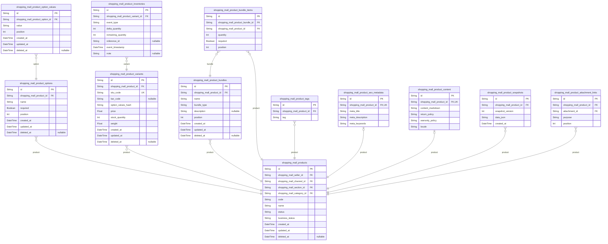

# Prisma Markdown

> Generated by [`prisma-markdown`](https://github.com/samchon/prisma-markdown)

- [Systematic](#systematic)
- [Actors](#actors)
- [Products](#products)
- [Orders](#orders)
- [Coupons](#coupons)
- [Coins](#coins)
- [InquiriesArticles](#inquiriesarticles)
- [Favorites](#favorites)
- [Attachments](#attachments)
- [Snapshots](#snapshots)
- [default](#default)

## Systematic

### `shopping_mall_channels`

Defines logical shopping mall channels (distinct sales
domains/applications/brands) serving as the top-level context for all
subsequent entities. Channel is the anchor for section, category,
catalog, order, and configuration scoping. Each channel may represent a
separate storefront, brand, or localized instance.

Properties as follows:

- `id`: Primary Key.
- `code`
  > Unique business code for the channel (e.g., 'main', 'korea', 'brandX').
  > Used for API routing and business rule scoping.
- `name`
  > Human-readable name of the channel. Used in admin UI and business
  > communication.
- `description`: General description and business context of the channel.
- `created_at`: Channel creation time.
- `updated_at`: Last update time of the channel info.
- `deleted_at`: Channel deletion time (soft delete).

### `shopping_mall_sections`

Logical groupings within a channel (e.g. 'Best Deal', 'International',
'Seasonal'), referencing the owning channel. Used for merchandising,
curation, and business rules. Hierarchically below channels, but may span
multiple business domains.

Properties as follows:

- `id`: Primary Key.
- `shopping_mall_channel_id`: Belonged channel's [shopping_mall_channels.id](#shopping_mall_channels).
- `code`
  > Unique section code, scoped to channel, for business identification
  > (e.g., 'home', 'event', 'bestseller').
- `name`: Section display name as seen in business UI or user application.
- `description`: Short description of the section's purpose.
- `display_order`: Integer order for listing sections within a channel.
- `created_at`: Section creation time.
- `updated_at`: Section update time.
- `deleted_at`: Section deletion time (soft delete); remains for audit/tracking.

### `shopping_mall_channel_categories`

Hierarchical categories defining product or section classification within
a given channel. Supports parent-child nesting for multi-level trees.
Used for search, browse, campaign targeting, and rule scoping. Each
belongs to a channel and can reference a parent category (self-relation).

Properties as follows:

- `id`: Primary Key.
- `shopping_mall_channel_id`: Channel to which the category belongs. [shopping_mall_channels.id](#shopping_mall_channels).
- `parent_id`
  > Optional reference to parent category for child/descendant relationships.
  > [shopping_mall_channel_categories.id](#shopping_mall_channel_categories).
- `code`
  > Unique category code scoped to channel (and maybe parent). Used in
  > routing and business logic.
- `name`: Human-readable name of the category.
- `description`: Description of the category purpose, contents, or intended merchandise.
- `display_order`: Sort order for UI rendering or admin lists within a parent or channel.
- `created_at`: Category creation time.
- `updated_at`: Last update to the category information.
- `deleted_at`: Category deletion time (soft delete).

### `shopping_mall_configurations`

Stores configuration blob(s) for channels or global use (e.g. feature
flags, legal text, social links, settings). Each config row may be
targeted at a channel, be global, or serve different configuration
classes. Version-managed by snapshots for audit and recovery.

Properties as follows:

- `id`: Primary Key.
- `shopping_mall_channel_id`
  > Optional FK channel scope for this configuration. If null, applies
  > globally or to all channels.
- `key`
  > Business-level code or category for this configuration (e.g.,
  > 'feature_flag_shipping', 'legal_policy_en').
- `value`
  > The configuration blob; may be JSON, text, or rendered markdown/HTML,
  > etc. Format varies by key.
- `revision`
  > Revision number for the configuration. Incremented with each new
  > snapshot/version.
- `description`: Description of the setting's business meaning.
- `created_at`: Configuration row creation time.
- `updated_at`: Last update time of this configuration value.
- `deleted_at`: Soft deletion time for the configuration row.

### `shopping_mall_channel_configuration_snapshots`

Append-only historical preservation of all configuration changes for
channel/global configuration records. Used to audit, rollback, or prove
compliance for configuration events. Each snapshot references the
configuration, storing its previous state, revision, and change timing.
Immutable after insert.

Properties as follows:

- `id`: Primary Key.
- `shopping_mall_configuration_id`
  > Target configuration whose state was snapshotted. {@link
  > shopping_mall_configurations.id}.
- `revision`
  > The revision number when this snapshot was taken (immutable for
  > historical record).
- `key`
  > Business configuration key being snapshotted, redundant for full history
  > traceability.
- `value`: Configuration value (blob/text/JSON) at the time of this snapshot.
- `created_at`: Snapshot creation time (point of version preservation).

## Actors

### `shopping_mall_customers`

Customer profile and identity for shopping mall platform. Stores primary
information for authenticated shoppers, their contact data, credential
hashes, registration channel, status, soft-delete, and audit timestamps.
Linked to their associated identities, external accounts, agreements, and
snapshots. [shopping_mall_customer_identities](#shopping_mall_customer_identities), {@link
shopping_mall_external_accounts}, [shopping_mall_user_agreements](#shopping_mall_user_agreements),
and [shopping_mall_customer_snapshots](#shopping_mall_customer_snapshots).

Properties as follows:

- `id`: Primary Key.
- `shopping_mall_channel_id`
  > Registered channel's [shopping_mall_channels.id](#shopping_mall_channels) for multi-tenant
  > segmentation.
- `email`
  > Primary customer email, unique per channel. Used for login unless OAuth
  > only.
- `password_hash`
  > Hashed password for authentication (never store plain). Null if no
  > password for OAuth-only users.
- `phone`: Mobile/contact phone per channel policy.
- `name`
  > Legal or preferred name for personalized interactions, receipts,
  > compliance.
- `status`
  > Customer account lifecycle status (active, pending, suspended, withdrawn,
  > etc).
- `kyc_status`: KYC/identity verification status (pending, verified, denied, etc).
- `created_at`: Record creation timestamp (UTC ISO-8601).
- `updated_at`: Record last modification timestamp (auto-update).
- `deleted_at`: Soft deletion timestamp for audit/compliance. Null if not deleted.

### `shopping_mall_sellers`

Seller account information. Identifies vendors with permissions to
list/manage products and access sales analytics for their own goods.
Inherits all customer fields plus seller-specific status, escalation,
verification, and profile meta. Links to customer entity, has
audit/snapshot, and supports soft delete. [shopping_mall_customers](#shopping_mall_customers)
(relation), [shopping_mall_sections](#shopping_mall_sections), {@link
shopping_mall_seller_snapshots}.

Properties as follows:

- `id`: Primary Key.
- `shopping_mall_customer_id`
  > Base customer record [shopping_mall_customers.id](#shopping_mall_customers) for permission
  > inheritance and login linkage.
- `shopping_mall_section_id`
  > Home section/shop for the seller [shopping_mall_sections.id](#shopping_mall_sections). Used
  > for channel/section scoping.
- `profile_name`: Seller's public display name or shop title.
- `status`
  > Seller approval/lifecycle status (pending, active, suspended, rejected,
  > withdrawn).
- `approval_at`: Datetime seller was formally approved. Null if not yet approved.
- `kyc_status`: KYC/identity check status (pending, verified, denied, etc).
- `created_at`: Record creation timestamp (UTC ISO-8601).
- `updated_at`: Record last modification timestamp (auto-update).
- `deleted_at`: Soft deletion timestamp for audit/compliance. Null if not deleted.

### `shopping_mall_admins`

Platform administrator profiles with role-based privilege separation.
Controls all system-level configuration, moderation, and audit features.
Core entity for admin authentication, KYC validation, and independent
login. Linked to escalation, audit, and admin snapshot tables. {@link
shopping_mall_admin_role_escalations}, {@link
shopping_mall_admin_snapshots}.

Properties as follows:

- `id`: Primary Key.
- `email`: Admin login email. Unique across all admins (no duplication allowed).
- `password_hash`: Hashed password for admin authentication (never store plain).
- `name`: Full legal name (compliance, logging, and business context).
- `status`: Admin account state (active, suspended, pending, withdrawn, etc).
- `kyc_status`: KYC/identity verification status (pending, verified, denied, etc).
- `created_at`: Record creation timestamp (UTC ISO-8601).
- `updated_at`: Record last modification timestamp (auto-update).
- `deleted_at`: Soft deletion timestamp for audit/compliance. Null if not deleted.

### `shopping_mall_customer_identities`

Customer identity verification information (KYC). Holds personal
identifiers, validated documents, verification status, issuer meta, and
active/inactive history. Links to customer entity and supports compliance
audits. Never directly exposed to non-admin users.

Properties as follows:

- `id`: Primary Key.
- `shopping_mall_customer_id`
  > Customer's [shopping_mall_customers.id](#shopping_mall_customers) for whom this identity
  > record is maintained.
- `identity_type`
  > Type of identity: government_id, passport, driver's_license,
  > resident_number, etc.
- `identity_value`: Hashed or encrypted identifier value for privacy.
- `issuer`: Year/authority/issuer for the proof. Optional per national regulation.
- `issue_date`: Date when ID/proof was issued. Useful for validity tracking.
- `verified_at`
  > Datetime when this identity was confirmed as valid by business staff or
  > AI models.
- `status`: Verification state: pending, verified, rejected, expired, etc.
- `created_at`: Record creation timestamp (UTC ISO-8601).
- `updated_at`: Record last modification timestamp (auto-update).

### `shopping_mall_external_accounts`

External OAuth/social account linkage for cross-platform authentication
(Google, Apple, Kakao, Naver, etc). Stores mapping to provider, subject
ID, link status, and audit meta. Supports unique association per provider
per customer. Used for password-less logins, account recovery, and
omnichannel identity. [shopping_mall_customers](#shopping_mall_customers).

Properties as follows:

- `id`: Primary Key.
- `shopping_mall_customer_id`
  > Customer's [shopping_mall_customers.id](#shopping_mall_customers) this external account
  > belongs to.
- `provider`: OAuth provider name (google, apple, kakao, naver, etc).
- `external_user_id`
  > Unique identifier for the user's external account at the provider (e.g.,
  > subject, uid).
- `linked_at`: Datetime the external account was linked to the customer record.
- `status`: Link status (active, revoked, expired, pending).
- `created_at`: Record creation timestamp (UTC ISO-8601).
- `updated_at`: Record last modification timestamp (auto-update).

### `shopping_mall_admin_role_escalations`

Admin role elevation requests and approvals. Tracks escalation attempts
(customer→admin, seller→admin), workflow status, reviewer,
approval/rejection reasons, evidence snapshot linkage. Used for audit,
compliance, and onboarding processes. [shopping_mall_admins](#shopping_mall_admins).

Properties as follows:

- `id`: Primary Key.
- `shopping_mall_admin_id`
  > Admin's [shopping_mall_admins.id](#shopping_mall_admins) targeted by this escalation
  > (person escalating or being escalated).
- `requestor_id`
  > ID of requesting user (customer/seller becoming admin) as business
  > context. Stored for traceability.
- `escalation_type`
  > Type of escalation: customer_to_admin, seller_to_admin, privilege_update,
  > etc.
- `status`: Escalation workflow status (pending, approved, rejected, cancelled, etc).
- `reviewed_by_id`
  > ID of the reviewer/admin who processed/approved this escalation. Null if
  > pending.
- `reason`: Approval/rejection reason or audit context.
- `created_at`: Escalation request creation timestamp (audit).
- `updated_at`: Last update timestamp for the escalation record.

### `shopping_mall_user_connections`

Session and connection metadata for actors. Records live and historical
session events (login, logout, IP, device info, auth context) for
compliance, fraud tracking, and risk scoring. Supports per-channel
scoping and audit history. Restricts PII exposure via role checks.
Links to customer, seller, or admin identities (discriminator required
for use).

Properties as follows:

- `id`: Primary Key.
- `actor_id`
  > Associated actor's id; refers to customer, seller, or admin depending on
  > session context (discriminator or composite required in application
  > layer).
- `actor_type`
  > Discriminator for actor type (customer, seller, admin) used to resolve
  > foreign context. Required.
- `channel_id`: Channel context for this connection (multi-channel session).
- `ip_address`: Remote IP address of connection (IPv4/IPv6).
- `user_agent`
  > Agent string of browser/app/device. Used for session/connection risk
  > analytics.
- `login_at`: Datetime of login/session establishment.
- `logout_at`: Datetime of logout/session end if known; null if session is current/open.
- `auth_context`
  > Auth context info (how login was performed—password, OAuth/google/apple,
  > role, device/2FA).
- `created_at`: Record creation timestamp (UTC ISO-8601).

### `shopping_mall_user_agreements`

Records all user (customer/seller/admin) agreement acceptances with
timestamp, version, and type (Terms, Privacy, Consent, etc). Essential
for legal and regulatory compliance, opt-in/withdrawal, and user
re-consent tracking. Links to actor entity via actor_id/type
discrimination (handled at app layer).

Properties as follows:

- `id`: Primary Key.
- `actor_id`
  > Associated actor's id; refers to customer, seller, or admin depending on
  > actor context (application-layer discriminator required).
- `actor_type`
  > Discriminator for actor type (customer, seller, admin) for reference
  > resolution.
- `agreement_type`: Agreement type—"Terms", "Privacy", "MarketingConsent", etc. Business enum.
- `version`: Document version string ("2024-03.1" or similar).
- `accepted_at`: Datetime when agreement was accepted or updated.
- `withdrawn_at`: Timestamp if user withdraws this agreement (GDPR/opt-out requests).
- `created_at`: Record creation timestamp (UTC ISO-8601).

### `shopping_mall_customer_snapshots`

Historical snapshots of customer entities for audit, compliance, and
evidence retention. Stores point-in-time state of customer record with
all major data for rollback/dispute or compliance requests. Never updated
post-write (append-only), only read for evidence/audit. Links to main
customer entity.

Properties as follows:

- `id`: Primary Key.
- `shopping_mall_customer_id`: Customer's [shopping_mall_customers.id](#shopping_mall_customers) whose state is snapshotted.
- `snapshot_data`
  > Serialized record of customer state (JSON or structured string).
  > Immutable. Includes PII as required by compliance.
- `created_at`: Snapshot creation time (UTC ISO-8601).

### `shopping_mall_seller_snapshots`

Historical snapshots of seller entities for audit/compliance. Stores
point-in-time state of seller account, including profile, status, KYC at
snapshot time. Used for rollback, dispute, or evidence analytics.
Append-only. Linked to main seller entity.

Properties as follows:

- `id`: Primary Key.
- `shopping_mall_seller_id`: Seller's [shopping_mall_sellers.id](#shopping_mall_sellers) whose state is snapshotted.
- `snapshot_data`
  > Serialized record (JSON/structured string) of seller at snapshot time.
  > Immutable. Includes all relevant fields for audit, rollback, or evidence.
- `created_at`: Snapshot creation time (UTC ISO-8601).

### `shopping_mall_admin_snapshots`

Historical snapshots of admin accounts for compliance, rollback, and
evidence. Stores admin state at time of change/event, retained for audit.
Append-only; not modified except for legal erasure. Linked to admin
entity.

Properties as follows:

- `id`: Primary Key.
- `shopping_mall_admin_id`: Admin's [shopping_mall_admins.id](#shopping_mall_admins) whose state is snapshotted.
- `snapshot_data`
  > Complete serialized record (JSON/etc) of admin at snapshot time.
  > Immutable.
- `created_at`: Snapshot creation time (UTC ISO-8601).

## Products

### `shopping_mall_products`

Core product catalog table representing products registered by sellers.
Supports linkage to seller, channel, section, and primary category.
Carries main identifying attributes, business status, and time meta for
full product lifecycle workflows. References subsidiary tables for
options, variants, bundles, SEO, content, inventory, and attachments.

Properties as follows:

- `id`: Primary Key.
- `shopping_mall_seller_id`: Seller who owns the product. [shopping_mall_sellers.id](#shopping_mall_sellers)
- `shopping_mall_channel_id`: Channel where the product is listed. [shopping_mall_channels.id](#shopping_mall_channels)
- `shopping_mall_section_id`
  > Section where product is grouped (virtual corner, theme, etc). {@link
  > shopping_mall_sections.id}
- `shopping_mall_category_id`
  > Primary category (hierarchical) for filtering & search. {@link
  > shopping_mall_channel_categories.id}
- `code`
  > Business-facing, unique product code per seller/channel. Used for SKU and
  > product identity.
- `name`: Product display name for customers and search.
- `status`
  > Product status (e.g., Draft, Active, Paused, Discontinued, Deleted).
  > Controls visibility and business flows.
- `business_status`
  > Business workflow state, e.g., Approval, Pending Activation, Blocked,
  > Suspended.
- `created_at`: Product creation timestamp.
- `updated_at`: Last update timestamp.
- `deleted_at`: Soft delete timestamp, null if not deleted.

### `shopping_mall_product_options`

Product option definitions (size, color, style, etc.) bound to a parent
product. Option attributes enable variant generation. Not independently
managed by users, defined as part of product setup.

Properties as follows:

- `id`: Primary Key.
- `shopping_mall_product_id`: Parent product [shopping_mall_products.id](#shopping_mall_products)
- `name`: Option name (e.g., Size, Color) shown to customer during selection.
- `required`: Whether this option must be selected to order product.
- `position`: Display order/position in UI for option selection.
- `created_at`: Option creation timestamp.
- `updated_at`: Last update timestamp.
- `deleted_at`: Soft delete timestamp, null if active.

### `shopping_mall_product_option_values`

Possible values for each product option (e.g., Red, Blue, Large, Small).
Referenced by variants. Managed as part of product definition and variant
generation, not directly managed by users.

Properties as follows:

- `id`: Primary Key.
- `shopping_mall_product_option_id`: Parent option [shopping_mall_product_options.id](#shopping_mall_product_options)
- `value`
  > Value label (e.g., Red, L, 42). Displayed for selection and variant
  > mapping.
- `position`: Display order/position relative to other values.
- `created_at`: Option value creation timestamp.
- `updated_at`: Last update timestamp.
- `deleted_at`: Soft delete timestamp, null if active.

### `shopping_mall_product_variants`

Each row represents a unique SKU (stock keeping unit) defined by a
combination of option values for a product. Critical for inventory and
order management but not user-managed directly.

Properties as follows:

- `id`: Primary Key.
- `shopping_mall_product_id`: Parent product this variant belongs to. [shopping_mall_products.id](#shopping_mall_products)
- `sku_code`: Internal SKU code/identifier unique within product.
- `bar_code`: Bar code or EAN/UPC for the variant (optional).
- `option_values_hash`
  > Deterministic hash of selected option values for this variant (enables
  > fast lookup and uniqueness enforcement).
- `price`: Sales price of this variant/SKU.
- `stock_quantity`
  > Current inventory quantity (redundant with inventory events, but used for
  > listing performance).
- `weight`: Weight for shipping calculations. Required for delivery use-cases.
- `created_at`: Variant creation timestamp.
- `updated_at`: Last update timestamp.
- `deleted_at`: Soft delete timestamp, null if active.

### `shopping_mall_product_bundles`

Represents a product bundle/composite product. Bundles reference type
(fixed, optional, etc), pricing logic, and display contents. Not managed
directly by users other than during product registration.

Properties as follows:

- `id`: Primary Key.
- `shopping_mall_product_id`
  > Parent product for which this bundle is defined. {@link
  > shopping_mall_products.id}
- `name`: Bundle display name for customers.
- `bundle_type`: Type of bundle, e.g., 'fixed' or 'optional'.
- `description`: Short description of bundle (optional).
- `position`: Display order for multiple bundles on one product.
- `created_at`: Bundle creation timestamp.
- `updated_at`: Last bundle update timestamp.
- `deleted_at`: Soft delete timestamp, null if active.

### `shopping_mall_product_bundle_items`

Junction table linking products included in a given bundle (composition
M:N). Each row is an item in a bundle, referencing both the bundle and
the constituent product. Enforces order and uniqueness, supports
optional/multiplicative bundles.

Properties as follows:

- `id`: Primary Key.
- `shopping_mall_product_bundle_id`: Bundle this item belongs to. [shopping_mall_product_bundles.id](#shopping_mall_product_bundles)
- `shopping_mall_product_id`: Product included in this bundle. [shopping_mall_products.id](#shopping_mall_products)
- `quantity`: Quantity of this product in the bundle.
- `required`: Whether this product must be included in purchase/bundle.
- `position`: Display order within the bundle.

### `shopping_mall_product_tags`

Tags associated with products for keyword search and AI-driven
recommendation/personalization. Not managed independently, attached
during product registration or update.

Properties as follows:

- `id`: Primary Key.
- `shopping_mall_product_id`: Product referenced by this tag. [shopping_mall_products.id](#shopping_mall_products)
- `tag`
  > Tag or keyword assigned to the product, used for search and
  > recommendations.

### `shopping_mall_product_seo_metadata`

Per-product SEO metadata including meta title, meta description, and
keywords for search optimization. Only attached via product, not managed
independently by users.

Properties as follows:

- `id`: Primary Key.
- `shopping_mall_product_id`
  > Product for which this SEO meta is attached. {@link
  > shopping_mall_products.id}
- `meta_title`: SEO meta title for the product.
- `meta_description`: SEO meta description for the product.
- `meta_keywords`: SEO meta keywords, comma-separated.

### `shopping_mall_product_content`

Rich content fields for product descriptions, policies, and multilingual
data. Includes display content in Markdown/HTML, return/warranty policy,
and structured data for suggestions/recommendations. Attached per
product.

Properties as follows:

- `id`: Primary Key.
- `shopping_mall_product_id`
  > Product for which this content is provided. {@link
  > shopping_mall_products.id}
- `content_markdown`: Formatted product description in Markdown or HTML.
- `return_policy`: Return policy text (localized, shown to customers).
- `warranty_policy`: Warranty/aftersales policy text (localized, shown to customers).
- `locale`: Language and region code for content localization.

### `shopping_mall_product_inventories`

Inventory event table, capturing all inventory-changing events (add,
remove, adjust, restock) by variant/SKU as an event log. Enables full
audit trail and reconciliation of stock changes for compliance.

Properties as follows:

- `id`: Primary Key.
- `shopping_mall_product_variant_id`
  > Variant SKU affected by this inventory event. {@link
  > shopping_mall_product_variants.id}
- `event_type`: Inventory event type: 'add', 'remove', 'adjust', 'restock', etc.
- `delta_quantity`: Change in quantity (positive for receive, negative for issue).
- `remaining_quantity`: Running balance of quantity for this SKU post-event.
- `reference_id`
  > Reference entity/event; could be order, restock or manual entry. Used for
  > audit linkage.
- `event_timestamp`: Time event is recorded.
- `note`: Optional note for context (e.g., reason for adjustment, batch ID).

### `shopping_mall_product_snapshots`

Snapshot table capturing the entire historical state of a product for
each mutation. Enables audit/evidence for compliance and rollback. Stores
all business fields and relationships as at the snapshot time.

Properties as follows:

- `id`: Primary Key.
- `shopping_mall_product_id`: Product which this snapshot represents. [shopping_mall_products.id](#shopping_mall_products)
- `snapshot_version`: Monotonically increasing snapshot version for this product.
- `data_json`
  > Complete serialized product state at the snapshot moment (JSON blob for
  > compliance/audit).
- `created_at`: Snapshot creation timestamp.

### `shopping_mall_product_attachment_links`

Links between products (or related entities) and file attachments.
Enables multiple attachments per product/content, supporting images,
files, and rich media.

Properties as follows:

- `id`: Primary Key.
- `shopping_mall_product_id`: Product for which this file is attached. [shopping_mall_products.id](#shopping_mall_products)
- `attachment_id`
  > Attachment file reference, linked to shopping_mall_attachments table.
  > [shopping_mall_attachments.id](#shopping_mall_attachments)
- `purpose`: Attachment usage context (e.g., main_image, gallery, spec_sheet).
- `position`: Order for displaying attachments of the same purpose/category.

## Orders

### `shopping_mall_carts`

Shopping cart entity managed per customer and channel/section. Allows
persistent holding of items before order, supports both guest and
logged-in users. Tied to shopping_mall_customers and systematic domains.
Soft delete and audit fields for compliance.

Properties as follows:

- `id`: Primary Key.
- `shopping_mall_customer_id`: Belonged customer's [shopping_mall_customers.id](#shopping_mall_customers).
- `shopping_mall_channel_id`: Associated sales channel [shopping_mall_channels.id](#shopping_mall_channels).
- `shopping_mall_section_id`: Associated section within channel [shopping_mall_sections.id](#shopping_mall_sections).
- `source`: Source of the cart (guest, member, migrated, etc).
- `status`: Status of the cart (active, expired, checked_out, deleted).
- `expires_at`: Expiration timestamp for automatic cart archival.
- `created_at`: Creation timestamp.
- `updated_at`: Last update timestamp.
- `deleted_at`: Soft deletion timestamp for audit/evidence compliance.

### `shopping_mall_cart_items`

Cart item entity representing a product/variant/option added to a cart.
Each row links to a unique product (or bundle/product option), quantity,
and cart context. No standalone search; always subsidiary to parent cart.

Properties as follows:

- `id`: Primary Key.
- `shopping_mall_cart_id`: Parent cart [shopping_mall_carts.id](#shopping_mall_carts).
- `shopping_mall_product_id`: Associated product [shopping_mall_products.id](#shopping_mall_products).
- `shopping_mall_product_variant_id`
  > Selected product variant (combination of options), {@link
  > shopping_mall_product_variants.id}.
- `quantity`: Quantity selected for this item.
- `option_snapshot`: Serialized snapshot of selected options for evidence/audit.
- `created_at`: Cart item creation timestamp.
- `updated_at`: Last update timestamp.
- `deleted_at`: Soft deletion timestamp for historical tracking.

### `shopping_mall_cart_snapshots`

Audit/history snapshot for entire shopping cart instance (state
before/after key changes, checkout, deletion, etc). Used for legal
compliance, rollback, and dispute scenarios.

Properties as follows:

- `id`: Primary Key.
- `shopping_mall_cart_id`: Source cart instance [shopping_mall_carts.id](#shopping_mall_carts).
- `snapshot_data`: Immutable serialized JSON of the cart structure at snapshot time.
- `created_at`: Snapshot creation timestamp.

### `shopping_mall_orders`

Main business order entity. Ties customer, channel/section, and core
order context. Supports multi-item, multi-seller, and multi-status
(applied, paid, fulfilled, split, cancelled, etc.). Legal evidence; all
state transitions snapshotted. Indexed for query across
channel/segment/timestamps.

Properties as follows:

- `id`: Primary Key.
- `shopping_mall_customer_id`: Order-placing customer [shopping_mall_customers.id](#shopping_mall_customers).
- `shopping_mall_channel_id`: Target channel [shopping_mall_channels.id](#shopping_mall_channels).
- `shopping_mall_section_id`: Target section [shopping_mall_sections.id](#shopping_mall_sections).
- `shopping_mall_cart_id`: Originating cart instance [shopping_mall_carts.id](#shopping_mall_carts).
- `external_order_ref`: Reference to external order/payment systems for events or integrations.
- `status`
  > Order status (applied, payment_required, paid, in_fulfillment, shipping,
  > delivered, completed, cancelled, split, etc).
- `order_type`: Type of order (normal, split, group, aftersales, etc).
- `total_amount`: Total order amount at application time. Used for analytics/auditing.
- `paid_amount`: Actual paid amount (may differ due to coupon, error correction, etc).
- `currency`: Order currency (supports multi-currency settlements).
- `created_at`: Order creation time.
- `updated_at`: Last update time.
- `deleted_at`: Soft deletion timestamp (for legal recovery, never physically deleted).

### `shopping_mall_order_items`

Order substructure for each unique product or bundled component. Each
item reflects status, fulfillment, individual pricing, and option choice.
Always subsidiary to a parent order (1:N).

Properties as follows:

- `id`: Primary Key.
- `shopping_mall_order_id`: Parent order [shopping_mall_orders.id](#shopping_mall_orders).
- `shopping_mall_product_id`: Ordered product [shopping_mall_products.id](#shopping_mall_products).
- `shopping_mall_product_variant_id`
  > Specific product variant (option combination) {@link
  > shopping_mall_product_variants.id}.
- `shopping_mall_seller_id`: Responsible seller for fulfillment [shopping_mall_sellers.id](#shopping_mall_sellers).
- `quantity`: Number of units ordered for this item/reference.
- `unit_price`: Unit price at order time (pre-discount).
- `final_price`: Final price after discounts, per unit.
- `discount_snapshot`: Snapshot of all discounts/coupons applied.
- `status`: Status of order item (ordered, paid, fulfilled, cancelled, returned, etc).
- `created_at`: Item creation timestamp.
- `updated_at`: Last update timestamp.
- `deleted_at`: Soft deletion for evidence/audit.

### `shopping_mall_order_snapshots`

Full audit snapshot of the order object at any legal/compliance relevant
state prior to transition. Stores immutable JSON blob and reference to
source order for easy retrieval and rollback. Used for dispute/legal
requirements.

Properties as follows:

- `id`: Primary Key.
- `shopping_mall_order_id`
  > Order instance referenced for audit snapshot {@link
  > shopping_mall_orders.id}.
- `snapshot_data`
  > Immutable serialized state of order (including nested items, payments,
  > etc) at time of snapshot.
- `created_at`: Snapshot creation timestamp.

### `shopping_mall_order_item_snapshots`

Snapshot of a single order item’s state at a point in time for
fine-grained audit and aftersales tracking. Used to reconstruct
product/item state in disputes or process automation.

Properties as follows:

- `id`: Primary Key.
- `shopping_mall_order_item_id`: Corresponding order item [shopping_mall_order_items.id](#shopping_mall_order_items).
- `snapshot_data`: Serialized frozen state of order item at the moment (JSON).
- `created_at`: Snapshot creation timestamp.

### `shopping_mall_payments`

Payment record associated with orders—tracks each payment, refund, or
settlement method flow. Includes support for asynchronous payment,
multiple partial payments, per-channel payment configuration. Indexed for
audit/tracing.

Properties as follows:

- `id`: Primary Key.
- `shopping_mall_order_id`: Linked order [shopping_mall_orders.id](#shopping_mall_orders).
- `shopping_mall_customer_id`: Paying customer [shopping_mall_customers.id](#shopping_mall_customers).
- `payment_type`: Payment type (card, virtual_account, deposit, mileage, split, etc).
- `external_payment_ref`: External system payment reference, if present.
- `status`: Payment status (pending, paid, cancelled, failed, refunded, etc).
- `amount`: Amount covered by this payment.
- `currency`: Currency of transaction (system supports multi-currency).
- `requested_at`: Time payment was initiated.
- `confirmed_at`: Time payment was confirmed.
- `cancelled_at`: Time payment was cancelled/refunded.
- `created_at`: Row creation time (for audit trail).
- `updated_at`: Row last update time (for audit trail).
- `deleted_at`: Soft deletion timestamp.

### `shopping_mall_payment_snapshots`

Audit snapshots of a payment state at critical transitions for compliance
(requested/confirmed/cancelled). Snapshots allow tracing every
legal/financial event on the payment object.

Properties as follows:

- `id`: Primary Key.
- `shopping_mall_payment_id`: Source payment [shopping_mall_payments.id](#shopping_mall_payments).
- `snapshot_data`: Serialized immutable JSON state at time of snapshot.
- `created_at`: Snapshot creation timestamp.

### `shopping_mall_shipments`

Shipment batch associated with an order. Shipments can be split from the
same order (partial or multi-seller) and are linked to fulfillment
workflow. Status, carrier, shipping info, and per-shipment state tracked.
Key for multi-seller/partial shipment logic.

Properties as follows:

- `id`: Primary Key.
- `shopping_mall_order_id`: Parent order [shopping_mall_orders.id](#shopping_mall_orders).
- `shopping_mall_seller_id`
  > Responsible shipping seller for this batch {@link
  > shopping_mall_sellers.id}.
- `shipment_code`: Unique shipment code for tracking purposes.
- `external_tracking_number`: External carrier's shipment tracking code.
- `status`
  > Combined status of shipment (pending, shipped, delivered, returned,
  > cancelled, etc).
- `carrier`: Logistics/carrier service reference.
- `requested_at`: Time shipment prep was initiated.
- `shipped_at`: Time goods handed to carrier.
- `delivered_at`: Time shipment delivery confirmed.
- `created_at`: Row creation time.
- `updated_at`: Row update time.
- `deleted_at`: Soft deletion timestamp, never physical deletion.

### `shopping_mall_shipment_items`

Junction table for many-to-many relationship between shipments and order
items, allowing partial shipments per item or item portions across
multiple shipments. Always subsidiary, never independent API.

Properties as follows:

- `id`: Primary Key.
- `shopping_mall_shipment_id`: Parent shipment [shopping_mall_shipments.id](#shopping_mall_shipments).
- `shopping_mall_order_item_id`: Associated order item [shopping_mall_order_items.id](#shopping_mall_order_items).
- `shipped_quantity`: Number of units shipped from this item in this batch.
- `created_at`: Junction creation timestamp.
- `updated_at`: Junction update timestamp.

### `shopping_mall_deliveries`

Represents the delivery address window for an order or specific
shipment/batch. Splits and supports post-shipment updates and recipient
confirmation logic. References external status/confirmation and fully
replaced for each handover.

Properties as follows:

- `id`: Primary Key.
- `shopping_mall_order_id`: Linked parent order [shopping_mall_orders.id](#shopping_mall_orders).
- `shopping_mall_shipment_id`
  > Optional link to a given shipment or batch (used in partial shipment
  > scenarios).
- `recipient_name`: Recipient name at time of delivery.
- `recipient_phone`: Contact phone of recipient.
- `address_snapshot`: Full delivery address/final snapshot for compliance/audit.
- `delivery_message`: User-supplied delivery message/instruction.
- `delivery_status`
  > Status (prepared, dispatched, delivered, returned, failed, confirmed,
  > etc).
- `confirmed_at`: User or system confirmation time for successful delivery.
- `delivery_attempts`: Number of delivery attempts.
- `created_at`: Row creation time.
- `updated_at`: Row update time.
- `deleted_at`: Soft deletion timestamp.

### `shopping_mall_after_sale_services`

Main business entity for after-sales service cases (returns, exchanges,
refund requests). Ties to order and delivery entities. Stores status,
request/resolution, and evidence snapshot references for dispute or
compliance.

Properties as follows:

- `id`: Primary Key.
- `shopping_mall_order_id`: Referenced order for after-sales case [shopping_mall_orders.id](#shopping_mall_orders).
- `shopping_mall_delivery_id`: Referenced delivery from which after-sales is initiated (if any).
- `case_type`: Type of case (return, exchange, refund, repair, etc).
- `status`
  > Current status (requested, processing, approved, denied, in_delivery,
  > completed, cancelled).
- `reason`: User-provided reason for request.
- `evidence_snapshot`: Reference to order/delivery/item snapshots at time of request.
- `resolution_message`: Resolution info from platform or seller/support.
- `created_at`: Row creation timestamp.
- `updated_at`: Row last update timestamp.
- `deleted_at`: Soft deletion timestamp for compliance.

## Coupons

### `shopping_mall_coupons`

Main business entity for all available discount/coupon definitions.
Represents the logical configuration of a coupon: code, type, discount
metadata, validity window, applicability (all/segment),
stackability/exclusivity, issuance/usage caps, and auditability.
Independently managed by admins or sellers. Referenced by issuances,
targets, usages, and campaigns. Snapshotted on all configuration or
status changes.

Properties as follows:

- `id`: Primary Key.
- `shopping_mall_coupon_campaign_id`
  > Associated campaign's [shopping_mall_coupon_campaigns.id](#shopping_mall_coupon_campaigns). Nullable
  > if stand-alone or ad hoc coupon.
- `code`: Unique coupon code or template (for single/bulk issuance).
- `title`: Coupon title/label, user-facing.
- `description`: Coupon description (terms, usage, etc).
- `coupon_type`: Type of coupon (public, private, one-time, etc).
- `discount_type`: Discount logic: 'amount', 'percentage', 'free_shipping', etc.
- `discount_value`: Discount value (amount/percentage depending on discount_type).
- `min_order_amount`: Minimum eligible order amount for coupon use.
- `max_discount_amount`: Maximum discount (for capped percentage types).
- `stackable`: Whether coupon can be stacked with others.
- `exclusive`: If true, coupon is exclusive (cannot be combined).
- `usage_limit_total`: Total usage cap for this coupon.
- `usage_limit_per_user`: Per-user usage cap for this coupon.
- `issuance_limit_total`: Total issuances allowed for this coupon.
- `issued_count`: Running total of times coupon issued.
- `used_count`: Running total of times coupon used.
- `issued_at`: Coupon activation/start time.
- `expires_at`: Coupon expiration/end time.
- `business_status`: Business/lifecycle status (e.g., draft, active, paused, expired, deleted).
- `created_at`: Coupon creation timestamp.
- `updated_at`: Coupon last update timestamp.
- `deleted_at`: Logical deletion timestamp.

### `shopping_mall_coupon_issuances`

Records actual issuances (allocation or assignment) of coupons to actors
(customers, accounts, segments, etc). Each record tracks the actor being
granted the coupon, when/for which coupon, issuance status, and context.
Used to enforce per-user/segment limits. May be generated in bulk or 1:1
(e.g., single-use). References coupon and optionally customer.

Properties as follows:

- `id`: Primary Key.
- `shopping_mall_coupon_id`: Referenced coupon's [shopping_mall_coupons.id](#shopping_mall_coupons).
- `shopping_mall_customer_id`
  > Recipient actor's [shopping_mall_customers.id](#shopping_mall_customers). Nullable for
  > public/anonymous cases.
- `code`: Actual coupon code issued (could be unique per issuance).
- `issued_at`: Time issued.
- `expires_at`: Expiration for this issuance (may differ from base coupon).
- `usage_limit`: Usage limit for this actor (may override per-user global).
- `used_count`: Number of times actor has used this issued coupon.
- `status`: Issuance status (active, expired, redeemed, revoked, etc).
- `created_at`: Creation timestamp.
- `updated_at`: Update timestamp.
- `deleted_at`: Deletion timestamp (for soft delete, audit).

### `shopping_mall_coupon_usages`

Tracks individual coupon usage events. Each record logs coupon and
issuance, order context, acting customer, timestamps, and outcome. Used
for full audit/analytics, fraud/abuse monitoring, and per-user limit
enforcement. Key for analytics, auditing, and operational business rules.

Properties as follows:

- `id`: Primary Key.
- `shopping_mall_coupon_id`: Used coupon's [shopping_mall_coupons.id](#shopping_mall_coupons).
- `shopping_mall_coupon_issuance_id`: Link to exact issuance used [shopping_mall_coupon_issuances.id](#shopping_mall_coupon_issuances).
- `shopping_mall_order_id`: Order where coupon was used [shopping_mall_orders.id](#shopping_mall_orders).
- `shopping_mall_customer_id`: Customer using the coupon [shopping_mall_customers.id](#shopping_mall_customers).
- `used_at`: Usage timestamp.
- `status`: Usage status: 'applied', 'confirmed', 'revoked', 'failed', etc.
- `discount_amount`: Actual discount value applied in use event.
- `created_at`: Record creation timestamp.
- `updated_at`: Update timestamp.

### `shopping_mall_coupon_targets`

Subsidiary table that defines which entities (channels, sections,
categories, sellers, products, customers, etc.) a coupon is eligible to
be applied to. Many-to-many mapping supports broad and fine-grained
targeting. Not directly exposed to business users, but referenced by
coupons and used in eligibility validation. Enables efficient eligibility
queries and administration of coupon scope.

Properties as follows:

- `id`: Primary Key.
- `shopping_mall_coupon_id`: Parent coupon [shopping_mall_coupons.id](#shopping_mall_coupons).
- `shopping_mall_channel_id`: Linked channel [shopping_mall_channels.id](#shopping_mall_channels). Nullable if not scoped.
- `shopping_mall_section_id`: Linked section [shopping_mall_sections.id](#shopping_mall_sections). Nullable if not scoped.
- `shopping_mall_channel_category_id`
  > Linked category [shopping_mall_channel_categories.id](#shopping_mall_channel_categories). Nullable for
  > global coupons.
- `shopping_mall_product_id`
  > Targeted product eligibility [shopping_mall_products.id](#shopping_mall_products). Nullable
  > for broader coupons.
- `shopping_mall_seller_id`
  > Eligible seller [shopping_mall_sellers.id](#shopping_mall_sellers). Nullable for broader
  > coupons.
- `shopping_mall_customer_id`
  > Eligible customer [shopping_mall_customers.id](#shopping_mall_customers). Nullable for
  > segment or global coupons.
- `target_type`
  > Indicates what this row maps to - e.g., 'channel', 'section', 'category',
  > 'product', 'seller', 'customer'.
- `created_at`: Creation timestamp.

### `shopping_mall_coupon_campaigns`

Represents an organized campaign grouping one or more coupons under a
business concept—promo, seasonal event, collaboration, etc. Stores
campaign metadata: name, description, period, business status, and
categorical analytics. Coupons may be standalone or linked to a campaign.
Campaigns are independently managed via business UI.

Properties as follows:

- `id`: Primary Key.
- `name`: Business-facing campaign name.
- `description`: Campaign description and terms.
- `starts_at`: Campaign activation/start time.
- `ends_at`: Campaign end/expiration time.
- `business_status`: Workflow status: draft, active, paused, expired, deleted, etc.
- `created_at`: Campaign creation timestamp.
- `updated_at`: Campaign update timestamp.
- `deleted_at`: Logical deletion timestamp, for partitioning and audit.

### `shopping_mall_coupon_snapshots`

Snapshot/history table supporting full point-in-time audit of coupon
definitions and all linked configuration and eligibility at every event.
Historical/log-audit for every change or status/event affecting main
coupon configuration. Used for forensic, rollback, and compliance
requests. Not user-editable, append-only, records all pre- and
post-change coupon details.

Properties as follows:

- `id`: Primary Key.
- `shopping_mall_coupon_id`: Target coupon [shopping_mall_coupons.id](#shopping_mall_coupons).
- `snapshot_type`: Type of snapshot event: creation, update, status_change, etc.
- `snapshot_data`
  > JSON or serialized snapshot data for the coupon and all linked
  > configuration.
- `snapshot_at`: Snapshot creation time.

## Coins

### `shopping_mall_deposits`

Represents each user's digital deposit balance (electronic wallet) in the
system. Connects to one customer. Reflects the available deposit coin
balance for monetary operations (top-up, spend, refund), with direct
linkage to all deposit-related transactions. Snapshot logic ensures
regulatory traceability. Used for customer-initiated deposits, refunds,
or administrative adjustments. Separate from loyalty program mileages.

Properties as follows:

- `id`: Primary Key.
- `shopping_mall_customer_id`
  > Belonged customer's [shopping_mall_customers.id](#shopping_mall_customers). Each deposit
  > account is tied to one user account.
- `balance`
  > Current deposit balance (in system currency units). Always non-negative,
  > may reflect pending operations until settled.
- `status`
  > Account status (active, frozen, closed, under_review, etc.) for financial
  > and compliance operations.
- `created_at`: Timestamp when the deposit record was created.
- `updated_at`: Timestamp for last update to the deposit record.
- `deleted_at`: Timestamp if deposit record is soft-deleted. Null unless deleted.

### `shopping_mall_deposit_transactions`

Ledger of all deposit coin inflows and outflows for customers. Each
record is an evidence for financial audit, compliance, or fraud
monitoring. Tied to a deposit account and customer; may reference an
order; records business context, amounts, type (income/outcome), status,
and reason. Stores timestamps for creation and reversal. Allows tracing
for all deposit operations (top-up, spend, admin adjustment, refund,
etc.).

Properties as follows:

- `id`: Primary Key.
- `shopping_mall_deposit_id`: Associated deposit account [shopping_mall_deposits.id](#shopping_mall_deposits).
- `shopping_mall_customer_id`
  > Target customer [shopping_mall_customers.id](#shopping_mall_customers). Always required for
  > user-level ledger/audit.
- `shopping_mall_order_id`
  > Linked order transaction (if applicable) [shopping_mall_orders.id](#shopping_mall_orders).
  > Null if not related to an order.
- `type`
  > Transaction type (income, outcome, refund, admin_adjustment, reversal,
  > etc.)
- `amount`: Transaction amount (system currency units, positive value).
- `business_status`
  > Business-side processing status (applied, confirmed, failed, in_review,
  > reversed, etc.).
- `reason`
  > Detailed business reason or description for transaction (top-up,
  > purchase, refund, bonus, manual debit, etc.).
- `evidence_reference`
  > Optional reference to evidence, audit record, or snapshot backing this
  > transaction.
- `reversed_at`
  > If this transaction was reversed/cancelled, indicates the datetime; null
  > otherwise.
- `created_at`: Transaction creation timestamp.
- `updated_at`: Transaction update timestamp.
- `deleted_at`: Soft-delete timestamp if the transaction was deleted; null otherwise.

### `shopping_mall_mileages`

Represents each user's mileage (loyalty/point system) balance. Separate
from deposit accounts; mileages are non-cash, generally earned by
system/business logic. Linked to a single customer. Used for loyalty,
reward, or promotional purposes. Subject to expiration and usage limits.
Fully auditable for compliance.

Properties as follows:

- `id`: Primary Key.
- `shopping_mall_customer_id`
  > Belonged customer's [shopping_mall_customers.id](#shopping_mall_customers). Each mileage
  > account is associated with a user.
- `balance`
  > Current usable mileage/point balance. Non-negative value representing
  > available loyalty points.
- `status`
  > Account status (active, expired, frozen). Indicates current ability to
  > accrue or spend mileage.
- `expired_at`
  > Datetime when all current mileage expires if not renewed or spent. Used
  > for campaign/bonus mileages with deadlines.
- `created_at`: Timestamp when the mileage account was created.
- `updated_at`: Timestamp for last update to the mileage account.
- `deleted_at`: Soft-delete timestamp; null if active.

### `shopping_mall_mileage_transactions`

Complete ledger for all mileage (loyalty point) actions: accrual, spend,
expiration, adjustment, bonus, or refund. Tracks every change to user
mileage with full evidence for audit and compliance (one record per
event). Foreign key links to mileage and customer. May reference an order
or campaign. Records status, type, context/reason codes, evidence refs,
and timestamps.

Properties as follows:

- `id`: Primary Key.
- `shopping_mall_mileage_id`: Associated mileage account [shopping_mall_mileages.id](#shopping_mall_mileages).
- `shopping_mall_customer_id`
  > Target customer [shopping_mall_customers.id](#shopping_mall_customers). Always required for
  > user-level audit.
- `shopping_mall_order_id`
  > Linked order (if associated) [shopping_mall_orders.id](#shopping_mall_orders). Null if not
  > related to a specific order.
- `type`
  > Transaction type (accrual, spend, expiration, bonus, adjustment, refund,
  > etc.).
- `amount`
  > Mileage value for this transaction (positive for accrual/bonus, negative
  > for spend/expiration).
- `business_status`
  > Processing/business status: applied, confirmed, failed, expired,
  > reversed, in_review, etc.
- `reason`
  > Optional business reason, event, or note (promo, adjustment, campaign,
  > system grant, manual, etc.).
- `evidence_reference`
  > Optional reference to compliance, audit, or related snapshot for the
  > event.
- `reversed_at`: Datetime if this event was reversed/cancelled. Null otherwise.
- `created_at`: Datetime for event creation.
- `updated_at`: Datetime when this event was last updated.
- `deleted_at`: Soft-delete timestamp if event was deleted. Null otherwise.

### `shopping_mall_donations`

Tracks all donation events using deposit/mileage by customers. Each
record captures donor, value, type (deposit or mileage), donation
target/campaign (external lookup or campaign id), status, datetime, and
evidence info for transparency, compliance, and analytics. Supports both
deposit and mileage as sources. Used for audit, fraud prevention,
campaign reporting, and regulatory evidence.

Properties as follows:

- `id`: Primary Key.
- `shopping_mall_customer_id`: Donating customer [shopping_mall_customers.id](#shopping_mall_customers).
- `source_type`
  > Type of the donation source (deposit, mileage). Determines if donation
  > was made from deposit or mileage balance.
- `source_entity_id`
  > Foreign key to the related deposit or mileage account
  > (shopping_mall_deposits.id or shopping_mall_mileages.id).
- `target_campaign_code`
  > The code or business key for the destination campaign/event receiving the
  > donation.
- `amount`
  > Donation amount (currency units for deposit, point units for mileage).
  > Must be non-negative.
- `status`
  > Donation status (pending, confirmed, failed, refunded, under_review,
  > etc.).
- `evidence_reference`: Optional link to evidence record, snapshot, compliance request.
- `donated_at`: Datetime donation was made.
- `created_at`
  > Datetime record was created (may differ from donated_at for
  > backfill/correction).
- `updated_at`: Datetime record was last updated.
- `deleted_at`: Soft-delete timestamp for the donation entry, if any. Null if active.

### `shopping_mall_coin_snapshots`

System/state snapshot table recording complete states of all deposit and
mileage accounts at one point in time for audit, compliance, regulatory
reporting, or recovery purposes. Stores entity id, entity type
(deposit/mileage), pre/post balance, timestamp, trigger info (system
maintenance, audit, campaign event), and evidence chain data. Used for
audit trails and regulatory proofs. Not directly manipulated by end
users.

Properties as follows:

- `id`: Primary Key.
- `entity_id`
  > Entity (deposit or mileage) being snapshotted: points to
  > shopping_mall_deposits.id or shopping_mall_mileages.id. This is a
  > business reference to an external table; not a Prisma model relation.
  > Type is uuid for compatibility and traceability.
- `entity_type`: Type of the snapshotted entity (deposit or mileage).
- `balance_before`: Account balance before snapshot event.
- `balance_after`: Account balance after snapshot event.
- `snapshot_trigger`
  > Reason or business event that triggered the snapshot (system_audit,
  > compliance, campaign, refund, etc.).
- `evidence_reference`
  > Optional referential link to audit/compliance/maintenance event or
  > document.
- `created_at`: Datetime the snapshot was taken.
- `updated_at`: Datetime the snapshot record was last updated.
- `deleted_at`
  > Soft-delete timestamp, null unless the snapshot itself is nullified for
  > business policy.

## InquiriesArticles

### `shopping_mall_boards`

Forum/board structure for channel/section, supporting product Q&A,
reviews, UGC. Board creation, visibility, moderation permissions, and
linkage to channel/section (by FK). Segmentation enables different boards
per channel/section; anchor for all board-based content and moderation.

Properties as follows:

- `id`: Primary Key.
- `shopping_mall_channel_id`: Belonged channel’s [shopping_mall_channels.id](#shopping_mall_channels).
- `shopping_mall_section_id`: Belonged section’s [shopping_mall_sections.id](#shopping_mall_sections).
- `title`: Board display name/title.
- `description`: Explanation/purpose of the board (Markdown supported).
- `visibility`
  > Board visibility: public, private, channel-restricted, or
  > section-restricted.
- `moderation_required`: Whether all posts need moderation before publication.
- `post_expiry_days`: Days until posts are auto-archived/expire (nullable).
- `created_at`: Time the board record was created.
- `updated_at`: Time this record was last updated.
- `deleted_at`: Soft delete time, null if active.

### `shopping_mall_board_posts`

Posts/articles/respondable threads in boards. Created by any role, linked
to board, optionally to products/orders. Full multi-role authorship,
moderation and reply threading. Supports independent management and
search.

Properties as follows:

- `id`: Primary Key.
- `shopping_mall_board_id`: Associated board’s [shopping_mall_boards.id](#shopping_mall_boards).
- `shopping_mall_customer_id`: If author is customer, link to [shopping_mall_customers.id](#shopping_mall_customers).
- `shopping_mall_seller_id`: If author is seller, link to [shopping_mall_sellers.id](#shopping_mall_sellers).
- `shopping_mall_admin_id`: If author is admin, link to [shopping_mall_admins.id](#shopping_mall_admins).
- `shopping_mall_parent_post_id`: Reply of/parent (self-ref).
- `shopping_mall_product_id`: Linked product’s [shopping_mall_products.id](#shopping_mall_products).
- `shopping_mall_order_id`: Linked order’s [shopping_mall_orders.id](#shopping_mall_orders).
- `title`: Post or article title.
- `body`: Main content (Markdown/HTML).
- `reply_level`: Thread depth (0=starter).
- `is_official_answer`: True if post is an official (admin/seller) answer.
- `visibility`: Visibility: public, registered-users, private, etc.
- `moderation_status`: Moderation: pending, approved, denied, etc.
- `moderation_reason`: Explanation for moderation state (optional).
- `created_at`: Created timestamp.
- `updated_at`: Last updated timestamp.
- `deleted_at`: Soft delete timestamp.

### `shopping_mall_board_post_snapshots`

Snapshots preserving all mutable fields for each board post mutation
(edit/moderation, etc). Immutable history for legal compliance and audit.
Snapshots reference their parent post.

Properties as follows:

- `id`: Primary Key.
- `shopping_mall_board_post_id`: Snapshot of board post [shopping_mall_board_posts.id](#shopping_mall_board_posts).
- `title`: Title at snapshot time.
- `body`: Content at snapshot time.
- `reply_level`: Thread depth at snapshot time.
- `is_official_answer`: Official answer flag at snapshot.
- `visibility`: Visibility at snapshot time.
- `moderation_status`: Moderation state at snapshot time.
- `moderation_reason`: Moderation reason at snapshot time (nullable).
- `snapshot_reason`: Reason for snapshot (edit, moderation, etc).
- `created_at`: Snapshot timestamp.

### `shopping_mall_product_inquiries`

Inquiries (Q&A) regarding products. Authored by customer/seller. Direct
linkage to product and actor/role; supports official response, privacy,
and moderation. Supports audit trails and batch solutions.

Properties as follows:

- `id`: Primary Key.
- `shopping_mall_product_id`: Related product’s [shopping_mall_products.id](#shopping_mall_products).
- `shopping_mall_customer_id`: If inquirer is customer, link to [shopping_mall_customers.id](#shopping_mall_customers).
- `shopping_mall_seller_id`: If inquirer is seller, link to [shopping_mall_sellers.id](#shopping_mall_sellers).
- `title`: Inquiry summary/title.
- `body`: Full inquiry content.
- `is_private`: Visibility restriction to only author and responders.
- `answered`: True when an answer is posted.
- `moderation_status`: Moderation state: pending, approved, etc.
- `created_at`: Inquiry created at.
- `updated_at`: Last update timestamp.
- `deleted_at`: Soft delete timestamp.

### `shopping_mall_inquiry_answers`

Answers to product inquiries by sellers/admins. Supports official answer
flag, independent moderation, and notification link. Linked to original
inquiry and multi-role author. Moderation life-cycle and compliance
supported.

Properties as follows:

- `id`: Primary Key.
- `shopping_mall_product_inquiry_id`: Inquiry being answered [shopping_mall_product_inquiries.id](#shopping_mall_product_inquiries).
- `shopping_mall_seller_id`: Responder if seller [shopping_mall_sellers.id](#shopping_mall_sellers).
- `shopping_mall_admin_id`: Responder if admin [shopping_mall_admins.id](#shopping_mall_admins).
- `body`: Answer body.
- `moderation_status`: Moderation: pending, approved, etc.
- `official_answer`: Official answer for the inquiry.
- `notified_at`: When customer notified (nullable).
- `created_at`: Answer created at.
- `updated_at`: Last updated at.
- `deleted_at`: Soft delete timestamp.

### `shopping_mall_reviews`

Product reviews by customers/sellers for compliance and UGC. Links to
product and order, supports unique (product,order,customer) constraint,
moderation and notification workflow. Key compliance artifact for
consumer protection.

Properties as follows:

- `id`: Primary Key.
- `shopping_mall_product_id`: Reviewed product [shopping_mall_products.id](#shopping_mall_products).
- `shopping_mall_order_id`: Related order [shopping_mall_orders.id](#shopping_mall_orders).
- `shopping_mall_customer_id`: Reviewer (customer) [shopping_mall_customers.id](#shopping_mall_customers).
- `shopping_mall_seller_id`: Reviewer (seller) [shopping_mall_sellers.id](#shopping_mall_sellers).
- `rating`: Stars/points integer rating (typ. 1-5).
- `title`: Title/headline for the review.
- `body`: Full review content.
- `moderation_status`: Moderation: pending, approved, etc.
- `notified_at`: Notification timestamp (optional).
- `created_at`: Review creation time.
- `updated_at`: Last modification time.
- `deleted_at`: Soft delete timestamp.

### `shopping_mall_review_snapshots`

All historic versions of a review, recording moderation/notification
state for audit/legal recovery.

Properties as follows:

- `id`: Primary Key.
- `shopping_mall_review_id`: Snapshot for review [shopping_mall_reviews.id](#shopping_mall_reviews).
- `rating`: Snapshot of rating at this point in time.
- `title`: Title at this snapshot.
- `body`: Review body at this snapshot.
- `moderation_status`: Moderation at this snapshot.
- `notified_at`: Notification state at this snapshot.
- `snapshot_reason`: Why snapshot was captured.
- `created_at`: Snapshot created.

### `shopping_mall_comments`

Threaded comments on posts/inquiries/reviews, multi-role authorship. Each
comment may reference a board post, inquiry, or review, and have threaded
replies. Moderation and notification. Cross-entity searchable,
created/managed independently.

Properties as follows:

- `id`: Primary Key.
- `shopping_mall_board_post_id`: Board post being commented on [shopping_mall_board_posts.id](#shopping_mall_board_posts).
- `shopping_mall_product_inquiry_id`
  > Product inquiry being commented on {@link
  > shopping_mall_product_inquiries.id}.
- `shopping_mall_review_id`: Review being commented on [shopping_mall_reviews.id](#shopping_mall_reviews).
- `shopping_mall_parent_comment_id`: Parent comment (self-reference) if reply.
- `shopping_mall_customer_id`: Authored by customer [shopping_mall_customers.id](#shopping_mall_customers).
- `shopping_mall_seller_id`: Authored by seller [shopping_mall_sellers.id](#shopping_mall_sellers).
- `shopping_mall_admin_id`: Authored by admin [shopping_mall_admins.id](#shopping_mall_admins).
- `body`: Comment text (Markdown supported).
- `level`: Thread level of comment (root=0).
- `moderation_status`: Moderation state (pending/approved/etc.).
- `moderation_reason`: Reason for moderation state (optional).
- `created_at`: Created at timestamp.
- `updated_at`: Last updated timestamp.
- `deleted_at`: Soft deleted timestamp (null if active).

### `shopping_mall_comment_snapshots`

All changes to each comment, for audit/dispute/evidence. Historical
snapshot of body, status, and moderation info.

Properties as follows:

- `id`: Primary Key.
- `shopping_mall_comment_id`: Original comment [shopping_mall_comments.id](#shopping_mall_comments).
- `body`: Body of comment at snapshot.
- `level`: Level at snapshot.
- `moderation_status`: Moderation status at snapshot.
- `moderation_reason`: Reason for moderation (optional).
- `snapshot_reason`: Why snapshot taken (edit, moderation, etc).
- `created_at`: Snapshot timestamp.

### `shopping_mall_post_attachments`

Link table that attaches files to posts/reviews/comments. References
posts, reviews, comments, and the global attachment table (FK to
attachments); used for audit/evidence and display. Managed only through
parent entity change (not independent CRUD).

Properties as follows:

- `id`: Primary Key.
- `shopping_mall_board_post_id`: Attached post’s [shopping_mall_board_posts.id](#shopping_mall_board_posts).
- `shopping_mall_review_id`: Attached review’s [shopping_mall_reviews.id](#shopping_mall_reviews).
- `shopping_mall_comment_id`: Attached comment's [shopping_mall_comments.id](#shopping_mall_comments).
- `shopping_mall_attachment_id`: Attachment (file) record [shopping_mall_attachments.id](#shopping_mall_attachments).
- `usage_type`
  > How the attachment is used: post_image, review_evidence, comment_media,
  > etc.
- `sort_order`: Order among entity’s attachments.
- `created_at`: When attached.

## Favorites

### `shopping_mall_favorite_products`

Represents a product favorited by a customer. Stores reference to the
favored product (from shopping_mall_products), the customer who favorited
it (from shopping_mall_customers), and the immutable snapshot
representing the product state at time of favoriting. Supports audit
fields, soft deletion, notification trigger flag, and batch operation
meta. Enforces uniqueness per customer-product pair. Enables user
personalization and downstream AI analysis. Key foreign relations to
[shopping_mall_customers.id](#shopping_mall_customers), [shopping_mall_products.id](#shopping_mall_products),
and [shopping_mall_favorite_snapshots.id](#shopping_mall_favorite_snapshots).

Properties as follows:

- `id`: Primary Key.
- `shopping_mall_customer_id`: Favoriting customer's [shopping_mall_customers.id](#shopping_mall_customers).
- `shopping_mall_product_id`: Favorited product's [shopping_mall_products.id](#shopping_mall_products).
- `shopping_mall_favorite_snapshot_id`
  > Snapshot at point of favoriting. {@link
  > shopping_mall_favorite_snapshots.id}.
- `notification_enabled`: Whether notifications are enabled for entity changes after favoriting.
- `batch_label`
  > Optional custom label/tag for user batch operation (e.g., organizing
  > favorites).
- `created_at`: Timestamp when favorite was created.
- `updated_at`
  > Timestamp when favorite was last updated (meta change, not favorite
  > entity).
- `deleted_at`
  > Timestamp of logical deletion (null if active). Enables soft delete for
  > auditability.

### `shopping_mall_favorite_addresses`

Represents a user-favorited address. Links to customer (from
shopping_mall_customers), to the address entity (from
shopping_mall_addresses — assumed present in external tables), and to an
immutable favorite snapshot at favoriting time. Supports notification
flag, audit fields, optional organization label, and batch management
support. Enforces unique favorite per customer per address.
Audit-supporting, snapshot-enabled, user-controllable entity for
personalization and history.

Properties as follows:

- `id`: Primary Key.
- `shopping_mall_customer_id`: Favoriting customer's [shopping_mall_customers.id](#shopping_mall_customers).
- `shopping_mall_favorite_snapshot_id`
  > Snapshot at favorite action time. {@link
  > shopping_mall_favorite_snapshots.id}.
- `shopping_mall_address_id`
  > Favorited address's business id (UUID reference to address system, not a
  > Prisma model relation).
- `notification_enabled`: Whether notifications (e.g., address update, delivery event) are enabled.
- `batch_label`: User-given organizational label/tag for this favorite.
- `created_at`: Favorite creation datetime.
- `updated_at`: Last update to favorite (meta, not address entity).
- `deleted_at`: Soft deletion timestamp if deleted, null when active.

### `shopping_mall_favorite_inquiries`

Captures a user-favorited inquiry (product Q&A). Links customer (from
shopping_mall_customers), inquiry (from shopping_mall_product_inquiries),
and favorite snapshot (from shopping_mall_favorite_snapshots). Enables
independent management, cross-inquiry search, and notification upon
changes/upstream answer. Supports label/tag, audit fields, notification
preference, soft deletion, and batch operation. Uniqueness enforced per
customer-inquiry pair.

Properties as follows:

- `id`: Primary Key.
- `shopping_mall_customer_id`: Favoriting customer's [shopping_mall_customers.id](#shopping_mall_customers).
- `shopping_mall_product_inquiry_id`: Favorited inquiry's [shopping_mall_product_inquiries.id](#shopping_mall_product_inquiries).
- `shopping_mall_favorite_snapshot_id`
  > Snapshot at the moment of favoriting. {@link
  > shopping_mall_favorite_snapshots.id}.
- `notification_enabled`: Enable notifications when the inquiry or its answer changes.
- `batch_label`: Optional user-defined favorite organization label.
- `created_at`: Datetime favorited.
- `updated_at`: Datetime last meta update.
- `deleted_at`: Timestamp of logical (soft) delete. Null if still active.

### `shopping_mall_favorite_snapshots`

Snapshot record capturing the full immutable state of any favorited
entity (product, address, inquiry) at the time it was favorited. Used to
preserve historical evidence for personalization, audit, compliance, or
dispute. Enables reconstruction of favorited state even if upstream
entity is later changed or removed. Includes the favorited entity's raw
business data, snapshot type (product/address/inquiry), foreign keys
(nullable, since snapshot may persist beyond entity lifetime), and
temporal/audit fields. All favorites reference their associated snapshot
for rollback and evidence purpose.

Properties as follows:

- `id`: Primary Key.
- `shopping_mall_product_id`
  > Referenced product (if snapshotting a product), from {@link
  > shopping_mall_products.id}. Nullable after source deletion.
- `shopping_mall_product_inquiry_id`
  > Referenced product inquiry, from {@link
  > shopping_mall_product_inquiries.id}. Nullable.
- `shopping_mall_address_id`
  > Referenced address's UUID from address system (not a Prisma relation).
  > Used for external reference or after deletion of original entity.
- `entity_type`: Type of favorited entity: 'product', 'address', or 'inquiry'.
- `snapshot_data`
  > Full business data of the entity at time of favoriting as serialized JSON
  > (immutable evidence).
- `created_at`: When snapshot was created (favorited).
- `deleted_at`
  > If snapshot is logically deleted (rare, e.g., for GDPR erase), timestamp
  > here.

## Attachments

### `shopping_mall_attachments`

Primary attachment record containing core file meta-data and high-level
auditability. Represents the business-unique file with links to versioned
content, and supports logical deletion and evidence preservation. Shared
by all business domains via generic entity associations. References
[shopping_mall_attachment_versions](#shopping_mall_attachment_versions) for actual file versions. All
access and evidence policies enforced at this level.

Properties as follows:

- `id`: Primary Key.
- `filename`
  > Original or user-assigned file name including extension, used for display
  > and file tracking.
- `file_extension`
  > File extension including the dot (e.g., .jpg, .pdf) for rapid filtering
  > and display logic.
- `mime_type`
  > MIME type for uploaded file (e.g., image/png, application/pdf),
  > determines handling/serving logic.
- `size_bytes`
  > Size of file in bytes. Used for storage/cost calculations, quota
  > enforcement.
- `server_url`
  > Direct storage URL or CDN-cached URI for download access, with compliance
  > and geo-sensitive policies.
- `public_accessible`
  > Whether this attachment is public (true) or access-restricted (false).
  > Used for secure vs. public access control.
- `permission_scope`
  > Business-defined string tag describing role, group, or domain-specific
  > access scope (e.g., 'admin_only', 'seller', 'customer', 'audit_only').
- `logical_source`
  > Describes the business module or origin context for system-generated
  > clarity (e.g. 'product', 'board_post', 'order', etc).
- `hash_md5`: MD5 or other strong hash for file integrity validation and dedup checks.
- `description`
  > Optional human-readable note or context field for file, visible in file
  > managers or audit trails.
- `created_at`: Date and time when the attachment was registered/uploaded.
- `updated_at`
  > Timestamp for last modification (meta or any versioning event). Required
  > for audit and review.
- `deleted_at`
  > Time when soft delete was performed (null if still active). Required for
  > logical deletion and audit compliance.

### `shopping_mall_attachment_versions`

Versioned content for attachments. Tracks each upload/modification, with
cryptographic integrity, CDN/file URL, uploader, and metadata. Ensures
complete file trail for evidence, supporting legal rollback and
role-based audit access. Links to main attachment via {@link
shopping_mall_attachments.id}. Supports logical deletion and time-stamped
audit. Each version is immutable.

Properties as follows:

- `id`: Primary Key.
- `shopping_mall_attachment_id`: Belonged master attachment's [shopping_mall_attachments.id](#shopping_mall_attachments).
- `version_number`
  > Attachment version (1-based sequence). Increments for each new file
  > upload/revision.
- `uploader_id`
  > User or system ID of actor who uploaded/replaced this version. Must
  > reference customer, seller, or admin in upstream user tables.
- `filename`: Captured at time of upload, may differ from current name if renamed later.
- `file_extension`
  > Extension at time of this upload, supports historical context for audit
  > or filter.
- `mime_type`: Mime type of file version for compliance and context.
- `size_bytes`: File size in bytes for this version at upload; never changes.
- `server_url`
  > Permanent CDN/URI location for this file version, required for evidence
  > chain.
- `hash_md5`: Strong hash, guarantees cryptographic integrity checks for versioned file.
- `created_at`: When this file version was uploaded, required for full audit trail.
- `deleted_at`
  > Soft deletion time. Null if not deleted. For evidence lifecycle
  > management.

### `shopping_mall_entity_attachment_links`

Associates any business entity (via entity UUID and type/discriminator)
to an attachment. Enables attachment/evidence linkage to products, posts,
orders, reviews, or any arbitrary or future entity. Supports audit,
permission, and evidence management. Includes meta fields for entity
type, user context, purpose, and logical deletion.

Properties as follows:

- `id`: Primary Key.
- `shopping_mall_attachment_id`: Linked attachment's [shopping_mall_attachments.id](#shopping_mall_attachments).
- `entity_type`
  > String discriminator (e.g., 'product', 'order', 'review', 'board_post',
  > etc.) allowing universal linkage.
- `entity_id`
  > UUID primary key of the attached business entity. Must always reference a
  > valid business object in the system, but no direct FK for global
  > extensibility.
- `linked_by_user_id`
  > User who performed or authorized the link. Supports audit trails and
  > role-based control.
- `purpose`
  > Describes context or purpose of attachment (e.g., 'evidence',
  > 'thumbnail', 'document').
- `visible_to_roles`
  > Comma-separated string of role/group codes having access (e.g.,
  > 'admin,seller,customer'). Used for permission/notification logic. Null
  > for universal visibility.
- `created_at`: Link creation time/audit beginning.
- `deleted_at`
  > Soft deletion record for link (null = still active). Required for logical
  > audit/compliance.

## Snapshots

### `shopping_mall_entity_snapshots`

Universal snapshot table capturing entity state at the time of a business
event (creation, modification, deletion, etc.). Provides immutable
evidence for any critical entity in the system (e.g., user, product,
order, review) as required by compliance and audit. Polymorphic
references to entity_type and entity_id support cross-domain usage. Used
for rollback, forensic analysis, audit queries, and regulatory/legal
requirements. Typically referenced by domain entities for evidence or
versioning.

Properties as follows:

- `id`: Primary Key.
- `entity_type`
  > Type of the referenced business entity (e.g., 'customer', 'product',
  > 'order', etc.). Used for polymorphic association and traceability across
  > domains.
- `entity_id`
  > ID of the referenced business entity. Combined with entity_type ensures
  > universal coverage and uniqueness.
- `snapshot_reason`
  > Reason for snapshot capture (e.g., creation, update, deletion, compliance
  > event). Business event context, for audit/evidence trace.
- `snapshot_actor_id`
  > Actor performing/triggering the event. May reference user/admin/seller
  > IDs or system processes. Provides regulatory traceability.
- `snapshot_data`
  > Serialized (e.g., JSON) representation of the captured entity state at
  > snapshot time. Used for evidence and rollback.
- `event_time`
  > Business event timestamp (when the snapshot was recorded). Distinct from
  > created_at for system-level event ordering.
- `created_at`: Entity creation timestamp (when this snapshot record itself was created).
- `updated_at`
  > Entity last update timestamp (if ever modified, e.g., for evidence chain
  > correction or annotation).

### `shopping_mall_audit_logs`

Cross-domain, general-purpose audit log table capturing all significant
business events or actions affecting any entity in the system. Tracks
event type, the affected entity (entity_type & entity_id), actor, result,
and supporting snapshot IDs as available. Supports compliance, business
rule tracing, security, and real-time monitoring.

Properties as follows:

- `id`: Primary Key.
- `entity_type`
  > Type of the entity involved in the audit event (polymorphic, e.g.,
  > 'order', 'product', 'customer').
- `entity_id`: ID of the entity involved in the audit event (polymorphic association).
- `event_type`
  > Type/category of event (e.g., create, update, delete, login,
  > permission_granted, error, workflow_transition, business_rule_eval,
  > etc.). Used for filtering and security audit.
- `actor_id`
  > User/admin/seller or system process that performed/triggered the event.
  > Used for accountability and forensics.
- `snapshot_id`
  > Optional reference to the associated snapshot (if relevant to this audit
  > event or state change). May be null for system-level events.
- `event_result`
  > Result of the audited event (e.g., success, failure, denied, completed,
  > partial, error code). Human/machine readable for business trace/audit.
- `event_message`
  > Detailed message or context (structured or free-form) about the event
  > itself (e.g. error details, input parameters, automated reasoning).
- `event_time`: When this audited event occurred (precise business event time).
- `created_at`: Time when this audit log record was written (system timestamp).

### `shopping_mall_deletion_events`

Tracks and evidences logical deletion (soft delete) events for any
managed entity in the system. Provides regulatory auditability for
removal actions, including type of entity, entity ID, actor, reason, and
snapshot reference. Not user-facing; used for compliance, data retention
enforcement, and legal evidence chains.

Properties as follows:

- `id`: Primary Key.
- `entity_type`
  > Type of entity affected by deletion (polymorphic, e.g., 'product',
  > 'order', 'review').
- `entity_id`: ID of the entity deleted (polymorphic, uniquely identifies the record).
- `deleted_by_id`
  > Actor (user/admin/system) who performed the delete operation. Audit chain
  > support for regulatory evidence.
- `deletion_reason`
  > Business or system reason for deletion (e.g., user request, policy
  > violation, auto-expiry, admin action). Critical for data retention/trace.
- `snapshot_id`
  > Reference to the snapshot capturing the entity state at or before
  > deletion. Critical for evidence/audit.
- `deleted_at`
  > Timestamp of when entity was marked deleted (logical deletion). Serves
  > compliance/audit needs.
- `created_at`: Record creation time for the deletion event (system timestamp).

## default

### `shopping_mall_coupon_analytics`

Materialized view or reporting table for coupons: stores denormalized or
pre-aggregated coupon campaign/issuance/usage statistics, trends, and
business intelligence metrics. NOT a business object for direct CRUD, but
critical for dashboard/query performance. Updated by scheduled/batch jobs
only. Examples include coupon utilization rate, issuance-to-redemption
ratio, per-segment analytics, etc.

Properties as follows:

- `id`: Primary Key.
- `shopping_mall_coupon_id`: Source coupon [shopping_mall_coupons.id](#shopping_mall_coupons).
- `shopping_mall_coupon_campaign_id`: Linked campaign (if any) [shopping_mall_coupon_campaigns.id](#shopping_mall_coupon_campaigns).
- `stat_issued_count`: Total issued (prefetched/denormalized for analytics).
- `stat_used_count`: Total used (prefetched/denormalized for analytics).
- `stat_usage_rate`: Redemption/usage rate (percent of issued redeemed).
- `stat_last_used_at`: Timestamp of most recent use event.
- `stat_last_issued_at`: Timestamp of most recent issuance event.
- `stat_segment_analytics`: JSON: analytics per segment/target group.
