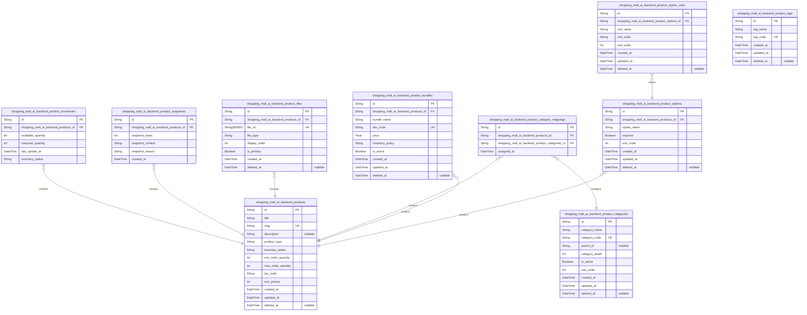
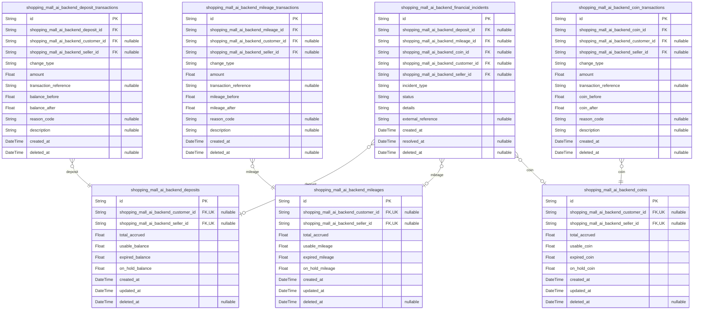
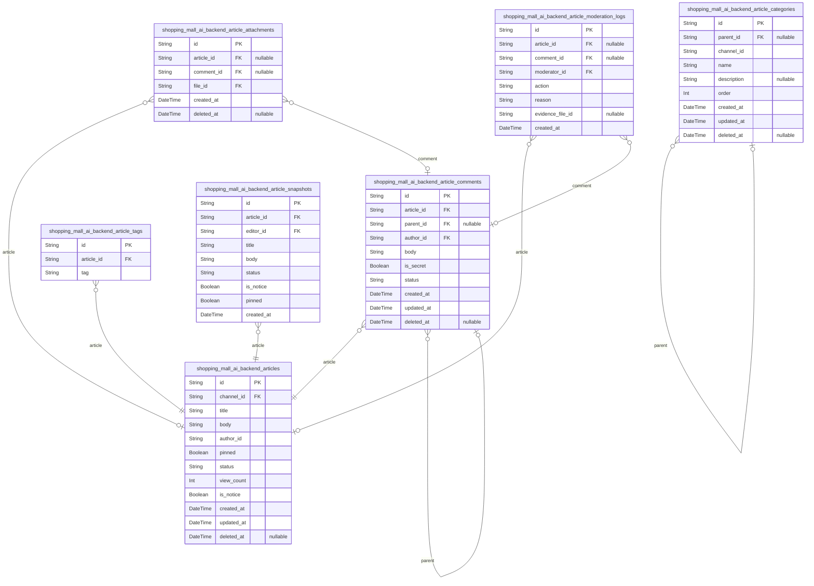

# Prisma Markdown

> Generated by [`prisma-markdown`](https://github.com/samchon/prisma-markdown)

- [Systematic](#systematic)
- [Actors](#actors)
- [Products](#products)
- [Carts](#carts)
- [Orders](#orders)
- [Coupons](#coupons)
- [Coins](#coins)
- [Inquiries](#inquiries)
- [Favorites](#favorites)
- [Articles](#articles)

## Systematic

### `shopping_mall_ai_backend_channels`

Represents a top-level sales channel (web, app, affiliate) with
independent branding, configuration, and legal context. Forms the root of
all section/category taxonomies. Other domains reference this for scoping
users, products, promotions, and analytics. Supports cross-channel
commerce and coordinated operations.

Properties as follows:

- `id`: Primary Key.
- `code`
  > Business channel code, unique across all channels, used for business
  > logic referencing and integration.
- `name`: Public display name for the channel.
- `description`
  > Detailed channel description, including business usage, for
  > admin/reference.
- `country`
  > Country or region for compliance and default settings. ISO 3166-1
  > (alpha-2).
- `currency`
  > Default currency for transactions in this channel (ISO 4217 codes e.g.
  > KRW, USD, EUR).
- `language`: Default language for this channel (IETF language tag).
- `timezone`: Default timezone of the channel (IANA/Olson database format).
- `created_at`: Timestamp of channel creation.
- `updated_at`: Timestamp of last channel update.
- `deleted_at`: Timestamp of soft deletion, if applicable.

### `shopping_mall_ai_backend_channel_sections`

Defines a section structure (e.g., home, sale, featured) for a channel.
Each section is scoped by channel and optionally organized hierarchically
(nested sections). Supports business navigation, personalization, and
analytics segmentation.

Properties as follows:

- `id`: Primary Key.
- `shopping_mall_ai_backend_channel_id`
  > Parent channel's [shopping_mall_ai_backend_channels.id](#shopping_mall_ai_backend_channels). Section
  > belongs to a single channel.
- `parent_id`
  > Optional parent section for nested section hierarchy. Self-referencing to
  > allow tree structure.
- `code`: Section code, unique within channel.
- `name`: Display name for section/navigation.
- `description`: Section business purpose/admin memo.
- `order`: Order for visual sorting/navigation; lower numbers are shown first.
- `created_at`: Timestamp of section creation.
- `updated_at`: Timestamp of last update.
- `deleted_at`: Timestamp of soft deletion, if present.

### `shopping_mall_ai_backend_channel_categories`

Represents category definitions for a channel (e.g., 'Home Decor',
'Electronics'). Each category is scoped by channel. Supports navigation,
filtering, analytics. Allows nesting (tree structure) with parent-child
relationships.

Properties as follows:

- `id`: Primary Key.
- `shopping_mall_ai_backend_channel_id`
  > Channel's [shopping_mall_ai_backend_channels.id](#shopping_mall_ai_backend_channels). Category is
  > assigned to a channel.
- `parent_id`: Optional parent category for nested category trees.
- `code`: Category code, unique within channel.
- `name`: Category display name.
- `description`: Business/admin context for category.
- `order`: Order for display or priority within channel.
- `created_at`: Timestamp of creation.
- `updated_at`: Last updated timestamp.
- `deleted_at`: Soft deletion timestamp, if any.

### `shopping_mall_ai_backend_channel_category_mappings`

Subsidiary mapping table for cross-channel or section-to-category
assignments—e.g., mapping category trees or sharing categories across
sections/channels. Not user-manageable; enables complex navigation or
analytics relationships.

Properties as follows:

- `id`: Primary Key.
- `shopping_mall_ai_backend_channel_section_id`
  > Section to which the category is mapped {@link
  > shopping_mall_ai_backend_channel_sections.id}.
- `shopping_mall_ai_backend_channel_category_id`: Mapped category's [shopping_mall_ai_backend_channel_categories.id](#shopping_mall_ai_backend_channel_categories).
- `created_at`: Mapping creation timestamp.

### `shopping_mall_ai_backend_system_configs`

Key-value configuration table for global and system context. Governs
business logic, operational flags, feature toggles, and platform-wide
parameters. Referenced by all domains—enables dynamic config management
and auditability.

Properties as follows:

- `id`: Primary Key.
- `key`
  > Unique config key. Scope: global, unless per-channel or per-feature. Used
  > by application logic for config lookup.
- `value`: Serialized value in standard format (e.g. JSON or string).
- `description`: Business/admin facing explanation of config parameter.
- `effective_from`: Config effectivity start time (for scheduled/conditional configs).
- `effective_to`: Optional: config end time.
- `created_at`: Time of creation/insert.
- `updated_at`: Last update timestamp.
- `deleted_at`: Time of soft deletion, if any.

### `shopping_mall_ai_backend_system_audit_trails`

Global system audit trail for configuration changes, platform events, and
sensitive operations. Used for regulatory compliance, business evidence,
and tamper-proof operational history. Each entry is immutable and
append-only.

Properties as follows:

- `id`: Primary Key.
- `event_type`: Type of event (enum: config_change, access, permission, error, etc.).
- `actor_id`
  > Reference to acting user, seller, admin, etc. (UUID from other tables).
  > Business context dependent.
- `description`: Human-readable business context and event details.
- `metadata`: Serialized details/metadata (JSON or text) for technical audit.
- `created_at`: Time of event occurrence.

### `shopping_mall_ai_backend_files`

System-wide files/attachments metadata table. Used across all business
domains for referencing uploads, compliance records, and evidence. Tracks
file lifecycle, storage, size, and linkage to business entities. Enables
content audit, ownership, and secure access controls.

Properties as follows:

- `id`: Primary Key.
- `original_filename`: User-supplied source filename (immutable, for audit).
- `mime_type`: File content-type (IANA, e.g. image/png, application/pdf).
- `storage_uri`: URI/reference to blob/object store or file service.
- `size_bytes`: File size in bytes.
- `uploaded_by_id`: Uploader's UUID (customer, seller, admin reference).
- `uploaded_at`: File upload timestamp.
- `deleted_at`: Logical deletion timestamp (if any).

### `shopping_mall_ai_backend_codebooks`

Represents a codebook (lookup dictionary) containing business
labels/codes. Used for status, types, region lists, option tags, etc.
Each codebook groups related codes for use in various domain contexts.
Managed independently (e.g., status values, option types).

Properties as follows:

- `id`: Primary Key.
- `code`: Business codebook identifier (unique).
- `name`: Codebook display name for reference/admin UI.
- `description`: Business context, usage, and memo for admins.
- `created_at`: Time of creation.
- `updated_at`: Time of last update.
- `deleted_at`: Soft deletion time, if present.

### `shopping_mall_ai_backend_codebook_entries`

Entries/values within a codebook, e.g. statuses, tags, option values.
Each entry is assigned to a parent codebook and has business visibility
rules (show/hide) and ordering. Not independently managed.

Properties as follows:

- `id`: Primary Key.
- `shopping_mall_ai_backend_codebook_id`: Parent codebook's [shopping_mall_ai_backend_codebooks.id](#shopping_mall_ai_backend_codebooks).
- `code`: Entry code, unique within codebook.
- `label`: Human display label for this entry.
- `description`: Business context/detail/memo.
- `order`: Sorting order for this entry among entries in a codebook.
- `visible`: Whether this entry is visible for business use.
- `created_at`: Created timestamp.
- `updated_at`: Updated timestamp.
- `deleted_at`: Soft deletion timestamp, if any.

## Actors

```mermaid
erDiagram
"shopping_mall_ai_backend_customers" {
  String id PK
  String email UK
  String phone_number UK
  String password_hash
  String name
  String nickname "nullable"
  Boolean is_active
  Boolean is_verified
  DateTime last_login_at "nullable"
  DateTime created_at
  DateTime updated_at
  DateTime deleted_at "nullable"
}
"shopping_mall_ai_backend_customer_withdrawals" {
  String id PK
  String customer_id FK
  String reason "nullable"
  DateTime withdrawn_at
  DateTime created_at
}
"shopping_mall_ai_backend_customer_sessions" {
  String id PK
  String customer_id FK
  String access_token UK
  String refresh_token "nullable"
  String ip_address
  String user_agent
  DateTime expires_at
  DateTime created_at
  DateTime terminated_at "nullable"
}
"shopping_mall_ai_backend_customer_external_identities" {
  String id PK
  String customer_id FK
  String provider
  String provider_key
  DateTime linked_at
  DateTime last_verified_at "nullable"
}
"shopping_mall_ai_backend_sellers" {
  String id PK
  String email UK
  String business_registration_number UK
  String name
  Boolean is_verified
  Boolean is_active
  DateTime created_at
  DateTime updated_at
  DateTime deleted_at "nullable"
}
"shopping_mall_ai_backend_seller_verifications" {
  String id PK
  String seller_id FK
  String verification_type
  String status
  String(80000) document_uri
  DateTime submitted_at
  DateTime verified_at "nullable"
}
"shopping_mall_ai_backend_seller_profiles" {
  String id PK
  String seller_id FK,UK
  String display_name "nullable"
  String contact_phone "nullable"
  String contact_email "nullable"
  String address "nullable"
  String description "nullable"
  DateTime created_at
  DateTime updated_at
}
"shopping_mall_ai_backend_seller_settlements" {
  String id PK
  String seller_id FK,UK
  String bank_name
  String bank_account_number
  String account_holder
  String remittance_memo "nullable"
  DateTime created_at
  DateTime updated_at
}
"shopping_mall_ai_backend_admins" {
  String id PK
  String username UK
  String password_hash
  String name
  String email UK
  String phone_number "nullable"
  Boolean is_active
  DateTime last_login_at "nullable"
  DateTime created_at
  DateTime updated_at
  DateTime deleted_at "nullable"
}
"shopping_mall_ai_backend_admin_audit_logs" {
  String id PK
  String admin_id FK
  String operation
  String target_id
  String target_type
  String description "nullable"
  DateTime created_at
}
"shopping_mall_ai_backend_role_escalations" {
  String id PK
  String user_id FK
  String admin_id FK "nullable"
  String from_role
  String to_role
  String escalation_type
  String reason "nullable"
  DateTime created_at
}
"shopping_mall_ai_backend_customer_withdrawals" }o--|| "shopping_mall_ai_backend_customers" : customer
"shopping_mall_ai_backend_customer_sessions" }o--|| "shopping_mall_ai_backend_customers" : customer
"shopping_mall_ai_backend_customer_external_identities" }o--|| "shopping_mall_ai_backend_customers" : customer
"shopping_mall_ai_backend_seller_verifications" }o--|| "shopping_mall_ai_backend_sellers" : seller
"shopping_mall_ai_backend_seller_profiles" |o--|| "shopping_mall_ai_backend_sellers" : seller
"shopping_mall_ai_backend_seller_settlements" |o--|| "shopping_mall_ai_backend_sellers" : seller
"shopping_mall_ai_backend_admin_audit_logs" }o--|| "shopping_mall_ai_backend_admins" : admin
"shopping_mall_ai_backend_role_escalations" }o--|| "shopping_mall_ai_backend_customers" : user
"shopping_mall_ai_backend_role_escalations" }o--o| "shopping_mall_ai_backend_admins" : admin
```

### `shopping_mall_ai_backend_customers`

Customer account information including all identity, authentication, and
business lifecycle attributes. Serves as the base entity for all
customer-centric commerce, holding references to profile, registration,
and current status data. Supports independent user management,
onboarding, and withdrawal requests. Linked to withdrawal and session
event models.

Properties as follows:

- `id`: Primary Key.
- `email`
  > Email address used for authentication and notifications. Must be unique
  > per channel.
- `phone_number`
  > Customer's verified mobile phone number. Used for primary contact and
  > regulatory identity check.
- `password_hash`: Hash of customer's authentication password. Never stored in cleartext.
- `name`: Full legal name of the customer as supplied or verified during onboarding.
- `nickname`
  > Customer's preferred display nickname. Displayed to sellers and in
  > community features.
- `is_active`: Whether the customer account is currently active and enabled for login.
- `is_verified`: Whether real-name and/or mobile number identity verification is completed.
- `last_login_at`
  > Timestamp of the customer's most recent valid login. Useful for activity
  > tracking and account monitoring.
- `created_at`: Timestamp when the customer account was created.
- `updated_at`: Timestamp when the customer account record was last updated.
- `deleted_at`
  > Timestamp recording logical deletion (withdrawal or admin removal) for
  > compliance.

### `shopping_mall_ai_backend_customer_withdrawals`

Historical log of customer withdrawal and account deactivation events,
preserving evidence and regulatory compliance data. Each record acts as a
snapshot of the state and rationale when the customer initiated or
completed withdrawal.

Properties as follows:

- `id`: Primary Key.
- `customer_id`: Belonged customer's [shopping_mall_ai_backend_customers.id](#shopping_mall_ai_backend_customers).
- `reason`: Customer provided reason for withdrawal or deactivation.
- `withdrawn_at`: Timestamp when withdrawal/deactivation was completed.
- `created_at`: Timestamp of record creation for evidence.

### `shopping_mall_ai_backend_customer_sessions`

Tracks all active or historical customer session records, used for
authentication, fraud investigation, and multi-device login support.
Manages session tokens, IP, device, and expiration for each authenticated
interaction.

Properties as follows:

- `id`: Primary Key.
- `customer_id`: Belonged customer's [shopping_mall_ai_backend_customers.id](#shopping_mall_ai_backend_customers).
- `access_token`: Session's access token for API authentication.
- `refresh_token`: Token used to renew the session without re-authentication.
- `ip_address`: IP address from which the session originated.
- `user_agent`: Browser or device user agent string for context and fraud monitoring.
- `expires_at`: Session expiry datetime (based on system policy).
- `created_at`: Session creation timestamp.
- `terminated_at`: Timestamp of explicit session logout or forced termination.

### `shopping_mall_ai_backend_customer_external_identities`

Links customer accounts to external identity providers such as
OAuth/Social logins. Enables SSO, mapping, and external account
management, ensuring business audit trail for all mappings.

Properties as follows:

- `id`: Primary Key.
- `customer_id`: Belonged customer's [shopping_mall_ai_backend_customers.id](#shopping_mall_ai_backend_customers).
- `provider`: External identity provider name (e.g., google, apple, naver, kakao).
- `provider_key`
  > Unique external key/id provided by the external provider for this
  > customer.
- `linked_at`: Timestamp when this identity mapping was created.
- `last_verified_at`: Timestamp of last verified sign-in with this external provider.

### `shopping_mall_ai_backend_sellers`

Seller (merchant) account entity, representing approved business users
authorized to register, sell, and fulfill orders. Stores identity
verification, business credentials, and current seller status.
Independent management, onboarding, and compliance attributes are
maintained per seller.

Properties as follows:

- `id`: Primary Key.
- `email`
  > Seller's primary business email address used for registration and
  > notifications. Unique per seller.
- `business_registration_number`
  > Seller's registered business identifier (regional/country standard
  > number).
- `name`: Legal business name of seller (business entity).
- `is_verified`: Whether seller identity/business verification is complete and approved.
- `is_active`: Whether seller account is currently active and able to operate.
- `created_at`: Timestamp when the seller account was created.
- `updated_at`: Timestamp when the seller account was last updated.
- `deleted_at`: Soft deletion timestamp (for closed or withdrawn sellers).

### `shopping_mall_ai_backend_seller_verifications`

Certification, KYB/KYC evidence and verification records related to
seller onboarding or periodic compliance checks. Each record links to a
seller and includes validation documents, scope, and approval outcomes.
Managed only as per business policy and immutable history.

Properties as follows:

- `id`: Primary Key.
- `seller_id`: Belonged seller's [shopping_mall_ai_backend_sellers.id](#shopping_mall_ai_backend_sellers).
- `verification_type`
  > Type of business verification (e.g., identity, business_license,
  > bank_account, AML, KYC).
- `status`
  > Current status (submitted, approved, rejected, expired, pending).
  > Reflects compliance policy workflow.
- `document_uri`
  > Secure URI to evidence document or file. Points to uploaded file or
  > reference directory.
- `submitted_at`: Timestamp when verification document was submitted.
- `verified_at`: Timestamp when verification was approved (if successful).

### `shopping_mall_ai_backend_seller_profiles`

Additional seller/business profile details, linked 1:1 to sellers.
Includes optional and extended info, business contact, and public display
settings. Managed through seller profile UI or admin.

Properties as follows:

- `id`: Primary Key.
- `seller_id`: Belonged seller's [shopping_mall_ai_backend_sellers.id](#shopping_mall_ai_backend_sellers).
- `display_name`: Seller's public display name/brand (may be different from legal name).
- `contact_phone`: Primary contact phone for business operations.
- `contact_email`: Business or support contact email.
- `address`: Business registered address (for display or compliance use).
- `description`: Self-description or introductory text for the seller shop page.
- `created_at`: Timestamp when the profile was created.
- `updated_at`: Profile update timestamp.

### `shopping_mall_ai_backend_seller_settlements`

Records of settlement configuration and payout instructions for each
seller, used in financial processing and disbursement. Includes payout
method, bank details, and account/recipient info per seller. Supports
settlement changes and audit trail.

Properties as follows:

- `id`: Primary Key.
- `seller_id`: Belonged seller's [shopping_mall_ai_backend_sellers.id](#shopping_mall_ai_backend_sellers).
- `bank_name`: Bank or financial institution name for disbursement.
- `bank_account_number`: Account number for payout.
- `account_holder`: Name of the registered account holder for settlements.
- `remittance_memo`: Optional memo or note field for settlement purposes.
- `created_at`: Settlement configuration creation timestamp.
- `updated_at`: Timestamp of last update to settlement info.

### `shopping_mall_ai_backend_admins`

Administrator account for platform operators, regulatory personnel, and
business rule enforcement. Each admin manages business policies, audits,
and incidents. Supports multi-factor auth, credential lifecycle, and
status management.

Properties as follows:

- `id`: Primary Key.
- `username`: Unique admin username or operator ID (must be unique).
- `password_hash`: Hashed administrator password for auth, never stored as cleartext.
- `name`: Administrator's real name for traceability.
- `email`: Administrator business email address (unique per admin).
- `phone_number`: Verified contact for admin (SMS/phone notification, account recovery).
- `is_active`: Whether this admin account is currently enabled.
- `last_login_at`
  > Time of last successful login. Used for audit trail and activity
  > monitoring.
- `created_at`: Timestamp of admin account creation.
- `updated_at`: Timestamp of last admin record update.
- `deleted_at`: Soft deletion timestamp (retained for audit compliance).

### `shopping_mall_ai_backend_admin_audit_logs`

Business and system audit log of all privileged admin actions. Captures
admin reference, operation performed, rationale, and affected
target/count. Immutable record for compliance and forensic review by
regulators.

Properties as follows:

- `id`: Primary Key.
- `admin_id`: Admin account's [shopping_mall_ai_backend_admins.id](#shopping_mall_ai_backend_admins).
- `operation`
  > Type of privileged operation (e.g., approve_seller, suspend_user,
  > modify_config, access_evidence).
- `target_id`
  > Primary identifier of the entity affected by this operation (for audit
  > linkage).
- `target_type`: Type of entity affected (e.g., customer, seller, system, order, config).
- `description`: Detailed description or justification for the operation.
- `created_at`: Timestamp when the audit log entry was created.

### `shopping_mall_ai_backend_role_escalations`

Snapshot entity capturing user membership/seller/admin role change and
escalation events. Used for regulatory audit, approval workflows, and
business process replays. Each record describes role transition, outcome,
and rationale, with references to relevant user/admin.

Properties as follows:

- `id`: Primary Key.
- `user_id`
  > ID of the user whose role was escalated/deescalated (references customer,
  > seller, or admin - cross-reference by context).
- `admin_id`
  > Administrator who approved/escalated role (references {@link
  > shopping_mall_ai_backend_admins.id}).
- `from_role`: Previous business role (e.g., customer, seller, admin, suspended, guest).
- `to_role`: Resulting business role after escalation/transition.
- `escalation_type`
  > Type of change (e.g., promotion, demotion, temporary, permanent,
  > approval, rejection).
- `reason`
  > Optional human-readable rationale or system justification for the
  > escalation.
- `created_at`: Time the escalation event was recorded.

## Products

### `shopping_mall_ai_backend_products`

Core product entity representing individual commerce items. Contains
business attributes such as title, slug, description, seller reference,
commerce status, minimum and maximum order amounts, product type, and
additional configurations. Every update to this entity must be
snapshotted to support audit and rollback. Linked via foreign keys to
seller entities, and by extensions to options, bundles, categories, tags,
and files. This table is essential for search, browse, and transaction
eligibility decisions.

Properties as follows:

- `id`: Primary Key.
- `title`
  > Product title/name displayed to users, unique per seller and channel
  > context.
- `slug`: SEO-friendly product slug, unique per channel and seller context.
- `description`: Detailed product description and content body.
- `product_type`
  > Type of product (e.g., physical, digital, service). Guides fulfillment
  > and inventory logic.
- `business_status`
  > Current commerce status (e.g., draft, active, paused, restricted,
  > deleted). Drives order eligibility and visibility.
- `min_order_quantity`: Minimum orderable quantity for a valid purchase.
- `max_order_quantity`: Maximum orderable quantity per transaction.
- `tax_code`: Applicable tax code category used for compliance and reporting.
- `sort_priority`: Manual or computed sort priority for product listings.
- `created_at`: UTC timestamp when product was created.
- `updated_at`: UTC timestamp when product was last updated.
- `deleted_at`: Timestamp when product was logically deleted. Null if not deleted.

### `shopping_mall_ai_backend_product_options`

Product option groups (e.g., color, size) that define available choices
per product. Each option group belongs to a product, provides business
logic for required/optional/combination selection, and is versioned for
audit. Directly linked to units for physical SKUs or attributes. Managed
by sellers/admins in the product management flow.

Properties as follows:

- `id`: Primary Key.
- `shopping_mall_ai_backend_products_id`: Belonged product's [shopping_mall_ai_backend_products.id](#shopping_mall_ai_backend_products)
- `option_name`: Label for option group (e.g., color, size).
- `required`: Whether option selection is required for order eligibility.
- `sort_order`: Display order of this option group among product options.
- `created_at`: Timestamp when this option group was created.
- `updated_at`: Timestamp when this option group was last updated.
- `deleted_at`: Soft deletion timestamp for this option group. Null if active.

### `shopping_mall_ai_backend_product_option_units`

Concrete selectable unit (e.g., Red, XL) within an option group for a
product. Each unit belongs to a product option, contains value and code
(for business rules/mapping), and has associated sort/display order. SKU
inventory is typically tracked at this or a bundled level. Used in
detailed order and inventory logic.

Properties as follows:

- `id`: Primary Key.
- `shopping_mall_ai_backend_product_options_id`
  > Option group [shopping_mall_ai_backend_product_options.id](#shopping_mall_ai_backend_product_options) this
  > unit belongs to.
- `unit_value`: Display value for this selectable unit (e.g., Red, XL).
- `unit_code`: Machine-readable code for business logic, analytics.
- `sort_order`: Display order for selectable units within option group.
- `created_at`: Creation timestamp of this unit.
- `updated_at`: Last updated timestamp of this unit.
- `deleted_at`: Soft deletion timestamp. Null if active.

### `shopping_mall_ai_backend_product_bundles`

Logical grouping of product option units, representing specific item
variants (e.g., [Red, Large] bundle = unique SKU). Bundles can be used
for package deals or unique SKUs with associated inventory/price. Each
bundle is mapped to option units, owned by the parent product.

Properties as follows:

- `id`: Primary Key.
- `shopping_mall_ai_backend_products_id`: Product owning the bundle. [shopping_mall_ai_backend_products.id](#shopping_mall_ai_backend_products)
- `bundle_name`: Display name for this bundle/variant combination.
- `sku_code`: Unique code representing this bundle/SKU.
- `price`: Price for this bundle (could override product base price).
- `inventory_policy`: Inventory control logic (e.g., track, ignore, by parent config).
- `is_active`: Whether this bundle is available for sale.
- `created_at`: Bundle creation timestamp.
- `updated_at`: Last update timestamp for bundle.
- `deleted_at`: Soft deaetion timestamp; null if active.

### `shopping_mall_ai_backend_product_tags`

Tag master for products. Tags provide user-searchable, vendor-assigned,
and/or AI-suggested semantic attributes for categorizing and filtering
products (e.g., 'eco-friendly', 'new arrival'). Tags can be mapped to
products many-to-many via relation tables or extensions.

Properties as follows:

- `id`: Primary Key.
- `tag_name`: Business-visible tag (label/content) for product filtering/search.
- `tag_code`
  > Machine-assigned code for business logic, search optimization, and
  > analytics.
- `created_at`: Tag creation timestamp.
- `updated_at`: Last update timestamp.
- `deleted_at`: Tag deletion timestamp; null if not deleted.

### `shopping_mall_ai_backend_product_categories`

Product category master holds the hierarchical definition of product
categories (e.g., Electronics > Computers > Laptops). Used for
navigation, search, and data analytics. Every product can belong to
multiple categories via mapping table.

Properties as follows:

- `id`: Primary Key.
- `category_name`: Display name of this category.
- `category_code`: Unique code for machine lookup, search, analytics.
- `parent_id`: Indicates parent category for category tree; null if top level.
- `category_depth`: Depth of this category in hierarchy (root = 0).
- `is_active`: Is category shown to users in navigation, search, etc.
- `sort_order`: Order among sibling categories for display.
- `created_at`: Category creation timestamp.
- `updated_at`: Last modified timestamp.
- `deleted_at`: If deleted, deletion time, or null if active.

### `shopping_mall_ai_backend_product_category_mappings`

Junction table mapping products to categories (many-to-many). Each row
represents one product-category association, used for navigation,
filtering, and analytics. Enforces unique (product_id, category_id)
constraint to prevent duplicates. Not managed independently from
products/categories.

Properties as follows:

- `id`: Primary Key.
- `shopping_mall_ai_backend_products_id`: Product reference. [shopping_mall_ai_backend_products.id](#shopping_mall_ai_backend_products)
- `shopping_mall_ai_backend_product_categories_id`: Category reference. [shopping_mall_ai_backend_product_categories.id](#shopping_mall_ai_backend_product_categories)
- `assigned_at`: Timestamp when product-category mapping was created.

### `shopping_mall_ai_backend_product_files`

Files and images attached to products for presentation (main image,
thumbnails, downloadable files). Stores metadata for display (file type,
uploader, order) and references file storage for content resolution.
Files may be managed by admins or sellers depending on product origin.

Properties as follows:

- `id`: Primary Key.
- `shopping_mall_ai_backend_products_id`: Referenced product. [shopping_mall_ai_backend_products.id](#shopping_mall_ai_backend_products)
- `file_uri`: Storage URI or CDN link for file/image.
- `file_type`: Content type (e.g. image/jpeg, application/pdf).
- `display_order`: Order among product files -- determines display priority.
- `is_primary`: Is this file the primary display image?
- `created_at`: Attachment creation timestamp.
- `deleted_at`: If deleted, timestamp; null if not deleted.

### `shopping_mall_ai_backend_product_snapshots`

Immutable historical record for point-in-time product state. Each
snapshot references its original product and contains a full copy of all
relevant product fields and relations at creation time. Used for audit
compliance, evidence in disputes, and rollback. Snapshots are managed
only via versioning logic and are never updated after creation.

Properties as follows:

- `id`: Primary Key.
- `shopping_mall_ai_backend_products_id`
  > Product record this snapshot covers. {@link
  > shopping_mall_ai_backend_products.id}
- `snapshot_index`: Sequence number or revision index for versioning.
- `snapshot_content`: Serialized JSON or business object containing historical data for audit.
- `snapshot_reason`
  > Business reason or trigger for snapshot (manual update, system,
  > correction, rollback, etc.).
- `created_at`: Time when snapshot was created.

### `shopping_mall_ai_backend_product_inventories`

Tracks stock level for products or bundles. Each record references a
product or bundle, shows available quantity, reserved quantity, and last
movement time. Provides base view for inventory tracking, order
commitment, and business analysis. May point to either product or bundle
as needed by business logic (union handled at application tier). Not
independently managed by end users.

Properties as follows:

- `id`: Primary Key.
- `shopping_mall_ai_backend_products_id`
  > Product this inventory is linked to. {@link
  > shopping_mall_ai_backend_products.id}
- `available_quantity`: Units available for sale (not reserved/committed).
- `reserved_quantity`: Committed units pending order completion.
- `last_update_at`: Time of the most recent stock movement (in/out/adjust).
- `inventory_status`
  > Business status of inventory (e.g., in_stock, out_of_stock, reserved,
  > discontinued).

## Carts

### `shopping_mall_ai_backend_carts`

Represents the customer's shopping cart for any active session or channel
(guest/member/linked session). Tracks current cart status, associated
customer/session reference, and captures any detailed cart-note, coupon,
mileage, or deposit status in real time. Critical as mutable pre-order
record but uniquely preserved through immutable snapshots for
audit/evidence. Users manage, merge, or clear carts independently per
channel/session context. Supports omnichannel transfer.

Properties as follows:

- `id`: Primary Key.
- `shopping_mall_ai_backend_customer_id`
  > Linked customer's [shopping_mall_ai_backend_customers.id](#shopping_mall_ai_backend_customers). Null for
  > guest, required for member.
- `shopping_mall_ai_backend_customer_session_id`
  > Current active session's {@link
  > shopping_mall_ai_backend_customer_sessions.id}. Null if persistent cart
  > not linked to a specific session.
- `cart_token`
  > Opaque unique ID for cart. Used to re-link carts across devices or for
  > guest workflows.
- `status`
  > Cart lifecycle status (e.g. active, submitted, merged, cleared,
  > abandoned).
- `expires_at`: Cart expiration datetime (for auto-clear, guest, or session rules).
- `last_merged_at`
  > Datetime this cart was last merged with another cart (for omnichannel
  > workflows).
- `note`
  > Customer's or business's cart note, instruction, or memo. Searchable
  > field.
- `created_at`: Creation timestamp.
- `updated_at`: Last update timestamp.
- `deleted_at`: Soft deletion timestamp for evidence trail.

### `shopping_mall_ai_backend_cart_items`

Individual and option-specific product items in a cart. Each record holds
selection quantity, attached options, and referential snapshot pointer.
Required for precise item, bundle, and variant management prior to
checkout. Editable by the user per cart context. Historical traces and
adjustments are preserved through linked snapshots.

Properties as follows:

- `id`: Primary Key.
- `shopping_mall_ai_backend_cart_id`: Parent cart's [shopping_mall_ai_backend_carts.id](#shopping_mall_ai_backend_carts).
- `shopping_mall_ai_backend_product_snapshot_id`
  > Product snapshot's [shopping_mall_ai_backend_product_snapshots.id](#shopping_mall_ai_backend_product_snapshots)
  > for price, title, attributes at time of add-to-cart.
- `quantity`: Quantity for this item (minimum 1 per business policy).
- `option_code`
  > Aggregate code for option/variant selection (from product option units,
  > enables unique constraint for per-product/item options).
- `bundle_code`: Product bundle code if selected (nullable if not used).
- `note`: Customer's note for this cart item (e.g. gift, details). Searchable field.
- `created_at`: Creation timestamp.
- `updated_at`: Last update timestamp.
- `deleted_at`: Soft deletion timestamp.

### `shopping_mall_ai_backend_cart_item_snapshots`

Immutable snapshot of all cart item details at each add/edit/remove
event, for business evidence and audit. Stores all relevant business
fields, referential link to both original cart item and snapshot data,
and a timestamp of when the snapshot was recorded. Ensures evidence
preservation if cart or item is later edited or deleted.

Properties as follows:

- `id`: Primary Key.
- `shopping_mall_ai_backend_cart_item_id`
  > Cart item's [shopping_mall_ai_backend_cart_items.id](#shopping_mall_ai_backend_cart_items) being
  > snapshotted.
- `snapshot_data`
  > Serialized (JSON/text) snapshot of all cart item business fields for
  > precise historical evidence. Not for query logic.
- `reason`
  > Snapshot creation reason (add, update, remove, merge, manual, evidence,
  > etc).
- `created_at`: Snapshot creation timestamp.

### `shopping_mall_ai_backend_cart_coupon_usages`

Per-cart usage log for all applied coupons, including time of
application, validation status, and associated business rules. Tied to
cart (not global basket) to ensure compliance with coupon stacking,
exclusivity, order, eligibility, and evidence trace. May have more than
one per cart, depending on business constraints.

Properties as follows:

- `id`: Primary Key.
- `shopping_mall_ai_backend_cart_id`: Applied on related cart's [shopping_mall_ai_backend_carts.id](#shopping_mall_ai_backend_carts).
- `shopping_mall_ai_backend_coupon_id`: Applied coupon's [shopping_mall_ai_backend_coupons.id](#shopping_mall_ai_backend_coupons).
- `applied_at`: Datetime coupon was applied to this cart.
- `status`
  > Current validation/application status (active, locked, rejected, used,
  > etc.)
- `stack_group`: Label for stacking logic group (if stacking/exclusivity policy applies).
- `note`: Admin/business note for coupon usage.

### `shopping_mall_ai_backend_cart_mileage_usages`

Cart-level historical log of all mileage (point) accrual or consumption
events tied to this cart, including validation, redemption, and evidence
of application. Subsidiary to the cart, but required for audit and
compliance (e.g., only redeemable once per line, balance checks). All
business constraints logged; supports composite queries for fraud or
reward optimization.

Properties as follows:

- `id`: Primary Key.
- `shopping_mall_ai_backend_cart_id`: Applied on related cart's [shopping_mall_ai_backend_carts.id](#shopping_mall_ai_backend_carts).
- `shopping_mall_ai_backend_mileage_id`: Linked mileage balance's [shopping_mall_ai_backend_mileages.id](#shopping_mall_ai_backend_mileages).
- `used_amount`
  > Mileage (points) used or accrued. Negative for redemption, positive for
  > accrual.
- `reason`
  > Business reason for mileage usage or accrual (e.g., redeem, bonus,
  > policy).
- `applied_at`: Datetime of usage/accrual event.
- `note`: Admin/business note for this transaction.

## Orders

### `shopping_mall_ai_backend_orders`

Core entity representing the customer's commercial transaction. Records
all business events and status changes in an order lifecycle, including
references to the customer, channel, and seller. Enforces regulatory and
audit constraints. Supports evidence preservation and compliance
investigation. Designed for independent creation, search, and legal
traceability.

Properties as follows:

- `id`: Primary Key.
- `shopping_mall_ai_backend_customer_id`: Belonged customer's [shopping_mall_ai_backend_customers.id](#shopping_mall_ai_backend_customers).
- `shopping_mall_ai_backend_channel_id`: Order's channel [shopping_mall_ai_backend_channels.id](#shopping_mall_ai_backend_channels).
- `shopping_mall_ai_backend_seller_id`
  > Order's seller [shopping_mall_ai_backend_sellers.id](#shopping_mall_ai_backend_sellers). May be
  > nullable if not routed/split yet.
- `code`
  > Business order number (unique per channel, for external and customer
  > reference).
- `status`
  > Business state/code for the current order (e.g. pending, confirmed, paid,
  > shipped, delivered, cancelled, etc.).
- `total_amount`
  > Total amount of the order (final charge after all discounts and
  > adjustments).
- `currency`: Order currency (ISO 4217, e.g. KRW, USD, JPY).
- `ordered_at`
  > Timestamp the order was submitted by the customer or created via an
  > upstream channel.
- `confirmed_at`
  > Timestamp the order was business-confirmed (assigns stock and locks
  > payment intent).
- `cancelled_at`: Timestamp if/when the order was cancelled, by user or operator.
- `closed_at`: Timestamp when the order was finalized (delivered, refunded, etc.).
- `created_at`: System record creation timestamp.
- `updated_at`: System record update timestamp.
- `deleted_at`: Soft delete timestamp. Null if record is active.

### `shopping_mall_ai_backend_order_items`

Line items for individual products/options within an order. Supports
bundles, variants, quantity, and per-item price/discount. Managed only in
context of an order. No direct API/CRUD, but required for evidence and
fulfillment traceability.

Properties as follows:

- `id`: Primary Key.
- `shopping_mall_ai_backend_order_id`: Parent order's [shopping_mall_ai_backend_orders.id](#shopping_mall_ai_backend_orders).
- `shopping_mall_ai_backend_product_id`: Purchased product's [shopping_mall_ai_backend_products.id](#shopping_mall_ai_backend_products).
- `shopping_mall_ai_backend_product_option_id`: Selected option's [shopping_mall_ai_backend_product_options.id](#shopping_mall_ai_backend_product_options).
- `shopping_mall_ai_backend_product_bundle_id`
  > If bundled, the bundle's {@link
  > shopping_mall_ai_backend_product_bundles.id}.
- `product_title`
  > Denormalized copy of product title at time of order (evidence,
  > compliance).
- `quantity`: Ordered quantity for this line item.
- `unit_price`: Unit price at time of order (pre-discount).
- `discount_amount`: Discount applied to this line (may be 0).
- `final_amount`: Final charge for this line (unit * qty - discounts).
- `currency`: Currency code for item charge.
- `created_at`: Record creation timestamp.
- `updated_at`: Record update timestamp.
- `deleted_at`: Soft delete timestamp. Null if record is active.

### `shopping_mall_ai_backend_order_item_snapshots`

Historical snapshot versions of order items. Tracks changes to items
(e.g. price correction, option change, after-sale) for full audit trail
and evidence purposes. Append-only, not user-editable. Used for dispute
resolution and compliance reporting.

Properties as follows:

- `id`: Primary Key.
- `shopping_mall_ai_backend_order_item_id`: The original order item's [shopping_mall_ai_backend_order_items.id](#shopping_mall_ai_backend_order_items).
- `snapshot_reason`
  > Business reason/context for the snapshot (e.g. after-sales edit, price
  > change).
- `quantity`: Snapshot of ordered quantity at this version.
- `unit_price`: Snapshot unit price at this version.
- `discount_amount`: Snapshot discount value at this version.
- `final_amount`: Snapshot final value at this version.
- `created_at`: Snapshot creation timestamp (versioned history).

### `shopping_mall_ai_backend_order_payments`

Tracks all payment attempts and records associated with an order.
Supports multiple payment methods and split/partial charge scenarios.
Used for audit, fraud detection, reconciliation, and compliance. Managed
in context of the order; no direct creation by user.

Properties as follows:

- `id`: Primary Key.
- `shopping_mall_ai_backend_order_id`: Linked order's [shopping_mall_ai_backend_orders.id](#shopping_mall_ai_backend_orders).
- `payment_method`
  > Business code for payment method (e.g. card, bank_transfer, deposit,
  > mileage, coupon, etc).
- `amount`: Amount charged by this payment record.
- `currency`: Payment currency.
- `status`: Payment status (pending, succeeded, failed, refunded, etc).
- `external_reference`: External payment provider identifier (if any).
- `requested_at`: Payment requested timestamp.
- `completed_at`: Payment completed timestamp (if succeeded).
- `failed_at`: Payment failed timestamp, if any.
- `cancelled_at`: Payment cancellation timestamp.
- `created_at`: Creation timestamp for system logging.
- `updated_at`: Update timestamp for system logging.
- `deleted_at`: Soft delete timestamp.

### `shopping_mall_ai_backend_order_payment_attempts`

Records every attempt to process payment (for retries, partial payments,
failures, etc). Used from security, compliance, and business evidence
perspectives. Append-only. Linked to specific order payment entries.

Properties as follows:

- `id`: Primary Key.
- `shopping_mall_ai_backend_order_payment_id`: Parent payment's [shopping_mall_ai_backend_order_payments.id](#shopping_mall_ai_backend_order_payments).
- `attempt_state`: Payment attempt result code (pending, success, fail, retry, etc).
- `error_message`: Error message (if any failure or rejection occurred).
- `provider_code`: Payment provider code (if used).
- `requested_at`: Payment attempt timestamp (system clocked).
- `completed_at`: Attempt completion timestamp (if success/fail).
- `created_at`: System record creation time.

### `shopping_mall_ai_backend_order_deliveries`

Represents single or partial physical delivery event(s) related to an
order (e.g., split shipments, staggered delivery). Each links to the
order header, with detail for tracking, status, and timeline.
Fulfillment/logistics, not directly user-managed.

Properties as follows:

- `id`: Primary Key.
- `shopping_mall_ai_backend_order_id`: Parent order's [shopping_mall_ai_backend_orders.id](#shopping_mall_ai_backend_orders).
- `delivery_status`: Delivery state (ready, in_progress, complete, failed, returned, etc).
- `logistics_provider`: Fulfillment carrier/partner code.
- `tracking_number`: Logistics carrier tracking ID.
- `shipped_at`: Datetime shipped or sent to carrier.
- `delivered_at`: Datetime completed by carrier (delivered, received).
- `delivery_notes`: Any user/business free-text notes about delivery.
- `created_at`: Creation timestamp for record.
- `updated_at`: Update timestamp.
- `deleted_at`: Soft delete timestamp.

### `shopping_mall_ai_backend_order_delivery_events`

Chronological event logs for all delivery status changes and logistics
evidence for a shipment. Used for business traceability, customer
service, and compliance. Append-only, one per discrete timeline event or
external update.

Properties as follows:

- `id`: Primary Key.
- `shopping_mall_ai_backend_order_delivery_id`: Parent delivery's [shopping_mall_ai_backend_order_deliveries.id](#shopping_mall_ai_backend_order_deliveries).
- `event_type`: Event type (status update, exception, checkpoint, etc).
- `event_context`: Free-text event context for traceability/evidence.
- `logged_at`: Timestamp for the event.
- `created_at`: System creation timestamp.

### `shopping_mall_ai_backend_order_returns`

Return requests/records for order items. Linked to orders and specific
line-items. Manages business context (reason, status, evidence). Managed
as after-sales action; used for refund/exchange workflows. Subsidiary
table with compliance/audit focus.

Properties as follows:

- `id`: Primary Key.
- `shopping_mall_ai_backend_order_id`: Linked order's [shopping_mall_ai_backend_orders.id](#shopping_mall_ai_backend_orders).
- `shopping_mall_ai_backend_order_item_id`: Linked item's [shopping_mall_ai_backend_order_items.id](#shopping_mall_ai_backend_order_items).
- `return_reason`: Reason provided by customer for return.
- `status`
  > Business logic status for the return process (requested, approved,
  > rejected, completed).
- `requested_at`: Timestamp when return was requested.
- `processed_at`: Timestamp when processed (approved/rejected).
- `completed_at`: Return process completion timestamp.
- `created_at`: System creation date.
- `updated_at`: Last update timestamp.
- `deleted_at`: Soft delete timestamp.

### `shopping_mall_ai_backend_order_exchanges`

Exchange process records for items/orders. Handles after-sales exchanges
for eligible orders/items. Managed in context of original order/item. For
compliance and traceability (subsidiary).

Properties as follows:

- `id`: Primary Key.
- `shopping_mall_ai_backend_order_id`: Original order's [shopping_mall_ai_backend_orders.id](#shopping_mall_ai_backend_orders).
- `shopping_mall_ai_backend_order_item_id`: Original item's [shopping_mall_ai_backend_order_items.id](#shopping_mall_ai_backend_order_items).
- `exchange_reason`: Reason provided for exchange.
- `status`
  > Current exchange process status (requested, approved, rejected,
  > completed, etc).
- `requested_at`: Exchange requested timestamp.
- `processed_at`: Approval/rejection processed timestamp.
- `completed_at`: Exchange finalized timestamp.
- `created_at`: System create timestamp.
- `updated_at`: Update timestamp for record.
- `deleted_at`: Soft delete timestamp.

### `shopping_mall_ai_backend_order_refunds`

Refund requests/records for orders or individual items. Supports
full/partial, per-item or per-order refunds. Subsidiary with full
business and audit context for compliance reporting. Managed by
operator/admin or automated logic.

Properties as follows:

- `id`: Primary Key.
- `shopping_mall_ai_backend_order_id`: Linked order's [shopping_mall_ai_backend_orders.id](#shopping_mall_ai_backend_orders).
- `refund_reason`: Reason for refund (e.g. customer request, system error, product issue).
- `refund_type`: Type of refund (full, partial, per-item, etc).
- `amount`: Amount refunded.
- `currency`: Currency of refund.
- `status`
  > Current status of the refund (requested, approved, rejected, paid,
  > completed, etc).
- `requested_at`: Refund requested time.
- `processed_at`: Approval/rejection processing time.
- `completed_at`: Refund completion timestamp.
- `created_at`: Record creation timestamp.
- `updated_at`: Record update timestamp.
- `deleted_at`: Soft delete timestamp.

### `shopping_mall_ai_backend_order_incidents`

Tracks incidents, exceptions, or evidence logs tied to orders: e.g.
fraud, user disputes, chargeback evidence, compliance events. Managed
only by admin/operator actions; append-only for audit, legal, and
business traceability.

Properties as follows:

- `id`: Primary Key.
- `shopping_mall_ai_backend_order_id`: Order's [shopping_mall_ai_backend_orders.id](#shopping_mall_ai_backend_orders).
- `incident_type`
  > Business code for incident type (fraud, dispute, system_error,
  > compliance, evidence, etc).
- `context`: Free-text or structured JSON business context.
- `event_at`: When the incident/event occurred.
- `created_at`: System record created at.
- `updated_at`: Updated at for record changes.
- `deleted_at`: Soft delete timestamp.

## Coupons

### `shopping_mall_ai_backend_coupons`

Master list of all coupons, promotions, and discount policies including
type, value, stacking, applicability, eligibility definitions, and
meta-configuration. Cross-linked to issuances, codes, stacking,
restrictions, notifications, and snapshots. Enables regulatory
compliance, analytics, and personal or bulk issuance.

Properties as follows:

- `id`: Primary Key.
- `shopping_mall_ai_backend_channel_id`
  > Scope of coupon for promotions within a specific channel. References
  > [shopping_mall_ai_backend_channels.id](#shopping_mall_ai_backend_channels).
- `shopping_mall_ai_backend_seller_id`
  > Seller that issued the coupon, if applicable. References {@link
  > shopping_mall_ai_backend_sellers.id}.
- `code`
  > Unique business code for the coupon or promotion campaign. E.g.
  > SUMMER2024, NEWUSER50.
- `type`
  > Coupon type: e.g., 'fixed', 'percentage', 'shipping', 'event', 'welcome',
  > 'bulk_code', 'personal'. Should be validated in application or codebook.
- `title`: Title for human-recognition (e.g., '10% Off First Order').
- `description`: Detailed description for display and audit trails.
- `value`: Discount amount or percentage depending on type.
- `min_order_amount`: Minimum eligible order amount, if any, for use validation.
- `max_discount_amount`: Maximum discount that can be applied, for percentage or capped coupons.
- `currency`
  > Currency code if monetary. (e.g., 'KRW','USD'). Null for non-monetary
  > coupons.
- `expires_at`: Coupon expiration datetime (absolute or computed per-issuance).
- `stackable`
  > Whether the coupon can stack with others (default: false). Business-level
  > validation required for eligibility.
- `personal`
  > True if only for a specific customer (e.g., birthday, one-off, event,
  > new-member).
- `issued_quantity`: Max issue count (e.g., for the entire campaign) or null for unlimited.
- `issued_per_user`: How many times a single user can be issued this coupon.
- `used_per_user`: Usage limit per user (null=unlimited).
- `usage_limit_total`: Total uses allowed for this coupon (null=unlimited).
- `issued_count`
  > Total number of coupons actually issued (system-maintained, for
  > analytics).
- `used_count`
  > System-maintained: aggregate number of times this coupon was successfully
  > used.
- `published_at`: When coupon is/will be publicly available for claim.
- `status`
  > Coupon status (e.g. 'active', 'expired', 'scheduled', 'hidden',
  > 'restricted'). Validate in application or via codebooks.
- `created_at`: Creation timestamp.
- `updated_at`: Last update timestamp.
- `deleted_at`: Soft-deletion timestamp if the coupon is removed from view.

### `shopping_mall_ai_backend_coupon_issuances`

Instance of coupon issued to a customer or group. Tracks the allocation,
recipient, status, and issuance time. Linked to coupons and customers,
and references the underlying policy for regulatory and eligibility
tracking.

Properties as follows:

- `id`: Primary Key.
- `shopping_mall_ai_backend_coupon_id`
  > Coupon policy associated with this issuance. {@link
  > shopping_mall_ai_backend_coupons.id}.
- `shopping_mall_ai_backend_customer_id`
  > Customer recipient issued this coupon. {@link
  > shopping_mall_ai_backend_customers.id}. Required if personal coupon.
- `external_code`
  > Redemption/external code assigned for this issuance (e.g. for affiliate,
  > external campaigns).
- `expires_at`
  > Expiration for issued coupon (overrides policy-specific expiry, e.g.,
  > per-user duration).
- `status`
  > Status per issuance ('issued','used','revoked','expired').
  > Application-validated or codebook-based.
- `issued_at`: Issuance timestamp (when delivered/given to user).
- `used_at`: When coupon was actually redeemed (if used).
- `revoked_at`: When coupon was revoked (user withdrawal or policy violation).
- `created_at`: Creation timestamp.

### `shopping_mall_ai_backend_coupon_usages`

Coupon redemption log. Tracks each attempt or successful use of a coupon
issuance (per customer, per order, per event). Linked to the issuance,
the redeemed customer, and order. Allows auditing of coupon consumption
and fraud tracking.

Properties as follows:

- `id`: Primary Key.
- `shopping_mall_ai_backend_coupon_issuance_id`
  > References the coupon issuance being used. {@link
  > shopping_mall_ai_backend_coupon_issuances.id}.
- `shopping_mall_ai_backend_customer_id`
  > Customer using coupon. Redundant to coupon_issuance.customer by history
  > (audit reliability). [shopping_mall_ai_backend_customers.id](#shopping_mall_ai_backend_customers) .
- `shopping_mall_ai_backend_order_id`
  > Order where coupon was used (for cross-reference/audit). {@link
  > shopping_mall_ai_backend_orders.id}.
- `used_at`: When this usage occurred (actual redemption).
- `amount_discounted`
  > Actual discount value given by this coupon on this usage (for refund,
  > analytics).
- `status`
  > Usage status, e.g. 'success','failed','rolled_back'. Application-enforced
  > for audit trail.
- `rolledback_at`
  > If usage was later revoked or refunded, time here indicates when event
  > occurred (e.g., if refund or invalid).

### `shopping_mall_ai_backend_coupon_codes`

Table holding bulk coupon codes for campaigns (e.g., public events,
external coupons). Maps each code to coupon policy and its status in
issuance or redemption. Prevents code collisions, duplicate use, and
supports external integrations.

Properties as follows:

- `id`: Primary Key.
- `shopping_mall_ai_backend_coupon_id`: Coupon this code belongs to. [shopping_mall_ai_backend_coupons.id](#shopping_mall_ai_backend_coupons).
- `shopping_mall_ai_backend_coupon_issuance_id`
  > If issued as an individual allocation, link to the issuance. Useful for
  > personalized or claimed codes. {@link
  > shopping_mall_ai_backend_coupon_issuances.id}.
- `bulk_code`
  > Bulk/published coupon code. E.g., for codes handed out at event, on a
  > flyer.
- `issued_to_email`
  > Optional: contact/email assigned for code claim (for
  > invite/referral/event tracking).
- `status`
  > Status: 'available','issued','redeemed','invalidated','revoked'.
  > Business-level enforcement.
- `created_at`: Creation timestamp (code generation).
- `redeemed_at`: When code was actually redeemed (if applicable).
- `revoked_at`: If code invalidated/revoked, store timestamp.

### `shopping_mall_ai_backend_coupon_stacking_rules`

Defines allowed/disallowed stacking of coupons and types, both in general
and per coupon campaign. Explicitly structures business-restricted
stackability (e.g., 'A cannot stack with B', 'fixed+percentage allowed',
'only 1 coupon per order'). Used in policy validation and at redemption.

Properties as follows:

- `id`: Primary Key.
- `shopping_mall_ai_backend_coupon_id`
  > Coupon for which this stacking rule applies. {@link
  > shopping_mall_ai_backend_coupons.id}.
- `excluded_coupon_id`
  > Specific coupon or type (if any) that this coupon cannot stack with.
  > Nullable for type/policy-wise rules. {@link
  > shopping_mall_ai_backend_coupons.id}.
- `type`
  > Rule type: 'allow', 'deny', or 'override'. Business logic enforces actual
  > stacking. Use codebook in application if possible.
- `applies_to_type`
  > Target coupon type/category this rule applies to (e.g., all 'fixed',
  > 'shipping', etc.). Null if only per-coupon.
- `created_at`: Creation timestamp of this stacking rule.

### `shopping_mall_ai_backend_coupon_restrictions`

Per-coupon restriction definitions. Defines not-allowed conditions,
periods, channels, users, sections, categories, products. Supports
fine-grained business enforcement (e.g., 'not valid with product X', 'not
for user group Y', 'blocked on weekends', etc.).

Properties as follows:

- `id`: Primary Key.
- `shopping_mall_ai_backend_coupon_id`: Coupon to restrict. [shopping_mall_ai_backend_coupons.id](#shopping_mall_ai_backend_coupons).
- `shopping_mall_ai_backend_product_id`
  > Product this restriction applies to (if any, else null means
  > general/global). [shopping_mall_ai_backend_products.id](#shopping_mall_ai_backend_products).
- `shopping_mall_ai_backend_channel_section_id`
  > Section limitation (if any). {@link
  > shopping_mall_ai_backend_channel_sections.id}.
- `shopping_mall_ai_backend_channel_category_id`
  > Category limitation (if any). {@link
  > shopping_mall_ai_backend_channel_categories.id}.
- `shopping_mall_ai_backend_customer_id`
  > User-level restriction (blacklist, group-exclude, business-group, etc.)
  > [shopping_mall_ai_backend_customers.id](#shopping_mall_ai_backend_customers).
- `start_time`: Restriction start (blocked during this time). Null for always-blocked.
- `end_time`: Restriction end (blocked until this time). Null for always-blocked.
- `weekday_bitmask`
  > Bitmask for restrict on specific days of the week (application logic
  > required).
- `is_holiday_restricted`: Whether restriction also applies during holidays.
- `reason_code`: Code/reason for restriction (audit log, application validates).
- `created_at`: Created at.

### `shopping_mall_ai_backend_coupon_notifications`

Per-coupon, code, or issuance notification log/tracking for required or
business-driven user notifications. Used for compliance, auditing, and
evidence. Includes type, status, send time, result, error messages. Can
log push, email, or SMS notifications.

Properties as follows:

- `id`: Primary Key.
- `shopping_mall_ai_backend_coupon_id`
  > Coupon policy to which the notification relates. {@link
  > shopping_mall_ai_backend_coupons.id}.
- `shopping_mall_ai_backend_coupon_issuance_id`
  > Lower specificity: specific issuance for which notification event
  > occurred (e.g., notification of redemption/expiry). {@link
  > shopping_mall_ai_backend_coupon_issuances.id}.
- `shopping_mall_ai_backend_coupon_code_id`
  > Notification relates to a particular code within a campaign. {@link
  > shopping_mall_ai_backend_coupon_codes.id}.
- `shopping_mall_ai_backend_customer_id`
  > Customer target of notification. {@link
  > shopping_mall_ai_backend_customers.id}.
- `notification_type`
  > Type: e.g.,
  > 'issuance','expiry','reminder','redemption','admin','campaign','error'.
- `status`: Delivery status: 'pending','sent','failed','acknowledged'.
- `send_attempts`: Number of prior attempts.
- `last_attempted_at`: When last send was attempted (if any).
- `result_message`: Response/result/error info.
- `created_at`: Created at.

### `shopping_mall_ai_backend_coupon_snapshots`

Immutable snapshots capturing full coupon policy state and related key
attributes for audit and historical trace. Created whenever coupon is
created or policy/rules are changed. Enables evidence for compliance and
legal defense.

Properties as follows:

- `id`: Primary Key.
- `shopping_mall_ai_backend_coupon_id`
  > Original coupon this snapshot records. {@link
  > shopping_mall_ai_backend_coupons.id}.
- `shopping_mall_ai_backend_admin_id`
  > Admin who created/modified the policy and triggered the snapshot. {@link
  > shopping_mall_ai_backend_admins.id}.
- `policy_json`
  > Serialized full snapshot of coupon policy and relations—must include all
  > business attributes and major rules for evidence. JSON for maximum
  > historical fidelity.
- `created_at`: Snapshot creation time.

## Coins

### `shopping_mall_ai_backend_deposits`

Represents the ledger of cash-like deposits for both customers and
sellers. Tracks available balances, total accrued, and current state
(e.g., usable, on hold, expired) for each account holder. Connects to
detailed transaction and adjustment logs. Provides a core basis for
refundable value holding and operational compliance. Related to {@link
shopping_mall_ai_backend_deposit_transactions} and customer/seller
tables.

Properties as follows:

- `id`: Primary Key.
- `shopping_mall_ai_backend_customer_id`
  > Belonged customer's [shopping_mall_ai_backend_customers.id](#shopping_mall_ai_backend_customers). This
  > field is used for customer deposit ledgers.
- `shopping_mall_ai_backend_seller_id`
  > Belonged seller's [shopping_mall_ai_backend_sellers.id](#shopping_mall_ai_backend_sellers). This field
  > is used for seller deposit ledgers.
- `total_accrued`
  > Cumulative cash (or equivalent) amount ever credited, including
  > expired/withdrawn funds.
- `usable_balance`: Current deposit balance available for use or withdrawal.
- `expired_balance`: Deposit value expired or lost and not available to user.
- `on_hold_balance`
  > Balance temporarily frozen due to withdrawal, incident, or review; not
  > available for use.
- `created_at`: Ledger creation timestamp for audit and evidence.
- `updated_at`: Last ledger update timestamp for audit and evidence.
- `deleted_at`: Soft deletion timestamp; null if active.

### `shopping_mall_ai_backend_deposit_transactions`

Detailed log of all deposit changes including accrual, consumption,
withdrawal, expiration, manual adjustments, and incident-related events.
Ensures full auditability, enabling ledger reconciliation and business
compliance. Each transaction references the linked ledger and
user/seller, and keeps event context such as transaction type, reason,
and audit trace.

Properties as follows:

- `id`: Primary Key.
- `shopping_mall_ai_backend_deposit_id`: Reference to deposit ledger [shopping_mall_ai_backend_deposits.id](#shopping_mall_ai_backend_deposits).
- `shopping_mall_ai_backend_customer_id`: Linked customer [shopping_mall_ai_backend_customers.id](#shopping_mall_ai_backend_customers).
- `shopping_mall_ai_backend_seller_id`: Linked seller [shopping_mall_ai_backend_sellers.id](#shopping_mall_ai_backend_sellers).
- `change_type`
  > Nature of transaction (e.g., accrual, usage, withdrawal, expire,
  > reversal, manual_adjustment, incident_lock, incident_unlock, etc.).
- `amount`
  > Amount changed in this transaction (positive for accrual, negative for
  > usage/expire).
- `transaction_reference`
  > External/internal reference code for audit/correlation (e.g., withdrawal
  > req, order id, etc.).
- `balance_before`: Ledger balance immediately before this transaction.
- `balance_after`: Ledger balance after this transaction is applied.
- `reason_code`: Business reason or outcome code for analytics/compliance.
- `description`
  > Textual explanation/context for this transaction, for business review or
  > compliance.
- `created_at`: Transaction creation timestamp.
- `deleted_at`: Soft deletion timestamp; null if active.

### `shopping_mall_ai_backend_mileages`

Mileage (points/reward) ledger for customers and sellers. Tracks overall
accruals, usable and expired balances, segmented by account holder.
Enables membership, promotional, and event point management.

Properties as follows:

- `id`: Primary Key.
- `shopping_mall_ai_backend_customer_id`
  > Customer who owns this mileage ledger. {@link
  > shopping_mall_ai_backend_customers.id}.
- `shopping_mall_ai_backend_seller_id`
  > Seller who owns this mileage ledger. {@link
  > shopping_mall_ai_backend_sellers.id}.
- `total_accrued`: Cumulative mileage/point credits (all-time) including expired/lost.
- `usable_mileage`: Current mileage balance available for use.
- `expired_mileage`: Mileage value expired or deleted and not available to user.
- `on_hold_mileage`: Mileage temporarily frozen due to incident, claim, fraud, etc.
- `created_at`: Ledger creation time for evidence/audit.
- `updated_at`: Last ledger update time for evidence/audit.
- `deleted_at`: Soft deletion timestamp; null if active.

### `shopping_mall_ai_backend_mileage_transactions`

Audit log of all mileage (point) ledger modifications, including
accruals, usage, expirations, manual/admin adjustments, and
incident-driven events. Each record preserves ledger state change and
rationale context.

Properties as follows:

- `id`: Primary Key.
- `shopping_mall_ai_backend_mileage_id`: Associated mileage ledger [shopping_mall_ai_backend_mileages.id](#shopping_mall_ai_backend_mileages).
- `shopping_mall_ai_backend_customer_id`
  > Customer associated to this transaction. {@link
  > shopping_mall_ai_backend_customers.id}.
- `shopping_mall_ai_backend_seller_id`
  > Seller associated to this transaction. {@link
  > shopping_mall_ai_backend_sellers.id}.
- `change_type`
  > Action performed (e.g., accrual, use, expire, reversal, admin_adjust,
  > incident_freeze, incident_release, donation, etc.).
- `amount`
  > Value changed in this transaction (positive for accrual, negative for
  > usage/loss/expire).
- `transaction_reference`: Internal/external reference (order, refund, gift, campaign, etc.).
- `mileage_before`: Ledger balance before transaction.
- `mileage_after`: Ledger balance after transaction.
- `reason_code`: Business/process reason for audit analytics.
- `description`: Narrative for this specific transaction (for compliance or analytics).
- `created_at`: Transaction creation timestamp.
- `deleted_at`: Soft deletion timestamp, null if active.

### `shopping_mall_ai_backend_coins`

Digital coin ledger for both users and sellers. Tracks coin accrual,
usage, on-hold coins, and expired/lost events. Often used for
promotional, wallet, or special event non-fiat value operations.

Properties as follows:

- `id`: Primary Key.
- `shopping_mall_ai_backend_customer_id`: Owner customer [shopping_mall_ai_backend_customers.id](#shopping_mall_ai_backend_customers).
- `shopping_mall_ai_backend_seller_id`: Owner seller [shopping_mall_ai_backend_sellers.id](#shopping_mall_ai_backend_sellers).
- `total_accrued`: Sum of all coins ever granted/accrued (regardless of use or expiration).
- `usable_coin`: Currently available coin balance for the owner.
- `expired_coin`: Value of coins expired/unavailable to the user.
- `on_hold_coin`
  > Coin value temporarily unavailable due to withdrawal, dispute, or
  > compliance.
- `created_at`: Ledger creation time for compliance/evidence.
- `updated_at`: Last update timestamp for compliance/evidence.
- `deleted_at`: Soft deletion timestamp; null if active.

### `shopping_mall_ai_backend_coin_transactions`

Comprehensive ledger audit entries for all coin changes, including
accrual, expenditure, manual/admin adjustment, incident freeze/unfreeze,
event distributions, and expiration. Tracks before/after coin values and
process context for evidence.

Properties as follows:

- `id`: Primary Key.
- `shopping_mall_ai_backend_coin_id`: Target coin ledger [shopping_mall_ai_backend_coins.id](#shopping_mall_ai_backend_coins).
- `shopping_mall_ai_backend_customer_id`
  > Associated customer, nullable.{@link
  > shopping_mall_ai_backend_customers.id}.
- `shopping_mall_ai_backend_seller_id`: Associated seller, nullable.[shopping_mall_ai_backend_sellers.id](#shopping_mall_ai_backend_sellers).
- `change_type`
  > Event for this transaction (e.g., accrue, use, expire, reversal,
  > admin_adjust, incident_hold, incident_release, etc.).
- `amount`: Value changed in this action (positive or negative by context).
- `transaction_reference`: Reference to related order, event, gift, etc.
- `coin_before`: Coin balance before this transaction.
- `coin_after`: Coin balance after transaction.
- `reason_code`: Process/business code for this event type.
- `description`: Business explanation for evidence/analytics.
- `created_at`: Transaction creation timestamp.
- `deleted_at`: Soft deletion timestamp, null if active.

### `shopping_mall_ai_backend_financial_incidents`

Incident, anomaly, or audit/investigatory event log related to deposit,
mileage, or coin ledgers. Captures all cases of suspected fraud,
unauthorized usage, reversals, compliance freezes, or business-side
ledger investigation. Ensures audit trail for financial events with
business or legal impact.

Properties as follows:

- `id`: Primary Key.
- `shopping_mall_ai_backend_deposit_id`
  > Related deposit ledger involved in this incident. Nullable if not
  > deposit-linked. [shopping_mall_ai_backend_deposits.id](#shopping_mall_ai_backend_deposits).
- `shopping_mall_ai_backend_mileage_id`
  > Related mileage ledger involved in this incident. Nullable if not
  > mileage-linked. [shopping_mall_ai_backend_mileages.id](#shopping_mall_ai_backend_mileages).
- `shopping_mall_ai_backend_coin_id`
  > Related coin ledger involved in this incident. Nullable if not
  > coin-linked. [shopping_mall_ai_backend_coins.id](#shopping_mall_ai_backend_coins).
- `shopping_mall_ai_backend_customer_id`
  > Associated customer if relevant. Nullable. {@link
  > shopping_mall_ai_backend_customers.id}.
- `shopping_mall_ai_backend_seller_id`
  > Associated seller if relevant. Nullable. {@link
  > shopping_mall_ai_backend_sellers.id}.
- `incident_type`
  > Type/category of incident (e.g., fraud, reversal, compliance_audit,
  > withdrawal_dispute, manual_freeze, system_error, anomaly_detection,
  > etc.).
- `status`: Current status (open, investigating, closed, resolved, reversed, etc.).
- `details`
  > Narrative business/context details of this incident. For compliance and
  > root cause review.
- `external_reference`
  > Correlator/reference to external systems, event logs, or legal/insurance
  > process.
- `created_at`: Incident started/recorded timestamp.
- `resolved_at`: Resolution time if closed; null if still open/ongoing.
- `deleted_at`: Soft deletion timestamp; null if still valid.

## Inquiries

### `shopping_mall_ai_backend_inquiries`

Represents inquiries raised by customers or sellers about products,
orders, deliveries, or general topics. Supports privacy level
(public/private), ownership by customer or seller, ties to relevant
product/order, visibility controls, and workflow status. Serves as the
main entity for buyer-seller-admin engagement and evidence in dispute
resolution. Snapshots and moderation logs reference this entity.

Properties as follows:

- `id`: Primary Key.
- `customer_id`
  > Inquiry owner's [shopping_mall_ai_backend_customers.id](#shopping_mall_ai_backend_customers). May be
  > null for non-customer inquiries.
- `seller_id`
  > Inquiry owner's [shopping_mall_ai_backend_sellers.id](#shopping_mall_ai_backend_sellers). Null for
  > customer inquiries.
- `product_id`
  > Product related to the inquiry. {@link
  > shopping_mall_ai_backend_products.id}. Nullable for non-product
  > inquiries.
- `order_id`
  > Order related to the inquiry. [shopping_mall_ai_backend_orders.id](#shopping_mall_ai_backend_orders).
  > Nullable for inquiries not about specific order.
- `title`: Inquiry subject or summary line.
- `body`: Full inquiry content, typically user question or statement.
- `private`
  > Whether the inquiry is private (visible only to owner and target) or
  > public.
- `status`
  > Inquiry workflow status (e.g., open, answered, closed,
  > pending_moderation, rejected).
- `closed_at`: Timestamp when inquiry was closed or resolved.
- `created_at`: Timestamp this inquiry was authored.
- `updated_at`: Timestamp of last update to inquiry.
- `deleted_at`: Timestamp when inquiry was marked deleted (soft delete), nullable.

### `shopping_mall_ai_backend_inquiry_replies`

Represents threaded replies (answers, follow-ups, clarifications) to
inquiries. Supports nested structure through parent_id self-reference,
attribution to customer or seller, visibility (private/public), and
evidence trails. Requires independent search and management across all
inquiries.

Properties as follows:

- `id`: Primary Key.
- `inquiry_id`: Replied inquiry's [shopping_mall_ai_backend_inquiries.id](#shopping_mall_ai_backend_inquiries).
- `parent_id`
  > Parent reply's [shopping_mall_ai_backend_inquiry_replies.id](#shopping_mall_ai_backend_inquiry_replies) for
  > nested thread replies. Null for top-level.
- `customer_id`
  > Reply author's [shopping_mall_ai_backend_customers.id](#shopping_mall_ai_backend_customers). May be null
  > for seller replies.
- `seller_id`
  > Reply author's [shopping_mall_ai_backend_sellers.id](#shopping_mall_ai_backend_sellers). Null for
  > customer replies.
- `body`: Reply content.
- `private`
  > Whether the reply is private (visible only to owner and counterpart) or
  > public.
- `created_at`: Timestamp when reply was created.
- `updated_at`: Timestamp of last update to reply.
- `deleted_at`: Timestamp if reply was soft deleted.

### `shopping_mall_ai_backend_inquiry_snapshots`

Captures immutable historical copies of inquiries and their replies for
evidence, audit, and compliance. Each record represents a past state,
generated on create, update, delete, or status change, and linked to the
original entity. Crucial for dispute resolution and regulatory
requirements.

Properties as follows:

- `id`: Primary Key.
- `inquiry_id`: Snapshot target inquiry's [shopping_mall_ai_backend_inquiries.id](#shopping_mall_ai_backend_inquiries).
- `reply_id`
  > Snapshot target reply's {@link
  > shopping_mall_ai_backend_inquiry_replies.id}, nullable if the snapshot is
  > for the inquiry itself.
- `title`: (Resolved) inquiry title at time of snapshot.
- `body`: (Resolved) inquiry or reply body at time of snapshot.
- `private`: Privacy flag at time of snapshot.
- `status`: Status (open/closed/etc) at time of snapshot.
- `closed_at`: Closed at (if applicable) at snapshot point.
- `author_type`: Type of author (customer/seller/admin/system) at snapshot point.
- `created_at`: Timestamp when this snapshot was created.

### `shopping_mall_ai_backend_inquiry_abuse_reports`

Stores user-submitted abuse or violation reports against inquiries or
replies. Includes linkage to reporting customer, to admin reviewer
handling the report, timestamps, status, and references to the
inquiry/reply in question. Enables abuse detection, moderation, and audit
evidence.

Properties as follows:

- `id`: Primary Key.
- `reporter_customer_id`: Reporting individual's [shopping_mall_ai_backend_customers.id](#shopping_mall_ai_backend_customers).
- `inquiry_id`: Subject inquiry's [shopping_mall_ai_backend_inquiries.id](#shopping_mall_ai_backend_inquiries).
- `reply_id`
  > Subject reply's [shopping_mall_ai_backend_inquiry_replies.id](#shopping_mall_ai_backend_inquiry_replies),
  > nullable if abuse report is about inquiry only.
- `admin_id`
  > Admin reviewer assigned to handle this report. {@link
  > shopping_mall_ai_backend_admins.id}.
- `reason`: Report details provided by reporter (freeform).
- `status`: Report workflow status (open, under_review, resolved, rejected, closed).
- `closed_at`: Closure timestamp for resolved/closed reports.
- `created_at`: Timestamp when report was submitted.
- `updated_at`: Timestamp when report was last updated.
- `deleted_at`: Timestamp of report deletion (nullable).

### `shopping_mall_ai_backend_inquiry_moderation_events`

Chronological record of moderation actions/events affecting inquiries or
abuse reports. Links actions to target inquiry, reply, or abuse report,
records moderator/admin, event type (e.g., review, rejection,
restoration), timestamp, and any rationale notes. Critical for compliance
and audit trails. Managed only via admin/mod console.

Properties as follows:

- `id`: Primary Key.
- `inquiry_id`
  > Target inquiry's [shopping_mall_ai_backend_inquiries.id](#shopping_mall_ai_backend_inquiries), nullable
  > if action relates directly to reply or report.
- `reply_id`
  > Target reply's [shopping_mall_ai_backend_inquiry_replies.id](#shopping_mall_ai_backend_inquiry_replies),
  > nullable.
- `abuse_report_id`
  > Target abuse report's {@link
  > shopping_mall_ai_backend_inquiry_abuse_reports.id}, nullable.
- `admin_id`
  > Administrator or moderator responsible for this action. {@link
  > shopping_mall_ai_backend_admins.id}.
- `event_type`: Event type (e.g., review, resolve, reject, restore, escalate).
- `note`: Rationale or moderation note (freeform, optional).
- `created_at`: Timestamp this moderation event was logged.

### `shopping_mall_ai_backend_inquiry_faq_suggestions`

Records AI-generated or admin-added FAQ suggestions linked to inquiries,
with rationale, FAQ question/answer, system/admin status, and timestamp.
Provides an audit trail of suggested/helpful resources for user or
moderation workflows. Not directly managed by users; exists to support
moderation and ML/AI explainability.

Properties as follows:

- `id`: Primary Key.
- `inquiry_id`
  > Inquiry for which FAQ is suggested. {@link
  > shopping_mall_ai_backend_inquiries.id}.
- `admin_id`
  > Admin who confirmed/suggested/explained the FAQ. {@link
  > shopping_mall_ai_backend_admins.id}, nullable if suggested by AI only.
- `faq_question`: FAQ question suggested for user.
- `faq_answer`: Suggested FAQ answer content.
- `suggestion_type`: How the FAQ was suggested (AI, admin, manual, ML-model, review).
- `status`: Status (suggested, accepted, dismissed, outdated, replaced).
- `note`
  > Explanation rationale, evidence, or ML/service reference for why the FAQ
  > was suggested (optional).
- `created_at`: Timestamp of FAQ suggestion creation.

## Favorites

### `shopping_mall_ai_backend_favorites`

Core business entity for a user's favorite item bookmark. Stores evidence
of favorite creation, snapshotting relevant target details at the time of
favoriting for audit and notification. May reference product, address,
inquiry via mapping tables. Supports audit/evidence and notification
functions. Each favorite belongs to a user and may be grouped via
favorite folders.

Properties as follows:

- `id`: Primary Key.
- `shopping_mall_ai_backend_customer_id`: Belonged customer's [shopping_mall_ai_backend_customers.id](#shopping_mall_ai_backend_customers).
- `shopping_mall_ai_backend_favorite_folder_id`
  > Optional reference to a favorite folder grouping {@link
  > shopping_mall_ai_backend_favorite_folders.id}.
- `title_snapshot`
  > Snapshot of the target item's title at the time of favoriting (for
  > evidence/notification).
- `target_type`
  > Type of favorite target: 'product', 'address', 'inquiry', etc. Used for
  > resolving the mapping table.
- `target_id_snapshot`
  > Snapshot/cached identifier of the target entity (e.g., product code,
  > address ID). For evidence even if original is removed.
- `created_at`: Favorite creation timestamp (evidence trail).
- `updated_at`: Record last modification timestamp.
- `deleted_at`: Soft-delete timestamp for logical deletion.

### `shopping_mall_ai_backend_favorite_products`

Mapping/supporting table for users' favorited products. Enables
notification to the user about product changes. References both favorite
and product IDs; preserves evidence. Used for personalizing product
experiences and batch operations.

Properties as follows:

- `id`: Primary Key.
- `shopping_mall_ai_backend_favorite_id`
  > Referenced favorite entity’s {@link
  > shopping_mall_ai_backend_favorites.id}.
- `shopping_mall_ai_backend_product_id`: Favorited product [shopping_mall_ai_backend_products.id](#shopping_mall_ai_backend_products).
- `created_at`: Mapping creation time.

### `shopping_mall_ai_backend_favorite_addresses`

Mapping/support table for address favorites. Supports personalized
checkout experience and fast address selection. Each record connects a
favorite entity with a referenced address. Snapshotting provides evidence
for future data integrity or notification.

Properties as follows:

- `id`: Primary Key.
- `shopping_mall_ai_backend_favorite_id`: Favorite entity’s [shopping_mall_ai_backend_favorites.id](#shopping_mall_ai_backend_favorites).
- `shopping_mall_ai_backend_customer_id`
  > Owner of the favorite. References {@link
  > shopping_mall_ai_backend_customers.id}.
- `address_snapshot`
  > Cached address details for audit history and evidence. Used if address is
  > changed or deleted.
- `created_at`: Mapping creation time for audit trail.

### `shopping_mall_ai_backend_favorite_inquiries`

Mapping/supporting table connecting user favorites to inquiries (Q&A,
help lines, support threads, etc.). Supports user notification for new
answers and evidence preservation if inquiry content changes. Each record
references a favorite and target inquiry.

Properties as follows:

- `id`: Primary Key.
- `shopping_mall_ai_backend_favorite_id`: Favorite entity’s [shopping_mall_ai_backend_favorites.id](#shopping_mall_ai_backend_favorites).
- `shopping_mall_ai_backend_inquiry_id`: Favorited inquiry [shopping_mall_ai_backend_inquiries.id](#shopping_mall_ai_backend_inquiries).
- `inquiry_snapshot`
  > Cached/inlined inquiry title/body details for tracking, notification, and
  > evidence of status/content at favoriting time.
- `created_at`: Mapping creation timestamp for evidence/audit.

### `shopping_mall_ai_backend_favorite_folders`

User-customizable folders/tags used to organize favorites for management
and notification grouping. Each folder belongs to a customer and may be
referenced by many favorites. Enables customized notification and
grouping logic for better user experience.

Properties as follows:

- `id`: Primary Key.
- `shopping_mall_ai_backend_customer_id`: Folder owner's [shopping_mall_ai_backend_customers.id](#shopping_mall_ai_backend_customers).
- `name`: Folder name or tag set by user for organization.
- `description`: Optional folder description (user notes).
- `created_at`: Folder creation time (auditable).
- `updated_at`: Last folder update timestamp.
- `deleted_at`: Soft-delete timestamp for logical deletion (folder hidden, not removed).

## Articles

### `shopping_mall_ai_backend_articles`

Holds core article content for community/post/notice board. Business
entity for all user- and admin-generated long-form content, supporting
publishing, editing, per-article moderation, cross-channel posting, and
policy compliance. Related to comments, attachments, categories, tags,
and has full versioning via snapshots.

Properties as follows:

- `id`: Primary Key.
- `channel_id`
  > Associated channel's [shopping_mall_ai_backend_channels.id](#shopping_mall_ai_backend_channels).
  > Determines which sales or content channel article belongs to.
- `title`
  > Article title, used for navigation, search, and channel display. Must be
  > concise and business-relevant.
- `body`: Main content body (supports multi-format text: markdown, HTML, plaintext).
- `author_id`
  > Business author reference (admin, seller, or customer) as policy allows.
  > References user entity by type. Polymorphic but required (resolved in
  > business logic).
- `pinned`
  > Whether the article is pinned to the top (e.g., as announcement or
  > notice). Used by admins or sellers for channel comms.
- `status`
  > Publication status: e.g. draft, published, archived, hidden. Keeps
  > logical state for workflow control.
- `view_count`
  > Number of times article has been viewed. Updated independently; not used
  > for materialized view in base table.
- `is_notice`: Whether this article is a formal notice (shown in separate notice boards).
- `created_at`: Creation timestamp. Used for sorting and audit.
- `updated_at`: Update timestamp, modified on every content or metadata update.
- `deleted_at`: Logical deletion time (soft-delete). If null, record is active.

### `shopping_mall_ai_backend_article_comments`

Business entity for user-generated comments on articles. Each comment may
have replies or be standalone. Requires moderation and audit.
Cross-article search supported, e.g. by user or keyword.

Properties as follows:

- `id`: Primary Key.
- `article_id`: The [shopping_mall_ai_backend_articles.id](#shopping_mall_ai_backend_articles) this comment belongs to.
- `parent_id`
  > Self-reference to parent comment for replies. Enables multi-depth
  > threads. Optional: root comments will be null.
- `author_id`: Commenting user's entity (customer/admin/seller as per policy).
- `body`: Comment content (plaintext or formatted as required).
- `is_secret`
  > Whether the comment is private/secret (e.g. Q&A only visible to
  > customer/seller/admins).
- `status`: Moderation/publication status: e.g., visible, hidden, flagged.
- `created_at`: Timestamp when comment was created.
- `updated_at`: Timestamp of last update.
- `deleted_at`: Logical deletion for audit/evidence. If null comment is active.

### `shopping_mall_ai_backend_article_categories`

Business taxonomy for organizing articles into hierarchical or flat
categories. Used for filtering, navigation, and analytics. Each category
can be top-level or nested. Centralized management.

Properties as follows:

- `id`: Primary Key.
- `parent_id`
  > Optional parent for hierarchical categories (self-reference). Enables
  > nesting (e.g. Announcement > Event).
- `channel_id`
  > Channel to which this category belongs. Enables different category trees
  > by channel.
- `name`: Category name, unique per channel tree.
- `description`: Short description or guidelines about category purpose and scope.
- `order`: Sort order within sibling categories (for navigation menus etc.).
- `created_at`: Category creation time.
- `updated_at`: Last update/modified date.
- `deleted_at`: Soft-deleted time for audit; null if active.

### `shopping_mall_ai_backend_article_tags`

Article tagging entity supporting flexible, multi-instance tagging. Tags
can be managed as a controlled list or ad-hoc. Used for classification,
navigation, and analytics; not a primary entity but supports many-to-many
mapping.

Properties as follows:

- `id`: Primary Key.
- `article_id`: The [shopping_mall_ai_backend_articles.id](#shopping_mall_ai_backend_articles) this tag is assigned to.
- `tag`
  > Single tag text (e.g. 'FAQ', 'Update', 'Event'). Used for
  > navigation/analytics.

### `shopping_mall_ai_backend_article_attachments`

File/attachment entity for linking files to articles or comments. Holds
reference to uploaded file metadata, enabling flexible file management
for images or documents related to content. Managed only through parent
entities (not standalone).

Properties as follows:

- `id`: Primary Key.
- `article_id`
  > The [shopping_mall_ai_backend_articles.id](#shopping_mall_ai_backend_articles) this file is attached
  > to. Mutually exclusive with comment (one must be present).
- `comment_id`
  > The [shopping_mall_ai_backend_article_comments.id](#shopping_mall_ai_backend_article_comments) comment this
  > attachment belongs to; for images/etc in discussions. Only one of
  > article/comment set.
- `file_id`
  > Actual attachment file's [shopping_mall_ai_backend_files.id](#shopping_mall_ai_backend_files).
  > References physical file metadata managed by ops.
- `created_at`: Attachment registration time.
- `deleted_at`: Logical deletion (if present, record is no longer visible).

### `shopping_mall_ai_backend_article_snapshots`

Immutable snapshots for all business state changes to articles. Every
edit, publish, delete, etc. creates a full copy, enabling audit,
rollback, and compliance evidence. Not directly user-editable. Used for
legal, compliance, and business analysis.

Properties as follows:

- `id`: Primary Key.
- `article_id`
  > Target article's [shopping_mall_ai_backend_articles.id](#shopping_mall_ai_backend_articles) at this
  > snapshot event.
- `editor_id`
  > Business entity that triggered the snapshot (admin/customer/seller, as
  > allowed).
- `title`: Title at the time of snapshot (immutable; preserved for evidence).
- `body`
  > Content at time of snapshot (immutable full copy, includes all business
  > data for compliance/legal trace).
- `status`
  > Publication status at the time of snapshot (e.g., draft, published,
  > archived).
- `is_notice`: Notice status as of snapshot (copied from article).
- `pinned`: Pinned-flag, copied at time of snapshot; supports rollback/audit.
- `created_at`: Timestamp when snapshot created (event time, not original article time).

### `shopping_mall_ai_backend_article_moderation_logs`

Event log for all moderation, review, flagging, or compliance actions
associated with articles or comments. Audit trail for interventions,
supporting business/legal disputes. Each log may reference article or
comment, or both, and records moderator who acted.

Properties as follows:

- `id`: Primary Key.
- `article_id`
  > Related article's [shopping_mall_ai_backend_articles.id](#shopping_mall_ai_backend_articles); may be
  > null if log relates to comment only.
- `comment_id`
  > Related comment's [shopping_mall_ai_backend_article_comments.id](#shopping_mall_ai_backend_article_comments);
  > null unless event targeted at comment (vs article).
- `moderator_id`: Moderator/admin entity who performed moderation action.
- `action`
  > Describes moderation event (flagged, approved, removed, warned, restored
  > etc.)
- `reason`
  > Details for evidence: explicit reasoning, user report, compliance policy
  > etc.
- `evidence_file_id`
  > Optional reference to evidence file (if provided as proof, screenshot,
  > etc.).
- `created_at`: Timestamp for moderation event.
