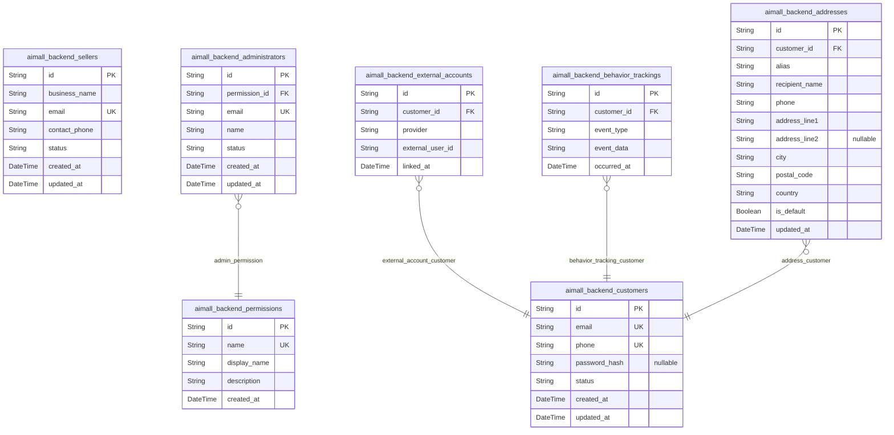

# Prisma Markdown

> Generated by [`prisma-markdown`](https://github.com/samchon/prisma-markdown)

- [Systematic](#systematic)
- [Actors](#actors)
- [Products](#products)
- [Community](#community)
- [Carts](#carts)
- [Orders](#orders)
- [Coupons](#coupons)
- [Coins](#coins)
- [Inquiries](#inquiries)
- [Analytics](#analytics)

## Systematic

### `aimall_backend_channels`

Channel entity - Implements the channels management requirement, supporting the definition and configuration of sales/distribution channels (e.g., main website, partner sites, mobile app) within the systematic backbone. Channels represent different distribution fronts for the platform, allowing appropriate products and content to be mapped or scoped. Strict 3NF compliance is maintained by decoupling the channel entity from other business entities. Channels may be referenced externally by related domain tables (such as products, channel assignments).

Properties as follows:

- `id`: Primary Key. Uniquely identifies each channel by universally unique identifier according to best practice.
- `code`: Channel code: unique short identifier (e.g., 'WEB', 'MOBILE'). Used for programmatic lookups and internal configuration, atomic value. Unique across all channels.
- `name`: Human-readable channel name for UIs and management. Fully normalized, used in admin/service configurations.
- `enabled`: If true, channel is active; otherwise, channel is disabled for routing/service. Atomic flag, fully normalized. Used for toggling channel availability without deletion.
- `created_at`: Row creation timestamp for audit trail and compliance, required for record keeping. 3NF: atomic.
- `updated_at`: Last modification timestamp for audit/change tracking. Atomic, not pre-calculated.

### `aimall_backend_sections`

Section entity - Implements the requirement for UI/display content organization within channels. Sections are subdivisions (e.g., homepage banners, featured blocks) and strictly normalized. Channel_id is FK to channels, code is unique within channel. Soft deletion uses deleted_at. Used as a referencing entity for content/product/offer assignment modules in other domains. No denormalized data, all fields atomic. 3NF compliant.

Properties as follows:

- `id`: Primary Key. Uniquely identifies each section in the system.
- `channel_id`: Belonged channel's [aimall_backend_channels.id](#aimall_backend_channels). Links section to a specific channel. This ensures clear channel/section-scoping. Non-nullable for data integrity.
- `code`: Section code, unique within channel, e.g., 'BANNER', 'DEALS'. Atomic value; fully 3NF; no repetition.
- `name`: Section display name: human readable, for admin/UI. Atomic data, normalized.
- `display_order`: Numeric order for display, atomic field, 3NF. Used for admin/UI ordering and rendering control.
- `enabled`: If true, section is active/visible; admin toggle/control for soft suppressing/activating sections. 3NF, atomic field.
- `created_at`: Creation timestamp for audit/logical tracing, no denormalization.
- `updated_at`: Last change timestamp for auditing. No pre-calculation, atomic field. 3NF.
- `deleted_at`: Logical deletion field: soft delete with timestamp, null if alive. Used for logical retention and audit. Nullable.

### `aimall_backend_configurations`

System Configuration entity - Implements requirement for global, channel, or section-scoped setting storage. Each configuration represents a setting (key/value) optionally scoped to channel or section. Used for feature toggles, platform-wide or channel-specific behaviors. Fully 3NF: no duplicated/denormalized/calculated fields, all settings atomic and change-tracked. Key+channel_id+section_id combination is unique to avoid overlap. All relationships are optional (global = both null).

Properties as follows:

- `id`: Primary Key. Unique record id. Each config is a standalone setting.
- `channel_id`: Optional foreign key to [aimall_backend_channels.id](#aimall_backend_channels). Null = global config; for channel-level settings. Ensures normalized design. Soft constraint; referenced channel must exist if used.
- `section_id`: Optional FK to [aimall_backend_sections.id](#aimall_backend_sections). Null = applies at global or channel settings; non-null = conf applies to given section. Retains 3NF, atomic references.
- `key`: Configuration key for setting, e.g., 'site_maintenance'. Atomic string key, unique per channel+section. No denormalization, single data point.
- `value`: Setting value in string form, to allow flexible data types (bool/int/JSON all as strings). Pure field, 3NF, atomic.
- `description`: Optional text explaining the configuration for admins, nullable. Used for documentation and operational clarity. No constraint; normalized; not required.
- `created_at`: Row created time for compliance/auditability. Not null; not derived.
- `updated_at`: Last change timestamp. 3NF: atomic field, not precomputed or denormalized.

## Actors

### `aimall_backend_customers`

Customer account data - This implements the core customer entity requirement from the Customer System requirements document. This model represents end-users who engage in shopping, use personalized features, and manage their own profiles, providing the anchor for all customer-centric activities. Maintains 3NF by separating identity and behavioral data. For example, referenced in orders, addresses, reviews, and behavior logs. Key relationships: links to external accounts, addresses, behavioral tracking. Special behaviors: unique constraints on identity; deletion triggers anonymization except for compliance logs.

Properties as follows:

- `id`: Primary Key.
- `email`: The customer's primary email address - Implements identity requirement. Used for authentication and notifications. Enforces normalization by not duplicating across other tables. For example: unique login/email mapping. Must be unique.
- `phone`: Customer’s primary phone number. Implements alternative contact requirement. Kept atomic. Used for SMS notification and verification flows. Example: profile edit, password reset.
- `password_hash`: Secure hashed password for the customer. Implements authentication requirement. Ensures security by never storing plain text. Used during login. Null for external-only accounts.
- `status`: Account status (e.g., active, suspended, pending, deleted). Implements status tracking. Maintains normalization as atomic code. Example usage: onboarding approval, account lock.
- `created_at`: Timestamp of account creation. Implements audit trail. Kept atomic and fully normalized. Used for registration analytics.
- `updated_at`: Timestamp of last profile update. Implements audit and integrity requirement. Tracked for compliance/logging.

### `aimall_backend_sellers`

Seller account record - Implements the seller onboarding and management requirement from the Seller System requirements. Each record represents a merchant business identity for listing, inventory management, and analytics. Maintains 3NF by storing only atomic seller-level data. Related to permissions for advanced controls. Example: referenced when tracking seller performance or auditing onboarding. Key relationships: may reference granular permission entity. Special behaviors: Verification/check/audit status handled via status field.

Properties as follows:

- `id`: Primary Key.
- `business_name`: Seller’s registered business name. Implements business profile requirement. Normalized to avoid duplication in product or order records. Used for display and compliance checks.
- `email`: Seller’s business contact email. Used for onboarding, notification, and login if allowed. Maintains uniqueness and normalization. For example: used in seller sign-up, password reset.
- `contact_phone`: Seller’s primary contact phone. Implements communication and verification requirement. Purely atomic and for contact purposes.
- `status`: Onboarding and operational status (pending, approved, rejected, suspended). Used for permission logic and admin review flows. Example: audit transitions, dashboard access.
- `created_at`: Timestamp of seller account creation. For audit and compliance. Example: onboarding analytics.
- `updated_at`: Timestamp of last seller account update. For audit, change tracking.

### `aimall_backend_administrators`

Platform administrator entity - Implements the administrator user management and permission assignment requirement. Stores atomic data for each admin-level user with assigned permissions. Maintains 3NF by not mixing with seller/customer logic. Used for full or scoped admin access, activity logging, and audit traceability. Example: System operator signs in and manages sellers. Key relationships: references permissions entity for role assignments.

Properties as follows:

- `id`: Primary Key.
- `permission_id`: References [aimall_backend_permissions.id](#aimall_backend_permissions) for assigned admin permission set. Enables hierarchical controls. For example: super admin vs. support admin.
- `email`: Administrator’s email address. Used for sign-in and notification. Must be unique. Normalized.
- `name`: Administrator display name. Implements admin user naming requirement. Used for dashboard, audit logs. Kept atomic and normalized, not duplicated elsewhere.
- `status`: Operational status (active, suspended, pending). Used for access gating and audit flows.
- `created_at`: Creation date for admin account. Used for join analysis, audit trace.
- `updated_at`: Last update timestamp.

### `aimall_backend_permissions`

Permission/role definition entity - Implements fine-grained and role-based permission requirements for sellers and administrators. Enables maintainable, extendable, reusable access control lists. Maintains full normalization; only the permission identity and description live here. Example: support admin, super admin, seller-inventory. Used as assignment in admin and seller models. Special behaviors: If altered, triggers audit trail. Relationship: referenced by administrator or seller for role mapping.

Properties as follows:

- `id`: Primary Key.
- `name`: Unique code or name for this permission/role (e.g., super_admin, seller_product_manager). Implements unique constraint for RBAC mapping. Maintains normalization; referenced only as foreign key.
- `display_name`: Display name for UI/analytics. Used on dashboards. Not necessarily unique. Maintained separately from permission code for localization/flexibility.
- `description`: Detailed explanation of what this permission grants. Used for system documentation, admin UX. Maintains atomicity by avoiding embedded business logic.
- `created_at`: Permission definition created timestamp. Used for audit trail and change tracking.

### `aimall_backend_external_accounts`

External identity account link - Implements federated login/OAuth requirements by tracking external provider identities (Google, Kakao, Apple, etc.) linked to primary AIMall customer accounts. Maintains strict normalization: all external linkage data is atomic and sits in this model, referenced from customers. Example: Single customer, multiple federated logins. Relationships: FK to aimall_backend_customers. Special behaviors: If deleted, only impacts authentications via provider.

Properties as follows:

- `id`: Primary Key.
- `customer_id`: Belonged customer’s [aimall_backend_customers.id](#aimall_backend_customers). Links this external account to the internal primary customer.
- `provider`: Identity provider code (e.g., google, kakao, apple). Enforces normalized provider codes for robust branching and validation. For example: login flow decision logic. Critical for OAuth mapping.
- `external_user_id`: External provider’s user ID string. Used to correlate federated identities. Example: store Google sub or Kakao id. Always atomic and never repeated.
- `linked_at`: Timestamp of account linkage. Enables audit trail for identity events. Used for UX (showing when account was linked).

### `aimall_backend_behavior_trackings`

Per-customer behavioral tracking - Implements the session/activity tracking requirement. Stores API-driven customer events, preferences, and actions for AI, analytics, compliance. Ensures 3NF by isolating behavioral actions from static identity data. Example usage: shopping session event logs, personalization input. Relationship: links to customer. Special behaviors: May be periodically purged/anonymized for compliance. Used only for analytics/AIOps, never for business-critical identities.

Properties as follows:

- `id`: Primary Key.
- `customer_id`: Related customer’s [aimall_backend_customers.id](#aimall_backend_customers). Logs which customer generated the behavior.
- `event_type`: What user activity/event is being tracked (e.g., login, view_product, add_cart, checkout, search, recommend_click). Implements event-type requirement. Kept atomic as string code; normalization enforced. Used in analytics pipeline for behavior modeling.
- `event_data`: Serialized payload describing the event more fully (JSON or similar). Contains atomic data, avoids schema transitive dependency. For example: product IDs, referer, AB test cohort.
- `occurred_at`: Timestamp the event was logged. Implements audit and analytics timing. Used in analytics; always atomic.

### `aimall_backend_addresses`

Customer delivery addresses - Implements the address management requirement, storing normalized and per-customer-linked delivery location data. Ensures all address data is atomic (split lines, etc) in full compliance with 3NF. Used for checkout, shipments, address book UX. Relationships: links customer. Special behaviors: Customers can have multiple addresses, with optional default flag. Deletion disables only for this customer.

Properties as follows:

- `id`: Primary Key.
- `customer_id`: Owner customer’s [aimall_backend_customers.id](#aimall_backend_customers). Allows associating multiple addresses per account, and enables easy lookup for checkout flows and address book UX.
- `alias`: User-defined label for quick selection (e.g., 'Home', 'Office'). Implements per-customer usability. Fully atomic; not duplicated across tables. Used in address picker UX.
- `recipient_name`: Address recipient name (can differ from customer profile). Fulfills logistics requirement. Used when generating shipping labels. Always atomic.
- `phone`: Phone number for this address/recipient. Meets delivery carrier and communication needs. Fully atomic.
- `address_line1`: Main line of street address/location. Split for normalization; no embedded logic. Used in shipping and verification.
- `address_line2`: Second line (optional, e.g., apartment/suite). Split for normalization; not duplicated. Optional for UX.
- `city`: City of the address. Used for logistics analysis; atomic for filtering/aggregation.
- `postal_code`: Postal/ZIP code. Maintains normalization, index for geo lookup.
- `country`: Country code or name. Normalized string for international handling; used for compliance/shipping.
- `is_default`: True if this is the primary/default address for the customer. Implements default selection UX. Only one per customer can be true. Constraint enforced by application logic.
- `updated_at`: When this address was last modified. Used for audit trail and UX.

## Products

### `aimall_backend_products`

Product master (core SKU/group) - This implements the comprehensive product catalog requirement from the Product Management document. Central record for all products listed across the platform. Holds product metadata, primary relationships (category, seller), and references to options and bundles. Maintains 3NF by not duplicating inventory, option, or category data – all relationships via foreign keys. For example, sellers define products here, and inventory or options are in linked tables. Key relationships: links to aimall_backend_sellers (already created table) and aimall_backend_categories. Special behaviors: Only normalized product master data; no precomputed inventory, price, or reviews.

Properties as follows:

- `id`: Primary Key. Uniquely identifies each product.
- `category_id`: Category's [aimall_backend_categories.id](#aimall_backend_categories). References which category this product belongs to.
- `seller_id`: Seller's [aimall_backend_sellers.id](#aimall_backend_sellers) - Who owns this product (from Actors domain; reference only).
- `title`: Product title - Implements product listing requirement. Human-readable product name. Ensures normalization as only master copy here. Example: 'Apple AirPods Pro 2'.
- `description`: Product detail/description - Implements product content requirement. Long text explaining features. Normalized; not duplicated elsewhere. Example: 'Latest model, improved noise cancellation.'
- `main_thumbnail_uri`: Main thumbnail image URI - Implements image management requirement. Single main image URI. Only stored here, not duplicated in options. Example: 'https://cdn/airpods2-thumb.jpg'.
- `status`: Status of product (active, inactive, out_of_stock, deleted) - Tracks whether product is available. Normalized field. Example: 'active'.
- `created_at`: Created timestamp - Implements audit and snapshot needs. Creation datetime. Example: 2024-05-01T10:00:00Z.
- `updated_at`: Updated timestamp. To support change and audit needs. Example: 2024-05-02T15:10:00Z.

### `aimall_backend_product_options`

Product options (variant definitions) - Implements the SKU/variant requirement in the Product Management and ERD. Stores all option variants for products (e.g., color, size). Maintains 3NF by only referencing products and not duplicating inventory or price. For example, 'Color: Black', 'Size: M' for given product. Key relationships: links to aimall_backend_products. Special behaviors: One record per option value; combinations for full SKU are stored in aimall_backend_skus.

Properties as follows:

- `id`: Primary Key. Unique per product option.
- `product_id`: Product's [aimall_backend_products.id](#aimall_backend_products) - Which product this option belongs to.
- `name`: Option name (e.g., Color, Size) - Implements option specification requirement. Atomic; not duplicated. For example, 'Color'.
- `value`: Option value (e.g., Red, Large) - Option value per option type. Ensures full normalization. For example, 'Black'.

### `aimall_backend_product_bundles`

Product bundles (set/group of products) - Implements the bundle/package product requirement from Product Management. Defines relationships between products that are sold together as bundles. Strictly normalized: just references to master products and role (main vs component). Never includes precomputed price or stock. For example, 'Gift Set' containing three products. Key relationships: links to main product and bundled product (both aimall_backend_products). Special behaviors: For M:N bundles, each row links a bundle and a bundled component.

Properties as follows:

- `id`: Primary Key. Unique per bundle-member relation.
- `bundle_product_id`: Main bundle product's [aimall_backend_products.id](#aimall_backend_products). Represents the product that is a bundle group/master.
- `component_product_id`: Bundled component product's [aimall_backend_products.id](#aimall_backend_products). Represents the directly included (child) product.
- `is_required`: Indicates if the component is required for the bundle - Implements bundle rule requirement. For example, requiring all components for fixed set; false for optional (e.g., gift add-on).
- `quantity`: Quantity of this component in the bundle - How many units included per bundle. Maintains normalization by not duplicating product details. Example: 2 means two of this item per bundle.

### `aimall_backend_categories`

Product categories (taxonomy) - Implements category management and classification from Product Management. Defines the product taxonomy hierarchy (main/sub/section levels). Maintains 3NF – only category data; no product fields here. For example, 'Electronics > Phones > Accessories'. Key relationships: can be hierarchical via parent_id (self-reference); products reference categories. Special behaviors: Hierarchical nesting is optional (nullable parent_id); root categories have null parent_id.

Properties as follows:

- `id`: Primary Key. Unique per category.
- `parent_id`: Parent category's [aimall_backend_categories.id](#aimall_backend_categories). Hierarchical parent, or null for root categories.
- `name`: Category name - Implements taxonomy labeling. Atomic; no category hierarchy in this field. For example: 'Electronics'.
- `depth`: Hierarchy depth - Root=1, increasing with subcategories. Implements hierarchy requirement. For example, 2 for subcategory.

### `aimall_backend_skus`

SKU master (variant combinations) - Implements complete variant/SKU specification from Product Management. Defines each purchasable SKU (combination of product + options), with references to all option values selected. Fully normalized: no pricing, inventory, or calculated data; only references and atomic SKU codes. For example, a unique SKU for 'AirPods Pro 2, Color: Black, Case: Yes'. Key relationships: links to product and all relevant options. Special behaviors: Unique per product and option combination.

Properties as follows:

- `id`: Primary Key. Unique per SKU.
- `product_id`: Product's [aimall_backend_products.id](#aimall_backend_products) for which this SKU is defined.
- `sku_code`: Platform-unique SKU code - Implements SKU referencing. Example: 'APPRO2-BLK-CASEY'.

### `aimall_backend_inventory_snapshots`

Inventory snapshot logger - Implements inventory audit trail, atomicity, and change tracking from Product Management. Records all changes to inventory for audit and temporal reconstruction. Fully normalized: references the SKU, never precomputes total inventory. For example, logs each change when inventory is updated due to sales, restock, or manual adjustment. Key relationships: links to SKUs and products. Special behaviors: Can reconstruct point-in-time inventory by aggregating snapshots for a SKU/product.

Properties as follows:

- `id`: Primary Key. Unique per inventory change event.
- `sku_id`: SKU's [aimall_backend_skus.id](#aimall_backend_skus) for which inventory was changed.
- `product_id`: Product's [aimall_backend_products.id](#aimall_backend_products) (denormalized FK for easier audit).
- `change_type`: Type of inventory change - Implements stock mutation requirement. Examples: 'sale', 'restock', 'manual_adjust'.
- `change_quantity`: Quantity of change (positive/negative) - Atomic per event. For example, -1 for sale, +5 for restock.
- `changed_by`: Actor's user id (e.g. admin or seller) - Who caused the change. Ensures proper audit trail. Example: seller UUID.
- `created_at`: Timestamp when snapshot created. Implements audit/compliance.

### `aimall_backend_channel_assignments`

Channel assignment for product listing - Implements cross-channel management from Product Management. Records product's registration and mapping to multiple channels (e.g. online store, section, marketplace). Maintains 3NF by only referencing IDs. Example: A product may be listed on two channels; each row here for a channel. No pricing or denormalized status fields. Key relationships: links to aimall_backend_products and already created aimall_backend_channels. Special behaviors: Each tuple is unique: a product appears at most once per channel.

Properties as follows:

- `id`: Primary Key. Unique per product/channel tuple.
- `product_id`: Product's [aimall_backend_products.id](#aimall_backend_products) for this listing.
- `channel_id`: Channel's [aimall_backend_channels.id](#aimall_backend_channels) (already implemented in Systematic domain).
- `assigned_at`: Assignment timestamp - When product was listed on this channel. Maintains correct timeline for audit/rollback. Example: 2024-05-02T13:20:00Z.

## Community

### `aimall_backend_posts`

Community Post Entity – Implements community post requirements from '06_aimall-backend_bulletin-board-and-community.md'.

This model represents bulletin board posts (questions, articles, announcements) by customers, sellers, or administrators. Maintains 3NF by separating atomic fields and delegating denormalized/aggregated data to materialized views if needed. Example: User creates a Q&A entry, product question, or system announcement.

Key relationships: References actor via foreign key (customer/seller/administrator via polymorphic pattern by referencing only customer for now, or 'actor_id' if polymorphism were implemented). May be linked to multiple comments and attachments. Product review posts are modelled in 'aimall_backend_reviews'.
Special behaviors: Only atomic, normalized data, status/visibility managed via fields (no pre-calculated counters).

Properties as follows:

- `id`: Primary Key. Unique identifier for the post record.
- `customer_id`: Belonged customer's [aimall_backend_customers.id](#aimall_backend_customers). Links post to the creating customer. Nullable for posts by seller/admin (future extension).
- `title`: Post title – Implements post composition requirements. The headline users see in boards or feeds. Maintains normalization by storing each post's title only once. Example: 'How do AI coupons work?'.
- `body`: Post content – Implements discussion body requirement. The main textual content. Fully normalized and searchable. Example: 'You can redeem AI coupons every Friday...'.
- `is_private`: Whether the post is private – Controls visibility per requirements. Ensures that private/public settings are not duplicated elsewhere. Example: A seller-customer product Q&A marked as private.
- `view_count`: Post view count – For tracking read frequency, enabling moderation or analytics. Not pre-aggregated; raw counter updated per view (always atomic). Example: 12 views.
- `created_at`: Creation timestamp – Implements system recording and audit requirements. Atomic record of creation. Example: 2025-07-29T15:45:40Z.
- `updated_at`: Last modification timestamp. Timestamp for auditing edits. Example: 2025-07-29T15:45:40Z.
- `deleted_at`: Soft deletion timestamp. Allows for compliant redaction/restore. Null if not deleted. Example: null or 2025-07-29T16:00:00Z.

### `aimall_backend_comments`

Community Comment Entity – Implements content/comment system from '06_aimall-backend_bulletin-board-and-community.md'.

Stores user comments/replies attached to posts, reviews, or announcements while normalizing structure (3NF). Each comment belongs to a post or review via foreign key. Maintains strict normalization by holding only atomic, per-comment data.
Example: User adds a reply to a Q&A, review, or announcement.
Key relationships: Links to aimall_backend_posts, aimall_backend_reviews, and optionally to parent comments for threads.
Special behaviors: Soft deletion supported by nullable timestamp; content removed only on explicit deletion for audit.

Properties as follows:

- `id`: Primary Key. Unique identifier for the comment record.
- `post_id`: Target post's [aimall_backend_posts.id](#aimall_backend_posts). Links comment to a post entry.
- `review_id`: Target review's [aimall_backend_reviews.id](#aimall_backend_reviews). Allows comments on reviews as per requirements.
- `parent_id`: Parent comment's [aimall_backend_comments.id](#aimall_backend_comments). Enables comment/reply threading. Null for top-level comments.
- `customer_id`: Comment author's [aimall_backend_customers.id](#aimall_backend_customers). Links comment to originating customer (nullable for polymorphic future extension).
- `body`: Comment content. Main discussion text. Fully normalized; all comments stored atomically. Example: 'Great post, thank you!'
- `is_private`: Is the comment private? Controls visibility per business rules. Example: true for seller/private thread, false for public comments.
- `created_at`: Creation timestamp – for full audit trail and recency sorting.
- `updated_at`: Last mod time – modified for each comment edit as audit record.
- `deleted_at`: Soft deletion timestamp. Null if active; otherwise marks as deleted for compliance/audit.

### `aimall_backend_reviews`

Product Review Entity – Implements review, rating, and moderation features from '06_aimall-backend_bulletin-board-and-community.md'.

Stores atomic product reviews with ratings, authored by customers. Maintains strict 3NF with one record per review. Example: Customer reviews a recently delivered product.
Key relationships: Links to customer (author) and product (target), both via foreign key referencing respective models in other domains. Review-specific attachments stored separately in aimall_backend_attachments.
Special behaviors: Supports soft deletion. Moderation handled externally (status flag can be added for further workflows).

Properties as follows:

- `id`: Primary Key. Unique identifier for the review record.
- `customer_id`: Reviewing customer's [aimall_backend_customers.id](#aimall_backend_customers). Authorship for reference and audit.
- `product_id`: Target product's [aimall_backend_products.id](#aimall_backend_products). The product reviewed in this entry.
- `title`: Review title. Concise headline for the review. Normalized by review. Example: 'Super fast delivery!'
- `body`: Review content text. Main review message from reviewer. Example: 'I received the item within one day; packaging was good.'
- `rating`: Star rating (1–5) as required by product review features. Integer, enforced by input layer. Example: 4
- `created_at`: Review creation timestamp for audit/history/personalization.
- `updated_at`: Timestamp for last review edit. Used for moderation/logging.
- `deleted_at`: Soft deletion timestamp; null for active, otherwise signals redaction/restoration window.

### `aimall_backend_attachments`

Community Attachment Entity – Implements attachment/media requirements from '06_aimall-backend_bulletin-board-and-community.md'.

Atomic representation of file/image/video/document attached to post, comment, or review. Maintains 3NF by separating main content and attachment storage. Example: User uploads a photo for a review or Q&A.
Key relationships: Attachments link to posts, comments, or reviews via foreign keys (only one set at a time, reflecting context).
Special behaviors: All files are stored externally and referenced by URI for privacy/compliance.

Properties as follows:

- `id`: Primary Key. Unique identifier for the attachment record.
- `post_id`: Belonged post's [aimall_backend_posts.id](#aimall_backend_posts). Nullable; links file to a post if set.
- `comment_id`: Belonged comment's [aimall_backend_comments.id](#aimall_backend_comments). Nullable; file attached to a comment.
- `review_id`: Belonged review's [aimall_backend_reviews.id](#aimall_backend_reviews). Nullable; attaches to review media.
- `file_uri`: File URI – Implements external reference for uploaded files by compliance. Atomic URI field only. Example: 's3://bucket/folder/uuid-filename.jpg'
- `file_type`: File type (image, video, doc) to support moderation. Example: 'image/jpeg'
- `file_size`: File size in bytes. Enables size filtering and compliance. Example: 328914
- `created_at`: File creation/upload timestamp.

### `aimall_backend_snapshots`

Community Snapshot Entity – Implements the snapshot/photo-sharing feature from '06_aimall-backend_bulletin-board-and-community.md'.

Used to store user image/photo/short-video moments optionally linked to products or posts for the social timeline. Maintains strict normalization (each row = one snapshot). Example: Photo tagged to a product or post for trending feed.
Key relationships: Foreign keys to products, posts, and customers per context.
Special behaviors: No denormalized trends/cache; all aggregated/denormalized data resides in views.

Properties as follows:

- `id`: Primary Key. Unique identifier for the snapshot record.
- `product_id`: Tagged product's [aimall_backend_products.id](#aimall_backend_products). Link snapshot to a product for timeline, searchable by product.
- `post_id`: Tagged post's [aimall_backend_posts.id](#aimall_backend_posts). Enables photo-to-post association.
- `customer_id`: Creator customer's [aimall_backend_customers.id](#aimall_backend_customers). Snapshot author/reference. Nullable for anonymous posts.
- `media_uri`: Media file URI – integrity-persistent link to external image/video for compliance. Atomic per snapshot. Example: 's3://bucket/path/snap-uuid.jpg'
- `caption`: Short caption for post context or social feeds. Example: 'Spring Fashion 2025 - Trending Looks'
- `created_at`: Moment creation/upload timestamp.

## Carts

### `aimall_backend_carts`

Cart entity for persistent session/account shopping cart, per 07_aimall-backend_cart-system.md. Implements shopping cart ownership and lifecycle, supporting both account-linked and guest session carts. Ensures 3NF by only containing ownership/session metadata and maintaining relations to items. Enforces business logic for one active cart per customer/session via unique constraints. Primary use: container for items prior to purchase/order creation.

Properties as follows:

- `id`: Primary Key. Uniquely identifies the cart instance.
- `aimall_backend_customer_id`: Owned account's [aimall_backend_customers.id](#aimall_backend_customers). Nullable for anonymous/guest carts. Implements account-tied cart merging requirement.
- `session_token`: Session or device token for anonymous carts; one of this or aimall_backend_customer_id should be present. Allows unique cart per session. Nullable for account-tied carts.
- `created_at`: Cart creation timestamp. For auditing, recovery, and analytics use cases.
- `updated_at`: Cart update timestamp. For sync, concurrent editing, and recovery. Always required.

### `aimall_backend_cart_items`

Cart item entity for individual products/options/SKUs attached to a cart, per 07_aimall-backend_cart-system.md. Strictly normalized to 3NF: each row references only atomic, business-level selections for one cart, product, option, and SKU. No pre-calculated or denormalized data: totals and calculations only in order or reporting models. Guarantees item distinction via composite unique key and references only valid products/SKUs/options across domains.

Properties as follows:

- `id`: Primary Key. Identifies the cart item row uniquely.
- `aimall_backend_cart_id`: The cart's [aimall_backend_carts.id](#aimall_backend_carts) this item is attached to. Implements cart containment. Required always.
- `aimall_backend_product_id`: The product's [aimall_backend_products.id](#aimall_backend_products) for this item. Implements product line selection requirement.
- `aimall_backend_product_option_id`: The product option's [aimall_backend_product_options.id](#aimall_backend_product_options) (size, color, etc). Nullable if product has no options. Implements variant selection.
- `aimall_backend_sku_id`: The SKU's [aimall_backend_skus.id](#aimall_backend_skus) representing the selected product variant. Nullable for unkeyed SKUs. Validates inventory/restrictions at checkout.
- `quantity`: Requested quantity. Implements unit selection policy, always positive integer. No pre-calculation, strictly atomic. Normalized per 3NF.
- `unit_price_snapshot`: Unit price snapshot at time of addition. Fulfills price/discount audit requirement. Must not be pre-calculated for totals, normalization preserved.
- `discount_snapshot`: Discount value per item at time of assignment. Captures promo logic at item addition. Nullable if no discount applied. Calculation delegated to reporting/views.
- `selected_name_display`: Optional UI-friendly product+option name for easier display in UI/cart. Optional, not required for backend operation.
- `created_at`: Timestamp: item creation. For lifecycle/audit tracking. Required.
- `updated_at`: Timestamp: item update. Required for change tracking.

## Orders

### `aimall_backend_orders`

Order master record - This implements the foundational requirement from the Order and Delivery System for robust, scalable handling of customer orders from placement to fulfillment (Section 8/Order and Delivery). 

Tracks primary order business data for each customer order including status, seller linkage, total amounts, and audit timestamps. Maintains 3NF normalization by breaking out order items, payments, and shipments into separate tables. For example, one entry per completed order. 

Key relationships: links to customer (already in Actors), ships to one address, references associated order snapshots. Special behaviors: immutable after archival; only modifiable in allowed statuses; supports audit trail.

Properties as follows:

- `id`: Primary Key.
- `customer_id`: Belonged customer's [aimall_backend_customers.id](#aimall_backend_customers). Used to attribute each order to its owner in the Actors domain.
- `seller_id`: Owning seller's [aimall_backend_sellers.id](#aimall_backend_sellers) for multi-vendor order scenarios.
- `address_id`: Delivery address for the order. References [aimall_backend_addresses.id](#aimall_backend_addresses) from Actors domain.
- `order_number`: Unique, business-facing order number. Implements requirement for order tracking, customer communication, and admin search. Ensures normalization by keeping system-int/uuid as primary and a unique business string for reference. For example: 'ORD-20250729-0001'. Constraint: uniquely indexed.
- `order_status`: Current order status (e.g., 'pending', 'paid', 'processing', 'shipped', 'delivered', 'cancelled', 'returned'). Implements fulfillment state machine; ensures normalization by using enumerative string. For example: 'paid'.
- `total_amount`: Total order amount at placement (snapshot of the customer-facing amount). Implements requirement for payment, reporting, and analysis. No auto-calc in table (all raw amounts). For example: 125000.00. Constraint: always >= 0.
- `currency`: Order currency code (e.g., 'KRW', 'USD'). Implements requirement to support multi-currency orders. Ensures normalization by storing ISO currency code. For example: 'KRW'. Applies to all order flows.
- `created_at`: Order creation timestamp. Implements requirement for auditability, KPI (order intake rate). Normalization is maintained as each event is atomic; non-derived. Example: '2025-07-29T15:45:40Z'.
- `updated_at`: Last modification time for the order record. Implements audit and monitoring requirements. Usage: admin tracking, compliance. Not derived, always updated in place. Example: '2025-07-29T17:01:10Z'.
- `archived_at`: Timestamp when this order was marked as immutable/archived. Implements audit and compliance feature for order records lifecycle. Null if not archived. For example: null or '2025-07-30T10:37:20Z'.

### `aimall_backend_order_items`

Order item line - This implements the detail breakdown for each product in an order, per the requirement that orders can contain multiple items (Section 8: multi-item, multi-seller order scenarios). 

Each record represents one product (SKU/option/bundle) purchased in the order, allowing for complete normalization without pre-aggregated data. Maintains 3NF: all variant, quantity, and item price data atomic. For example: an order with 2 different goods results in 2 rows here.

Key relationships: Belongs to an order, references a product and option from Products domain. Special behaviors: immutable after order is archived.

Properties as follows:

- `id`: Primary Key.
- `order_id`: Parent order's [aimall_backend_orders.id](#aimall_backend_orders). Enforces relationship between line item and master order.
- `product_id`: Purchased product's [aimall_backend_products.id](#aimall_backend_products) in Products domain. Ensures normalized reference.
- `product_option_id`: Ordered product option's [aimall_backend_product_options.id](#aimall_backend_product_options). Supports SKU/variant distinctions. Null if none (e.g. for base products).
- `item_name`: Display name of item at time of purchase. Implements snapshot of purchase detail per order, used for support, returns, and analytics. For example: 'AI Smart Speaker' (not a calc field, denormalized to support legal compliance on order receipts).
- `quantity`: Ordered quantity for this item. Business meaning: inventory deduction, analytics, returns processing. For example: 2. Always positive integer.
- `unit_price`: Unit price snapshot at purchase time. Fulfills critical requirement for audit trail, analytics, claims. Not a calc field—this field preserves item price history. For example: 59000.0.
- `total_price`: Total price = unit_price * quantity at time of order. Snapshot requirement for precise reconciliation. Not a pre-calculated aggregate (single-item only). For example: 118000.0.

### `aimall_backend_payments`

Order payment transaction - Implements requirement for flexible, auditable order payments (Section 8 & Discount/Loyalty). Records each payment event tied to an order, including multiple forms (split payment, coupon, points). Maintains 3NF by itemizing each transaction event, never aggregating in-line to regular order tables. For example: an order with cash + points records two entries here. Key relationships: to order, and optionally, coupon/loyalty/discount entities in other domains. Special behaviors: amount integrity, immutable after completion, joinable via order_id.

Properties as follows:

- `id`: Primary Key.
- `order_id`: The order this payment is associated with. References [aimall_backend_orders.id](#aimall_backend_orders).
- `payment_method`: Payment channel/type used (e.g., 'credit_card', 'deposit', 'coupon', 'loyalty_points', 'virtual_account'). Implements requirement for multi-mode payments per order. Not a calculated or enum field, but controlled by business logic.
- `amount`: Amount paid via this transaction. Implements requirement for sum-to-total integrity for each order. Use for audit/reconciliation. For example: 59100.0.
- `currency`: Payment currency code such as 'KRW', 'USD'. Implements multi-currency flexibility, maintains normalization. For example: 'KRW'.
- `transaction_id`: External payment processor's transaction or confirmation code. Implements traceability/chargebacks. May be nullable for internal balance, coupon cases. For example: 'PAY2025072900023'.
- `paid_at`: Timestamp when this payment event was processed and confirmed. Auditable event. Example: '2025-07-29T16:44:51Z'.

### `aimall_backend_shipments`

Shipment record for an order - Implements requirement for real-time order/delivery tracking and logistics integration (Section 8). Each record denotes shipment and delivery event for a part/all of an order. Maintains 3NF by separating shipment events from orders, allowing for multi-seller/partial-ship. For example: two shipments for split orders, or replacements. Key relationships: references order, shipment address (Actors), and shipper; can be joined via order_id for fulfillment queries. Special behaviors: immutable after delivery except for tracking updates.

Properties as follows:

- `id`: Primary Key.
- `order_id`: Linked order's [aimall_backend_orders.id](#aimall_backend_orders). Enforces relationship with primary order record.
- `shipment_address_id`: Target delivery address for this shipment. References [aimall_backend_addresses.id](#aimall_backend_addresses).
- `carrier`: Shipping carrier name—recorded for handoff, customer service, compliance. Not a lookup or derived type; can be any contracted vendor name. For example: 'CJ Logistics'.
- `tracking_number`: Carrier-provided tracking code. Key for customer tracking and support, audit logs. For example: '1Z9999Y70200370006', can be null for in-process or non-tracked deliveries.
- `shipment_status`: Current fulfillment status ('pending', 'shipped', 'delivered', etc.). Implements state machine for delivery steps.
- `shipped_at`: Shipment departure timestamp from warehouse. Used for fulfillment metrics. Null if not shipped.
- `delivered_at`: Final delivery confirmation timestamp. Used for SLAs, customer comms, audit trails. Null if not delivered yet.
- `created_at`: Record creation timestamp for shipment event. For audit trail and logistics management. For example: '2025-07-29T16:32:00Z'.

### `aimall_backend_order_snapshots`

Order state snapshot/audit trail - Implements snapshot-based pattern for order/invoice auditing and rollback (Section 8, System Overview, Technical+Compliance). Each entry is a full serialized snapshot of the order’s business state at a critical event (placement, modification, cancelation). Maintains 3NF by storing atomic, versioned snapshots tied to an order (never redundant calc/agg fields in main tables). For example: one entry at order creation, another on update/cancel. Key relationships: references order; supports audit/compliance. Special behaviors: append-only, never mutable/deletable except under strict retention policies.

Properties as follows:

- `id`: Primary Key.
- `order_id`: The underlying order being snapshotted [aimall_backend_orders.id](#aimall_backend_orders).
- `snapshot_type`: Categorizes snapshot event ('created', 'modified', 'cancelled', 'fulfilled', etc.). Used for auditability and compliance. For example: 'created'.
- `snapshot_data`: Serialized JSON string of the full order record and related items/payments/shipments at this point in time. Implements snapshot/audit trail requirement. For example: '{...}' (not directly queryable fields; used for rollback/forensics).
- `snapshot_at`: Time at which the snapshot was taken. Ensures correct event ordering (audit). For example: '2025-07-29T17:03:11Z'.

## Coupons

### `aimall_backend_coupons`

Coupon entity - This implements the requirements for coupon management and tracking as described in section 4 of the Discount & Loyalty System requirements.

Coupons are digital vouchers that can be issued system-wide or user-specific, usable for eligible orders and products. All instances of coupon issuance, unique code storage, status (issued, redeemed, expired, invalidated), and usage constraints are strictly tracked at this entity. Maintains 3NF compliance by referencing related campaigns or users via IDs, with no redundant storage or pre-computation. For example, the system records a unique row per issued coupon, capturing its single-use or multi-use state for audit and abuse prevention.

Key relationships: References the discount campaign and customer/user (from external actors) as the owner. May link to specific products or categories via foreign keys if necessary.
Special behaviors: Unique coupon codes, strict status enumeration, and time-based validity are centrally enforced. No aggregate or computed fields, per normalization rules.

Properties as follows:

- `id`: Primary Key. Uniquely identifies the coupon.
- `discount_campaign_id`: Belonged campaign's [aimall_backend_discount_campaigns.id](#aimall_backend_discount_campaigns). Links coupon to its issuing campaign for rule tracking and analytics.
- `customer_id`: Belonged customer's [aimall_backend_customers.id](#aimall_backend_customers). Tracks coupon assignment, redemption, and user-level eligibility. References already-existing customer entity in the actors domain.
- `code`
  > Coupon code - Implements the requirement for per-coupon identification.
  >
  > A unique code assigned to each coupon, which users enter or that are validated automatically in checkout flows. Ensures normalization by storing only the code, not related details. Example: ABCD1234, UNIV2025. Uniqueness enforced at the database with a unique index.
- `status`
  > Coupon status - Implements redemption and state-based business logic.
  >
  > Business meaning: Whether coupon is 'issued', 'redeemed', 'expired', or 'invalidated'. Ensures normalization: actual event details elsewhere. Example: Only one status value per coupon at any moment. Constraint: Acceptable values ('issued', 'redeemed', 'expired', 'invalidated') set by application logic.
- `issued_at`: Timestamp coupon was issued. Implements the issuance tracking part of requirements for audit. For example, tracks when the coupon became available. Required; not nullable.
- `expires_at`
  > Expiration timestamp - Implements the expiry control from coupon requirements.
  >
  > Defines when the coupon is no longer valid. For example, all redemptions after this point are denied. Ensures normalization by placing only atomic expiry data here.
- `redeemed_at`
  > Timestamp coupon was redeemed, if applicable - Implements requirement to audit all coupon lifecycle events.
  >
  > Example: Null until coupon is redeemed; filled when redeemed for traceability. Nullable as not all coupons will be redeemed.

### `aimall_backend_discount_campaigns`

Discount Campaign entity - Implements discount rule and campaign management requirements described in section 4 of the Discount & Loyalty System requirements.

Discount campaigns group together sets of logic for applying discounts, coupon issuance parameters, stacking rules, and analytic tracking. A normalized (3NF) representation encapsulating start/end dates, rule definitions, stacking, and status but without summary/aggregate data.

For example, a campaign row controls: scope (order, product), stackable limit, usage limits, priority, etc. Campaign can be referenced by many coupons or redemptions but stores no pre-aggregated value.

Key relationships: One-to-many with coupons and redemptions.
Special behaviors: Unique code and priority enforcement; snapshot references for rule versioning if changed.

Properties as follows:

- `id`: Primary Key. Uniquely identifies the discount campaign.
- `name`
  > Discount campaign name - Implements business-facing identification of campaigns.
  >
  > Clear, human-readable name for management and analytics. 3NF compliance: No description duplication. Example: 'New Year Sale 2025'.
- `code`
  > Campaign code - Implements unique, system-handled identifier for programmatic logic and analytics.
  >
  > Unique string (often uppercase/slug) used for campaign referencing, stacking, and analytics. 3NF: No duplication. Example: 'NEWYEAR2025'. Database uniqueness enforced.
- `type`
  > Campaign type - Implements logic for order/product scope and analytic reporting.
  >
  > Business meaning: whether discount is 'order', 'product', or other (application logic enumerates). Maintains normalization: actual logic flows elsewhere. Example value: 'order'.
- `status`
  > Campaign status - Enables active/inactive flag and clean campaign lifecycle management.
  >
  > Examples: 'active', 'inactive', 'ended', etc. Maintains 3NF by not mixing with actual events.
- `stackable`
  > Whether campaign can be stacked with others - Implements stacking/combination logic from requirements.
  >
  > True when combinable with other discounts, respecting stacking rules at checkout.
- `start_at`
  > Campaign start timestamp - Marks campaign activation for eligibility and analytics.
  >
  > Defines first moment of campaign eligibility for coupons/discounts. Required; not nullable. For example: '2025-01-01T00:00:00Z'.
- `end_at`
  > Campaign end timestamp - Marks campaign deactivation point and eligibility.
  >
  > Defines the last valid moment for coupon redemptions/discount application; no events after this point. Ensures correct time-bound logic.
- `max_uses_per_user`
  > Maximum number of allowed uses per user - Implements usage limit logic per requirements.
  >
  > Integer; 0 or null means unlimited. Normalization: Only the atomic usage parameter, not aggregates. Example: 1 for single-use campaigns, 0 for unlimited. Application logic enforces the rule.
- `priority`
  > Priority value - Implements campaign precedence in case of rule conflicts per requirements.
  >
  > Higher integer wins precedence; determines stacking/order during application. Normalized as atomic value only.
- `description`
  > Long-form description for business or admin guidance - Implements documentation and operational guidance requirements.
  >
  > Example: 'Order-level campaign for new users; stackable with product level'. Not used for display to end customers. Nullable for minimal campaigns.

### `aimall_backend_coupon_redemptions`

Coupon Redemption entity - Implements detailed redemption/audit requirements in section 4 of Discount & Loyalty System, and supports full traceability and fraud prevention.

Each redemption row captures a single coupon redemption event (including success/failure), strictly separated from the coupon itself for normalization. Data here supports auditing, anti-abuse monitoring, and rollback processes.

For example, a redemption is recorded for each attempt (success/failure), including who attempted, what order/product was targeted, and timestamp of the attempt. Snapshots of this table support fraud trend analytics.

Key relationships: Coupon being redeemed, campaign involved (if applicable), customer performing redemption (actors).
Special behaviors: No aggregate fields; atomic, one-event-per-row, supporting strict normalization.

Properties as follows:

- `id`: Primary Key. Uniquely identifies each coupon redemption event.
- `coupon_id`
  > Redeemed coupon's [aimall_backend_coupons.id](#aimall_backend_coupons).
  >
  > Defines which coupon was redeemed, ensuring referential integrity and enabling full redemption tracking.
- `customer_id`
  > Customer who performed redemption: references [aimall_backend_customers.id](#aimall_backend_customers) in actors.
  >
  > Enables audit and anti-abuse analytics, linking redemptions to external users.
- `discount_campaign_id`
  > Referenced campaign for reporting context: links to [aimall_backend_discount_campaigns.id](#aimall_backend_discount_campaigns).
  >
  > Supports cases where redemption logic is context-sensitive to campaign rules.
- `redeemed_at`
  > Timestamp that redemption was attempted.
  >
  > Supports audit and anti-fraud logics; expected to be used in analytic materialized views. Required; not nullable.
- `redemption_status`
  > Status of redemption attempt (success, failed, invalid, etc).
  >
  > Implements requirement to record all outcomes. Normalized by putting only status text, not aggregation. Application logic enumerates allowed values.
- `order_id`
  > Order against which coupon was redeemed.
  >
  > Use case: anti-fraud, analytic tracking, rollback. Atomic data, normalization maintained. Can be null if redemption not tied to an order.
- `product_id`
  > Product against which coupon was redeemed.
  >
  > Used in single-product redemption scenarios. Nullable to allow broad campaign use; normalization kept by not mirroring product data here.

## Coins

### `aimall_backend_loyalty_transactions`

Loyalty Transaction Entity - Implements the loyalty point/mileage tracking and auditing requirements from the Discount & Loyalty System document. Each record is a normalized atomic transaction (accrual, redemption, expiration, or reversal), ensuring 3NF by not holding computed balances. Strong auditability for compliance and fraud prevention. References Customers (required), Orders (optional), Coupons (optional). Example: accrual for order completion, burning for redemption, reversal for refund.

Properties as follows:

- `id`: Primary Key. Unique identifier for each loyalty transaction record.
- `customer_id`: Associated customer's [aimall_backend_customers.id](#aimall_backend_customers). Links this transaction to the user who earned or used mileage/points.
- `order_id`: Associated order's [aimall_backend_orders.id](#aimall_backend_orders); set if triggered by an order (e.g. purchase, refund, etc).
- `coupon_id`: Associated coupon's [aimall_backend_coupons.id](#aimall_backend_coupons), if transaction was triggered by coupon redemption or benefit.
- `amount`: Net change in user's mileage or loyalty points. Positive for accrual/awards, negative for redemption/expiration. Atomic value, not a running balance.
- `type`: Type of this transaction e.g. 'accrual', 'redemption', 'expiration', 'refund_reversal'. Business event code for this record.
- `description`: Operator/user-facing context reason (e.g. 'Order 0001 redemption', 'Sign-up bonus', 'Points expired', etc). May be null for system-generated entries.
- `created_at`: Timestamp of transaction creation. Used for audit, expiry, ordering, and analytics.
- `expired_at`: If this transaction caused point expiration, the timestamp of expiry. Nullable - not all transactions expire points.

### `aimall_backend_abuse_incidents`

Abuse Incident Entity - Each record is a single system- or admin-detected abuse/fraud event related to loyalty/discount/coupon/points usage. Normalized (3NF): only atomic events here. Examples: self-referral, rapid stacking, velocity anomalies. Used for AI/analytics, compliance, and admin investigation. References: customer, order, coupon, discount campaign when applicable.

Properties as follows:

- `id`: Primary Key. Unique identifier for this abuse incident record.
- `customer_id`: Suspected or affected customer's [aimall_backend_customers.id](#aimall_backend_customers). Nullable if systemic (not user-specific).
- `order_id`: Associated order's [aimall_backend_orders.id](#aimall_backend_orders). Nullable if not order-based.
- `coupon_id`: Associated coupon's [aimall_backend_coupons.id](#aimall_backend_coupons). Nullable if incident not coupon-based.
- `discount_campaign_id`: Related campaign's [aimall_backend_discount_campaigns.id](#aimall_backend_discount_campaigns). Nullable if not campaign-linked.
- `type`: Nature/type of abuse e.g. 'self_referral', 'coupon_stacking', 'velocity_anomaly', 'systemwide_policy'. Root cause/event code.
- `details`: Further context/notes (e.g. IDs, context, admin note). Nullable if covered by other fields or not applicable.
- `detected_at`: Timestamp when system or admin detected (flagged) this event.
- `resolved`: Incident status: true if admin/AI confirmed and closed investigation, false if pending.

## Inquiries

### `aimall_backend_support_tickets`

Support Ticket Entity - This implements the service support and inquiry feature requirements from the backend requirements analysis, particularly relating to customer service workflows and support escalation (see EARS statements about ticketing, AI escalation, and compliance logging). 
This table models customer-initiated service requests—used for tracking issues, questions, and operational problems faced by customers, sellers, or administrators. It enables robust, auditable support workflows and links to related users by foreign keys (referencing pre-existing user tables). Maintains full 3NF normalization: All attribute data is atomic, and references are by foreign keys only. No pre-calculated or summary fields are present. Key relationships: links (via foreign keys) to users (customers, sellers, admins) in already-existing tables; referenced by audit/logging modules in other schemas. Special behaviors: status transitions (open, assigned, resolved, closed); fully audit-trailed via timestamp fields; supports escalation, categorization, and assignment. Sensitive information must be subject to compliance logging.

Properties as follows:

- `id`: Primary Key. Uniquely identifies each support ticket.
- `requester_id`: User's [aimall_backend_customers.id](#aimall_backend_customers), [aimall_backend_sellers.id](#aimall_backend_sellers), or [aimall_backend_administrators.id](#aimall_backend_administrators) who created the support ticket. Enables reference to the actor initiating the ticket for compliance and support workflow.
- `assignee_admin_id`: Assigned admin's [aimall_backend_administrators.id](#aimall_backend_administrators), if a ticket has been assigned to a staff member for handling. Tracks responsibility delegation in support workflow.
- `subject`: Support ticket subject line - Implements the summary/short title requirement. Business meaning: customer-provided or system-generated one-line description for ticket triage (e.g., 'Order not received', 'Billing error'). Atomic, required for efficient ticket queue management.
- `body`: Support ticket full request detail - Implements the main description field. This is the message or inquiry provided by the user, containing all specifics of the case. Must be stored as a string (may contain markup/HTML). Strictly atomic and normalized.
- `status`: Ticket status - Implements the workflow state for tracking open, pending, resolved, or closed support requests. Suggested enum values: 'open', 'pending', 'resolved', 'closed', but allows string for forward-compatibility with workflow engines. Always atomic and only represents the current state, not calculated. Used for ticket queue filtering.
- `priority`: Priority flag (e.g., 'low','normal','high','urgent') - Implements support triage requirement. Indicates urgency for staff response and routing. Not calculated; strictly atomic and can be updated per ticket system business rules.
- `category`: Ticket category - Implements requirement for classification/tagging (e.g., 'payment', 'delivery', 'product', 'technical', 'account') for reporting, agent assignment, and workflow. Always atomic and reflects user/system selection upon ticket submission.
- `created_at`: Ticket creation timestamp - Implements requirement for audit trails, SLAs, and tracking. Indicates when the ticket was submitted. Not nullable per compliance requirements.
- `updated_at`: Ticket last update timestamp - Ensures audit log compliance and enables support workflow monitoring (e.g., for SLA violation, escalation checks). Updated on every atomic change to the ticket.

### `aimall_backend_faqs`

FAQ Entity - This implements the knowledge base/self-service feature from the requirements, enabling listing and maintaining frequently asked questions to improve user self-resolution and reduce support load (see EARS requirements for knowledge management and ticket deflection). Models a single FAQ record (question-answer pair), fully atomic and referenceable in a normalized fashion. Allows categorization and keyword search. There is no denormalization or calculated data. Example usage: customer accesses FAQ for 'Payment not processed', gets guided advice, reducing incoming support tickets. Key relationships: can be referenced from support tickets (for self-service deflection statistics), links only via reference IDs as required by normalized modeling guidelines. Special behaviors: supports category-tag filtering, allows soft update of content/visibility for compliance (e.g. hiding outdated answers).

Properties as follows:

- `id`: Primary Key. Uniquely identifies each FAQ entry.
- `question`: FAQ question - Implements requirement for FAQ knowledge base questions. Short, atomic, and searchable (used as main text for user lookup).
- `answer`: FAQ answer - Implements knowledge base content for most common inquiries. May contain rich/HTML content for effective guidance. Atomic, not calculated, and strictly normalized.
- `category`: FAQ category - Implements requirement for classification/tagging, enabling search and filtering over large FAQ databases. Examples: 'order', 'payment', 'product', 'account'. Strictly atomic and normalized.
- `sort_order`: Manual sort order for display - Implements the need for prioritized/ordered FAQ listing (e.g., order by popularity, admin-set priority). Atomic integer, not calculated.
- `visible`: Visibility flag - Implements soft hide/archive policy for outdated or admin hidden FAQs. If false, FAQ is hidden from customer view but still exists for audit/compliance records. Fully atomic, normalized.
- `created_at`: FAQ creation timestamp - For audit log compliance and historical analysis. Indicates when FAQ entry was created/published. Always required; never nullable per compliance tracing.
- `updated_at`: FAQ last updated timestamp - Maintains revision history compliance; updated on any change to the question or answer. Atomic, not calculated, strictly normalized.

## Analytics

### `aimall_backend_analytics_dashboards`

[Analytics Dashboard] - This implements the requirement for centralized analytics dashboards as referenced in the technical architecture and analytics/monitoring requirements documents. This normalized entity represents configuration records for admin-customizable analytics dashboards (e.g., KPIs, fraud monitors). It ensures 3NF by only storing dashboard config data—not pre-aggregated or denormalized metric results. Example use: an admin creates a 'fraud monitoring' dashboard; access rights are managed externally. Supports audit linkage for change tracking via other tables.

Properties as follows:

- `id`: Primary Key. Unique identifier for the analytics dashboard.
- `code`: [Dashboard Code] - Unique symbolic identifier for this dashboard (e.g., 'sales-kpi-main'). Used in lookup and linking; ensures no aggregate types are mixed here. Example: Used by admin UI to load dashboard definition by code.
- `title`: [Dashboard Title] - Human-readable dashboard name for UI display (e.g., 'Sales Overview'). Atomic string for normalized structure. Example: Appears in dashboard selectors.
- `description`: [Dashboard Description] - Optional detailed explanation of dashboard purpose. Example: Used for admin UI tooltips/documentation; null allowed.
- `config_json`: [Dashboard Config JSON] - Serialized JSON (as string) storing dashboard widget/layout/metrics config. Only configuration is stored here, never calculated results. Example: '{"widgets":[{"type":"chart","metric":"orders_daily"}]}'
- `created_at`: [Created At] - Creation timestamp. Used for sorting/audit; enforced at insert.
- `updated_at`: [Updated At] - Last modification timestamp for change tracking/audit trail.

### `aimall_backend_audit_logs`

[Audit Log Entity] - Implements the technical/compliance requirement for all key admin/user/system actions and system events. Normalized append-only entity supporting traceable, regulatory-compliant audit trails for the platform (e.g., admin actions, config changes). Each row represents a single event, consistent with 3NF—no aggregates or summaries. Example usage: storing admin logins, permission changes, dashboard edits; deletion/updates forbidden. Relations to actors in otherComponents via actor_id foreign key. Supports full-text search on core event fields.

Properties as follows:

- `id`: Primary Key. Unique identifier for the audit log event.
- `actor_id`: [Actor Reference] - Foreign key referencing the administrator/user (from aimall_backend_administrators) responsible for the event. Key for audit traceability. Allows null for system/automated events. Maintains normalization by reference only, not denormalized actor info.
- `event_type`: [Event Type] - Categorical string for the class of event ('LOGIN','PERMISSION_CHANGE','DASHBOARD_UPDATE', etc). Maintains 3NF by only storing atomic type.
- `event_target`: [Event Target] - Resource/entity impacted (e.g., dashboard code, configuration key, resource ID). 3NF by only storing atomic identifier, not summary/result.
- `ip_address`: [IP Address] - IP the event originated from; atomic string for auditing/admin compliance.
- `outcome`: [Event Outcome] - Result state of action (e.g., 'SUCCESS', 'FAILED', 'DENIED'). Only stores normalized atomic event outcome.
- `detail_json`: [Event Detail (JSON)] - Optional raw JSON string (text) giving extended context for the event; not pre-aggregated. E.g., '{"previous_role":"user","new_role":"admin"}'. Null allowed for minimal records.
- `created_at`: [Event Timestamp] - When this log row was created; used for filtering/reporting. 3NF as atomic event record.
