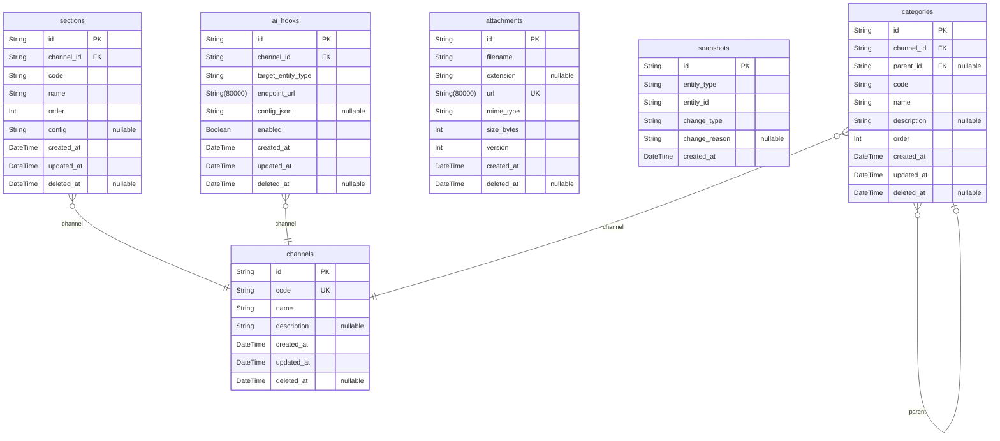

# Prisma Markdown

> Generated by [`prisma-markdown`](https://github.com/samchon/prisma-markdown)

- [Core](#core)
- [Users](#users)
- [SellersAndAdmins](#sellersandadmins)
- [Products](#products)
- [CatalogSearch](#catalogsearch)
- [EngagementBoards](#engagementboards)
- [CartOrder](#cartorder)
- [PromotionsBalances](#promotionsbalances)
- [NotificationLocalization](#notificationlocalization)
- [AnalyticsAI](#analyticsai)
- [default](#default)

## Core

### `channels`

Channel entity - This implements the multi-site/storefront segregation requirement from 'Core System Concepts' (Section 2.1, Overview and Objectives). 

Represents a logical business boundary such as a storefront, brand, or marketplace instance; provides the root container for all product, category, and configuration data. Fully normalized: all non-key attributes are atomic and associated only to the primary key (no redundancy). For example, 'MegaMall US' and 'MegaMall EU' are different channels with custom catalogs and settings.

Key relationships: sections, categories, and AI hooks reference channel. Special behaviors: Channel enables multi-tenancy, isolated configurations, and access separation.

Properties as follows:

- `id`: Primary Key. Unique identity for each channel.
- `code`
  > Channel code - Implements unique identification.
  >
  > Short, system-wide unique code. Used for referencing and API keys. 3NF: No partial dependencies, no redundancy. Example: 'us_store', 'eu_mega'.
- `name`
  > Display name - Implements requirement for human-readable labeling.
  >
  > End-user visible channel name. For example: 'MegaMall USA'. Ensures normalization: only present in the root channel; not in sub-entities.
- `description`
  > Optional description for the channel - Provides administrative metadata.
  >
  > Nullable; used for admin help, onboarding, and system notes. No impact on normalization.
- `created_at`
  > Creation timestamp - Implements auditability.
  >
  > Tracks when channel is created. For compliance/history. 3NF: tied only to channel identity.
- `updated_at`
  > Updated timestamp - Implements tracking of lifecycle changes.
  >
  > Updated on any administrative or config change. For example: updating branding, adding section. 3NF: fully dependent on PK.
- `deleted_at`
  > Soft delete timestamp - Implements soft-delete (Business/Compliance/Security requirement).
  >
  > Retains legal/audit history without destructive deletes. Nullable; set when a channel is logically deleted. Not physically removed. 3NF compliant.

### `sections`

Section entity - Implements dynamic store organization requirement from 'Core System Concepts' (Section 2.2) and Structure/Scale/Integration.

Atomic grouping of content/catalog units within a channel (e.g., 'Home Banner', 'Flash Sale Area'). Normalized: all configuration is section-local; no redundant data. Example: 'Homepage Featured', 'Clearance'.

Key relationships: belongs to channel. Special behaviors: modifying section structure is logged/auditable.

Properties as follows:

- `id`: Primary Key. Section identity.
- `channel_id`: Owning channel's [channels.id](#channels). Channel for this section.
- `code`
  > Section code - Implements unique identification within a channel.
  >
  > Atomic code, unique per channel. Example: 'frontpage', 'flash_deals'. 3NF: No redundancy.
- `name`
  > Display name - Implements channel-local visibility.
  >
  > End-user visible label. Example: 'Homepage Banners.' 3NF compliant.
- `order`
  > Display order - Implements flexible storefront layout.
  >
  > Controls appearance order/priority within channel. Atomic and PK-dependent.
- `config`
  > JSON-encoded configuration - Implements section customization requirement.
  >
  > Serialized (but atomic per row) configuration, modifiable only in section. 3NF: full dependency.
  > Example: '{"maxProducts":8}'.
- `created_at`: Audit: creation timestamp. Atomic, immutable. Tied to PK.
- `updated_at`: Audit: last updated timestamp. Fully dependent on PK.
- `deleted_at`: Soft delete timestamp. Nullable; preserved for compliance/audit use.

### `categories`

Category entity - Implements channel-scoped hierarchical taxonomy from 'Core System Concepts' (Section 2.3, Product Domain).

Atomic representation of category (e.g., 'Shoes', 'Men/Sneakers'). Belongs to a channel, can nest by parent_id supporting unlimited depth. Normalized: parent_id is nullable for root; all descriptive attributes reference only PK. Example: 'Apparel > Shoes > Running'.

Key relationships: allowed recursion (parent_id), channel reference. Special: all product/category assignments are in join tables elsewhere.

Properties as follows:

- `id`: Primary Key. Unique identity for category.
- `channel_id`: Owning channel's [channels.id](#channels). Channel for this category.
- `parent_id`: Parent category (self-reference) [categories.id](#categories). Null for root node.
- `code`: Category code - Required, unique (per channel/parent) identifier. Example: 'mens_sneakers', 'clearance'.
- `name`: Display name - End-user visible. Example: 'Men's Sneakers'. Fully dependent on PK.
- `description`: Optional description. For search/SEO/UX. Example: 'Category for all men's athletic shoes.'
- `order`: Display ordering - Controls sort within parent. PK-dependent.
- `created_at`: Audit: time of creation. For compliance/history.
- `updated_at`: Audit: last update timestamp.
- `deleted_at`: Soft delete timestamp. Marked for legal compliance/lifecycle management.

### `attachments`

Attachment entity - Implements the secure versioned attachment system from 'Structure, Scale & Integration' and Board/Product Domain requirements.

Represents any file (image, doc, video) usable system-wide: product images, banners, board files. All metadata atomic, no denormalized/cached data. Soft deletion supported, legal compliance (access logs attached in separate table). Example: product media stored as attachments, referenced by join tables.

Key relationships: assigned to product, board, review by join tables elsewhere. Special: CDN integration, access tracked not here but in associated log.

Properties as follows:

- `id`: Primary Key. Unique identity for each attachment file.
- `filename`: Original file name without extension. Example: 'photo1', 'banner'. Atomic and unique per upload.
- `extension`: File extension, e.g., 'jpg', 'pdf'. Null for extensionless files like 'README'.
- `url`: Secure CDN/object storage URL for file delivery. Only atomic pointers, not cached content. Example: 'https://cdn.site/file.jpg'.
- `mime_type`: MIME type (e.g., 'image/jpeg'). For content negotiation and validation.
- `size_bytes`: File size in bytes. Used for quota and validation. Atomic, PK-linked.
- `version`: Attachment version. Implements immutable versioning; increments on overwrite/update. Not denormalized. Example: version 2 = re-uploaded file.
- `created_at`: Upload timestamp. For audit and version tracking.
- `deleted_at`: Soft delete timestamp. Legal/compliance retention only. Null if active.

### `snapshots`

Snapshot entity - Implements the 'immutable, versioned data instance' pattern (Core System Concepts / Product Domain). 

Records the immutable state of a referenced entity (e.g., product, category) at a point in time. Each modification to products, categories, or board content generates a new snapshot, enabling history and rollback. This table is normalized: contains only atomic references and change context (entity, type, reason), no pre-calculated summaries. Example: Product edit triggers a new snapshot record referencing 'product_id', 'old_value', 'change_reason'.

Key relationships: references arbitrary entity via 'entity_type' and 'entity_id'; version management handled by application with foreign references. Special: all audit log/rollback uses this record.

Properties as follows:

- `id`: Primary Key. Unique snapshot instance.
- `entity_type`: Type of entity snapshotted. Implements polymorphism without redundancy. Example: 'product', 'category', 'board_post'.
- `entity_id`: Target entity's ID (referencing another model's PK in application logic, not enforced FK for flexibility).
- `change_type`: Type of change, e.g., 'create', 'update', 'delete'. For auditability; atomic only.
- `change_reason`: Reason for snapshot; admin-entered or system-generated. Example: 'manual edit', 'bulk import'. Optional, nullable. Atomic for 3NF.
- `created_at`: Timestamp of snapshot. For audit/history rollbacks. Atomic to snapshot event.

### `ai_hooks`

AI Hook entity - Implements the 'AI Layer' extensibility requirement (Core System Concepts section 2.5, AI/Analytics/Future-readiness).

Represents registered AI microservices/automation endpoints that process or enrich entities like products, orders, or users. Hook registration per channel/target, records endpoint and config. No denormalized/cached results here. Example: fraud detection hook for 'order', recommendation hook for 'product' etc. Controlled via join tables/entities for each triggered event/log elsewhere.

Key relationships: references channel; target entity typed by application logic. Special: actual runtime calls/results not stored here, only registration/config.

Properties as follows:

- `id`: Primary Key. Unique AI hook instance.
- `channel_id`: Owning channel for this AI hook. Implements channel-scoped extensibility.
- `target_entity_type`: Type of target (e.g., 'order', 'product', 'user'). No FK; for extensible polymorphism.
- `endpoint_url`: AI service endpoint URL. Example: 'https://ai.mall.com/fraudcheck'. For runtime dispatch only.
- `config_json`: Serialized config/params. Atomic per hook; not denormalized. Example: '{"threshold":0.8}'. Nullable.
- `enabled`: Whether the AI hook is currently active (toggle for feature rollouts/testing).
- `created_at`: Add timestamp. For audit/history.
- `updated_at`: Last updated timestamp.
- `deleted_at`: Soft delete timestamp. Auditable deactivation.

## Users

### `users`

User account records - This implements requirements from 'User Architecture' in the specification, providing the persistent business anchor for user authentication, role assignment, RBAC, and system session management.

Business: Represents a single system-level authenticated identity, mapped to a unique login (email/username/SSO/external). Also the foundation for customer, seller, and admin roles, supporting multi-channel and external integrations.

Normalization: Strict 3NF—holds only authentication primary key information; detailed attributes live in user_profiles. Example: On login, the user authenticates with 'users', then profile/address are loaded via relation.

Key relationships: Links to user_profiles (1:1), user_sessions (1:N), user_addresses (1:N), rbac_assignments (1:N), and audit_logs (1:N). Each channel/platform login is managed externally via user_external_auths.
Special behaviors: Soft delete (deleted_at), unique email/username, fully normalized. Changing to seller/admin triggers RBAC updates.

Properties as follows:

- `id`: Primary Key. Unique system identifier for the user.
- `email`: Email address for user login - Implements unique credential requirement. Critical for account access, RBAC linking, and notification routing. Ensures normalization by guaranteeing one email per user, loading related identities separately. Example: 'user@email.com'. Unique, required.
- `username`: Unique username/login handle - Enables both email and username authentication as required by specification. Maintains normalization by storing only identifier, not profile data. Example: 'john_doe_77'. Unique, required.
- `password_hash`: Password hash - Implements secure password storage. Never stores cleartext. Example: bcrypt hash string. Ensures authentication data is kept separate from identity/profile info (normalization). Required unless using SSO.
- `created_at`: User creation timestamp - For audit and compliance. Normalized atomic timestamp field. Example: '2025-06-09T15:28:59.983Z'. Required.
- `updated_at`: Last account update timestamp - Maintains last known change. Example: '2025-06-09T15:28:59.983Z'. Required.
- `deleted_at`: Soft delete marker - Implements the 'immutable history, no destructive delete' requirement. On user request/ban, marks user deleted for audit, normalization by separating status field. Example: '2025-06-09T15:28:59.983Z' or null if active.

### `user_profiles`

Extended personal profile data for users - Implements the requirement for field-level encryption, regional residency, and GDPR-compliant profile management.

Business: Contains enriched (and potentially encrypted) identity information, such as legal name, locale, and marketing preferences, mapped 1:1 to a users record. Segregates PII and preference control for compliance, making all changes audit-logged.

Normalization: 3NF: Separated from authentication (users), atomic fields only. Example: When a user updates their display name, user_profiles is updated, not users.

Key relationships: References users (1:1), user_addresses (1:N for history), user_consents (1:N, by audit), and audit_log (profile changes).
Special: PII required to be field-encrypted. Consents linked for compliance. Soft delete supported individually.

Properties as follows:

- `id`: Primary Key. Unique identifier for each profile record.
- `user_id`: Owner's users.id - The user to whom this profile belongs. Required for mapping to the main authentication entity.
- `display_name`: Name shown in UIs. Implements display customization. Ensures normalization by storing only display value (no denormalized extra PII here). Example: 'Jane Kim'. Required.
- `legal_name`: Legal name (field-encrypted) - Implements compliance for regional regulations (AML, GDPR). Normalized, atomic, not repeated elsewhere. Example: 'Jane Eunyoung Kim'.
- `birth_date`: Birth date (field-encrypted) - Enables verification flows and segmentation. Normalized (YYYY-MM-DD). Use datetime for atomic compliance.
- `gender`: Gender string/enum - Implements marketing/analytics/audit requirement. Normalized, supports enums or free text for inclusivity. Example: 'F', 'M', 'Non-binary'.
- `locale`: Preferred user locale (i18n) - For language settings/personalization. Example: 'ko-KR'. Normalized for filtering/user experience.
- `timezone`: IANA Timezone string (personalization/compliance) - Example: 'Asia/Seoul'. Normalized, atomic, not repeated. Enables compliance for region-specific data retention.
- `marketing_opt_in`: Marketing consent flag - Implements explicit opt-in tracking. Normalized, atomic, example: true/false.
- `created_at`: Profile created timestamp - For audit and rollback. Normalized, atomic.
- `updated_at`: Last profile update timestamp. Required for GDPR/audit. Normalized, atomic.
- `deleted_at`: Soft delete marker for profile (audit/legal). Normalized, atomic. Null if active.

### `user_addresses`

User address book - Implements requirements for multi-address support, geo-hierarchy, and per-channel regional compliance.

Business: Stores shipping, billing, or pickup addresses linked to a user. Each user may have multiple addresses supporting history and types.

Normalization: 3NF, atomic address parts (street, city, etc.), country/regional codes for localization. Address book changes logged by audit.

Key relationships: Linked to user_profiles (preferential, can also link to users), used in order flows, potentially favorited.
Special: Null soft-delete field for history compliance. No redundant computed fields.

Properties as follows:

- `id`: Primary Key. Unique identifier for the address.
- `user_id`: Owner users.id - The user to whom this address belongs. Required.
- `type`: Address type (shipping/billing/pickup/custom) - Implements multi-type address requirement. Ensures normalization by atomic type mapping, not repeated info. Example: 'shipping'. Required.
- `recipient_name`: Name of the recipient at this address - Normalized for compliance. Example: 'Jisoo Park'.
- `phone`: Recipient's phone (field-encrypted) - Implements notification requirement. Kept atomic.
- `country`: Country code (ISO 3166-1 alpha-2) - For localization. Example: 'KR', 'US'. Required.
- `state`: State/province/region string - For localization/routing. Required in some countries.
- `city`: City/town for delivery. Example: 'Seoul'. Normalized, atomic. Required.
- `street`: Street address (line1+line2 if needed) - Fully normalized atomic string.
- `postal_code`: Postal/ZIP code - For delivery compliance. Atomic and normalized. Example: '03187'.
- `primary`: Primary address flag - Enables business logic for default selection. Only one per type can be true. Ensures normalization by not duplicating default logic. Example: true/false.
- `created_at`: Address record creation time - For audit/logging. Normalized.
- `updated_at`: Last update time for address - For ordering/audit. Normalized.
- `deleted_at`: Soft delete marker for address - Implements audit and immutable history per compliance sections. Null if active.

### `user_sessions`

Session records for authenticating users - Implements persistent login, cross-device/session revocation, and audit trailing from 'User Architecture'.

Business: Each session represents a logged-in device/session for a user. Used for audit, revocation, anomaly detection. Example: User logs in from web and mobile (has two sessions).

Normalization: 3NF, contains only session data, not user profile info.

Key relationships: Linked to users, referenced by audit logs. Special: IP/device fingerprint for security.
Special behaviors: Session expiry logic, soft delete.

Properties as follows:

- `id`: Primary Key. Unique identifier for the session.
- `user_id`: Session owner - users.id. Required.
- `token_hash`: Hashed session token - Implements security, avoids cleartext storage. Example: JWT hash.
- `ip_address`: Session IP address (normalized, IPv4/6) - For audit/compliance/anomaly checks. Example: '120.44.1.10'
- `user_agent`: Session user agent string for device/client logging - Maintains atomicity and normalization. Example: Chrome/99.0.
- `expires_at`: Session expiration timestamp. Implements expiry/auto-logout requirement. Null for non-expiring sessions.
- `created_at`: Session creation timestamp - Required for compliance/audit. Atomic.
- `revoked_at`: Revocation timestamp (null if active) - For force logout flows, audit. Normalized.

### `user_consents`

Consent audit log for user profile/privacy preferences - Implements compliance (GDPR, CCPA) and explicit tracking of user sharing/marketing/data export preferences.

Business: Each consent row maps to a user (by user_id) and records a timestamp, scope, and outcome (opt-in/out) with immutable audit trail. Consent changes tracked by user, updated by admin/system.

Normalization: 3NF, only atomic, non-derived consent data recorded. Normalized away from user_records / user_profile for historical tracking.

Key relationships: Links to user_profiles, users (via user_id), audit log for audit trail. Special: Exported in regulatory requests.

Properties as follows:

- `id`: Primary Key. Unique row per consent action.
- `user_id`: Consent owner - users.id. Required for consent mapping and regulatory traceability.
- `scope`: Consent scope string - E.g., 'marketing', 'data_export'. Implements explicit consent scopes under GDPR/etc. Ensures normalization by recording just the scope here. Example: 'marketing_email'.
- `opt_in`: Consent flag - true (consented), false (withdrawn). Required for audit. Ensures normalization: one flag per row, use history for changes.
- `recorded_at`: Consent record timestamp - Required for legal audit/audit log mapping. Normalized.
- `revoked_at`: Timestamp if consent withdrawn/revoked (null if active). Ensures auditability and normalization.

### `user_identity_verifications`

History of external/regional identity verification attempts per user - Implements KYC/KYB/AML workflow logging as required by regulatory guidelines.

Business: Stores each verification event (success/failure/status) for each user to permit compliance audit trails and dynamic escalation. Includes provider response, timestamps, and evidence of outcome.

Normalization: 3NF, each event atomic, no denormalization. Example: On initiation of KYC, record created; updated with response.

Key relationships: Linked to users. Cross-referenced for audit by admins.
Special: Notifies risk/fraud modules. Used in onboarding/escalation.

Properties as follows:

- `id`: Primary Key. Unique identifier for verification event.
- `user_id`: Verification target user (users.id). Required for traceability/audit mapping.
- `provider`: External provider/service name - Implements integration with pluggable external KYC/KYB. Normalized atomic string (e.g., 'Stripe ID', 'PASS Auth').
- `request_payload`: Verification request summary (encrypted/hashed for privacy). Normalized for audit and compliance reporting.
- `response_payload`: Provider response/record (encrypted/anonymized). Normalized data for compliance audit. Never denormalized here.
- `status`: Verification outcome code (success/failure/pending/etc) - For audit log. Normalized atomic string. Example: 'success'.
- `verified_at`: When verification passed (null if not yet passed/failed). Needed for escalation/tracking/regulatory export.
- `created_at`: Attempt creation timestamp - For immutable history trail. Normalized.
- `updated_at`: Last update to verification attempt. Required for compliance history.

### `user_external_auths`

User external authentication mapping records - Implements SSO/OAuth/vnd platform login compliance. Provides M:N mapping of user records to external providers, as per system modular login requirements.

Business: Each row assigns a system user to an external auth provider account (Google, Apple, Kakao, etc.). Enables users to have multiple linked providers. Workflows: Association/disassociation is logged and auditable.

Normalization: 3NF, each mapping atomic, one provider per row, never stores profile info (only identifier reference). Used by sign-in logic and internal account merge/federation flows.

Key relationships: Linked to users on system side, provider/user_id on platform side. Used for cross-system SSO and onboarding.
Special: Never stores provider credentials/secrets here—only identifiers.

Properties as follows:

- `id`: Primary Key. Unique mapping per user/provider combination.
- `user_id`: System user account - users.id (for access control and login mapping). Required.
- `provider`: External provider (e.g., 'google', 'apple', 'naver') - Required. Normalized string. Used for sign-in logic.
- `external_user_id`: Provider's user identifier (atomic, not a full profile) - Required. Used for federated login. Normalized—never computed from other info.
- `linked_at`: Date of this provider link - For audit/compliance and sign-in history. Normalized.

### `rbac_roles`

Role definitions for RBAC - Implements the fundmental permission system for users/sellers/admins. Required by granularity and escalation logic in the requirements.

Business: Each row represents a RBAC role (e.g., 'customer', 'seller', 'admin'). Used by the RBAC engine to grant users context-specific rights. Roles are applied per assignment for context/channel/section flexibility.

Normalization: 3NF, role attributes only, associations live in rbac_assignments. Example: Role 'admin' may have multiple permissions.

Key relationships: Linked to rbac_assignments (many-to-many via assignment), rbac_permissions (many-to-many via assignment/permission matrix).
Special: Built-in and custom roles differentiated by code/flags.

Properties as follows:

- `id`: Primary Key. Unique identifier per role record.
- `code`: Role code (unique per type) - E.g., 'customer', 'seller', 'super_admin'. Used for reference/assignments. Enforces normalization: atomic string-per-row, not denormalized list.
- `description`: Role description string (admin UI/help) - For admins to understand purpose. Normalized, never repeated.
- `is_builtin`: Built-in/system-programmable role flag - Indicates system-generated roles not editable by admin. Enforces normalization by separating custom roles. Example: true/false.
- `created_at`: Role definition time - For audit/versioning. Normalized.
- `updated_at`: Last role update (admin edits/customization). For audit/history. Normalized.

### `rbac_permissions`

RBAC permission definitions - Implements permission matrix (CRUD/resource-based) for assignment to roles. Requirement: permissions are granular and versionable.

Business: Each row is a unique permission (e.g., 'order_read', 'product_edit'). Matrixed to roles (M:N) via assignment tables.

Normalization: 3NF, atomic permission code per row. Never stores mapping (association only in assignments).

Key relationships: Linked via rbac_assignments (M:N). Used to derive rights at runtime.
Special: Built-in flag distinguishes system vs admin-defined permissions.

Properties as follows:

- `id`: Primary Key. Unique permission row.
- `code`: Permission code (unique system-wide) - Implements ability to grant matrixed permissions. E.g. 'order_create', 'user_data_erase'. Enforces normalization: one per row.
- `description`: Permission textual description - For admin UI. Normalized atomic string. Never used for logic, only for help.
- `is_builtin`: System permission flag - Indicates core permissions, differentiated from admin-custom. Example: true/false. Maintains normalization/compliance with infrastructure Evolution.
- `created_at`: Permission creation timestamp. For system audit/audit of custom permission logic.
- `updated_at`: Last permission update - For admin extension/retiring of permission. Normalized for audit.

### `rbac_assignments`

RBAC assignment matrix - Implements all requirements for granular, contextual, and temporal permissions/scoping. Supports multi-channel and workload isolation.

Business: Each row maps a user (or seller/admin) to a role and permission with optional scope (channel, section, temporal validity). Enables complex scenarios like emergency escalation, temporal roles, compliance auditing.

Normalization: 3NF, one tuple per assignment, never denormalized role/permission lists. Assignment changes fully audit-logged.

Key relationships: Links users, roles, permissions; referenced in audit_log for compliance. Used by escalation logic and UI bulk update flows.
Special: Assignment expiry/auto-revocation stores timing atomicity. No computed/aggregated info stored.

Properties as follows:

- `id`: Primary Key. Unique row per assignment role/permission/user/triple.
- `user_id`: Assigned user (users.id) - Required. Links to assigned user.
- `role_id`: Linked role (rbac_roles.id) - Required. Links to role being assigned.
- `permission_id`: Linked permission (rbac_permissions.id) - Required. Links to permission for the role/context.
- `scope_channel_id`: Optional channel scoping (if role is specific to a channel). Maintains strict normalization by separating channel context per assignment. Example: channel-specific 'seller' role. Nullable.
- `scope_section_id`: Optional section scoping (if role is only valid in a section within channel). Maintains normalization by isolating section context. Nullable.
- `expires_at`: Assignment expiration (null = permanent). Implements compliance for auto-revocation scenarios. Required for temporal roles.
- `created_at`: Assignment record timestamp - Required (for audit, traceability, rollback). Atomic/normalized.

### `audit_logs`

Comprehensive audit log for user-related actions and RBAC events - Implements 'full auditability', GDPR/CCPA audit, and regional compliance requirements, as well as rollback capability and suspicious event tracking.

Business: Each row is a logged event (login, RBAC change, consent, escalation, KYC, etc.), timestamped, reasoned, and actor-attributed. Provides immutable record for all user/account/permission/consent operations. Supports filtering/export for compliance requests.

Normalization: 3NF, all information atomic (who, what, when), no derived/denormalized audit summaries here. Bulk exports for compliance run off this table.

Key relationships: Links to users, rbac_assignments, user_profile changes. Used for admin review and security analytics.
Special: field-level masking on PII as required by compliance.

Properties as follows:

- `id`: Primary Key. Unique identifier for each audit log entry.
- `user_id`: Target user (users.id) for the event being logged. Required for traceability, audit, and compliance exports.
- `event_type`: Event log code (e.g., 'login', 'profile_update', 'rbac_assign', 'consent_withdraw'). Implements the requirement for strictly atomic, codified audit event typing. Required.
- `event_reason`: Short, human-readable reason for event - Used for admin/audit panels. Normalized string; details for compliance/legal tracking.
- `event_context`: Event metadata/context detail (JSON string, field-encrypted if needed) - Used for trace/audit scenarios. Maintains normalization by storing only atomic context, never denormalized audit summaries. Optional.
- `actor_id`: ID of actor responsible (users.id or admin id if not user) - For compliance, rollbacks, and root cause analysis. Nullable for system events. Normalized atomic link.
- `created_at`: Audit event timestamp - Required for legal, rollback, and compliance/Audit reporting. Atomic, normalized.

## SellersAndAdmins

### `sellers`

Seller account and profile information - This implements onboarding and core seller management as per 03_user_architecture.md (User Architecture) and 04_product_domain.md (Product Domain). 

Provides the central entity for sellers, supporting multi-stage onboarding, role and status tracking, channel assignments, and linkage to user identity. Maintains 3NF by holding only seller-specific, atomic fields, delegating roles, verifications, and assignments to separate tables. For example, when a new merchant registers or is invited, a record is created here, while elevated permissions or verifications are in related tables. 

Key relationships: [sellers.id](#sellers) is referenced by seller_verification, seller_permission, and seller_channel_assignment. Relates to user identity via a foreign key. 
Special behaviors: Soft-deletion via deleted_at, seller suspension through status tracking, channel/role links only via junction tables.

Properties as follows:

- `id`: Primary Key.
- `user_id`
  > Owning user's [users.id](#users)
  >
  > Links seller legal/account to unified user system.
- `nickname`
  > Seller display or trade name - Implements display/branding aspect.
  >
  > Used publicly across the system; atomic, not calculated.
- `status`
  > Status state (pending, active, suspended) - Implements compliance/workflow states.
  >
  > Atomic, not derived; controls onboarding and operational flows. E.g., transitions managed through admin review.
- `created_at`
  > Registration timestamp - Implements onboarding and compliance timeline.
  >
  > Set at insert, never modified.
- `updated_at`
  > Last profile update timestamp - Tracks profile changes for audit.
  >
  > Changed on update, never calculated.
- `deleted_at`: Soft-deletion timestamp - Complies with non-destructive delete/audit trail. Null unless deleted; regular table, keeps 3NF.

### `seller_verifications`

Seller verification workflow entries - Implements the compliance and onboarding verification as per 03_user_architecture.md (Seller Management Workflows).

Each row logs a verification step (e.g., KYC, business doc, bank, tax) tied to a seller. All data fully normalized; no status/history fields here intermixed with other entities. Example: when a KYC check is started for a seller, a row is created here referencing [sellers.id](#sellers), with outcome and timestamps.

Key relationships: Linked to sellers via seller_id. 
Special behavior: Each verification is its own entry—multiple rows per seller allowed. Atomic, fulfills 3NF.

Properties as follows:

- `id`: Primary Key.
- `seller_id`
  > Linked seller's [sellers.id](#sellers).
  >
  > Who this verification entry is for.
- `type`
  > Verification type - e.g., KYC, business_license, bank, tax.
  > Complies with 3NF; not calculated.
- `outcome`
  > Outcome result - Implements compliance result state (pending, approved, rejected).
  > Atomic result for audit/history.
- `reference_id`
  > External verification ID/reference from provider APIs.
  > Atomic, for audit only; not calculated.
- `requested_at`
  > Verification requested timestamp.
  > Audit/trace timeline; not derived.
- `completed_at`
  > Completion timestamp (null if still open/pending).
  > Maintains time series without denormalization.

### `seller_permissions`

Seller additional permission assignments - Implements dynamic, granular access and elevated powers as specified in user architecture/RBAC flows (03_user_architecture.md).

Each row grants an optional, context-sensitive permission (e.g., new category, analytics access) to a seller, referencing permission catalog elsewhere. Fulfills 3NF by representing only assignments, not holding permission logic or profile data. Example: to grant a seller new analytics rights, an entry here links seller, permission, and timestamp.

Key relationships: References sellers and admin (who granted). 
Special: Allows temporal/conditional assignment, each row is audit-traceable, atomic.

Properties as follows:

- `id`: Primary Key.
- `seller_id`: Grantee seller's [sellers.id](#sellers).
- `granted_by_admin_id`: Admin who granted permission's [admins.id](#admins).
- `permission_code`
  > Permission code/key - Corresponds to system's permission catalog.
  > Atomic assignment only.
- `granted_at`: Timestamp when permission assigned, for compliance/audit trail.
- `expires_at`
  > Expiration timestamp for temporary permissions.
  > Null if permanent.

### `seller_channel_assignments`

Seller-to-channel assignment (junction table) - Implements multi-channel enablement as in Core System Concepts and onboarding workflow.

Each record links a seller to a channel they're allowed to operate in. Pure M:N assignment table, strictly 3NF—atomic links only, no denormalized details. Example: granting a seller access to a new storefront/channel is a new row here.

Key relationships: References sellers and channels. 
Special: Assignment-specific permissions handled via permission or role granting, not here.

Properties as follows:

- `id`: Primary Key.
- `seller_id`
  > Seller's [sellers.id](#sellers).
  >
  > Who is granted access.
- `channel_id`
  > Channel's [channels.id](#channels)
  >
  > Channel/storefront assigned.
- `assigned_at`
  > Timestamp of assignment - Implements workflow step and audit.
  > Atomic, set on insert; not derived.
- `revoked_at`
  > Revocation/removal timestamp.
  > Null unless channel access is revoked. Maintains normalized timeline.

### `admins`

Admin account/identity - Implements system/admin staff definitions as described in 03_user_architecture.md (Admin Controls).

Central entity for staff/admin management, separate from user for RBAC and compliance flows. 3NF maintained by having only ID, status, and reference to user (profile, PII stored in user). Example: onboarding a new admin creates this record; updating roles is managed via assignments table.

Key relationships: Linked to user, roles/assignments/audit logs reference this ID. 
Special: Soft-deletion via deleted_at, admin status (active/suspended/etc.) only in this table.

Properties as follows:

- `id`: Primary Key.
- `user_id`
  > Linked user's [users.id](#users).
  > Centralized identity; PII etc. delegated to user subsystem.
- `status`
  > Admin status (active, suspended, pending) - Maintains atomic admin workflow state.
  > Never calculated; enables escalation/checks.
- `created_at`: Admin creation timestamp - Audit/track admin onboarding.
- `updated_at`: Last admin update timestamp - For audit; not denormalized.
- `deleted_at`: Soft-deletion. Null unless deleted; implements non-destructive removal for compliance.

### `admin_roles`

Admin roles definitions - Implements RBAC structure for admins as specified in 03_user_architecture.md (RBAC & Access Escalation).

Defines system roles (superadmin, manager, reviewer, etc.), separate from assignments/membership. Maintains normalization by never storing user/admin data; this is a role catalog only. Example: a superadmin role is defined here, but not assigned to any admin until linked by admin_assignments. 

Special: No denormalization, 3NF enforced. Permissions linked in separate table, not here.

Properties as follows:

- `id`: Primary Key.
- `code`: System-wide role code - e.g. 'superadmin', 'manager'. Unique by code.
- `name`: Human-visible role name, for admin UI.
- `description`
  > Multi-line description for explainability/export.
  > Never includes usage examples; atomic, textual info only.

### `admin_permissions`

Admin permissions catalog - Implements granularity required by permission matrix.

Defines each permission (by unique code)—separate catalog; individual grant/assignment in other tables. Maintains normalization; no user/admin linkage here. Example: permission to access audit logs is defined here, later assigned to roles/admins via assignments table.

Special: 3NF enforced, atomic codes only.

Properties as follows:

- `id`: Primary Key.
- `code`: System permission code/key, e.g., 'manage_users', 'view_logs'.
- `name`: Human-readable permission label.
- `description`: Long-form permission info.

### `admin_assignments`

Admin assignment/junction: which admins have which roles/permissions - Implements dynamic RBAC assignment workflow (see 03_user_architecture.md RBAC & Escalation).

Each row grants a role/permission to an admin. Fully normalized: only references/junction, no denormalized details. Example: assigning 'superadmin' to an admin is a row here; updating/removing is deleting/inserting rows (no pre-calculated, all atomic). 

Key relationships: Links admins, roles, permissions. 
Special: No status, only atomic links and audit timestamps.

Properties as follows:

- `id`: Primary Key.
- `admin_id`: Linked admin's [admins.id](#admins).
- `role_id`: Linked role's [admin_roles.id](#admin_roles).
- `permission_id`: Linked permission's [admin_permissions.id](#admin_permissions).
- `assigned_at`
  > Assignment timestamp - for RBAC and audit.
  > Never calculated, atomic only.
- `expires_at`: Assignment expiration (null if permanent). Maintains full normalization.

### `admin_action_logs`

Admin action/audit logs - Implements required compliance and supervision per section 03_user_architecture.md (Admin Controls & Auditing).

Records all actions performed by admins for full traceability. Each row is a single atomic event. Enforces normalization—no denormalized summary/calculation; details (entity, type, timestamp, outcome) only. Example: if an admin escalates a role or processes a permission change, writes a row here.

Key relationships: Linked to admin, references which admin performed the action. 
Special: Details (outcome, entity, etc.) always atomic.

Properties as follows:

- `id`: Primary Key.
- `admin_id`: Performing admin's [admins.id](#admins).
- `action_type`
  > Type of action (e.g., 'role_escalation', 'account_review').
  > Atomic, string only; not calculated.
- `entity_type`: Entity affected (e.g., 'seller', 'order', 'user').
- `entity_id`: UUID of the affected entity, if any.
- `outcome`: Outcome/result (e.g., 'success', 'failure', 'pending review').
- `details`
  > Optional text detail for extra context (never denormalized summary).
  > Always atomic.
- `created_at`
  > Action timestamp (occurrence time).
  > Atomic and always set at insert, not calculated.

## Products

### `products`

[Product entity] - This implements F1 (Product CRUD with variant/bundle support), F2 (immutable product snapshots), and F3 (category, tag, attribute, channel search customization) from the requirements document. 

Represents the core product in the shopping mall, serving as the parent for variants, bundles, media, SEO metadata, and snapshot versioning. Maintains 3NF by only holding atomic product identification and main relationships; details and descriptions are managed in related models/snapshots. Example: When a new smartphone is listed, the 'products' row is created; edits generate new snapshots. 

Key relationships: variants, bundles, options, attributes, snapshots, media attachments, SEO metadata, category/tag assignment. 
Special behaviors: All changes are via snapshots, products are never deleted but soft-deleted to meet audit/compliance.

Properties as follows:

- `id`: Primary Key.
- `channel_id`: Belonged channel's [channels.id](#channels). Implements multi-channel capability (Core System Concepts 2.1). Products are scoped to specific channels for tailored management and listings.
- `code`
  > [Unique business code] - Implements product unique identifier/coding for F1 (CRUD/SEO/3rd party integration).
  >
  > Used for integration, product lookup, and duplication prevention. Maintains normalization by remaining atomic. For example: SKU123456.
  > Must be unique per channel.
- `created_at`
  > [Creation timestamp] - Implements audit/compliance traceability.
  >
  > When the product was created. Allows product lifecycle and audit tracking, strictly atomic. For example: When a seller registers a product.
  > Never null.
- `updated_at`
  > [Update timestamp] - Implements audit, triggers for snapshot/AI.
  >
  > When the product was last modified (triggers new snapshot, external sync, or AI event), not a computed field but historical. Always atomic. For example: When a product detail is edited, this is updated.
  > Never null.
- `deleted_at`
  > [Soft delete marker] - Implements regulatory requirement, audit, and reversibility.
  >
  > If the product is deleted (soft), the timestamp is recorded. Maintains normalization by not removing the record (audit evidence).
  > For example: Product de-listed due to compliance issue.
  > Optional.

### `product_variants`

[Product variant entity] - Implements F1 (variants/options), F3 (channel customization) from the requirements. 

Represents a purchasable variant for a product, e.g., size/color/edition. Only holds atomic variant attributes and relationship to products; variant-specific option/attribute references stored in related tables. Maintains 3NF by deferring details to option/attribute models. For example: 'Red, 128GB' variant for a smartphone.

Key relationships: belongs to product, has attributes/options, appears in bundles.
Special behaviors: unique code per product-variant, soft delete only.

Properties as follows:

- `id`: Primary Key.
- `product_id`: Belonged product's [products.id](#products). Links to master product (bundle of variants).
- `code`
  > [Variant code] - Implements F1 (integration, inventory, compliance) and F3 (variant lookup/identification).
  > Atomic code per variant. Example: SKU-PROD-A-BLUE-M. Unique per product.
  > Never null.
- `created_at`
  > [Creation timestamp] - Audit and compliance.
  > When the variant was created. Used for lifecycle and analytics.
  > Never null.
- `updated_at`
  > [Update timestamp] - Triggers for inventory/AI analytics.
  > Updated when changes are made to the variant.
  > Never null.
- `deleted_at`
  > [Soft delete marker] - Regulatory/audit reversibility.
  > Variant is marked as deleted but retained for evidence.
  > Optional.

### `product_bundles`

[Product bundle entity] - Implements F1 (bundles/combo products, unlimited composites) from the requirements.
Represents a bundle which groups specific product variants together as a sellable or promotional unit. Maintains normalization via strict junction modeling. For example: 'Holiday Gift Set' containing soap and towel variant-IDs.

Key relationships: links to bundle owner product, and pointed variants via junction.
Special behaviors: Bundles can be virtual; deletion is soft.

Properties as follows:

- `id`: Primary Key.
- `product_id`: Owner product's [products.id](#products). This bundle is a merchandising aspect of the product.
- `variant_id`: Bundled variant's [product_variants.id](#product_variants). The variant included in this bundle.
- `quantity`
  > [Variant quantity] - Implements F1 (quantity control in bundle). Number of units of the variant in this bundle. Fully atomic, never null.
  > Example: A bundle contains 2 red towels, 1 soap.
- `created_at`: [Creation timestamp] - Enables historical reporting, compliance.
- `updated_at`: [Update timestamp] - Audit and reporting.
- `deleted_at`: [Soft delete marker] - Regulatory evidence, reversibility.

### `product_options`

[Product option] - Implements F1 (variants/options), F3 (channel customization) and F6 (AI-enabled search/merchandising).
Defines an option applicable to a product (e.g., color, size). 3NF is maintained by not storing resolved choice/values here. Example: 'Color', 'Size' for T-shirts.

Key relationships: belongs to product, referenced by variants and attribute models.
Special behaviors: Option names are localizable, and have GIN for i18n search.

Properties as follows:

- `id`: Primary Key.
- `product_id`: Belonged product's [products.id](#products). The product this option is relevant to.
- `name`
  > [Option name] - Implements F1 (option display/selection, i18n).
  > E.g., 'Color', 'Size'. Used for display and AI.
  > Never null.
- `required`: [Option required flag] - Is this option mandatory for the variant. Ensures variant completeness. Example: Shoes always require 'Size'.
- `sort_order`
  > [Order of appearance] - Controls display order in UI, purely atomic.
  > Example: 'Color' is shown before 'Size'.

### `product_attributes`

[Product attribute] - Implements F1 (flex/variant-attribute extensibility) and F3.
Atomic values reflecting option choices for each variant. E.g., for 'Color', Value = 'Red'. Maintains 3NF by only storing resolved choices, not calculated combos.

Key relationships: belongs to variant, references option for meaning.
Special behaviors: Option-value atomic, i18n ready.

Properties as follows:

- `id`: Primary Key.
- `variant_id`: Variant's [product_variants.id](#product_variants).
- `option_id`
  > Option's [product_options.id](#product_options).
  > Indicates which product option this attribute realizes.
- `value`
  > [Attribute value] - Implements F1/F3 (variant attribute; atomic choice, i18n ready).
  > E.g., 'Red', 'Large'. Never null.
  > Atomic/independent by design.

### `product_snapshots`

[Product snapshot entity] - Implements F2 (immutable product versioning, compliance, audit) from requirements.
Stores immutable product state on every change to the product (edit, publish, etc.). Only exact product data and versioning info, no computed fields. Maintains normalization for snapshot storage. Example: User edits title/description; a new snapshot row is recorded.

Key relationships: belongs to product, references updating actor.
Special behaviors: Snapshots are append-only, never edited/deleted, strict audit record.

Properties as follows:

- `id`: Primary Key.
- `product_id`
  > Related product's [products.id](#products).
  > Indicates which product is snapshotted and versioned.
- `actor_id`
  > User [users.id](#users) who performed the update. Ties change to responsible actor (admin/seller) for compliance.
  > May be null if system-automated.
- `title`
  > [Title at time of snapshot] - Implements F2/F4 (audit, compliance, versioned display, i18n with external support).
  > Strictly point-in-time, atomic.
  > E.g., 'Summer Collection Dress' (May 1, 2025).
- `description`
  > [Description at time of snapshot] - Implements F2/F4.
  > Atomic, immutable per snapshot. I18n via external reference.
  > E.g., 'Latest design, lightweight.' Never null if published.
- `published`
  > [Published status at snapshot] - Was this version the published one?
  > Implements workflow/restore features. Atomic, never computed.
- `created_at`: [Snapshot creation timestamp] - Strict auditability/traceability.

### `product_media`

[Product media/attachment entity] - Implements F5 (media/attachment support in product and boards).
Defines atomic product media files (images, video, docs) that may be shown for a product.
Maintains full normalization; links each record to an attachment, never stores blobs itself.

Key relationships: belongs to product, references external attachment (with versioning). Optionally linked to snapshot for historical display.
Special behaviors: Version and attachment tracked, no pre-calculated fields.

Properties as follows:

- `id`: Primary Key.
- `product_id`: Parent product's [products.id](#products).
- `attachment_id`: Linked attachment file's [attachments.id](#attachments). Always references external attachment table for audit/versioning/CDN.
- `snapshot_id`: Optional reference to [product_snapshots.id](#product_snapshots) indicating which version's media it belongs to (enables reconstruction of product state in time).
- `sort_order`
  > [Display order] - Implements F5 (ordering in UX, image carousel). Defines position in product's gallery. Strictly atomic.
  > E.g., Primary image has sort_order=1. Never null.
- `type`: [Media type] - Category of media (image, video, doc), implements F5 & compliance rules.
- `alt_text`
  > [Alt text] - Used for accessibility compliance, i18n ready. Purely atomic. E.g., 'Front view'. Optional for accessibility (WCAG).
  > Optional.

### `product_seo_metas`

[Product SEO meta entity] - Implements F1 & F5 (SEO/marketing rich meta) from requirements.
Atomic SEO metadata, scoped per product and channel. Never pre-calc, always 1NF/3NF.
Key relationships: belongs to product, scoped to channel.
Special behaviors: SEO metadata can be indexed separately by GIN for advanced search, i18n is via external/localization strings.

Properties as follows:

- `id`: Primary Key.
- `product_id`: Related product's [products.id](#products).
- `channel_id`: Channel context (for multi-channel SEO customization) [channels.id](#channels).
- `meta_title`
  > [SEO title] - Used in head/meta for SEO. Fully atomic.
  > E.g., 'Buy Summer Dress Online'. Never null.
- `meta_description`
  > [SEO description] - Appears in Google Snippets. Atomic.
  > E.g., 'Shop latest design, fast delivery'. Optional but never calculated.
- `meta_keywords`
  > [SEO keywords] - Comma-separated tags or keyword string (searchable).
  > E.g., 'dress, summer, design'. Optional, atomic.

## CatalogSearch

### `tags`

Tag entity - Implements Product Domain's requirement for flexible, channel-customizable tags supporting advanced search, recommendations, and campaign targeting. 

Allows products to be grouped/found by arbitrary tags (e.g., 'Summer', 'AI', 'Eco-friendly'). Ensures 3NF by not storing tag lists in product directly and by normalizing to a separate entity linked by assignments.

Key relationships: channel, products via assignment. Special: channel-unique codes, i18n display names, soft delete for audit.

Properties as follows:

- `id`: Primary Key.
- `channel_id`: Belonged channel's [channels.id](#channels). Fulfills the per-channel customization of taxonomies requirement.
- `code`: Unique tag code within a channel. Used for search URL, campaign linkage. Maintains 3NF as unique atomic value.
- `name`: Display label for tag. Enables i18n. Not derived. For example, 'Limited Edition'.
- `created_at`: Creation timestamp for auditing/tag lifecycle per compliance.
- `updated_at`: Update timestamp for audit/triggers.
- `deleted_at`: Soft delete timestamp; for legal/audit compliance. Null if active.

### `product_category_assignments`

Product-Category Assignment - This implements the M:N linkage between products and categories as required in product ERD. Enables products to appear in multiple, channel-specific categories without denormalizing product/category records.

Maintains 3NF compliance via atomic product-category references. For example, one laptop listed under "Computers" and "Bestsellers". Key: bridges products to categories, channel is implicit via category. Composite PK prevents duplicate assignments.
Special: disallow duplicate, supports audit trail (created_at).

Properties as follows:

- `id`: Primary Key.
- `product_id`: Assigned product's [products.id](#products). Fulfills ERD's need for category-product joins. Enforces atomic relationship for strict normalization.
- `category_id`: Assigned category's [categories.id](#categories). Permits products having multiple categories. Not nullable.
- `created_at`: Assignment timestamp; satisfies audit requirement for all changes.

### `search_query_logs`

Search Query Log - Implements requirement for full auditability and AI/analytics for product search as outlined in AI/ML & Analytics requirements. Logs all user or system search queries for traceability, analytics, and dashboard features.

Maintains 3NF, each search event atomic and cross-linked; no aggregations here. For example, customer searches 'laptop under $1000', or admin sees trending queries. Key: references user (nullable), query string, metadata for analysis.

Properties as follows:

- `id`: Primary Key.
- `user_id`: User's [users.id](#users) if member. Nullable for guests as required. Enables cross-user analytics without breaking 3NF.
- `query`: Raw search input. Not pre-analyzed for normalization purposes. Used for recommendation, analytics. For example, 'wireless gaming mouse'.
- `language`: Language code for query as per localization requirement. For analysis and i18n.
- `filters`: JSON-encoded filters (e.g., price range, categories). Atomic at this layer, denormalized summaries only in analytics/reporting. 3NF compliant as single value.
- `result_count`: Returned result count as direct metric, not derived. Used in analytics. Maintains atomicity.
- `created_at`: Timestamp of the search event. Required for analytics/audit/log retention.

## EngagementBoards

### `boards`

Board entity - Implements the requirement for custom, configurable forums and engagement spaces per channel/section, as detailed in Section 7 of the requirements. Enables community, Q&A, notices, and specialized content boards tailored by channel/section context. Fully normalized (3NF): all board configuration/settings are refactored into board_config; only references and atomic fields exist in the main board. For example, each product, channel, or section can have multiple distinct boards, each with separate threads and posts. Key relationships: Links to channel and section, has many board_threads, tied to board_config. Special behaviors: Changes to core configuration are version-tracked; deletion is soft by marking deleted_at.

Properties as follows:

- `id`: Primary Key. Unique identifier for each board.
- `channel_id`: Channel's [channels.id](#channels) in which this board operates. Implements multi-tenancy: each board belongs to a channel. Enforces 3NF by not duplicating channel attributes.
- `section_id`: Section's [sections.id](#sections) where board is displayed. Optional; allows board to exist solely on a channel, or attached to specific store sections. Follows 3NF: references, not duplicates section info.
- `board_config_id`: Board configuration's [board_configs.id](#board_configs). Allows multiple boards to share or differ in rules/settings. Ensures normalized handling of configs.
- `name`: Board name - Implements requirement for customizable, multilingual board labels. Only atomic data stored.
- `description`: Short description of board purpose. Used for display and admin management. Ensures normalization by keeping summaries atomic, not concatenated or derived.
- `created_at`: Timestamp when board was created. Implements audit and creation tracking. Example: For display and sorting.
- `deleted_at`: Soft delete timestamp - Implements audit/compliance requirements. When non-null, board is hidden (not deleted from DB).

### `board_configs`

Board configuration - Implements requirement for configurable board policies (roles, permissions, moderation flags) as per Section 7. All non-atomic/highly variable settings are normalized into this entity. Ensures full 3NF; main board entity does not duplicate settings. For example: read/write permissions, AI moderation settings. Key relationships: referenced by boards. Special behaviors: When config version/revision is updated, boards can reference newer configs.

Properties as follows:

- `id`: Primary Key.
- `name`: Config name - Implements admin/designer-readable identifier for this config version. E.g., "Default Board Settings".
- `settings_json`: JSON-formatted board policy/rule set. Implements flexible, extensible config for board RBAC, moderation, AI flagging, attachment rules, etc. Normalized as atomic string (no derived fields). For example: '{"allow_attachments":true}'
- `version`: Version number for the settings. Allows precise tracking and rollback. Immutable after creation for full audit/coherence.
- `created_at`: Timestamp config was created. Enables config versioning and audit trail.

### `board_threads`

Board thread - Implements the requirement for primary threaded discussions within boards as detailed in Section 7. Each thread represents the top-level container for posts (can be a parent post or initial question in Q&A style). Maintains 3NF by separating posts/threads; all actual content is in board_posts. Example: One thread per discussion, with multiple posts/replies. Key relationships: belongs to board, has many board_posts. Special: deleted_at for audit/soft delete.

Properties as follows:

- `id`: Primary Key.
- `board_id`: Board's [boards.id](#boards) which this thread belongs to. Fulfills board-thread hierarchy requirement.
- `title`: Thread title. Implements requirement for searchable discussion titles. Kept atomic and not duplicated in posts.
- `created_at`: When thread was created. For audit, sort, view filtering. Example: Used to show recent discussions.
- `deleted_at`: Soft delete timestamp. Not actually erased to ensure immutable history/audit.

### `board_posts`

Board post - Implements requirement for granular, versioned posts in forums/boards, as described in Section 7. Every post belongs to a thread and optionally a parent (nested replies). Fulfills 3NF by placing all user-generated atomic content in this table. Edits are versioned/snapshotted. Example: Q&A reply, announcement response, threaded comment. Key: Each post ties to author, optionally parent, with markdown/media fields only in attachments or snapshots. Special: soft delete via deleted_at.

Properties as follows:

- `id`: Primary Key.
- `thread_id`: Thread's [board_threads.id](#board_threads). Each post is part of a thread (mandatory). Maintains normalized structure for posts within threads.
- `parent_id`: Optional parent post's [board_posts.id](#board_posts) for nested replies. Enables reply chains without recursion/duplication. Null for top-level.
- `author_id`: User's [users.id](#users) who authored this post. Ensures all author/user info is referenced, not duplicated. Edge: only for registered users.
- `body`: Content body - Implements atomic storage of text/markdown, as required. Multimedia is only referenced, not stored. Used by API, search.
- `created_at`: When post was made (or versioned). Used for audit/sorting.
- `deleted_at`: Soft delete; for audit—post hidden but not removed.

### `product_bulletins`

Product bulletin post - Implements requirement for dedicated boards per product (e.g., announcements, FAQs). Tightly coupled to product domain & engagement system (Section 7). Ensures all bulletin board fields are atomic, 3NF; links to product, author, can have attachments as separate entities. Example: Seller announces new feature; bulletin about maintenance. Key: references product, author. Special: snapshot relations, only atomic fields included, deleted_at for audit.

Properties as follows:

- `id`: Primary Key.
- `product_id`: Product's [products.id](#products) to which this bulletin applies. Enforces strict linking for product-specific boards.
- `author_id`: User's [users.id](#users) who posted bulletin. All author info referenced, not duplicated. Seller or admin privilege required.
- `title`: Bulletin title—atomic, for display/search. For example: "System Maintenance April 2025".
- `body`: Content body - atomic storage of text/markdown, no formatting or derived/cached fields. Used per compliance and history tracking.
- `created_at`: Publishing timestamp. Used for sorting/audit.
- `deleted_at`: Soft delete timestamp for compliance/immutable history.

### `product_reviews`

Product review - Implements the review system tied to product snapshots, fulfilling Section 7 requirements for transparent buyer feedback and auditing. Only atomic, non-derived review fields are allowed. Review content and rating are atomic; all references (author, product, product_snapshot) are normalized. Review edits result in new snapshot reviews for audit. Example: Customer leaves rating and markdown review attached to a specific product version. Key: wants verified badge (post-purchase, not in this table). Special: soft delete; attachments in separate table. Strict 3NF—no snapshot/aggregated fields here.

Properties as follows:

- `id`: Primary Key.
- `product_id`: Reviewed product's [products.id](#products). Each review attaches to a product.
- `product_snapshot_id`: Snapshot's [product_snapshots.id](#product_snapshots) being reviewed. Makes historical context immutable.
- `author_id`: User's [users.id](#users) who authored the review. Ensures normalized reference.
- `rating`: Review rating—implements requirement for atomic rating value (e.g., 1-5). Ensures no aggregate/final average is calculated here. Example: Customer rates product 5 stars.
- `title`: Short review headline (optional). For example, "Best Purchase!". Atomic; not derived.
- `body`: Review content in markdown. Implements atomic, audit-trail text. Example: Details of user experience.
- `created_at`: When review was created (or versioned/audited). Supports audit/history. Not a calculated field.
- `deleted_at`: Soft delete for auditability and compliance/history. Never actually removed.

### `product_review_attachments`

Product review attachment - Required by Section 7 for media/files connected to reviews, normalized as M:N linking table (with order support). Ensures review only references attachments, does not duplicate content; each association is atomic. Example: A review includes three photos, ordered for UI display. Key: Link to review and to attachment (image/file asset). Special: attachments refer to separately versioned models, not stored here. 3NF strictly maintained.

Properties as follows:

- `id`: Primary Key.
- `review_id`: Review's [product_reviews.id](#product_reviews) this attachment belongs to. Enables linking multiple media per review.
- `attachment_id`: Attachment's [attachments.id](#attachments) being included. Refers to asset table (image/video/file). 3NF compliance—never stored in this table.
- `sequence`: Order of the attachment per review—supports UI display/ordering. Atomic, used in composite index for review attachment ordering.

### `favorites`

Favorite entity - Implements Section 7 requirements for multi-entity bookmarking with snapshot tie-in and notification logic. Strict 3NF: always references entity by id/type and snapshot; all notification logic/events outside. Example: User favorites a product, inquiry, or address. Key: references user, type, entity id, latest snapshot id. Special: If favorited entity changes, notification system triggers via snapshot relink, not here.

Properties as follows:

- `id`: Primary Key.
- `user_id`: User's [users.id](#users) who marked the favorite. Strict 3NF—no user state duplicated here.
- `entity_snapshot_id`: Snapshot's [snapshots.id](#snapshots) for the favorited target (product/post/address). Enables immutable notification tie-in by referencing snapshot. Normalization: no cached summary or duplication.
- `entity_type`: Type of entity favorited (e.g., 'product', 'inquiry', 'address', 'board_post'). String code, atomic field. Example: 'product'.
- `entity_id`: Raw id of target entity (not a FK for polymorphic support). Atomic; entity-specific data always referenced, never duplicated.
- `created_at`: When favorite was registered. Used for notifications/sorting.

## CartOrder

### `carts`

Persistent Shopping Cart - This implements requirements F1, F2, and the persistence requirements from section 5 of the requirements document (Cart & Order). 

Enables the creation and maintenance of persistent carts for both guest and logged-in users, supporting add-to-cart, cart migration, and cart session flows. Maintains 3NF compliance by storing only cart metadata and foreign keys; items are linked separately via cart_items. 
For example, a user adds items to a cart as a guest, then on login the cart is preserved and merged. Key relationships: links to users, cart_templates, and cart_items. Special behaviors: Cart soft delete, cross-session merging, and expiry logic.

Properties as follows:

- `id`: Primary Key. Unique identifier for each cart instance.
- `user_id`
  > Belonged user's [users.id](#users).
  > Represents ownership or shopper identity if known, for migration and analytics. Can be null for guest carts.
- `session_token`
  > Session identifier - Implements cart persistence and migration requirements.
  > Links this cart to a specific device/session, especially for guests. Ensures normalization by storing only reference, not user detail. For example, allows linking guest cart to user upon login.
- `expires_at`
  > Cart expiry time - Implements session/expiry requirements.
  > Business meaning: When this cart is scheduled for auto-deletion if not acted upon. Enforces cart lifecycle logic without embedding status logic in this table. For example, if the cart is inactive past this datetime, it is eligible for auto-removal.
- `created_at`
  > Creation timestamp - Implements audit/auditability requirements.
  > Records true creation time. Ensures temporal data tracking without redundant calculation. For example, aids in tracking abandoned carts via analytics.
- `updated_at`
  > Last update timestamp - Implements audit tracking.
  > Marks when the cart was last modified. For example, supports abandonment analytics.
- `deleted_at`
  > Soft-delete timestamp - Implements compliance/immutability requirements.
  > Soft deletion for recovery/audit. For example, a user 'deletes' a cart but data is retained for audit.

### `cart_items`

Individual Item in Cart - Fulfills persistence, auditability, and normalization requirements from section 5.4. 

Represents a single product entry in a cart, fully normalized (3NF) with references to cart, product_variant, and all option selections. No calculated totals stored here; only atomic data and references. Example: a line for 2 units of a specific variant in John Doe's cart. Key relationships: cart, product_variant, references option values via assignment tables. Special behaviors: None—snapshotted via cart/session, not here.

Properties as follows:

- `id`: Primary Key.
- `cart_id`
  > Belonged cart's [carts.id](#carts).
  > Links this item to a parent cart; preserves normalization by not duplicating any cart metadata.
- `product_variant_id`
  > Product variant reference [product_variants.id](#product_variants).
  > Points to exact variant, allowing for flexible options/attributes. Maintains atomic linkage for inventory, pricing, and fulfillment.
- `quantity`: Quantity of product - Fulfills cart line persistence. How many units user intends to purchase of this variant. Not calculated—updated atomically by user only. For example, quantity=3 if adding 3 T-shirts of same color/size.
- `note`: User-provided memo - (Optional) e.g., gift message or customization. Ensures normalization by not embedding user meta in main cart table. For example, note = 'birthday surprise'.
- `created_at`: Creation timestamp.
- `updated_at`: Update timestamp.
- `deleted_at`: Soft-delete timestamp for recovery, audit trails. Marked when removed from cart but still retained in DB for analytics/audit.

### `cart_templates`

Saved Cart Template - Implements requirements for saved, repeatable cart configurations (section 5.4). 

Enables users to save named cart configurations for quick future purchases. Maintains normalization by separating template meta from items. Example: 'Monthly groceries' template for easy re-use. Key relationships: user, template items (references to cart_items reused or copied). Special behaviors: None; versioned for snapshotted audit elsewhere.

Properties as follows:

- `id`: Primary Key.
- `user_id`: Owner user's [users.id](#users). For access-control and per-user template folders.
- `name`: Template name - Required; e.g., 'Weekly shopping'. Business meaning: user-facing and used for selection/listing. Only the name and reference, not contents, are stored here.
- `created_at`: Creation timestamp.
- `updated_at`: Update timestamp.

### `orders`

Order Parent Record - Fulfills requirements for full order workflow, auditability, and partial/after-sales support from section 5.4–5.6.

Contains high-level order metadata, referencing user, channel, payment, etc. Snapshot enables immutable audit history; all workflow status/timing handled via separate status and item tables for strict normalization. Example: an order placed after checkout, tracking status but not calculated totals. Key relationships: user, channel, status history, items, payments. Special behaviors: soft delete, audit log linkage.

Properties as follows:

- `id`: Primary Key.
- `user_id`: Order owner user [users.id](#users) for permission, fulfillment, and analytics.
- `channel_id`: Channel for order [channels.id](#channels); supports multichannel separation for operational/analytic needs.
- `cart_id`: Originating cart's [carts.id](#carts); tracks cart->order transitions, abandoned carts, and history.
- `order_number`: Order number - Implements unique tracking per channel; not a calculated field. Used for customer references, fulfillment, legal compliance. Patterned by channel settings.
- `status`: Canonical status key (e.g., Placed, Paid, Shipped, Delivered, Returned) - Implements decoupled, normalized workflow. All transitions are tracked in order_status_histories, but the main status for quick fetch is on this record. No calculation, just snapshot of latest state.
- `placed_at`: Order placement timestamp. When checkout was finalized.
- `cancelled_at`: Order-level cancellation timestamp. If present, the order was cancelled (audit not deleted).
- `completed_at`: Order-level completion timestamp. For workflow, compliance, and analytic purposes.
- `created_at`: Creation timestamp. For true record creation (audit/auditability).
- `updated_at`: Update timestamp. When order was last changed (status/item etc).
- `deleted_at`: Soft-delete timestamp, for data retention/audit/legal proof. Never physically removed.

### `order_items`

Normalized Item within Order - Implements requirements for item-level audit, atomic fulfillment, and workflow (section 5.4, 5.6).

Represents a distinct purchased variant per order; maximum normalization (3NF). Product, price, and calculated values snapshot-referenced, not pre-computed. Example: 4 shirts in size/color for a single order. Key relationships: orders (parent), product_variant. Special behaviors: strictly atomic—every order modification triggers a new snapshot elsewhere.

Properties as follows:

- `id`: Primary Key.
- `order_id`: Parent order's [orders.id](#orders).
- `product_variant_id`: Purchased product reference [product_variants.id](#product_variants) (snapshot-linked for price/audit).
- `quantity`: Quantity purchased for this variant (atomic, only updated at placement/amend).
- `note`: (Optional) order-level comment or instructions for this item.
- `created_at`: Creation timestamp for item audit trail.
- `updated_at`: Update timestamp for change-tracking.
- `deleted_at`: Soft-delete marker for item removal after placement (audit only).

### `order_status_histories`

Order Status Transition History - Implements full audit of all order workflow transitions per compliance/audit requirements from sections 5.4–5.6.

Each record represents one order status change, with actor, comment, and timestamp. 3NF: does not store order data, only references status/action. Example: order transitions from "Placed" to "Paid" by system or admin. Key relationships: order; special behaviors: fully temporal (new record for every change).

Properties as follows:

- `id`: Primary Key.
- `order_id`: Parent order's [orders.id](#orders).
- `actor_id`: Responsible user's [users.id](#users) (customer/admin/seller/ai etc) who triggered this status change. Supports audit/compliance traceability.
- `from_status`: Previous order status, for state transition (never calculated).
- `to_status`: New order status effective after this event.
- `comment`: Optional memo, e.g. 'Auto-cancelled due to timeout', 'Admin override'.
- `created_at`: Timestamp for when status change occurred.

### `payments`

Payment Info Record - Fulfills requirements for payment decoupling, refund support, legal audit (from section 5.4, 5.6).

One record per payment event (not always per order), referencing order, channel, and payment method. 3NF: no pre-calculated totals; status is current event-state, audit preserved elsewhere. Special behaviors: refund, multi-method support. Example: customer splits payment on card + deposit for partial order. Key relationships: order, user, channel.

Properties as follows:

- `id`: Primary Key.
- `order_id`: Paid order's [orders.id](#orders) (can be null if pre-authorized/refunded before order finalization).
- `user_id`: Paying user's [users.id](#users) for compliance and refund.
- `channel_id`: Sale channel's [channels.id](#channels) for multi-channel operations.
- `payment_method`: Type of payment; e.g., card, deposit, paypal, etc.
- `external_transaction_id`: Reference to external gateway or processor transaction (when available). Needed for audit/troubleshooting. Not calculated; directly from integrator.
- `status`: Current payment status (e.g., approved, failed, refunded, cancelled). For workflow, not calculation.
- `paid_at`: Timestamp when payment was successfully completed (null if pending/failed).
- `created_at`: Record creation timestamp.
- `updated_at`: Last update timestamp.

### `shipments`

Order Shipment - Implements requirement for staged/partial shipping, compliance traceability (section 5.4, 5.6).

One record per (partial) shipment. 3NF: maintains normalized reference-only data, no aggregates. Links to key shipment milestones, actor, and order. Key relationships: order, actor (fulfiller/admin/carrier), supports partial fulfillment. Example: split shipment sent in two boxes by different carriers. Special behaviors: supports both full and partial shipments.

Properties as follows:

- `id`: Primary Key.
- `order_id`: Order associated with this shipment [orders.id](#orders).
- `actor_id`: Actor responsible for shipment (e.g., seller, warehouse worker, carrier) [users.id](#users) for complete audit traceability.
- `tracking_number`: Carrier-assigned tracking code (user/business visible); not calculated.
- `carrier`: Shipping carrier or method; e.g., DHL, Local Fleet, Pickup.
- `status`: Current shipping status, e.g., prepared/shipped/in-transit/delivered/returned. Workflow-only; all transitions kept elsewhere for audit.
- `shipped_at`: Actual time package left for delivery.
- `delivered_at`: Confirmed delivery timestamp (proof for completed status).
- `created_at`: Creation timestamp for shipment audit trail.
- `updated_at`: Update timestamp.

### `returns`

Order Return Transaction - Fulfills after-sales, refund, and workflow requirements (see section 5.4, 5.6). 

Represents a customer-initiated return event for a specific order item. 3NF: Each reason and item is always referenced, never duplicated. Example: customer returns a single product; one record per returned item with reason, audit state. Linked to refunds elsewhere. Key relationships: order_item, user (requester), status/audit log. Special behaviors: only one open return per item at once.

Properties as follows:

- `id`: Primary Key.
- `order_item_id`: Order item being returned [order_items.id](#order_items).
- `user_id`: User who initiated the return [users.id](#users).
- `reason`: Return reason as stated by the user (e.g., defective, wrong item). Text, not calculated.
- `status`: Workflow status (e.g., requested, approved, rejected, completed).
- `requested_at`: Timestamp of when return was initiated.
- `completed_at`: Completion timestamp for final audit trail.
- `created_at`: Record creation timestamp.
- `updated_at`: Update timestamp.

### `exchanges`

Order Exchange Transaction - Fulfills after-sales (exchange) compliance, workflow, and user satisfaction requirements (sections 5.4, 5.6).

One record per exchange event. 3NF: Links only to item and user/requester, with details/notes for exchange reason. Example: user exchanges a shirt for another size. Audit and resolution tracked here. Key relationships: order_item, user. Special behaviors: only one open exchange per item; resolved by workflow.

Properties as follows:

- `id`: Primary Key.
- `order_item_id`: Order item being exchanged [order_items.id](#order_items).
- `user_id`: User requesting exchange [users.id](#users).
- `reason`: Exchange reason as provided by user. e.g., wrong size/color.
- `status`: Workflow status (e.g., requested, approved, shipped, rejected, completed).
- `requested_at`: Initiation timestamp for exchange process.
- `completed_at`: Timestamp for completion/resolution of exchange.
- `created_at`: Record creation timestamp.
- `updated_at`: Update timestamp.

### `order_snapshots`

Order Snapshot - Implements full immutable order editing/versioning, audit requirements for legal and compliance from section 5.4. 

One snapshot issued for every order change/amend. Allows rollback, auditability, and reconstitution of historical order states. 3NF: all snapshot data here, no redundancy/calc in main order table. Key relationships: order, user (actor). Special behaviors: append only, never modified/deleted.

Properties as follows:

- `id`: Primary Key.
- `order_id`: The order this snapshot belongs to [orders.id](#orders).
- `actor_id`: Actor responsible for the snapshot (user/admin) [users.id](#users).
- `snapshot_data`: Serialized JSON blob representing the full order state for this snapshot (for rollback/audit).
- `created_at`: Issuance timestamp for snapshot.

### `order_audit_logs`

Order Audit Log - Implements requirement for tracking all order-related user/admin/system actions for compliance (section 5.4–5.6).

3NF: logs discrete user/system act per order (status change, payment attempt, edit). Key relationships: order, user. Special behaviors: full temporal log retained for legal proof and troubleshooting.

Properties as follows:

- `id`: Primary Key.
- `order_id`: Order being audited [orders.id](#orders).
- `user_id`: Actor responsible for action (may be null for automated/system) [users.id](#users).
- `action_type`: Type of action (e.g., 'status_change', 'payment', 'shipment', 'return', 'change', 'system_audit').
- `action_data`: Additional serialized data (JSON) for auditing; not calculated here, only referenced.
- `created_at`: Timestamp of log entry creation.

### `ai_fraud_checks`

AI Fraud Check Event - Implements real-time and logging of anti-fraud decisions during checkout as per section 5.4, 10.AI/ML. 

One per order or attempted order, appends AI-provided fraud check and explainability log. 3NF: refers only to original order, user, and normalized output fields. Example: AI model flags order as high risk before payment is processed. Key relationships: order, user. Special behaviors: immutable, append only, legal proof.

Properties as follows:

- `id`: Primary Key.
- `order_id`: Order being checked or attempted [orders.id](#orders).
- `user_id`: Owner/user for compliance, analysis [users.id](#users).
- `ai_model_name`: Name of fraud model/service used (for audit, explainability).
- `score`: Numeric risk score assigned by AI engine; not pre-calc'd elsewhere.
- `decision`: System-usable fraud status (e.g., Pass, Fail, Review).
- `explanation`: Model's human-readable explainability output. Serialized blob.
- `checked_at`: Fraud check timestamp (audit/correlation point).

## PromotionsBalances

### `coupons`

Coupon entity - This implements the coupon system requirements from section 06 (2. Coupon System Design) of the requirements analysis. 

Business explanation: Represents all created coupons in the system, supporting public, private, and code-based types with channel scoping and basic coupon lifecycle. Maintains 3NF normalization by separating distribution/redemption, associating coupons with channels, and defining business rules externally. For example, public or private coupon creation with metadata.

Key relationships: Linked to channels, coupon rules, and redemptions. Can be associated with products/categories (in other tables). 
Special behaviors: Audit logs cover create/distribute/expire, soft delete, and expiry.

Properties as follows:

- `id`: Primary Key. Unique identifier for a coupon.
- `channel_id`
  > Channel's [channels.id](#channels) this coupon belongs to. Implements multi-channel coupon scoping requirement.
  >
  > Business meaning: Coupons can be scoped to a storefront (channel). Ensures normalization and separation of multi-tenant state.
  > E.g., admin creates coupon specific for a channel.
- `code`
  > Coupon code/identifier - Implements requirement of public/private/code-based coupon identification.
  > Used for code redemption or campaign mapping. Unique when used as a code-based or limited-use coupon. Maintains atomic, single-value storage.
- `type`
  > Coupon type (public/private/code) - Implements section 2.1 Coupon Types.
  > Indicates business logic for distribution/eligibility. Ensures atomic storage by single choice only.
- `title`
  > Admin-facing title for the coupon. Implements display/management/analytics requirements.
  > Single string, normalized, human-readable.
- `description`
  > Detailed description, eligibility, or campaign message. Implements marketing/audit requirements.
  > Atomic field, no aggregation or computed content.
- `issued_at`: Datetime when coupon is issued. Fulfills audit, expiry, and reporting requirements. Atomic per coupon, never aggregated data.
- `expired_at`: Datetime when coupon expires. For lifecycle, notification, and compliance. Atomic per coupon.
- `max_redemptions`: Maximum allowed redemptions for this coupon, per system or per user depending on redemption logic. Implements F1/F2 coupon rules. Not pre-aggregated, simply limit for validation logic.
- `is_stackable`: If coupon can be combined with others. Implements stacking rules in section 2.2. Atomic boolean as eligibility flag.
- `created_at`: Created at timestamp. Immutability for audit logs and compliance. Not pre-aggregated, strictly atomic.
- `updated_at`: Last updated at timestamp for tracking modifications. Atomic per coupon.
- `deleted_at`: Soft deletion timestamp for compliance and GDPR requirements. Atomic, not aggregated.

### `coupon_rules`

Coupon rule entity - Implements coupon eligibility and application requirements (6.2) from section 06. 

Business explanation: Defines business rules and restrictions for applying each coupon, such as min/max spend, allowed products, eligible users, channel/category scoping, AI computed eligibility, and stackability. Maintains 3NF by using a separate entity for flexible/extensible rules, decoupling rules from coupon instances. For example, a coupon valid only for a product category, or only for certain users.

Key relationships: Linked to coupons, channels, categories (other tables), possibly AI eligibility audit later. 
Special behaviors: Rules can be referenced by redemption validation and audited in logs.

Properties as follows:

- `id`: Primary Key. Unique identifier for a coupon rule.
- `coupon_id`: Coupon's [coupons.id](#coupons) this rule belongs to. Required for linking to the coupon being described.
- `min_order_amount`: Minimum order value for rule satisfaction. Implements conditional eligibility. Atomic, non-derived field.
- `max_order_amount`: Maximum order value for applying this coupon. Atomic per rule, not pre-aggregated.
- `eligible_user_type`: Eligible user type (e.g., registered, guest, new, VIP). Implements targeted rules. Atomic, per rule.
- `eligible_channels`: Eligible channels, as a CSV or JSON if multiple. Maintains atomicity by being a pure mapping reference rather than pre-aggregated query; structurally could later be normalized into a mapping table if many-to-many is realized.
- `excluded_categories`: Reference to excluded product categories (CSV/JSON as for eligible_channels; see notes above on normalization; justification for atomic field is requirements for dynamic rules).
- `start_at`: Rule start activation datetime for scheduling and eligibility windows. Atomic, never computed.
- `end_at`: Rule end datetime. Implements expiry window.
- `config_json`: Extensible rule configuration json. Implements extensibility for future eligibility or reward logic (see 2.2), atomic by storing unparsed blob.

### `coupon_redemptions`

Coupon redemption entity - Implements audit, assignment, and redemption tracking (section 2.3/2.4/2.5). 

Business explanation: Represents an instance of a coupon issued and/or redeemed by a user. Tracks assignment, claim, usage timestamps, AI fraud check references, and state. Maintains 3NF by not storing aggregate values, only individual redemption events. For example, a user redeeming a coupon for an order tracked individually, not pre-counted totals in this table.

Key relationships: Linked to coupons, users, and possibly AI fraud checks. 
Special behaviors: All actions are audit logged, references to AI fraud outcomes for explainability.

Properties as follows:

- `id`: Primary Key. Unique identifier for a coupon redemption instance.
- `coupon_id`: Coupon's [coupons.id](#coupons) being redeemed or assigned.
- `user_id`: User's [users.id](#users) to whom the coupon was issued or who redeemed it.
- `status`: Redemption status (e.g., assigned, claimed, redeemed, expired, cancelled). Implements state transition logging. Atomic value, not pre-aggregated.
- `assigned_at`: Timestamp when coupon is assigned to the user (if applicable). For audit and reporting. Atomic, per instance.
- `claimed_at`: Timestamp when user claimed the coupon (may differ from redemption). For tracking user flow. Atomic.
- `redeemed_at`: Timestamp when coupon was redeemed. Main reference for eligibility and analytics. Atomic per redemption.
- `expired_at`: Timestamp when redemption expired (if unused). For compliance/audit. Atomic.
- `fraud_check_id`: Optional reference to AI fraud check outcome on this redemption. Links to fraud_check entity for explainability/audit requirements. Atomic value, references external table.

### `user_balances`

User balance entity - Implements user balances for deposits, mileage, and promotional points (section 3.1, 3.2).

Business explanation: Maintains segmented balances per user and currency/types, but never pre-aggregated total values for compliance and normalization. Each line is a normalized atomic balance by user/balance type. For example, a user has a cash deposit balance record and a mileage record.

Key relationships: Linked to users. Histories and adjustments are in audit log table. 
Special behaviors: Supports soft deletion and currency context; never pre-computed totals (those in materialized views).

Properties as follows:

- `id`: Primary Key. Unique identifier for a user balance record.
- `user_id`: User's [users.id](#users) this balance belongs to. Fulfills multi-balance per user requirement.
- `balance_type`: Type of balance (deposit, mileage, refund, promotion etc.). Implements multi-segmented balances (F3). Ensures normalization by atomically identifying the balance kind.
- `currency`: Currency code (e.g., USD, KRW) for multi-currency support and atomic storage. Required for compliance/analytics.
- `amount`: Current balance amount in atomic form. Not pre-aggregated, direct value for a single balance type only.
- `created_at`: Created at timestamp, for audit/trail purposes. Atomic per balance row.
- `updated_at`: Updated at timestamp for last modification. Atomic.
- `deleted_at`: Soft deleted timestamp, atomic per row for compliance. Row not deleted.

### `user_deposits`

User deposit entity - Implements deposit subsystem, one-time load/reversal of funds (section 3.2). 

Business explanation: Each row is a single deposit event (load, reversal, adjustment). Maintains strict normalization: no pre-aggregated running totals. For example, when a user loads funds, or a reversal is needed, an audit log entry is created and a new row here. 

Key relationships: Linked to users and user_balances for context. 
Special behaviors: Audit log entry per event; refunds/nested reversals handled externally.

Properties as follows:

- `id`: Primary Key. Unique identifier for a deposit event.
- `user_id`: User's [users.id](#users) deposit is attached to. Ensures user tracking, no duplication.
- `amount`: Deposit value, atomic for a single load/reversal event. No computation across records.
- `deposit_type`: Type (load, reversal, adjustment), atomic and keeps event atomicity.
- `status`: Deposit event status (pending, completed, failed), atomic field.
- `currency`: Currency code for deposit. Ensures currency normalization.
- `created_at`: Created timestamp (audited).
- `updated_at`: Last updated timestamp. For operational audits.
- `deleted_at`: Soft deleted timestamp, for compliance, not delete.

### `user_mileages`

User mileage entity - Implements mileage/points earning and redemption subsystem (section 3.2).

Business explanation: Each entry tracks a single earn or redemption event, normalized and granular. For example, if a user earns points by purchase, or redeems mileage, or receives a bonus—the event is atomic/row based. Not pre-aggregated. 

Key relationships: Linked to users; audit/history in balance_audit_log.
Special behaviors: Only event information, totals/inferences go to materialized views.

Properties as follows:

- `id`: Primary Key. Unique identifier for a mileage event row.
- `user_id`: User's [users.id](#users). Fulfills per-user tracking, normalized.
- `mileage_type`: Type (earn, redeem, bonus, expire) for the event; atomic. Business requirement for separate event audit trail.
- `amount`: Amount earned/redeemed, always atomic per event.
- `description`: Description or reference. For audit/analytics/notes. Not derived, direct input.
- `status`: Event status (pending, completed, expired, revoked). For compliance/audit; atomic only.
- `created_at`: Event creation timestamp, atomic.
- `deleted_at`: Event soft deletion timestamp, atomic per row.

### `balance_audit_logs`

Balance audit log entity - Implements audit/event tracking of all changes to user balances/deposits/mileage for full compliance (section 3.1/3.4, 4.2).

Business explanation: Every change to user balance of any kind is recorded as an atomic, immutable event, not pre-aggregated. For example, credits, debits, expiration, admin adjustments, etc. Each row is a single event. Supports full traceability and legal requirement for immutable logs.

Key relationships: Linked to users, can reference other models as event context. 
Special behaviors: All events are soft-deletable; events drive audit exports/reports.

Properties as follows:

- `id`: Primary Key. Unique ID for a balance audit entry.
- `user_id`: User's [users.id](#users). Event applies to this user.
- `event_type`: Type of event: credit, debit, expire, adjustment etc. For traceability/audit. Atomic.
- `amount`: Change value for the event, atomic per row.
- `balance_type`: Balance type affected (deposit/mileage/refund). For reporting/compliance, normalization ensured.
- `event_ref`: Reference to related event (e.g., deposit ID, mileage ID, external ref). Not derived, atomic by direct string/link.
- `description`: Descriptive notes. For audit/reporting. Direct not computed.
- `created_at`: Timestamp of event log entry.

### `refunds`

Refund entity - Implements refund subsystem, supporting user-initiated, admin, or automated refunds with compliance, workflow, and audit needs (sections 3.3, 3.4, 4.2, 4.4).

Business explanation: Each refund is a single atomic event: user- or system-driven, tracked for status, method, legal region, and references to order or payment. For example, a refund issued as deposit, to card, or as donation. Maintains strict 3NF.

Key relationships: Linked to users; can reference order/payment models (in other files); region/legal handled in extra fields.
Special behaviors: Audit logs, soft delete, and region policy compliance maintained.

Properties as follows:

- `id`: Primary Key. Unique ID for a refund row.
- `user_id`: User's [users.id](#users). Refund relates to this user. Atomic, compliance-required.
- `refund_amount`: Refunded amount, atomic, no computations here. Not derived, per row event.
- `refund_method`: Refund method (deposit, card, etc.) Ensures business logic for legal compliance. Atomic per row.
- `status`: Refund event status (pending, completed, failed). Required for workflow, atomic only.
- `legal_region`: Legal/jurisdiction region for compliance. Required in global/compliance scenarios. Atomic, not computed.
- `created_at`: Created at timestamp. For audit/compliance.
- `updated_at`: Updated at timestamp for last modification/checks. Not derived, per record.
- `deleted_at`: Soft-deleted at timestamp for GDPR/compliance. Atomic, not computed.

### `donations`

Donation entity - Implements donation requirements for refunds as donations (section 3.3, 3.4).

Business explanation: When a user requests/approves a refund to be donated (e.g., to a configured non-profit), this entity logs the atomic donation event and status. Maintains 3NF by single event, never totals. For example: refund converted to donation processed and audited individually.

Key relationships: Linked to users; can reference refund or other receipt as event_ref. 
Special behaviors: Fully traceable for compliance/auditing.

Properties as follows:

- `id`: Primary Key. Unique identifier for a donation row.
- `user_id`: User's [users.id](#users). Donor for the donation. Fulfills atomic per event rule.
- `donation_amount`: Amount donated by user. Atomic, not pre-calculated.
- `donation_target`: Target recipient (non-profit etc.). Implements business logic for target tracking. Atomic.
- `status`: Donation event status (pending, completed, cancelled etc.). Atomic, no derived statuses.
- `event_ref`: Reference to upstream refund or event, atomic (not computed, must link audit/log purposes).
- `created_at`: Created at timestamp, for audit/log.

## NotificationLocalization

### `notifications`

Notification record - This implements the requirement for auditable, multi-channel notification delivery tracing (from requirements in sections 11 and 8). 

Stores every notification event (outgoing or incoming, e.g., in-app, email, SMS, push) with contextual references to user, channel, template, and audit trace. Maintains 3NF by separating notification instance from preference, template, and user profile data. Example: An order shipment email or real-time push notification for a user's cart event.

Key relationships: links to users, notification_templates, channels. Special behaviors: ensures compliance and audit via immutable log, supports multi-language and multi-channel notification context.

Properties as follows:

- `id`: Primary Key - Unique identifier of the notification event.
- `user_id`
  > Related user's [users.id](#users) - Reference to the recipient or sender user entity.
  > Ensures traceability for auditing and permission enforcement.
- `channel_id`
  > Delivery channel's [channels.id](#channels) - Reference to the delivery channel (e.g., email, push, SMS, in-app).
  > Fully normalized: channel properties are not repeated, but referenced.
- `notification_template_id`
  > Used template's [notification_templates.id](#notification_templates) - Points to the template used for rendering this notification.
  > Supports i18n by referencing language-specific templates, keeps payload normalized.
- `sent_at`
  > Send time - Implements requirement for immutable, timestamped event log.
  > Indicates when the notification was delivered or attempted. 3NF: Atomic timestamp, not calculated.
- `status`
  > Delivery status - Tracks status (delivered, failed, queued, etc.); implements compliance/audit tracing.
  > Atomic field, not derived. Example: 'delivered', 'failed', 'pending'.
- `delivery_type`
  > Delivery type - Indicates the method (e.g., email, push, SMS, in-app) as required for multi-channel support in requirements.
  > Not calculated; used for channel-specific routing and compliance logging. Example: 'email'.
- `payload`
  > Notification content - Raw body/content sent. Maintains normalization: full message content as rendered at time of send; not derived or recalculated.
  > Example: HTML for email, text for SMS, JSON for push.
- `failure_reason`
  > Failure reason - If notification failed, records error for audit; optional (nullable).
  > Supports regulatory need for explainability. Example: 'SMTP AUTH failed', 'push expired'.

### `notification_templates`

Notification template - Implements the requirement for structured, versioned, and localized message templates for notifications (Reqs: 11, 8, 4).

Represents template metadata supporting multi-language (i18n) via locale and type fields; supports versioning, editing, and assignment to notifications without pre-rendering (3NF compliance). Example: English vs Korean order confirmation email templates.

Key relationships: linked by notifications and used by localization_strings. Special behaviors: Immutable template references by notifications; not duplicated in notification records.

Properties as follows:

- `id`: Primary Key - Unique ID for the template.
- `channel_id`: Channel's [channels.id](#channels) - Indicates which channel this template is configured for (e.g., store-specific notifications).
- `type`: Message type - Indicates business context, like 'order_created', 'shipment', 'password_reset'. Normalized atomic code, not calculated.
- `locale`: Language/locale code - Specifies language for this template (e.g., 'en-US', 'ko-KR'). Atomic 3NF field supporting i18n.
- `title`: Template title - Visible name, e.g., 'Order Confirmation'. Enables search and management interface filtering. 3NF: not duplicated elsewhere.
- `content`: Template content - Un-rendered message content (may contain placeholders for variables, e.g., {{user_name}}). Template logic not evaluated here; 3NF: atomic configuration only.
- `version`: Template version - For managing updates and tracking historical changes. Fulfills audit/version-control requirement. Not calculated; increments on change.
- `is_active`: Active flag - Whether this template is currently in use (for assignment, A/B testing, or phased rollout). 3NF: separated from notification record.

### `notification_preferences`

Notification preference - Implements user-configurable, channel-specific notification settings (from requirements 11 and 8).

Defines user's opt-in/out state for various notification types and channels, fully normalized from notification or user records. Example: User chooses to receive email but not SMS for order updates.

Key relationships: links users and channels to notification type (by code). Special behaviors: per-template granularity, searchable for opt-out management.

Properties as follows:

- `id`: Primary Key - Unique preference entry.
- `user_id`: User's [users.id](#users) - Preference owner, enforcing 3NF; no duplicated user fields.
- `channel_id`: Channel's [channels.id](#channels) - Specifies which sales/storefront the preference applies to.
- `notification_type`: Notification type code - E.g., 'order_update', 'promotion'. 3NF; codes are not duplicated or calculated from templates.
- `delivery_type`: Channel type - E.g., 'email', 'push', 'sms'. Used for channel-specific preference toggling. Not a calculated/aggregated field.
- `enabled`: Opt-in status - True if user wants to receive this notification. 3NF: Each preference is atomic to user/channel/type combination.

### `localization_strings`

Localization string - Implements the requirement for structured string management supporting app-wide i18n (from section 11).

Each record manages a translatable key, locale, and value, referenced by templates and UI logic. Example: 'welcome_message' in many languages. Maintains 3NF by not duplicating content and allowing multi-locale coverage per key.

Key relationships: referenced by notification_templates, UI, and analytics dashboards. Special behaviors: enables search, versioning, and export for translators.

Properties as follows:

- `id`: Primary Key - Unique identifier for the localization record.
- `key`: Translation key - Unique identifier for phrase/string. 3NF: Atomic and not duplicated. Example: 'cart_empty_message'.
- `locale`: Language/locale code - E.g., 'en-US', 'zh-CN'. Enables full i18n coverage by record, normalized per key/locale.
- `value`: Translated string value - Target-language translation of the key. 3NF, not calculated or aggregated.
- `version`: Version - Changes to content increment version for traceability. Allows full rollback. 3NF: atomic versioning, no derived data.
- `context`: Context info - Optionally describes usage or screen (e.g., 'order page header'). 3NF, atomic documentation. Nullable by business requirement.

### `localization_files`

Localization file - Implements requirement for batch/large-volume localization artifacts (section 11, i18n pipeline support).

References uploaded files (archives or spreadsheets) containing string tables for bulk import/export, versioning, or language pack delivery. 3NF: all file metadata atomic, not pre-computed. Example: Excel file upload for new locale.

Key relationships: can be linked to channels or import jobs, notifies admins on changes. Special behaviors: triggers UI updates, tracks import versioning.

Properties as follows:

- `id`: Primary Key - Unique ID for uploaded localization file.
- `channel_id`: Channel's [channels.id](#channels) - Indicates channel context for bulk localization. 3NF, does not duplicate channel data.
- `file_name`: File name - Original file upload name (e.g., 'ko-strings-v2.xlsx'). 3NF: atomic metadata, no duplication.
- `uploaded_at`: Upload time - Timestamp when file ingested. 3NF, atomic, used for trace/audit.
- `uploaded_by`
  > Uploader's [users.id](#users) - User/admin who uploaded the file.
  > Foreign key stored as UUID for privacy; reference managed by business process.
- `file_url`: File URL - CDN/object storage pointer (signed or open link). No denormalized/cached content here. 3NF: atomic reference.
- `version`: File version - Supports localization versioning logic. Increments on update. Not derived/calculated.

## AnalyticsAI

### `analytics_dashboard`

[Analytics Dashboard] - This implements the requirement 'Dashboards: Role-specific access to sales, LTV, funnel, and segmentation metrics; Customizable, real-time visualization, exportable.' from 'AI/ML, Analytics & Future-readiness'.

This model allows for defining analytic dashboards, each representing a configurable set of metrics and visualizations for users, sellers, or admins. Maintains 3NF compliance by separating dashboard metadata/configuration from metric data. For example, an admin can configure multiple dashboards for different teams or purposes, each with different metric sets and filters.

Key relationships: Tied to analytics_metric and metric_export; can be configured per-owner (user/admin/seller) via appropriate assignments.
Special behaviors: Dashboards are versionable, soft-deletable, and exportable. Access controlled via RBAC and audit-logged.

Properties as follows:

- `id`: Primary Key.
- `name`: [Dashboard name] - Implements analytic/reporting configuration naming. Human-friendly title, e.g. 'Sales Overview', to identify the dashboard in UI and exports. Ensures normalization by keeping display info atomic.
- `description`: [Dashboard description] - Implements dashboard documentation/clarity. A longer description of what the dashboard covers/presents. Atomic for 3NF compliance.
- `configuration`: [Dashboard configuration] - Implements layout/filter/permission configs as serialized JSON. Stores all dashboard setup (filters, widget orders, access permissions) in an atomic text blob (for normalization).
- `owner_type`: [Owner type] - Specifies whether the dashboard is for 'user', 'admin', or 'seller' context. Supports multi-tenancy; strictly atomic as per normalization.
- `owner_id`: [Owner ID] - ID of the owner (user/admin/seller), references external identity but not a direct FK (normalization for multi-type ownership and avoiding polymorphic FK). Maintains 3NF by preventing mixed dependencies; pattern allows flexible assignment.
- `created_at`: [Creation timestamp] - Implements auditability (requirement: all changes auditable). Exact time of creation. Atomic, non-nullable.
- `updated_at`: [Last update time] - Implements audit trail. Time of last modification of dashboard configuration. Atomic, non-nullable.
- `deleted_at`: [Soft deletion timestamp] - Implements soft deletion (compliance; no hard delete per requirements). Null when active; sets when deleted. Maintains normalization, enabling proper auditability.

### `analytics_metric`

[Analytics Metric] - This implements the requirement 'Metrics: Real-time metrics for dashboards; fully auditable.' from 'AI/ML, Analytics & Future-readiness'.

Represents a single analytic metric, such as sales, LTV, conversion rate, etc. Metrics are atomic, and dashboard-metric assignment is handled in dashboard configuration (to decouple dependencies, preserving 3NF).

Key relationships: Referenced from dashboards, used in metric exports. Not FKed to dashboard for flexible multi-assignment.
Special behaviors: Metric source/logic are describable for auditability. Metrics can be updated or deprecated while keeping dashboards intact.

Properties as follows:

- `id`: Primary Key.
- `name`: [Metric name] - Implements the requirement for human-friendly reporting. E.g. 'Total Sales', 'Avg LTV'. Atomic, non-nullable.
- `description`: [Metric description] - Longer description (purpose, calculation logic, business intent). Ensures normalization since each metric is atomic.
- `source`: [Metric source] - Records data origin (table, query, or external API ref). Eases traceability and audit. Normalized to avoid data duplication.
- `data_type`: [Metric data type] - Specifies kind (int/double/string/datetime/etc.) for rendering and aggregation. Forces atomic storage and audit.
- `created_at`: [Creation time] - Audit trail; metric creation timestamp.
- `updated_at`: [Last update] - Audit trail; last update timestamp.

### `metric_export`

[Metric Export] - Implements 'Metric export: exportable dashboards, aggregated metric outputs with audit trail/export format', 'AI/ML, Analytics & Future-readiness'.

Each export represents a historical export or download (CSV/JSON/PDF) run of dashboard data. Keeps full auditability and normalization by tracking exports as atomic events. Includes reference to dashboard + configuration at export time and export file location.

Key relationships: FK to dashboard; can be joined with analytics_metric via dashboard config at time-of-export.
Special behaviors: Exports are immutable (no update), soft-deletable.

Properties as follows:

- `id`: Primary Key.
- `dashboard_id`: [Dashboard reference] - Dashboard’s [analytics_dashboard.id](#analytics_dashboard). Links this export event to the related dashboard. Not unique; multiple exports per dashboard allowed.
- `export_format`: [Export format] - CSV/JSON/PDF/etc. Implements API/support for exportable analytics. Atomic for normalization.
- `configuration`: [Export configuration] - Retains export setup (e.g., filters, metric set, user context) at point-of-export. Ensures auditability, atomic.
- `export_file_url`: [Export file URL] - Secure URI for download of the export artifact. Maintains normalization, supports audit.
- `export_time`: [Export time] - When the export action was performed. For audit, non-nullable.
- `requested_by`: [Requested by] - ID of user/admin who triggered export (not direct FK; allows multi-type ref). Maintains normalization.
- `deleted_at`: [Soft delete timestamp] - Implements audit, soft deletion of exports. Nullable. Ensures auditability (never hard-delete).

### `recommendation`

[Recommendation] - Implements 'Recommendation Engine: personalized product recommendations via AI API; configurable per channel, user.' from 'AI/ML, Analytics & Future-readiness'.

Represents a recommendation generated by the AI module for a particular user (or segment), referencing an AI provider and optionally the applied logic snapshot. Cleanly normalized: each recommendation is one prediction/action result, not a denormalized batch. Product(s) recommended are referenced externally (not embedded arrays) to preserve 3NF.

Key relationships: FK to AI Provider and user; can reference logic snapshot or inference metadata.
Special behaviors: Recommendations are immutable once created, fully auditable for compliance.

Properties as follows:

- `id`: Primary Key.
- `ai_provider_id`: [AI provider ref] - AI provider’s [ai_provider.id](#ai_provider). Which AI system generated this recommendation. Not unique, required FK.
- `user_id`: [User reference] - User’s [users.id](#users). User this recommendation is for. Not unique.
- `recommendation_type`: [Recommendation type] - E.g. product, coupon, bundle, etc. Atomic, normalizes what is being recommended.
- `target_entity_id`: [Target entity ID] - ID of the recommended entity (e.g. product). Not a FK to maximize flexibility, as IDs may come from external or partitioned domains.
- `metadata`: [Metadata] - JSON blob with extra details, such as inference snapshot ID, scoring, algorithm context. For extensible, non-relational data.
- `generated_at`: [Generated at] - When this recommendation was produced. For end-to-end auditability.

### `fraud_check`

[Fraud Check] - Implements 'FraudCheck: AI/ML-powered transactional risk scoring, anomaly detection, explainable audit trail.'

Represents an AI-driven fraud check/risk assessment event, e.g. performed during order, cart, or refund. Fully normalized: every check is a discrete record (not aggregated in regular table). Results, AI rationales, and explainability are included as atomic fields.

Key relationships: FK to AI Provider, user (who triggered/subject), and possibly to target order/cart/etc via IDs.
Special behaviors: Record is immutable once performed, all explainability output is kept as atomic data for compliance.

Properties as follows:

- `id`: Primary Key.
- `ai_provider_id`: [AI provider ref] - AI provider’s [ai_provider.id](#ai_provider). Links this fraud check to a specific AI engine or logic.
- `user_id`: [User reference] - References [users.id](#users). Person or system who triggered or was subject to this check. Not unique.
- `target_type`: [Target type] - What entity is being checked (order, cart, refund, etc). Normalization: atomic type field.
- `target_id`: [Target ID] - ID of the entity being checked (order, cart, refund, etc). Not a FK to allow cross-domain referencing. Atomic for 3NF.
- `risk_score`: [Risk score] - Calculated risk (0-1 for ML, or domain-specific). Atomic numeric (3NF).
- `explanation`: [Explanation] - Explainable AI output; why was this flagged/passed? Ensures auditability and explainability. Atomic as per 3NF.
- `checked_at`: [Checked at] - Timestamp when the fraud check occurred. Required for audit log compliance.

### `ai_provider`

[AI Provider] - Implements 'AI Provider: Modular API-driven intelligence components and provider mapping.'

Represents an AI or ML system that delivers intelligence for analytics, recommendation, fraud, etc. Abstracts provider details for modular plug-in support. Each provider is an atomic record; any contract/configuration is in the metadata.

Key relationships: Referenced by recommendation, fraud_check, ai_log. Enables modular AI extensibility.
Special behaviors: Providers can be inactive or deprecated, but never deleted for compliance history.

Properties as follows:

- `id`: Primary Key.
- `name`: [Provider name] - Human-friendly unique name, e.g. 'OpenAI', 'InHouseAI', used for admin config and traceability. 3NF enforced by uniqueness.
- `provider_type`: [Provider type] - e.g. 'recommendation', 'fraud_detection', 'analytics'. Atomic identifier for normalization.
- `api_endpoint`: [API endpoint] - Primary endpoint for API integration, or admin UI. Atomic URI (3NF).
- `metadata`: [Provider metadata] - JSON metadata/configuration, such as tokens, version, docs. Atomic text for normalization.
- `active`: [Active] - Is the provider available for service assignments? Ensures system auditability. 3NF: explicit, modifiable flag.
- `created_at`: [Created at] - Audit trail; creation timestamp. Atomic.
- `updated_at`: [Updated at] - Audit trail; last update timestamp. Atomic.

### `ai_log`

[AI Log] - Implements 'Auditability: AI module access and output, full logging/audit trail, compliance.'

Each AI interaction (input/request or output/event) is logged for audit and compliance needs. These are strictly atomic per access/event. Sensitive data may be masked per compliance logic (field-level masking rules enforced externally).

Key relationships: FK to ai_provider and user (initiator/subject if user-driven). Can be filtered/audited by provider, user, event type, or time.
Special behaviors: Immutable, non-updatable for strict audit trail. Potential for very high volume (requires scalable storage logic off-table for large logs).

Properties as follows:

- `id`: Primary Key.
- `ai_provider_id`: [AI provider ref] - FK to [ai_provider.id](#ai_provider). Specifies which AI system was used in this event. Required, not unique.
- `user_id`: [User reference] - FK to [users.id](#users). Who initiated or accessed this AI operation. Not unique/required (could be system-initiated).
- `event_type`: [Event type] - Distinguishes 'input', 'output', 'error', 'callback', etc. Atomic (3NF).
- `event_time`: [Event time] - Timestamp for this AI event. Required for chronological audit. 3NF enforced.
- `request_payload`: [Request payload] - (Optionally masked) input/request data. Large/complex data may be summarized for audit export. 3NF: required field kept atomic, excess data externalized when necessary.
- `response_payload`: [Response payload] - (Optionally masked) output/response data. Storage of AI outcome, prediction, etc. Atomic and normalized.
- `status`: [Status] - 'success', 'failure', 'audit', etc. Indicates outcome of event. Enforces atomicity/best practices.

## default

### `search_index`

Product Search Index - Implements advanced, AI-searchable, full-text search capabilities as required by Product Domain and Core System Concepts. 

Caches denormalized searchable representations of products for fast, faceted, and AI-optimized queries; all denormalized data is stored here, not in product table. For example, multi-field concatenated, language-keyed tokens, snapshot ref. 

Strictly materialized (material: true) per denormalization rules. Source-of-truth always in normalized tables; search_index is rebuilt as needed.

Key relationships: product, latest product_snapshot. Special: supports multilingual tokens, GIN index for fast query.

Properties as follows:

- `id`: Primary Key.
- `product_id`: Target product's [products.id](#products). Implements requirement to link searches to Living product record.
- `product_snapshot_id`: Latest product_snapshot used to build index. For AI-powered search and auditability; enables snapshot rollback rebuilding index.
- `tokens`: Full-text search tokens (multilingual, denormalized). Implements rapid, AI-optimized search over product fields/tags/cats. Strictly denormalized here as per materialized view policy. Atomic in materialized context.
- `language`: Language code for i18n tokenization. Enables full i18n search; compliant with localization requirements. For example, 'en', 'ko'.
- `created_at`: Index build timestamp for refresh/audit. Maintains integrity.
- `updated_at`: Index last update.
