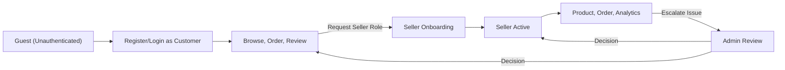

# 1. User Personas and Needs

## 1.1 Persona Overview
- **Customer**: Individuals seeking to browse, select, purchase, and review products. May visit anonymously, as a registered member, or via external identity providers.
- **Seller**: Trusted members who register products, manage sales, handle logistics, and respond to customer communications. Incentivized to optimize listings and provide good customer service.
- **Admin**: Enterprise-operational users responsible for enforcing business rules, overseeing compliance, ensuring platform integrity, and orchestrating resolutions for sensitive or escalated scenarios.

## 1.2 User Needs Context
- **Customers** need an uninterrupted and safe shopping journey, precise account management, privacy, and easy recoverability (identity and purchases).
- **Sellers** need tools for product and order management, fast onboarding, business analytics, and prompt notification of status or issues.
- **Admins** require holistic visibility, deep audit trails, fine-grained permissions management, and controls for exceptional business situations.

# 2. Role Definitions

| Role     | Business Responsibilities                                                                      |
|----------|-----------------------------------------------------------------------------------------------|
| Customer | - Discover/browse products                                                                    |
|          | - Register an account, authenticate via API, or use external services                         |
|          | - Place orders, manage addresses, use coupons/mileage                                         |
|          | - Submit reviews and inquiries                                                                |
|          | - View purchase history, accrue/transfer points/mileage                                       |
| Seller   | - Register/verify as business vendor                                                          |
|          | - List/manage products with dynamic options                                                   |
|          | - Track and fulfill orders, issue/manage coupons                                              |
|          | - Respond to customer inquiries/reviews                                                       |
|          | - Access sales insights, analytics, and performance dashboards                                |
| Admin    | - Create/manage system configurations, monitor platform operations                            |
|          | - Approve/restrict user and seller permissions                                                |
|          | - Review, audit, and intervene in any business workflow                                       |
|          | - Enforce compliance, resolve disputes, and handle sensitive escalations                      |

# 3. Authentication Requirements (API-centric)

## 3.1 Registration and Login
- THE system SHALL allow customers to register (with mobile or email) and authenticate via API.
- THE system SHALL support external (OAuth/social) authentication for customers and enable account linking.
- THE system SHALL allow sellers and admins to access via secure credential-based API login only after proper verification.

## 3.2 Session and Account Lifecycle
- WHEN a user authenticates, THE system SHALL create a secure session valid for no more than 30 minutes of inactivity (configurable).
- WHERE refresh tokens are supported, THE system SHALL allow secure session renewal within 30 days of last activity.
- WHEN a session expires, THE system SHALL require re-authentication for all API requests.
- IF multiple session attempts fail (5 consecutive failures within 10 minutes), THEN THE system SHALL temporarily block further login for 15 minutes and notify the user accordingly.
- WHEN a user requests password reset or account recovery, THE system SHALL verify user control via registered contact before proceeding.

## 3.3 External and Multi-Channel Authentication
- WHERE external identity is used, THE system SHALL enforce unique mapping of external IDs to backend user records.
- THE system SHALL store the provider, external user key, and last verified timestamp.
- WHEN signing in by external provider, THE system SHALL automatically link to an existing account if verified contact details match, else prompt user for explicit linking or registration.

## 3.4 Account Suspension and Withdrawal
- WHEN an account is withdrawn, THE system SHALL immediately revoke all sessions/tokens and mark the record as inactive.
- WHEN an admin issues a suspension, THE system SHALL restrict all access, log the rationale, and notify the user.
- IF an authentication attempt is made on a suspended or withdrawn account, THEN THE system SHALL deny access and return a clear message with support contact link.

# 4. Permission Matrix

| Action/Resource                        | Customer | Seller | Admin |
|-----------------------------------------|:--------:|:------:|:-----:|
| Register/Authenticate                   |   ✅     |   ✅   |   ✅  |
| Browse/Search Products                  |   ✅     |   ✅   |   ✅  |
| Create/Manage Orders                    |   ✅     |   ✅   |   ✅  |
| Manage Addresses                        |   ✅     |   ✅   |   ✅  |
| Use Coupons or Mileage                  |   ✅     |   ✅   |   ✅  |
| Submit Reviews/Inquiries                |   ✅     |   ✅   |   ✅  |
| Register/List Products                  |   ❌     |   ✅   |   ✅  |
| Manage Inventory/Options                |   ❌     |   ✅   |   ✅  |
| Issue Coupons                           |   ❌     |   ✅   |   ✅  |
| Respond to Reviews/Inquiries            |   ❌     |   ✅   |   ✅  |
| View Sales Analytics                    |   ❌     |   ✅   |   ✅  |
| Seller Onboarding/Verification          |   ❌     |   ✅   |   ✅  |
| Manage System Configurations            |   ❌     |   ❌   |   ✅  |
| Approve/Restrict Seller Permissions     |   ❌     |   ❌   |   ✅  |
| Audit/Intervene in Orders/Payments      |   ❌     |   ❌   |   ✅  |
| Enforce Compliance/Legal Actions        |   ❌     |   ❌   |   ✅  |

# 5. Role-based Access Flows

## 5.1 User Account Flow (Mermaid)

## 5.2 Business Rules for Access, Error, and Edge Cases
- WHEN a non-authenticated API request is made to a protected endpoint, THE system SHALL return HTTP 401 with business error code "AUTH_REQUIRED".
- IF a user tries to perform an action outside role permissions, THEN THE system SHALL return HTTP 403 with business error code "INSUFFICIENT_PERMISSIONS" and guidance for escalation.
- WHERE sensitive actions require consent/confirmation (e.g. withdrawal, major config changes), THE system SHALL enforce multi-factor or re-authentication.
- WHEN a seller attempts to operate without administrative approval, THE system SHALL block access until process completion.
- IF a user account is flagged for suspicious activity, THEN THE system SHALL automatically freeze access, notify admins, and require additional manual review before restoring operations.

## 5.3 Performance and User Experience
- WHEN a legitimate authentication or role change occurs, THE system SHALL process and confirm within 2 seconds in 95% of cases.
- WHEN a permissions error occurs, THE system SHALL provide business context, corrective instructions, and a support contact reference with each API error response.

--- 

All requirements above are specified according to EARS format where applicable, in business logic and process terms. No technical implementation, database schema, API spec, or infrastructure guidance is included as per document constraints. All technical implementation details—including architecture, security mechanisms, API design, and persistence—are at the discretion of the backend development team.