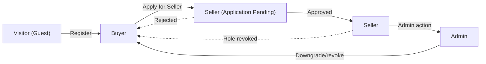
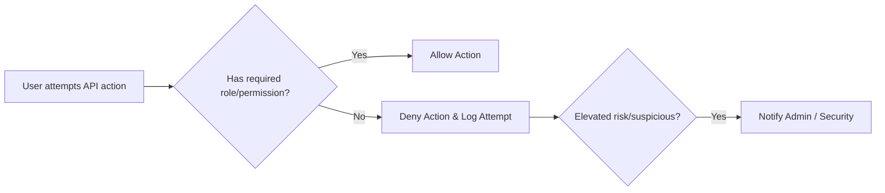

# aiCommerce User Roles & Authentication Requirements Specification

## 1. Introduction
aiCommerce powers a multi-channel, AI-driven commerce platform where users interact as buyers, sellers, administrators, or visitors. A robust authentication, authorization, and session management system is essential to maintain security, regulatory compliance, and seamless business workflows. These requirements establish clear, testable business rules for user management, role-based capabilities, permission boundaries, account recovery, and security controls throughout the platform lifecycle.

## 2. User Role Definitions and Hierarchy

### 2.1 Defined Roles

| Role    | Description                                                                                                                        |
|---------|------------------------------------------------------------------------------------------------------------------------------------|
| Visitor | Unauthenticated guest with browsing access only.                                                                                   |
| Buyer   | Registered user who can purchase, manage orders, profiles, favorites, reviews, and inquiries.                                      |
| Seller  | Buyer who has registered and been approved as a store operator; can manage products, sales analytics, issue coupons, respond, etc. |
| Admin   | Platform administrator with global privileges; manages platform-wide settings, disputes, compliance, and AI configuration.         |

### 2.2 Role Hierarchy & Elevation
- Visitor ⟶ Buyer (via registration)
- Buyer ⟶ Seller (after onboarding/approval)
- Admin is separately provisioned by internal process.

## 3. Authentication and Registration Requirements

### 3.1 Account Registration, Onboarding, and External Auth
- THE system SHALL allow Visitors to register as Buyers with email, mobile, and password (multi-locale, privacy-compliant forms).
- THE system SHALL support social and external identity provider registration (OAuth, OpenID Connect, SSO providers as configured).
- THE system SHALL enforce consent acquisition per applicable jurisdiction before user onboarding.
- WHERE identity verification is required by compliance or merchant policy, THE system SHALL require government-issued or provider-based identity checks.
- WHEN upgrading from Buyer to Seller, THE system SHALL collect and verify business credentials (e.g., company registration, tax info, bank account).
- Admin accounts SHALL only be provisioned via secure internal access workflow (no public registration allowed).

### 3.2 Authentication Flow
- THE system SHALL allow all roles to authenticate via password or supported federated logins.
- THE system SHALL support passwordless login options where enabled (e.g., magic link, one-time password [OTP] via email/SMS).
- THE system SHALL maintain secure session/jwt token lifecycle for every login session.
- THE system SHALL provide MFA (multi-factor authentication) as an optional/required feature for Seller and Admin roles.
- WHEN authentication fails, THEN THE system SHALL limit retry attempts and respond with a generic error without disclosing sensitive information.

### 3.3 Account Approval/Escalation
- WHEN users apply to become Sellers, THE system SHALL require manual or AI-assisted approval and notify users of the outcome.
- WHEN approval is denied, THEN THE system SHALL provide Seller-specific feedback for escalation or re-application.
- WHEN Admin privileges are granted/revoked, THEN THE system SHALL log the action and send notifications for audit compliance.

## 4. Role-Based Permissions Matrix

### 4.1 Capabilities by Role
| Action                                                | Visitor | Buyer | Seller | Admin |
|-------------------------------------------------------|:-------:|:-----:|:------:|:-----:|
| Browse products (public listings)                     |   ✅    |  ✅   |   ✅   |  ✅  |
| Add to cart/check out                                 |   ❌    |  ✅   |   ✅   |  ✅  |
| Place orders/make payments                            |   ❌    |  ✅   |   ✅   |  ✅  |
| Manage orders, favorites, reviews, and inquiries      |   ❌    |  ✅   |   ✅   |  ✅  |
| Create/update shipping addresses                      |   ❌    |  ✅   |   ✅   |  ✅  |
| Apply coupons or mileage                              |   ❌    |  ✅   |   ✅   |  ✅  |
| Register as Seller/apply for role escalation          |   ❌    |  ✅   |   ❌   |  ✅  |
| Manage products                                      |   ❌    |  ❌   |   ✅   |  ✅  |
| View & use analytics/performance tools                |   ❌    |  ❌   |   ✅   |  ✅  |
| Issue/respond to product inquiries & reviews          |   ❌    |  ✅   |   ✅   |  ✅  |
| Issue/manage coupons for products                     |   ❌    |  ❌   |   ✅   |  ✅  |
| Escalate support/inquiries/disputes                   |   ❌    |  ✅   |   ✅   |  ✅  |
| Access/modify platform/global settings                |   ❌    |  ❌   |   ❌   |  ✅  |
| Approve/reject Seller applications                    |   ❌    |  ❌   |   ❌   |  ✅  |
| Manage all user/seller accounts                       |   ❌    |  ❌   |   ❌   |  ✅  |
| Moderate or delete posts/reviews/inquiries systemwide |   ❌    |  ❌   |   ❌   |  ✅  |
| Configure AI-powered features                         |   ❌    |  ❌   |   ❌   |  ✅  |

### 4.2 Permissions in EARS Format
- THE system SHALL permit Visitors to browse public listings and (optionally) mark items for follow-up registration.
- WHEN a Buyer attempts a Seller action, THEN THE system SHALL deny access and provide clear instructions to upgrade or apply.
- WHEN a Seller attempts to perform an Admin action, THEN THE system SHALL deny access and provide a statement of privilege.
- WHEN any account attempts an unauthorized action, THEN THE system SHALL log the attempt and, WHERE appropriate, alert compliance personnel.

## 5. Account Recovery and Session Management
- THE system SHALL provide a secure password reset flow using verified contact mechanisms (email and, where configured, SMS).
- WHEN a recovery action is triggered, THEN THE system SHALL temporarily suspend suspect sessions until successful password change.
- THE system SHALL allow users to revoke all sessions/devices after suspicious activity or by request.
- THE system SHALL expire authentication tokens after 15-30 minutes inactivity (access) and 7-30 days (refresh) as configured per user type.
- THE system SHALL allow users (except Visitors) to view and manage their current sessions and activity history.
- THE system SHALL mask, log, and notify attempts of suspicious logins, role escalation, or account takeovers.

## 6. Security Considerations
- THE system SHALL store all passwords and sensitive authentication data using industry-standard cryptographic protocols (e.g., bcrypt, Argon2).
- THE system SHALL store JWT tokens securely (using httpOnly cookies or secure storage) and regularly rotate secrets.
- THE system SHALL use TLS/SSL for all authentication endpoints.
- THE system SHALL prevent brute force, enumeration, credential stuffing, and replay attacks by monitoring access patterns, rate-limiting, and adaptive AI risk scoring.
- THE system SHALL maintain full compliance with data privacy (GDPR, CCPA, local laws) and support user deletion/right-to-be-forgotten.
- THE system SHALL avoid exposing error details that could facilitate privilege escalation or attacks.
- THE system SHALL log all authentication/authorization attempts for audit and compliance monitoring.
- THE system SHALL provide MFA enforcement for privileged/Admin actions and allow optional MFA/magic link for Buyers/Sellers.

## 7. Error Handling and User-Facing Scenarios
- IF authentication fails (invalid credentials, expired session, revoked role), THEN THE system SHALL clearly communicate the error without leaking sensitive information.
- IF account recovery fails due to mismatch or illegal attempts, THEN THE system SHALL lock the account and require manual verification for reset.
- IF a user tries to access protected resources with insufficient permissions, THEN THE system SHALL respond with a clear "insufficient privilege" error (localizable message).
- IF an account is flagged for suspicious activity, THEN THE system SHALL proactively alert the account holder and, WHERE policy allows, require re-authentication or admin intervention.
- THE system SHALL provide metrics and logs for all failed/suspicious authentication attempts, accessible by Admin for security investigations.

## 8. Diagrams

### 8.1 Authentication and Role Elevation Flow

### 8.2 Permissions Enforcement Logic

---

This document provides business requirements only. All technical implementation decisions (architecture, APIs, database design, etc.) belong to the development team. This document describes WHAT the system should do, not HOW to build it.