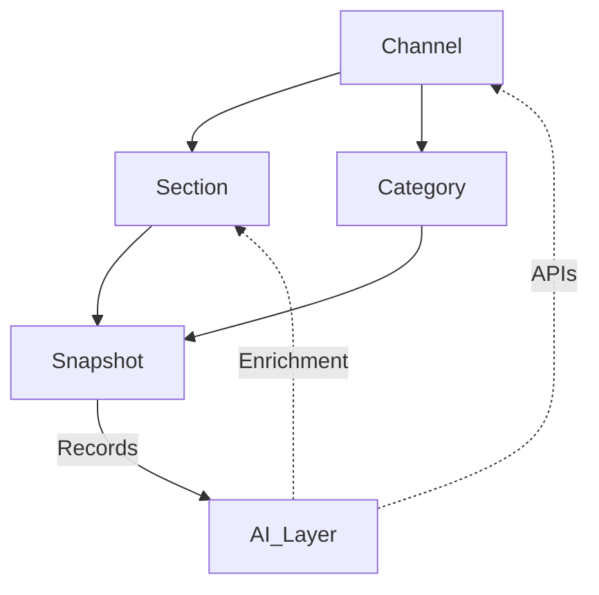

# Core System Concepts

This document outlines the essential system constructs underpinning the AI Shopping Mall Backend System, articulating their roles in enabling modularity, flexibility, and future readiness for commerce operations. These core concepts establish a robust semantic and technical base for all advanced features, integrations, and scalability efforts.

---

## 1. Concept Overview

The system is architected on modular primitives ensuring extensibility and maintainability. Each concept is both business-facing and technical, designed for clear separation of concerns, scalability, and seamless integration with AI capabilities.

| **Concept** | **Definition** | **Purpose** |
|-------------|----------------|-------------|
| Channel     | Independent storefront or marketplace instance, supporting multi-tenancy. | Enables separate business lines, brands, or regional operations on a single backend. |
| Section     | A merchandising or organizational sub-area within a channel. | Organizes products, content, and features within each channel for flexible layouts and market segmentation. |
| Category    | Multi-level hierarchical taxonomy, scoped by channel. | Allows bespoke product organization for discovery, filtering, and channel-specific campaigns. |
| Snapshot    | Immutable, versioned data instance (for products, boards, etc.). | Ensures complete history, auditing, rollback, and safe concurrent updates. |
| AI Layer    | Modular API-driven intelligence components (recommendations, fraud, analytics). | Embeds data-driven insights, automation, and adaptive security throughout commerce flows. |

---

## 2. In-Depth Descriptions

### 2.1 Channel
A _Channel_ represents a logically distinct storefront or brand, capable of managing customized catalogs, user segments, policies, and workflows. Channels enable multi-site architecture for franchises, partners, or region-based market strategies, all under unified administration. Each channel can run tailored promotions, language packs, and compliance settings.

### 2.2 Section
_Sections_ are logical groupings within channels catering to merchandising themes, campaigns, or functional zones (e.g., Flash Sale, New Arrivals, Community Boards). Sections are assignable, reorderable, and support dynamic content integration for engaging and adaptive storefronts.

### 2.3 Category
Every channel defines its own _Category_ tree—a flexible, nested taxonomy to organize products. Categories empower targeted search, intelligent merchandising, and channel-unique product hierarchies. All category modifications are event-sourced for full traceability.
- **Features:**
  - Per-channel configuration
  - Unlimited depth
  - Integrated with AI for auto-sorting and insights

### 2.4 Snapshot
The _Snapshot_ mechanism records immutable points-in-time for critical data entities (product details, reviews, board posts). Snapshots guarantee:
- Complete change history and versioning
- Rollback for error correction
- Compliance with audit and legal requirements
- Parallel variant management (e.g., draft, published)

### 2.5 AI Layer
A distinct _AI Layer_ exposes system data to a family of AI-powered microservices through decoupled APIs, such as:
- Personalized product recommendations
- Fraud risk evaluation on carts and orders
- Advanced sales and engagement analytics
- Automated moderation and abuse detection

The AI Layer is designed for extensibility—new AI modules can be added without codebase disruption, and all inference actions are auditable via snapshot ties.

---

## 3. Relationship Diagram

---

## 4. Key Principles

- **Separation of Concerns:** Each concept is strictly delineated, minimizing inter-dependency and promoting testability.
- **Auditability:** All major constructs are versioned and record their own operational history.
- **AI-Native Core:** AI modules are planned into system workflows from the ground up, not retro-fitted.
- **Dynamic Extensibility:** Channels, sections, and categories can be added or modified in realtime, even post-deployment.

---

[Return to TOC](./00_toc.md)
