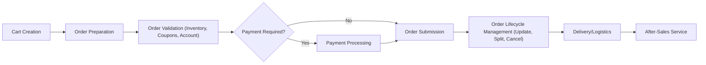
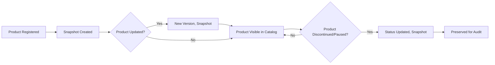

# Functional Requirements Overview for AI-Based Shopping Mall Backend

## System Scope

THE "shoppingMall" backend SHALL provide a unified, extensible business logic platform for multi-channel/multi-section e-commerce, supporting advanced AI features, high scalability, global compliance, and robust auditability. 

THE system SHALL serve three primary roles: customer, seller, and admin, with strict permission separation and escalation. All business actions SHALL be tracked via snapshot-based history for evidence, dispute resolution, and compliance.

## General Functional Requirements

- WHEN a user accesses the platform, THE system SHALL record critical session and identity metadata (IP, access URL, referrer, device, and authentication context), storing connection details per interaction.
- WHEN users are guests, registered, or OAuth-linked, THE system SHALL enable seamless identity verification per channel, supporting global phone standards and encrypted meta.
- WHERE external authentication is used, THE system SHALL link external identity to internal customer records for a consistent experience across access methods.
- WHERE a role upgrade is initiated (customer → seller/admin), THE system SHALL enforce approval workflows, permission reviews, and event logging.
- THE system SHALL support dynamic channel (Storefront, Brand, App) and section (category, virtual corner) registration, with independent, hierarchical taxonomies and configurations per channel.
- THE system SHALL capture a snapshot of all core business objects (products, users, orders, posts, etc.) on every state change—never-deleting data but marking with deletion time, to ensure regulatory compliance.
- THE system SHALL enable multi-language, multi-currency operations—localizing all customer-facing meta, regulating formats by locale, and supporting RTL/region-specific content.
- WHEN business rules require, THE system SHALL apply enforcement logic for coupon stacking, permission validation, order eligibility, and all inventory/transaction state changes.
- THE system SHALL expose audit histories for all critical workflows (product changes, order transitions, payment status), accessible by authorized roles only.

## Product, Order, and User Workflows

### User and Access Management

- THE system SHALL allow customers to:
  - Register, authenticate, update, and remove their account (with per-channel data segregation).
  - Save multiple email addresses and manage password/identity settings with encrypted storage.
  - Set up multiple shipping addresses, with support for global formats and default preferences.
  - Use loyalty and payment features (mileage, deposits, coupons) with full history and balance visibility.

- WHEN a user accesses as a guest, THE system SHALL track behavior and associate persistent shopping operations (cart, viewed products) with device/session ID.

- IF identity verification fails, THEN THE system SHALL clearly notify the user and restrict registration, purchase, or account-related actions.

- WHEN a customer becomes a seller, THE system SHALL:
  - Unlock product registration and order management privileges scoped to owned products only.
  - Display sales and performance analytics based on active data.
  - Enforce approval process prior to any sales operation.

- WHEN a role is admin, THE system SHALL:
  - Allow global user, product, order, and channel configuration.
  - Grant access to all logs, audit trails, configuration screens, and system health overviews.

### Product & Catalog Management

- WHEN a seller registers, updates, pauses, or deletes a product, THE system SHALL:
  - Capture a snapshot at each state transition and preserve all previous versions.
  - Allow channel/section-specific category assignment (with multiple category links), and distinguish between required/optional attributes and composition bundles.
  - Support variant/option logic (e.g., size, color), enforcing legal/stock rules and group assignments.
  - Enable rich content formats (Markdown, HTML) and multimedia/media attachment with SEO fields.
  - Allow tagging and optimized search, storing and returning thumbnails and attachments with each relevant entity.

- WHEN an inventory-affecting event occurs (purchase, restock, adjustment), THE system SHALL update stock for all affected options and maintain a version history, automatically enforcing stock-out logic where thresholds are breached.

- WHERE product bundles are registered, THE system SHALL enable fixed or optional inclusion lists, manage bundle pricing, and maintain stock for all unit products in the composition.

### Cart & Order Processing

- WHEN a customer adds items to the cart, THE system SHALL:
  - Store cart contents per customer/session, applying all selected options and quantity choices.
  - Retain all option/configuration info in cart item structure for validation.
  - Allow access, update, and conversion to order regardless of login status, with later reconciliation upon authentication.

- WHEN converting cart to order:
  - THE system SHALL validate inventory, discounts, customer identity, and eligibility. If any check fails, THEN THE system SHALL prevent order and inform the user of the error/rejection reason.
  - Orders SHALL proceed through multi-stage lifecycles: application, payment, delivery, fulfillment, completion—with state tracking, event timestamps, and associated snapshot versions for all item records.

- WHEN payment is processed, THE system SHALL support:
  - Multiple payment methods (cash, deposit, mileage, mixed), asynchronous settlement (e.g., virtual account, bank transfer), and cancellation/refund flows with strict order/payment reconciliation.
  - Clear audit of payment status changes, auto-confirmation rules (e.g., auto-confirm 14 days after delivery), and compliance-mandated timing capture for all transitions.

- WHEN orders involve multiple vendors or partial fulfills, THE system SHALL segment shipments and update delivery status per sub-order, exposing status events and logistics tracking to both customer and seller involved.

- IF a delivery error or order exception occurs (e.g., out-of-stock after purchase, shipment delay, product issue), THEN THE system SHALL notify appropriate parties, trigger dispute resolution mechanisms, and maintain full evidence trails for all actions and communications.

### Discounts, Coupons, Deposits, and Loyalty

- WHEN discounts or coupons are configured:
  - THE system SHALL manage issuance, targeting (by customer, segment, channel, seller, section, product), and limit stacking/exclusivity as per defined rule engine.
  - Each coupon SHALL store detailed applicability, eligibility rules, usage and issuance/expiry limits, and support private/public modes (including single-use codes and bulk generations).

- THE system SHALL enforce validation at order time: IF a coupon is inapplicable (criteria not met, expired, usage cap), THEN the system SHALL block its use and return clear feedback.

- THE deposit and mileage subsystems SHALL:
  - Enable earning, consumption, expiry, donation, and promotional allocations, visible to the user in complete history and summarized by type.
  - Auto-audit for fraud/risk, enforce balance and expiration logic, and tie all deposit/mileage operations to both user and order/event snapshots for traceability.

### Inquiry, Board, and Review System

- WHEN a customer makes a product inquiry or writes a review:
  - THE system SHALL tie all posts, replies, edits, and deletions to immutable snapshots, capturing history for legal compliance and dispute investigation.
  - THE system SHALL allow hierarchical answers, private post controls, verified purchase identification, and seller-admin response moderation—keeping notification flows live throughout.

- IF reportable or inappropriate content is detected, THEN THE system SHALL flag for moderation, restrict access, and log all actions.

### Favorites, Personalization & Notifications

- WHEN a customer "favorites" any entity (product, address, inquiry), THE system SHALL record a snapshot of the favorited item for personalization and evidence.
- THE system SHALL support organizing, batch-operating, and subscribing to favorite items notifications (e.g., price drops, inquiry answers).

### Attachments, Evidence, and Auditability

- THE system SHALL provide secure file/attachment storage (posts, products, reviews), storing rich metadata and version history; access must be governed by permissions and regulatory needs, with support for CDN-based delivery.
- WHERE audit or data retention policy applies, THE system SHALL maintain and expose complete evidence trails—never silently deleting data, always marking deletions with reason and time.

### Compliance, Security, and Internationalization

- ALL business logic and data processing SHALL conform to applicable legal (GDPR/CCPA, consumer/tax/PCI DSS) and accessibility standards (WCAG), including data subject rights handling.
- WHERE multi-language/currency support is active, THE system SHALL present user-facing content localized per region, with business logic correctly applying locale-specific processing for currency/format/tax rules.

### Performance and Scalability Expectations

- THE system SHALL respond to standard business-user interactions (view/edit product, add to cart, convert to order, post inquiry, etc.) within 2 seconds for 99% of requests under normal load.
- WHERE AI/ML modules are active (recommendations, fraud detection, dynamic pricing), THE system SHALL operate with appropriate asynchronicity, presenting results to the user within 5 seconds or via background tasks with notification support.
- THE system SHALL scale horizontally, maintain modular API processing, and provide expansion hooks for future AI, ML, and external service integrations.

## Business Process Overviews

### End-to-End Customer Journey:

### Order & Payment Workflow:

### Product Lifecycle & Audit Trail:

### Business Rule Enforcement Example:

- WHEN a customer applies multiple coupons, THE system SHALL evaluate exclusive/stackable logic, applying only permitted discounts and providing error notifications where business rules are violated.
- IF an order is finalized before payment, THEN THE system SHALL enforce eventual payment collection, cancellation, or expiration per business logic and compliance needs.
- WHEN inventory is below minimum threshold, THE system SHALL mark products as out-of-stock and block further orders.
- WHERE evidence is required for disputes/audit, THE system SHALL provide full entity and workflow history upon authorized request.

## Summary

This document defines all required system behavior for the shoppingMall backend from a business rules perspective, with EARS syntax for clarity. Detailed domain-specific requirements appear in related documents (e.g., [Product & Catalog Management](./04-product-and-catalog-management.md), [Order, Cart, and Payment Workflows](./05-order-cart-and-payment-workflows.md)). All logic is designed for automation, audit, extensibility, and future AI-integration.