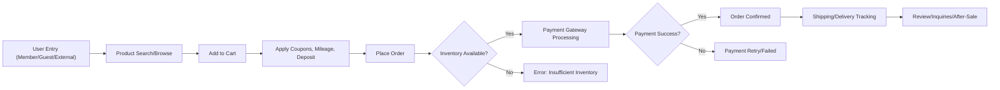
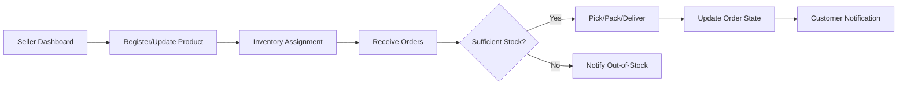
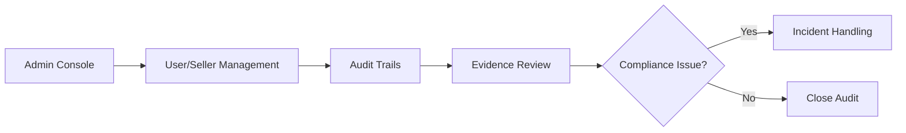

# Functional Requirements Analysis for AI-powered Shopping Mall Backend

## 1. Business Process Overview

The shoppingMallAiBackend is an AI-powered commerce system supporting multi-channel retail operations. It enables secure and efficient interaction between three core business roles: customers, sellers, and administrators. The platform manages the entire commerce lifecycle—from user acquisition, onboarding, and purchase, through post-sale management, data-driven marketing, and compliance.

Key business processes include:
- Multi-modal user onboarding and role assignment
- Shopping experience (product discovery, coupon use, checkout)
- Seller-driven inventory, product, and order management
- AI-driven personalization, fraud prevention, and analytics
- Legal, compliance, and audit operations
- Global/international commerce workflows (multi-language, multi-currency, shipping)

## 2. Major User Flows

### A. Customer (Buyer) Flows
- Onboarding as member, guest or via external authentication
- Browsing products by channel, section, or category
- Using search and filter (with AI-based suggestions)
- Adding items to cart, editing cart, converting cart to order
- Applying coupons, mileage, deposits at checkout
- Order confirmation, payment, and tracking
- Communication with sellers (inquiries, reviews)
- Managing addresses, favorites, purchase history
- Receiving personalized recommendations

### B. Seller Flows
- Registering as seller, verification process
- Creating and updating product listings (with possible AI-based tools for description, pricing, images)
- Managing inventory, categories, tags, and product variants
- Receiving and fulfilling orders (stage-by-stage delivery tracking)
- Handling product inquiries, responding to reviews
- Issuing coupons and promotions
- Analyzing sales and trends using analytics dashboards

### C. Administrator Flows
- User, seller, and role management
- System-wide audit, moderation, and compliance checks
- Managing global system configurations and channel/section taxonomy
- Payment and transaction compliance oversight
- Evidence preservation and dispute handling

## 3. Comprehensive Functional Requirements (EARS Syntax)

### User Onboarding, Identity, and Role Management
- WHEN a user connects to the platform, THE system SHALL record IP, access URL, and referrer for each connection.
- WHERE a user attempts to register, THE system SHALL support registration as member, guest, or via external provider.
- WHERE identity verification is required, THE system SHALL perform mobile number and real-name checks and store this information encrypted.
- WHEN a member is promoted to seller or admin, THE system SHALL require additional verification and approval.
- IF a user withdraws membership, THEN THE system SHALL anonymize personal data in compliance with regulations.

### Customer Commerce Journey
- WHEN a customer browses products, THE system SHALL provide search, filter, and personalized recommendations (where available).
- WHEN a customer adds items to the cart, THE system SHALL store quantities, option selections, and product snapshot references.
- WHEN a customer initiates order placement, THE system SHALL validate cart contents, available inventory, and apply active coupons, mileage, and deposit balances.
- IF payment fails during checkout, THEN THE system SHALL provide recovery options and allow cart to persist for retry.
- WHEN an order is confirmed, THE system SHALL generate a trackable order with audit trail of each business step (order, payment, shipping).
- WHERE delivery is international, THE system SHALL enable country/region/city/detailed address formats and handle currency conversions.
- WHEN a customer submits product reviews, THE system SHALL enable verified purchase badges, moderation workflow, and maintain history as snapshots.
- WHEN a customer requests after-sales service or cancellation, THE system SHALL adhere to order and delivery stage rules as described below.

### Seller Workflow Management
- WHEN a seller registers products, THE system SHALL validate required/optional option completeness and support snapshotting for each significant update.
- WHEN a seller issues coupons, THE system SHALL enforce issuance and usage restriction policies (quantity, exclusivity, period, eligibility).
- WHEN a seller fulfills an order, THE system SHALL record inventory deductions and shipment stages, issuing notifications at each change of state.
- IF a seller’s product is flagged for legal or policy violation, THEN THE system SHALL restrict the product and maintain historic evidence.
- WHEN a seller responds to inquiries and reviews, THE system SHALL track response time and quality.

### Administrator Governance
- WHEN an admin acts on user or seller accounts, THE system SHALL audit and preserve all modifications in an immutable trail.
- WHEN business or regulatory policies change, THE system SHALL support configuration changes without downtime or data loss.
- WHEN a compliance audit is triggered, THE system SHALL retrieve all relevant evidence snapshots, data retention logs, and activity trails.

### Data and Content Management
- WHEN data is updated (products, posts, reviews, etc.), THE system SHALL create a new snapshot and preserve prior versions.
- IF a deletion is requested, THEN THE system SHALL mark data as deleted and log the timestamp instead of removal.
- WHEN a user favorites a product/inquiry/address, THE system SHALL store a snapshot copy at the moment of favoriting.
- WHERE multilingual or multicultural content is present, THE system SHALL provide localized formats and right-to-left language support.

### Coupon, Deposit, and Mileage
- WHEN coupons are issued, THE system SHALL enforce amount/percentage rules, stacking/exclusivity, eligibility, and time limitations.
- WHEN deposits or mileage are accrued or consumed, THE system SHALL validate business rules, record a detailed transaction log, and enable secure balance management.
- IF an attempt is made to use an expired or ineligible coupon/deposit/mileage, THEN THE system SHALL prevent usage and present informative error messaging.
- WHERE promotional or one-time coupons are distributed, THE system SHALL generate and validate secure, non-predictable codes.

### AI and Analytics Business Features
- WHEN user behavior data is available, THE system SHALL use machine learning models to recommend products or prevent fraudulent transactions.
- WHEN sellers or admins view sales trends, THE system SHALL provide dashboard analytics reflecting real-time and historical data.

### Channel, Category, Section Management
- WHERE multiple channels are present, THE system SHALL maintain independent category systems by channel with flexible mapping rules.
- WHEN a section or channel is added or modified, THE system SHALL ensure cross-channel analytics and preserve a consistent user experience.
- WHEN files (images, attachments) are uploaded, THE system SHALL perform type validation, metadata extraction, secure access control, and versioning.

## 4. Business Rules and Validation Logic

- WHEN an order is placed, THE system SHALL verify option selections, minimum order requirements, and that all relevant terms (return, delivery) have been acknowledged.
- IF inventory for a selected option is insufficient, THEN THE system SHALL prevent checkout and display real-time inventory status.
- WHEN external integrations (payment, identity, logistics) are invoked, THE system SHALL enforce appropriate business validation for success/failure conditions.
- WHEN discounts apply, THE system SHALL enforce stacking, exclusivity, and maximum discount rules as set by business policy.
- WHEN the order or payment process is interrupted, THE system SHALL ensure data consistency and accurate audit trail resumption upon recovery.
- WHERE regional compliance is required (e.g., tax, privacy), THE system SHALL apply region-specific business logic.
- WHEN selling digital or physical goods, THE system SHALL differentiate fulfillment, evidence retention, and after-sales workflows accordingly.

## 5. Error Scenarios and Handling (EARS)

- IF a user attempts to access a restricted resource, THEN THE system SHALL deny access and provide a business-readable error message.
- IF a duplicate account registration is attempted (same email/identifier), THEN THE system SHALL block the attempt and explain the reason to the user.
- IF an order is cancelled after shipment, THEN THE system SHALL block refund and provide return/exchange policies based on delivery state.
- IF a payment gateway or external provider is unreachable, THEN THE system SHALL allow retry and inform both the user and admin with context-specific error codes.
- IF an invalid or expired coupon/mileage/deposit is used, THEN THE system SHALL explain the reason and suggest corrective action.
- IF an illegal product or prohibited content is detected, THEN THE system SHALL block the action and inform appropriate parties for escalation.
- IF evidence data is missing for a compliance audit, THEN THE system SHALL raise an incident to the admin and preserve all related audit trails for review.

## 6. Performance Expectations
- WHEN users interact with core shopping flows (search, cart, checkout), THE system SHALL respond within 2 seconds for 95% of requests during normal operation.
- WHEN uploading files or large attachments, THE system SHALL process and make available new files within 5 seconds or notify of delays.
- WHEN retrieving historical data (snapshots, order history, analytics), THE system SHALL deliver content in less than 3 seconds for single-user queries.
- WHERE unusual load or failures are detected, THE system SHALL degrade gracefully and maintain core commerce and evidence functions above 99% availability during business hours.
- THE system SHALL support at least 1000 concurrent customer sessions per channel without compromising business process integrity.

## 7. Core Business Flow Diagrams (Mermaid)

### A. Customer Commerce Flow

### B. Seller Product and Order Fulfillment Flow

### C. Admin Audit Trail Flow

---
This document provides business requirements only. All technical implementation decisions—including API design, architecture, and database structure—are at the full discretion of the development team. The descriptions above specify WHAT the system must do from a business perspective, not HOW it must be technically accomplished.
