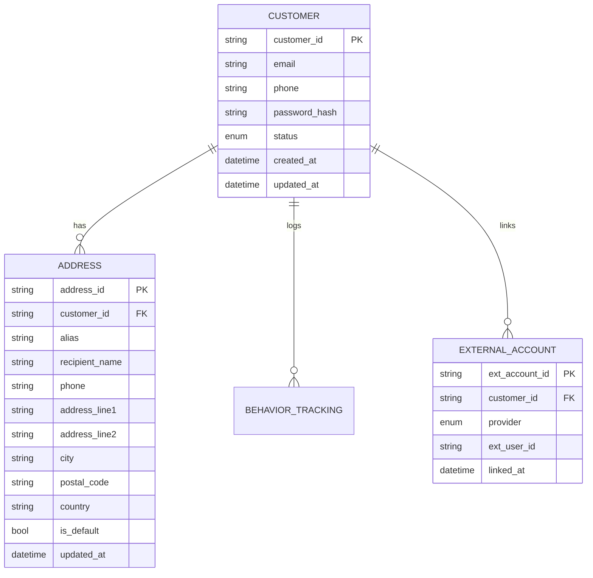

# AIMall Backend Customer System

## Overview
The AIMall Backend Customer System is central to enabling seamless user experiences on the AIMall platform. This system supports comprehensive account management, external and federated authentications, behavior tracking, and advanced personalization. It forms the foundation for all customer interactions, ensuring secure, scalable, and compliant management of identities, preferences, and engagement history.

## Objectives
- Provide robust account and identity management for all customers
- Enable diverse authentication pathways (local, social, federated)
- Track customer interaction behavior securely for analytics and AI
- Facilitate seamless address and profile management with strong privacy controls

## Customer System Functionalities
### Account Management
- THE customer system SHALL allow account creation, profile updates, password resets, and secure account deletion.
- WHEN a user unregisters, THE system SHALL permanently remove all personal identifiers except for anonymized activity logs necessary for legal or analytical purposes.

### Identity Verification & Federated Login
- THE system SHALL support customer authentication via email/password, mobile phone (using OTP), and external OAuth providers (Google, Kakao, Apple, etc.).
- WHEN the user chooses federated login, THE system SHALL ensure token validation and minimal required data import in compliance with privacy stance.

### Address Management
- THE system SHALL enable customers to register, modify, and delete multiple delivery addresses, set defaults, and use aliases for quick selection during purchase.

### Behavioral & Connection Tracking
- WHILE a customer is logged in via API, THE system SHALL track session activities, shopping preferences, and interaction events. Data SHALL be securely stored with pseudonymization.

### AI-driven Personalization
- OPTIONAL: WHERE the customer consents, THE system SHALL collect and analyze behavioral data for enhanced search, recommendation, and targeted marketing features.

## User Scenarios
- Account signup and first login via social provider, including address addition
- Regular shopping sessions with browsing, cart management, favoriting, and checkout
- Profile update, address list maintenance, and reviewing purchase history
- Password reset via SMS OTP and profile privacy setting adjustments

## ERD (Excerpt)

# Related Documents

## Table of Contents
The full set of AIMall backend documentation is organized for clarity and modularity. Key sections include:
- [System Overview](./01_aimall-backend_system-overview.md) – Platform architecture, design aims, and service summary
- [User Roles & Authentication](./02_aimall-backend_user-roles-and-authentication.md) – All user classes, privileges, and corresponding authentication protocols
- [Customer System (this document)](./03_aimall-backend_customer-system.md) – Details on customer management, login, tracking, and personalization
- [Seller & Admin Systems](./04_aimall-backend_seller-and-admin-system.md) – Seller onboarding, admin dashboards, and monitoring features
- [Product Management](./05_aimall-backend_product-management.md), [Cart](./07_aimall-backend_cart-system.md), [Orders](./08_aimall-backend_order-and-delivery-system.md), and more, each in their respective files

## User Roles & Authentication
The platform defines three primary user roles:
- **Customer**: Shops via API as guest, member, or with external login. Accesses product listings, manages carts/orders/profiles, writes reviews, and receives AI recommendations.
- **Seller**: Registers as a merchant; can list/manage inventory, track sales insights, operate promotions, and contact buyers.
- **Administrator**: Platform managers with full or granular system access. Manage all users/products/sellers, enforce compliance, and operate system-level controls.

Each role authenticates by API. External providers (OAuth/OpenID) are supported for customers and sellers, enforcing robust token-based validation. Administrators use secured credentials with hierarchical permissions.

## Technical Architecture & Compliance
The customer system components are designed for modular integration and adherence to international privacy and data security standards:
- **Architecture**: Decoupled microservices exposing RESTful APIs, enabling flexible scaling and rapid feature deployment. Separation of concerns for authentication, address management, behavioral tracking, and AI modules.
- **Compliance**: All identity, contact, and behavioral data is handled per global regulations (GDPR, CCPA, South Korea’s PIPA). Sensitive processes (e.g., password storage, OAuth flows) employ strong encryption, and audit trails monitor all accesses and data modifications.
- **Security**: Zero-trust principles, input validation, and rate limiting applied through all API entry points.
