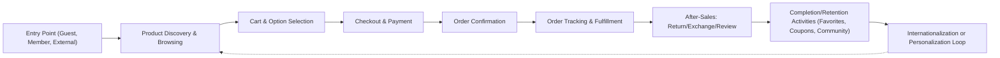

# Customer Journey User Stories for AI-powered Shopping Mall Backend

## Buyer Personas

### Persona 1: Local Frequent Shopper
- Female, 32, tech-savvy, prefers quick transactions and personalized recommendations. Shops bi-weekly for lifestyle and electronics. Uses mobile app and web equally. 

### Persona 2: International Guest Buyer
- Male, 45, business traveler, occasional high-value purchases. Uses guest checkout or external (Google, Apple) accounts. Valued for quick, reliable fulfillment and transparent international shipping/currency.

### Persona 3: Bargain Hunter
- Non-member, always seeks best deals. Rarely registers but uses coupons, mileage, and compares sellers across channels.

### Persona 4: Power User Member
- Longstanding member, accumulates mileage and favorites across product categories. Leverages search, advanced filters, and notification settings. Occasionally leaves product reviews and inquiries.

## Onboarding, Discovery, and Purchase

### Account Creation & Entry
- WHEN a new visitor accesses the platform, THE system SHALL allow entry as guest, new member, or external service login (e.g., Google, SNS).
- WHERE an external service is used, THE system SHALL initiate identity verification and record linkage for analytics and security.
    - IF external integration fails, THEN THE system SHALL offer fallback to guest or standard registration.

### Product Discovery & Browsing
- THE system SHALL provide multi-channel browsing (mobile, web, external apps) and category-based navigation.
- WHEN browsing, THE system SHALL track session entry point (channel, referrer) and capture basic analytics for personalization.
- THE system SHALL provide dynamic search, filtering, tag-based discovery, and allow hierarchical navigation through sections and categories.
- WHERE user preferences (history/favorites) exist, THE system SHALL leverage them for personalized recommendations using AI/ML features.

### Cart and Option Selection
- WHEN a user adds items to the cart, THE system SHALL retain option selections and inventory validation for each entry.
- WHERE user is a member, THE system SHALL persist cart state between sessions/devices. WHERE user is a guest, the cart SHALL persist for the session unless browser data is cleared.
- THE system SHALL enable revision and removal of cart items, real-time price adjustments (including any applicable coupons or discounts), and post inventory status on attempted confirmation.
- IF item option/inventory is invalidated (e.g., out-of-stock), THEN THE system SHALL clearly notify the user with recommended alternatives or waiting list options.

### Checkout and Payment
- WHEN proceeding to checkout, THE system SHALL corral shipping/payment details and validate required fields by country/region.
- THE system SHALL support single and split orders, mixed payment types (cash, deposit, mileage, coupon), and partial fulfillment.
- WHERE payment fails (insufficient funds, invalid coupon, bank errors), THEN THE system SHALL provide clear guidance for correction and offer retry or alternate method.
- THE system SHALL not create any order until all payment steps are confirmed, supporting rollback in case of asynchronous payment failures.

## Coupon, Mileage, and Favorites Journeys

### Coupon Discovery and Redemption
- WHEN coupons are published (public or targeted), THE system SHALL notify eligible customers via their preferred channels (push, email, site banner).
- WHERE a customer has a coupon, THE system SHALL show its applicability (sections, products, sellers, minimum/max thresholds) before checkout and allow selection/combo per business rules.
- IF coupon is invalid or restricted (e.g., exclusive, expired, stacking denied), THEN THE system SHALL inform user with specific error codes/banners.

### Mileage and Deposit Usage
- WHEN a purchase is made or a promotion completed, THE system SHALL accrue mileage and/or deposits to the customer’s account according to business logic.
- WHERE mileage/deposit is redeemable, THE system SHALL show balances at checkout and allow selection alongside other payment methods, subject to per-order rules.
- IF mileage or deposit redemption fails (expired, insufficient, rule breach), THEN THE system SHALL highlight the reason and guide user to resolve (e.g., earn more, check expiry, request support).

### Favorites and Notifications
- THE system SHALL enable favoriting of products, delivery addresses, and inquiries for all user types.
- WHEN a favorite is added, THE system SHALL capture snapshot of product details for future retrieval and notify on relevant changes (e.g., price drop, new answer on inquiry, product discontinued).
- WHERE favorites are organized (folders, tags), THE system SHALL allow management and provide batch operations (delete, categorize, notification settings).

## Order and After-Sales Experience

### Order Placement and Tracking
- WHEN an order is placed, THE system SHALL generate an order record and send confirmation to user (via preferred contact method).
- THE system SHALL allow real-time tracking of order processing status (application, payment, preparation, shipping, delivery) and provide stage updates.
- IF order is delayed or split, THEN THE system SHALL proactively notify affected customers and provide revision/cancellation options as permitted by business rules.

### Returns, Exchanges, and Cancellations
- WHEN a customer initiates a return, exchange, or cancellation within permitted timeframe/states, THE system SHALL present clear process guidance, eligibility checks, and timeline expectations.
- THE system SHALL manage asynchronicity (e.g., partial returns) with accurate historical tracking and provide refund/adjustment estimates up front.
- IF transaction is not eligible (time expired, state restriction), THEN THE system SHALL explain business reason and suggest escalation/support options.

### Review, Inquiry, and Community Engagement
- WHEN an order is marked delivered, THE system SHALL allow customer to leave product reviews, ratings, and post-sale inquiries.
- WHERE inquiry is posted, THE system SHALL distinguish privacy (public/private), manage reply and comment flows, and provide AI-powered related FAQ suggestions.
- THE system SHALL flag potential abuse and enable moderation/appeal actions accessible by both customer and admin roles.

## Internationalization and Personalization

### Multi-Language and Multi-Currency
- THE system SHALL provide localized experiences driven by user’s region or manual selection, supporting multiple languages (including right-to-left) and currency display/processing.
- WHEN international addresses are entered, THE system SHALL guide required/optional fields and support region-specific validation, as well as delivery time and fee transparency.
- IF a product or promotion is not available in user region, THEN THE system SHALL inform user at point of discovery and offer substitutes or notification subscription.

### Personalization and Accessibility
- THE system SHALL provide accessibility features in compliance with global standards (WCAG 2.1), offering options for text size, high contrast, keyboard-only navigation, and screen reader support.
- WHERE AI/ML is deployed for personalization, THE system SHALL provide users with opt-in/opt-out controls and transparency into the nature of tailored recommendations or offers.
- WHEN personal data is used for service improvement or enhancement, THE system SHALL employ explicit consent and provide a clear record of processing purpose, in accordance with compliance documents.

## Diagram: High-Level Customer Journey

---

This document describes business requirements only. Technical implementation decisions—including system architecture, API design, and database schemas—are the responsibility of the development team. All user- and admin-facing features and scenarios are articulated in business logic and process terms, not interface or technical code.
