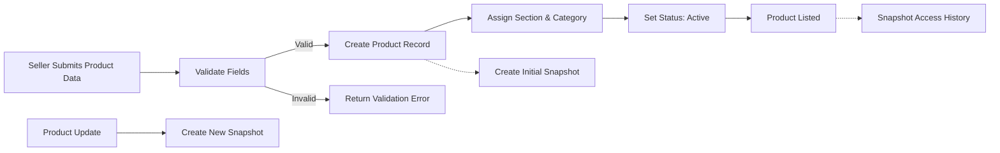
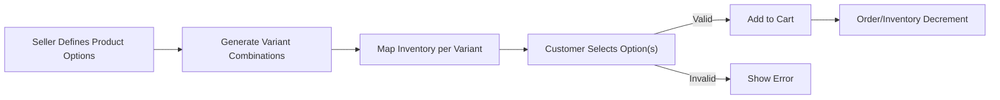
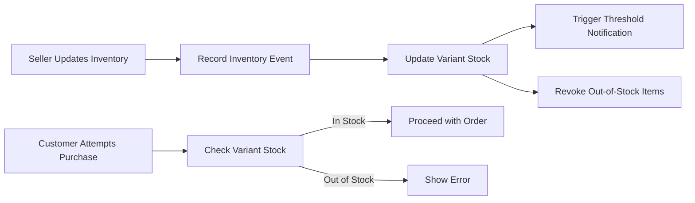

# Product and Catalog Management - Business Requirements Specification

## 1. Introduction and Scope
This document specifies the complete business requirements for managing the product catalog in the shoppingMall backend platform. It covers registration, updates, configuration, categorization, rich content, inventory, auditing, and extensibility—designed for multi-channel, multi-section, AI-driven e-commerce at scale. All requirements are written in actionable, measurable terms, using the EARS methodology where applicable, and focused on business logic with no technical implementation details.

## 2. Product Registration and Snapshot Management

### 2.1 Product Registration and Lifecycle
- THE system SHALL allow sellers to register new products individually or in bulk.
- WHEN a seller submits product information, THE system SHALL validate all required fields (name, description, category, options, inventory, price).
- WHEN a product is created, THE system SHALL generate a unique product identifier scoped to the seller and channel context.
- WHEN a product is updated (including content, price, or configuration), THE system SHALL create a snapshot recording all prior data before modification.
- WHEN a seller requests removal of a product, THE system SHALL mark the product as discontinued (soft delete), preserving its snapshot history for compliance and audit purposes.
- THE system SHALL support the following product lifecycle statuses: Draft, Active, Paused, Discontinued, Deleted.
- WHERE a product update occurs, THE system SHALL allow reverting to previous snapshots for dispute or rollback situations.
- WHERE multiple products require identical configuration, THE system SHALL support batch registration, update, and pause/activation functions.
- IF a required product field is missing or invalid during registration or update, THEN THE system SHALL reject the action and return a detailed error message listing the invalid fields.
- THE system SHALL assign each product to at least one section and one category by default.

### 2.2 Product Snapshot and Version Control
- WHEN an attribute of a product is modified, THE system SHALL create and persist a complete historical snapshot of the product state prior to the change.
- THE system SHALL preserve a full audit trail of every product's creation, update, pause, reactivation, and discontinuation events.
- WHERE a compliance request is made, THE system SHALL provide all historical snapshots for any specified product.

### 2.3 Mermaid Diagram - Product Registration and Snapshot Flow

## 3. Product Options and Variant Logic

### 3.1 Option Models and Configuration
- THE system SHALL allow sellers to define one or more options per product (e.g., color, size, material).
- WHERE an option is required for purchase, THE system SHALL enforce selection by the customer.
- THE system SHALL support distinction between required and optional options.
- WHERE options are specified, THE system SHALL generate all possible variant combinations.
- WHEN a customer selects product options, THE system SHALL validate the selection against available option-value combinations and inventory.
- THE system SHALL distinguish options into variable (affect price or stock) and fixed (for informational or organizational purposes).
- WHERE dependency rules exist (e.g., only certain sizes allow certain colors), THE system SHALL enforce valid option dependencies and display appropriate selections accordingly.
- WHERE a product is a bundle or composite of unit products, THE system SHALL support configuration of required and optional bundled components.
- THE system SHALL record all selected options and composition history for each order as evidence for after-sales and dispute scenarios.
- IF a customer selects an invalid or unavailable option, THEN THE system SHALL display an informative error message guiding the correct selection.

### 3.2 Option and Variant Management Diagram

## 4. Category and Section Structures

### 4.1 Category Hierarchy
- THE system SHALL support channel-specific and hierarchical category trees (with arbitrary depth levels per channel).
- WHEN adding or updating a category, THE system SHALL allow administrators to configure parent-child relationships.
- WHERE a channel's category structure changes, THE system SHALL allow bulk re-assignment of products to new categories with history preserved.
- THE system SHALL allow products to be associated with multiple categories for flexible browsing and search.
- WHERE category reorganization occurs, THE system SHALL maintain backward links to historical category assignments in product snapshots.
- THE system SHALL allow category status toggling (active, inactive) and provide channel-specific category activation.

### 4.2 Section Management
- THE system SHALL allow administrators/managers to create, update, or remove sections as logical groupings within channels (e.g., "Best Deals", "Seasonal" segments).
- WHEN a product's section is changed, THE system SHALL record the change as part of the product snapshot history.
- WHERE section-specific merchandise logic applies, THE system SHALL enforce section eligibility criteria during product registration or reassignment.
- THE system SHALL provide per-section metrics and analytics to sellers and administrators for merchandising optimization.

## 5. Product Content, Tagging, and SEO

### 5.1 Product Content Management
- THE system SHALL support rich product content, including text, HTML, Markdown, images, and video.
- WHERE sellers provide product content, THE system SHALL validate against input constraints (format, max length, file size).
- WHEN a media file is attached, THE system SHALL generate optimized thumbnails and alternative resolutions for delivery performance.
- THE system SHALL support upload, update, and removal of media attachments, with audit trails for each event.
- THE system SHALL allow sellers to define and update product-specific policies (returns, warranty, etc.) and display them as structured content.
- WHERE content fields are updated, THE system SHALL snapshot the previous content for rollback and compliance.
- THE system SHALL allow multilingual product content for globalized catalogs, supporting locale-specific description, title, tags, and policy content.
  
### 5.2 Tag and Search Management
- THE system SHALL permit sellers and administrators to add, update, or remove product tags for keyword search and discovery.
- WHEN tags are updated, THE system SHALL update the search index and maintain tag change history for each product in snapshots.
- THE system SHALL provide advanced search relevance adjustment for trending and promoted products.
- WHERE channel-specific search configuration is provided, THE system SHALL respect channel-specific tag and search settings.
- THE system SHALL display trending, popular, and recommended products dynamically, leveraging tag and analytics data.

### 5.3 SEO Optimization
- THE system SHALL allow sellers to enter SEO metadata (meta title, meta description, keywords) for each product.
- THE system SHALL validate presence of minimum required SEO fields for product listing eligibility.
- WHERE SEO fields are modified, THE system SHALL preserve previous values in product snapshots.

## 6. Inventory Handling and Audit Trails

### 6.1 Primary Inventory Management
- THE system SHALL maintain inventory per product variant/option combination.
- WHEN inventory is added, removed, reserved, or depleted, THE system SHALL record each change as a separate inventory event linked to order/cart/snapshot context.
- WHEN inventory reaches zero, THE system SHALL automatically set the corresponding product variant as out of stock and remove it from eligible search/browse results.
- WHERE low inventory thresholds are reached, THE system SHALL notify the seller and provide threshold analytics/reports.
- THE system SHALL support initial and additional inventory entries per variant with full traceability.
- WHERE bulk inventory updates occur, THE system SHALL provide audit records for all changes.

### 6.2 Inventory Error Handling
- IF an order or cart action attempts to purchase more than available inventory, THEN THE system SHALL prevent checkout and display an out-of-stock error to the customer.
- IF inventory update fails due to an invalid value (negative, too large, data type error), THEN THE system SHALL reject the change and log the incident for review.

### 6.3 Inventory Management Diagram

## 7. Business Rules and Edge Cases

### 7.1 General Business Logic
- WHERE seller permissions are restricted due to compliance violations, THE system SHALL prevent product registration or update, and notify the seller.
- WHERE a product is discontinued, THE system SHALL remove the product from active listings but maintain all prior sales/inquiry/review records linked to historical snapshots.
- WHERE buyers place orders on discontinued/paused products, THE system SHALL allow completion only if inventory is available, and flag the order for special handling.
- THE system SHALL follow strict permission segmentation: customers cannot modify products; sellers may manage their own; admins may access and manage all products globally.

### 7.2 Error and Exception Scenarios
- IF a seller submits product or option data with a duplicate identifier (SKU, etc.), THEN THE system SHALL reject the registration and return a conflict error.
- IF a media attachment is missing or fails validation, THEN THE system SHALL reject it and prompt for a valid replacement.
- IF a category or section becomes inactive or is deleted, THEN THE system SHALL prevent further product assignments and flag all affected products for admin review.
- WHERE data corruption or system errors prevent snapshot creation, THE system SHALL provide alerts to admins and record the error incident.

### 7.3 Performance Requirements
- THE system SHALL process product listing, update, and snapshot operations within 2 seconds under normal load (90th percentile), supporting real-time usage.
- THE system SHALL refresh search and category indices within 1 minute of relevant product/catalog changes.

## 8. Compliance, Automation, and Extensibility Considerations

- THE system SHALL store all product, category, option, and inventory changes as immutable historical records for audit/compliance (GDPR/CCPA, dispute resolution, regulatory reporting).
- THE system SHALL support extensible product attribute schemas for future feature expansion (e.g., AI-based recommendation tags, new media types).
- WHERE product fields or structures are extended, THE system SHALL not affect existing historical snapshots, ensuring backward compatibility.
- THE system SHALL provide interface-level hooks for automation: e.g., AI tagging, automatic content moderation, dynamic pricing, and smart inventory forecasting modules.
- THE system SHALL support i18n/l10n: all product content fields, tags, and policy information SHALL be localizable per supported locale.

## 9. Diagrams (Mermaid)

### 9.1 Overview of Product Lifecycle Flow

## 10. Success Criteria

- All product/option/category/inventory management actions must be fully auditable, historical, and reversible with complete traceability.
- Business requirements articulated herein must enable immediate backend implementation by developers, supporting extensible, global, and AI-driven e-commerce.
- THE system SHALL ensure robust permission, error, and compliance controls with no ambiguity or technical detail dependency.

---

> *Developer Note: This document defines business requirements only. All technical implementations (architecture, APIs, database design, etc.) are at the discretion of the development team.*