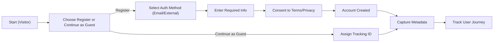
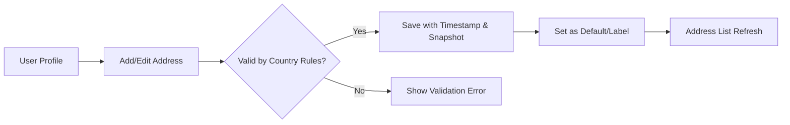

# User Management and Addressing Business Requirements for aiCommerce

## 1. Introduction
This document specifies all business requirements, rules, and workflows for user, address, and account management within the aiCommerce backend system, supporting global commerce, advanced analytics, and strict privacy compliance. Requirements are structured to directly inform backend development.

## 2. Business Context and Principles
aiCommerce serves as an AI-driven multi-channel commerce platform, requiring flexible, international-ready user management processes and robust privacy protections.

- **Business Objective:** Seamless onboarding, international profile/address support, rich account analytics/tracking, privacy, and third-party integration.
- **Key AI Differentiators:** Personalized onboarding, real-time analytics, smart verification, and AI-driven address validation.

## 3. User Types, Roles, and Permissions

### Supported User Roles
| Role     | Description                                                                                 |
|----------|---------------------------------------------------------------------------------------------|
| Visitor  | Unauthenticated/guest browsing public content; cannot purchase or manage personal data.    |
| Buyer    | Authenticated customer; can manage cart, orders, reviews, profile, addresses, favorites.   |
| Seller   | Member-seller; can manage store products, access basic analytics, interact with buyers.    |
| Admin    | Full system access (platform-wide management, user/seller control, compliance oversight).  |

### Role-Specific Permission Rules (Business Logic)
- THE system SHALL restrict purchasing, order, and account-management business actions to authenticated buyers, sellers, or admins only.
- WHEN a user is in the “visitor” role, THE system SHALL grant access only to public product listings, with no personal account or checkout actions permitted.
- WHERE a user is a seller, THE system SHALL expose only their own store, order, and analytics data; global platform data is restricted.
- WHERE a user is an admin, THE system SHALL enable actions for user management, compliance review, and reporting across all modules.

## 4. Customer Onboarding and Tracking

### Business Requirements (EARS)
- WHEN a new user accesses aiCommerce, THE system SHALL enable access as a guest (visitor) with anonymous tracking and assign a temporary tracking identifier.
- WHEN a user elects to register, THE system SHALL present registration workflows supporting: email, password, and external account options.
- WHEN a user completes registration, THE system SHALL create a user profile, assign a unique account identifier, and securely store all disclosed data.
- THE system SHALL capture and store onboarding metadata (IP, device info, referrer, channel) for all registrations and initial logins.
- WHERE an onboarding process is interrupted before completion, THE system SHALL retain partial progress (within privacy/legal boundaries) for a minimum period of 24 hours.
- WHEN tracking user actions, THE system SHALL distinguish between guest and logged-in journeys, merging data where identity is resolved.

### Workflow Diagram (Onboarding & Tracking)

## 5. Authentication Integration (External Services, Identity Verification)

### Business Requirements (EARS)
- THE system SHALL support federated login with major external providers (e.g., Google, Apple, Kakao) and national/international identity providers as permitted by law.
- WHEN a user chooses external authentication, THE system SHALL verify the authenticity and integrity of the third-party credential before linking or creating an aiCommerce profile.
- WHEN identity verification is required (e.g., for regulatory or payment purposes), THE system SHALL implement country- and channel-specific verification steps (such as mobile verification, document upload, or AI-based anti-fraud checks).
- THE system SHALL segregate external provider account metadata from local user records, recording external profile IDs and integrating only with user consent.
- WHERE a user links multiple external accounts, THE system SHALL merge journeys and ensure data integrity for the unified profile.

### Domain Rules
- THE system SHALL reject incomplete or inauthentic identity verifications and log them as security incidents.
- IF a federated authentication attempt fails, THEN THE system SHALL display a business-appropriate error, unlink any attempted associations, and flag the account for review if suspicious activity is detected.
- THE system SHALL allow users to manage, revoke, or switch their linked external logins at any time.

## 6. Address and Profile Management

### Core Requirements (EARS)
- WHEN a user (buyer/seller) adds or edits address information, THE system SHALL validate all fields according to the selected country/region specification.
- THE system SHALL support structured address storage: country code, region/state, city, postal/zip code, street address, building/unit, special instructions.
- WHERE multiple addresses exist per user, THE system SHALL allow flagging of one default shipping address and provide editing/removal for all.
- WHERE a user marks an address as favorite, THE system SHALL store a snapshot at favoriting time for later historical accuracy.
- WHEN an admin accesses user address data, THE system SHALL allow only partial (redacted) address views unless explicit access is granted for compliance processes.
- WHEN a user updates their profile, THE system SHALL allow changes to contact information, communication preferences, and locale settings, while validating all entries.
- IF an invalid address or profile entry is submitted, THEN THE system SHALL reject the request with a descriptive error and guidance on correction.
- THE system SHALL provide versioned address and profile change histories, capturing edit timestamps for audit and compliance.
- THE system SHALL support localization of address validation (formats, required fields, postal code masks) according to the country/region indicated.
- THE system SHALL allow saving, updating, and deleting addresses for all authenticated buyer and seller accounts.

### Workflow Diagram (Address Management)

## 7. International User Support

### Requirements (EARS)
- THE system SHALL provide internationalization (i18n) for address forms, error messages, and profile fields, adapting to user’s preferred language and local norms.
- WHEN presenting address or profile interfaces, THE system SHALL auto-format entry fields, validation, and help text as appropriate for the user’s selected country/locale.
- THE system SHALL support address and contact details for at least 200 countries/jurisdictions, conforming to recognized standards (UPU, ISO 3166-1, country-specific regulations).
- WHERE local compliance demands additional verification (e.g., customs ID, state tax ID), THE system SHALL dynamically request and store the required fields.

## 8. User Activity Analytics and Privacy

### Analytics Requirements
- THE system SHALL collect user activity data (site entry, product view, cart actions, orders, address/profile changes, consent events) for analytics, always respecting consent and country-specific privacy laws.
- WHEN a user consents to analytics, THE system SHALL log all activity in an auditable, exportable manner, tagged by role and channel.
- WHERE required by law (GDPR, CCPA, etc.), THE system SHALL provide users with actionable controls over data usage, analytics opt-out, and data export/deletion requests.
- THE system SHALL pseudonymize or anonymize analytics data for visitors and provide clear documentation for each data category collected.
- IF a user revokes consent for analytics tracking, THEN THE system SHALL immediately cease non-essential data collection and purge history as required by law.

### Privacy, Audit, and Compliance (EARS)
- THE system SHALL encrypt, pseudonymize, or redact all private/contact data fields at storage and transit layers.
- WHEN granting admin or compliance access, THE system SHALL log all access events for audit with user, time, and accessed data scope.
- THE system SHALL implement data retention and deletion policies that reflect the most restrictive legal obligation applicable to each user’s country of residence.

## 9. Business Rules, Error Handling, and Edge Cases

### Key Rules
- WHERE duplicated user records arise (e.g., external + local registration), THE system SHALL merge or flag records for user-driven reconciliation.
- IF a mandatory profile or address field is missing or formatted incorrectly, THEN THE system SHALL return a descriptive, actionable error.
- WHEN address validation fails repeatedly, THE system SHALL present region-specific examples and a clear recovery path (i.e., support/contact form link).
- THE system SHALL enforce uniqueness of primary identifiers (email, phone, external provider ID) per user account.
- THE system SHALL throttle repeated failed profile or address update attempts to prevent abuse.

## 10. Requirements Traceability and Success Criteria

### Traceability
- Each requirement above is mapped to EARS syntax wherever applicable.
- Success is measured by: accurate onboarding, minimal account friction, address/profile update success rate >99%, legal compliance across all jurisdictions, < 1% error rate on validated submissions.

---

This document delivers exhaustive business requirements for user onboarding, profiling, tracking, external authentication, address/international support, privacy, and analytics within aiCommerce. All technical implementation choices and detailed architecture are left to the backend development team as per project conventions.