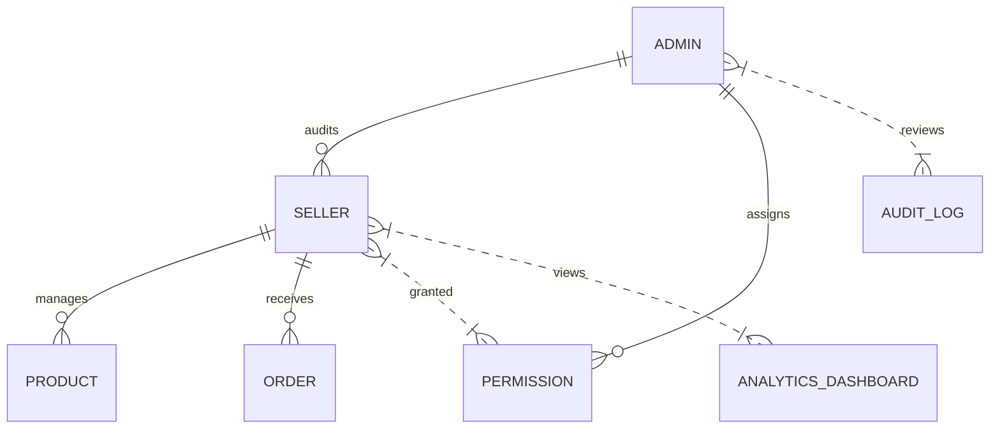

# AIMALL Backend Seller and Admin System

## Overview
The Seller and Admin System provides robust capabilities for onboarding merchants (sellers), managing their permissions, enabling business data analytics, and equipping platform administrators with comprehensive control functions. This document defines all requirements, user scenarios, and core service features, ensuring a scalable and transparent e-commerce environment.

---

## 1. Objectives
- Support seamless onboarding, verification, and management of sellers
- Provide role-based and granular permission assignment for sellers and administrators
- Equip sellers with product, sales, and customer analytics tools
- Enable administrators to audit, manage users, configure the platform, and monitor compliance

---

## 2. User Personas
- **Seller**: Registers as a merchant, manages inventory, tracks performance, interacts with buyers, and leverages analytics to grow business
- **Administrator**: Handles system-wide policies, seller audits, dispute resolution, compliance, and configuration

---

## 3. Seller System Requirements
- THE system SHALL enable merchant applicants to register, submit required documents, and track onboarding status.
- WHEN a seller completes registration, THE system SHALL validate data, trigger KYC/business credential checks, and flag for manual review if necessary.
- IF critical onboarding data is missing, THEN THE system SHALL display errors and prompt for correction.
- THE system SHALL allow sellers to manage product listings, edit inventory, and launch marketing campaigns.
- WHEN sellers access analytics, THE system SHALL display product, sales, and customer trends tailored by time-window and filter.
- WHERE sellers attain strong performance metrics, THE system SHALL enable eligibility for advanced features or incentives.

---

## 4. Administrator System Requirements
- THE system SHALL allow administrators full or scoped access by role hierarchy.
- WHEN a new seller onboard request is received, THE system SHALL prompt for review and approval/rejection.
- IF fraudulent or non-compliant activity is detected, THEN THE system SHALL restrict access and escalate for investigation.
- THE system SHALL enable bulk operations: user suspension, product recalls, compliance notifications, and data exports.
- WHILE the platform is in maintenance mode, THE system SHALL restrict seller/non-essential admin actions, providing appropriate notifications.

---

## 5. Permission and Role Management
- THE system SHALL support assignment of granular permissions (e.g., sales data view, inventory control, order management, campaign launch).
- WHEN an admin alters seller permissions, THE system SHALL log all changes and immediately enforce updated access controls.

---

## 6. Data Analytics and Reporting
- THE system SHALL deliver sellers detailed dashboards: revenue, conversion rates, inventory turnover, customer acquisition, and satisfaction metrics.
- WHERE anomalies are detected (e.g., sharp drop in sales), THE system SHALL highlight and provide actionable recommendations.
- THE system SHALL enable administrators to generate and export system-wide reports by category, date range, and user scope.

---

## 7. Security and Auditing
- THE system SHALL maintain audit logs for all permission changes, log-ins, sensitive operations, and compliance checks, with immutable storage.
- IF suspicious access patterns are detected, THEN THE system SHALL notify administrators and trigger adaptive authentication.

---

## 8. Acceptance Criteria
- All mandatory onboarding checks, permissions logic, analytics, and admin controls tested successfully.
- Role-based access validated for seller and admin personas.
- System audit log is comprehensive, immutable, and queryable by authorized staff.

---

## 9. ERD (Entity Relationship Diagram)

