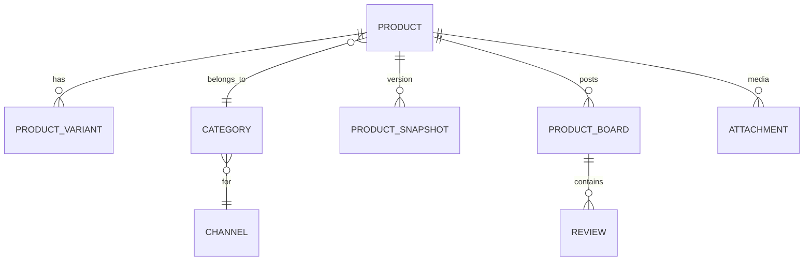

# 4. Product Domain: AI Shopping Mall Backend

## 1. Introduction
The Product Domain enables robust, scalable, and highly customizable product management for multi-channel e-commerce. This covers the full product lifecycle—creation, update, deletion—with support for variants, bundles, multimedia-rich content, and advanced categorization and discoverability. The architecture ensures auditability, extensibility, and supports AI-driven merchandising and analytics.

## 2. Objectives
- Empower sellers/admins to manage products flexibly across multiple channels/sites
- Enable AI-powered discovery, recommendations, and merchandising
- Provide full auditability via snapshotted version history
- Support rich content and advanced SEO
- Ensure customer trust via transparent boards and reviews

## 3. Key Features
### 3.1 Product Management
- **Product CRUD**: Create, read, update, delete products
- **Variants & Bundles**: Unlimited option/variant handling per product. Support for product sets, combos, and bundles
- **Snapshots**: Every product edit generates an immutable snapshot for full audit/history
- **Rich Media & Content**: Support images, video, markdown, and detailed specs
- **SEO Optimizations**: Editable metadata (title/description/keywords), friendly URLs, schema markup

### 3.2 Categorization & Search
- **Hierarchical Categories**: Channel-specific, tree-structured. Each product can appear in multiple categories
- **Tags/Attributes**: Flexible tagging—configurable per channel
- **Advanced Search**: Full-text, faceted, AI-optimized search APIs
- **Channel-Specific Customization**: Catalog structure is customizable by channel

### 3.3 Boards & Engagement
- **Product Bulletins**: Board per product (e.g., notices, FAQs)
- **Review System**: Tied to product snapshots for immutable, historical context. Attachments (media, docs)
- **Moderation & Trust**: Verified buyer badges, abuse reporting, moderation workflow

## 4. User Scenarios
| Persona          | Scenario                                                       |
|------------------|----------------------------------------------------------------|
| Seller/Manager   | Import products, define bundles, manage options per channel    |
| Admin            | Approve or moderate reviews, audit product change history      |
| Customer         | Discover via filters, read reviews/FAQs, trust transparent info|

## 5. Functional Requirements
| #  | Requirement                                                              |
|----|-------------------------------------------------------------------------|
| F1 | Product CRUD incl. variant/bundle support                                |
| F2 | Immutable product snapshots per change                                   |
| F3 | Category, tag, attribute, and search customization by channel            |
| F4 | Product/review/FAQ boards, linked to product and snapshots               |
| F5 | Attachments: images, video, markdown per product and board post          |
| F6 | AI-powered category/search optimization                                  |
| F7 | Moderation, buyer verification, abuse detection for engagement boards    |

## 6. Non-Functional Requirements
- **Scalability**: Millions of SKUs, real-time changes
- **Auditability**: Action log for all changes, irreversible snapshots
- **Extensibility**: Modular options/attributes per channel/domain
- **Security**: Permissions, RBAC, soft-delete support across all records
- **Localization**: Full i18n for products, categories, boards

## 7. Entity Overview (ERD/high-level)

## 8. Acceptance Criteria
- All product edits are snapshotted and audit-trailed
- Products support unlimited options, bundles, and media attachments
- Channel/category/tag system is fully customizable per channel
- Product boards/reviews are tied to product snapshot for historical trust
- Search is scalable, fast, and AI-optimizable

[Go back to TOC](./00_toc.md)
