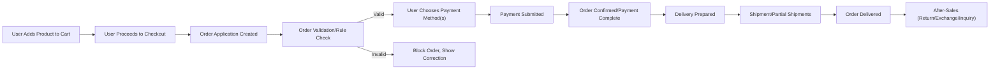
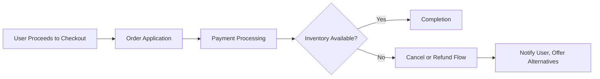

# Order, Cart, and Payment Workflows Requirement Analysis

## 1. Introduction
This document provides a complete, implementation-focused requirement analysis for the order, cart, and payment workflows of the shoppingMall backend. Every workflow, edge case, and business rule is specified using EARS format wherever possible. Auditability, automation, extensibility, and compliance are prioritized throughout. All requirements apply across channels and user types, enabling robust, global, and AI-augmented commerce operations.

## 2. Cart Management Logic

### 2.1 Cart Creation, Update, and Deletion
- WHEN a user (guest or member) adds a product to a cart, THE system SHALL create a persistent cart session (per-user, per-channel).
- WHEN a cart is created, THE system SHALL link the cart to the current product snapshot and record item-level selections (options, quantity, etc).
- WHEN a member logs in and has a pre-existing guest cart, THE system SHALL offer to merge or replace with the member’s saved cart.
- WHEN a user removes all items from a cart, THE system SHALL mark the cart as logically deleted, preserving history as a snapshot for 90 days.
- IF a cart remains inactive beyond the configured expiry period (default = 30 days), THEN THE system SHALL expire the cart and move its state to archived, retaining audit history but preventing further edits.
- WHERE cart templates are configured by sellers/admins, THE system SHALL reference these as default layouts during cart initialization.

### 2.2 Cart Item Handling & Validation
- WHEN a user changes cart item options (e.g., selects a different size), THE system SHALL revalidate all option-dependent constraints (inventory, price, eligibility).
- WHEN a user adds multiple units of the same product-option combination, THE system SHALL increment quantity in a single cart line, updating inventory in real time.
- THE system SHALL reject addition of products/options with insufficient inventory and notify the user.
- IF conflicting options are selected (e.g., incompatible variants), THEN THE system SHALL prevent cart update and display an actionable error message.
- WHEN a product is removed from the catalog or is unpublished, THE system SHALL keep such items in the cart as inactive and inform the user when viewing cart or attempting checkout.

### 2.3 Guest vs Member Cart Flows
- WHERE user is not authenticated, THE system SHALL store the cart in a session cookie (or device-local context) and synchronize it upon authentication.
- WHEN user authentication occurs, THE system SHALL prioritize member cart as the source of truth, providing users with a clear merge/overwrite choice.
- WHERE local laws or compliance require consent for cookie/storage use, THE system SHALL seek explicit consent before persisting non-member carts.

### 2.4 Integration with Product Snapshots & Options
- WHEN products or options are modified after being added to the cart, THE system SHALL retain a reference to the carted snapshot version until order conversion or cart item removal.
- WHERE system supports bundled/composite products, THE system SHALL track required and optional unit selections as discrete cart lines while maintaining composed bundle semantics.

### 2.5 Cart Expiry, Recovery, Batch Operations
- WHEN users return after cart expiry/archival, THE system SHALL allow for viewing archived carts (read-only) and easy recovery/re-addition into a new cart.
- THE system SHALL support batch item operations, such as moving, deleting, or selecting multiple items for checkout.
- Performance Requirement: Cart operations (add, update, delete, view) SHALL complete within 1 second under normal load.

### 2.6 Error Scenarios & User Feedback
- IF any validation fails during cart operations (inventory, option, etc.), THEN THE system SHALL display actionable feedback specific to the root cause.
- IF a concurrent modification is detected (e.g., same cart modified from different devices), THEN THE system SHALL detect the conflict, prevent data loss, and present the user with resolution options.

## 3. Order Creation and Processing

### 3.1 Cart-to-Order Transformation
- WHEN a user proceeds to checkout, THE system SHALL transform current active cart items into a new order application, referencing product/option/membership/coupon snapshots.
- THE system SHALL validate all business rules (option, inventory, membership, coupons, address) as part of pre-order checks.
- Performance Requirement: Cart-to-order conversion SHALL complete within 2 seconds under normal load.
- IF any business rule fails (e.g., invalid option), THEN THE system SHALL block order submission and provide clear correction steps.
- WHEN checkout is confirmed, THE system SHALL clear the items from the originating cart and update cart/order histories accordingly.

### 3.2 Multi-stage Order Processing Flow
- THE order workflow SHALL support application (pending), confirmation (paid), partial fulfillment, shipment, delivery, and closure (completed or cancelled).
- WHEN an order contains items from multiple sellers, THE system SHALL split the order into logical sub-orders for fulfillment, tracking, and payment distribution.
- WHERE multi-stage fulfillment is needed (e.g., partial shipments), THE system SHALL represent each segment or shipment batch as a distinct delivery/tracking record.

### 3.3 Partial Order Fulfillment & Split Orders
- WHEN a user orders multiple products with different preparation or shipping timelines, THE system SHALL allow each product (or set) to advance independently through the fulfillment stages.
- IF an item becomes unavailable post-order application but pre-confirmation, THEN THE system SHALL offer user options (substitute, cancel part/order, or hold for resolution).

### 3.4 Order Validation, State Management, and Snapshots
- WHEN any order state changes (applied, paid, shipped, delivered, cancelled, returned), THE system SHALL record a full snapshot for audit and evidence.
- THE system SHALL prevent state regressions (e.g., delivered cannot become pending).
- IF any illegal state transition is attempted (via API or UI), THEN THE system SHALL log a security/audit event and prevent the change.

### 3.5 Order History, Analytics, and Evidence Preservation
- THE system SHALL provide users and staff with full order/shipment/payment histories, including time-stamped state changes and all associated snapshots.
- WHERE required for legal compliance, THE system SHALL archive all deletions as logical/soft (never destructive delete) and retain audit trails for the legally mandated retention period.

### 3.6 Business Rule Enforcement & User Scenarios
- THE system SHALL enforce channel- and product-specific business rules (coupon stacking, eligibility, inventory gating, etc.) at order time.
- WHEN a customer applies multiple coupons or mixed payment methods, THE system SHALL sequentially validate each condition and display both eligible and ineligible usage with specific reasons.

### 3.7 Error and Exception Flows
- IF payment is confirmed but a subsequent error occurs during inventory assignment, THEN THE system SHALL either roll back payment or initiate refund workflow within 10 seconds.
- IF an order encounters external system failure (e.g., payment gateway timeout), THEN THE system SHALL retry (configurable) or present error options (retry/cancel/ask support).

## 4. Payment and Transaction Rules

### 4.1 Payment Method Management (Multi-channel)
- THE system SHALL support diverse payment methods per channel (credit card, bank transfer, virtual account, deposit, mileage, third-party, global/local options).
- WHERE payment method is channel- or country-specific, THE system SHALL present only valid choices based on user context (region, device, channel).

### 4.2 Payment Application, Confirmation, and Asynchronous/Third-Party Integration
- WHEN user submits order for payment, THE system SHALL initiate payment application and transition order to 'pending-payment'.
- WHEN external/asynchronous payment is used (e.g., virtual account), THE system SHALL monitor for payment confirmation events and transition to 'paid' only on receipt.
- IF payment is not confirmed within the defined timeframe (e.g., 24 hours), THEN THE system SHALL auto-cancel the order and notify the user.
- WHERE multiple payment steps are required (split, installments), THE system SHALL track each payment against the corresponding order segment.

### 4.3 Split Payments, Mixed Payment Support
- WHEN a user combines payment methods (e.g., deposit + credit card + coupon), THE system SHALL allocate amounts proportionally (following valid combinations and prioritization rules), documenting each in the payment ledger.
- WHERE coupons reduce payable amounts, THE system SHALL apply these before external payments, always tracking actual discounts versus payments.

### 4.4 Payment State Tracking, Cancellations, Refunds, Audit
- WHEN order/payment cancellation is requested (by user or due to error), THE system SHALL initiate refund across all payment methods used for the order.
- IF partial delivery/fulfillment occurs, THEN THE system SHALL support partial refunds, with each refund mapped to specific order items and payment segments.
- THE system SHALL retain complete payment and refund logs for every transaction, with audit and compliance metadata for at least the minimum regulatory retention period.

### 4.5 Compliance & PCI, Security, Error Handling
- THE system SHALL never store raw payment credentials or sensitive information, processing all payments through PCI DSS-compliant flows.
- WHERE payment errors or declines occur, THE system SHALL present actionable and localized error messages, logging all events for audit.
- IF repeated payment failures are detected (patterned by account/IP), THEN THE system SHALL trigger fraud detection flows and optionally require additional verification, notifying admins via dashboard/alert.

## 5. Delivery, Fulfillment, and Status Tracking

### 5.1 Delivery Flow (Stages, Partial Deliveries, Combined Shipments)
- THE delivery workflow SHALL support all major stages: preparation, packing, shipping, in-transit, delivered, and completed (with timestamps for each).
- WHEN orders have products from multiple sellers or warehouses, THE system SHALL optimize delivery by allowing combined shipments where possible but always tracking discrete segments for fulfillment and notification.

### 5.2 Integration with External Logistics/Tracking
- WHERE external logistics providers are used, THE system SHALL interface via API or batch import/export, capturing tracking numbers and associated events.
- THE system SHALL offer real-time delivery/status updates to users, reflecting logistics provider state as soon as available.
- IF logistics provider integration fails, THEN THE system SHALL fall back to manual entry and display clear warning messages to staff/users.

### 5.3 Delivery Status, Notifications, and History
- WHEN shipment state changes, THE system SHALL push notifications (in-app, email, SMS per user setting) reflecting the new state and any customer actions needed.
- THE system SHALL record all delivery-related events (handover, delays, exceptions) in the order and delivery history, visible to all authorized roles.

### 5.4 Exception and Delay Management
- IF a shipment is delayed beyond the promised delivery window, THEN THE system SHALL proactively notify customers, provide status, and offer remediation (compensation, support contact, etc.).
- THE system SHALL allow customers and staff to initiate delivery exception workflows (lost/damaged, misrouted, etc.)

### 5.5 International and Multi-step Fulfillment
- WHERE delivery involves international shipping, THE system SHALL support necessary customs, tax, tracking, and user data requirements, presenting these requirements at order time.
- THE system SHALL segment and track multi-step fulfillment flows (e.g., local pickup, warehouse transfer, final mile delivery), recording timestamps and snapshots at each stage.

## 6. After-Sales Service

### 6.1 Return, Exchange, and Refund Management
- WHEN a customer initiates a return/exchange request, THE system SHALL validate the request against order/snapshot data (eligibility, time limits, item condition).
- THE system SHALL record return/exchange processing, with status, reason, and outcome linked to the original order snapshot.
- IF the return/exchange request is rejected, THEN THE system SHALL provide specific reasons and escalation paths.
- THE system SHALL automatically process refunds for approved returns and update payment history accordingly.
- ONLY items approved for return/exchange/refund SHALL re-enter inventory, tracked in inventory logs.

### 6.2 Inquiry and Support Integration
- WHERE an after-sales service request is made, THE system SHALL automatically provide access/update to related inquiry or support thread, linking all relevant order/item data.
- THE system SHALL allow users to track the progress of after-sales service requests and notify them upon changes or resolution.

### 6.3 Evidence Tracking, Snapshots, Legal Compliance
- THE system SHALL archive every return/exchange event as a snapshot, reconstructable in audits or disputes.
- WHERE required by law, THE system SHALL provide downloadable records for customer and authority use.
- Retention period for all after-sales data SHALL comply with the strictest applicable jurisdiction (configurable).

### 6.4 Performance and Error Handling Requirements
- All after-sales workflows SHALL be processed and reflected in the system within 5 seconds for standard operations.
- IF error or unexpected event occurs, THEN THE system SHALL log the event and present recovery or escalation options to both user and staff, without data loss.

## 7. Mermaid Diagrams: Process/Flow Summaries

### 7.1 Order-to-Fulfillment Main Workflow

### 7.2 Exception Handling - Payment and Inventory

## 8. Success Criteria & Appendices

### 8.1 Performance Benchmarks
- Cart operations (add, update, view, delete): under 1 second
- Cart to order conversion: under 2 seconds
- Payment and after-sales workflows: under 5 seconds where possible; exceptions logged and flagged for review

### 8.2 Validation Rules & Error Handling
| Step                        | Validation Rule/Check                                  | Error Handling                                   |
|-----------------------------|-------------------------------------------------------|---------------------------------------------------|
| Add to Cart                 | Inventory, option selection, product status            | Show error, disable add, offer alternatives      |
| Checkout/Order Application  | Business rules, address, coupon, payment method        | Show correction steps, block order submission    |
| Payment                     | Payment confirmation, fraud checks, timeout            | Retry/cancel/refund, escalate if needed          |
| Delivery                    | Address and logistics validation                       | Manual update, customer/staff notification       |
| After-Sales                 | Eligibility, timing, item condition                    | Offer escalation, log reason, retain snapshot    |

### 8.3 Compliance Requirements Reference
- PCI DSS for payment data
- GDPR/CCPA for user and order data
- Tax, customs, cross-border requirements for shipping
- Accessibility (WCAG), internationalization for all user interactions

---
For related system context, refer to the [Service Vision and Business Model](./01-service-vision-and-business-model.md), [User Roles and Authentication](./02-user-roles-and-authentication.md), [Product and Catalog Management](./04-product-and-catalog-management.md), [Discounts, Coupons, and Loyalty Programs](./06-discounts-coupons-and-loyalty-programs.md), and [Business Rules, Exception Handling, and AI Features](./10-business-rules-exception-handling-and-ai-features.md).
