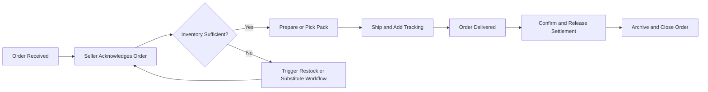

# Seller Journey User Stories and Requirements

## 1. Seller Onboarding and Verification

### Overview
The onboarding process enables a member (customer) to become a verified seller with permissions to register and manage products, fulfill orders, and access merchant tools.

### Business Requirements (EARS)
- WHEN a member requests seller onboarding, THE system SHALL initiate seller registration with identity and business verification.
- WHEN required documentation is incomplete or invalid, THE system SHALL notify the applicant of all deficiencies and required next steps.
- WHEN seller requirements are met and verification is approved, THE system SHALL activate seller permissions and provide access to the merchant dashboard.
- IF a seller application is rejected, THEN THE system SHALL state specific reasons and remediation steps.
- WHEN onboarding is successful, THE system SHALL send a confirmation notification to the new seller.

### Seller Profile and Verification Details
- Seller profiles include business name, registration number, official contact, settlement account info, and compliance documents; all data must be reviewed for authenticity.
- THE system SHALL offer KYC(know-your-customer) and AML(anti-money laundering) screening for new and updating sellers, using configurable rule sets.
- WHEN a seller needs to update core business information, THE system SHALL enforce a re-verification step before changes take effect.

### Edge/Error Scenarios
- IF documents are expired or invalid, THEN THE system SHALL request re-submission with clear error messages.
- WHERE external verification services are interrupted, THE system SHALL queue applications and notify users of the delay.

### Performance Expectations
- ALL seller verification decisions SHALL be communicated within 2 business days of complete submission.

## 2. Product Registration and Catalog Management

### Overview
Sellers manage product lifecycle from creation and updates to deactivation, including options, bundles, and content for multiple sales channels and categories.

### Business Requirements (EARS)
- WHEN a seller begins new product registration, THE system SHALL collect all required product attributes (category, section, title, description, price, options).
- WHEN any required field is omitted, THE system SHALL flag the error and require correction before saving.
- WHEN a seller submits a product for listing, THE system SHALL validate against compliance policies (prohibited items, category fit).
- WHEN approved, THE system SHALL make the product visible in the appropriate channels and sections based on seller configuration.
- WHEN a seller edits a product, THE system SHALL create a versioned snapshot to preserve history.
- WHERE a product is listed in multiple channels or categories, THE system SHALL allow channel/category-specific descriptions and pricing.
- WHEN a seller pauses or deactivates a product, THE system SHALL retain the product in the catalog as inactive, preserving its record for evidence.
- IF duplicate or fraudulent products are detected, THEN THE system SHALL notify the seller and may suspend the product or seller account as per business rules.

### Catalog and Variant Logic
- Sellers can define bundles, variants (required/optional units), and complex options; inventory is tracked at the option/bundle level.
- THE system SHALL support bulk product operations for large catalogs.

### Error Scenarios
- IF a category is deprecated or changed, THEN THE system SHALL prompt the seller to reclassify affected products.
- IF product submission fails compliance, THEN THE system SHALL present specific issues and allow resubmission.

### Performance Expectations
- Product registration, editing, and snapshot creation SHOULD feel near-instant (<3 seconds) for the seller’s experience.

## 3. Order Fulfillment and Management

### Overview
Sellers receive, process, and update orders through a structured lifecycle, including partial fulfillment, status management, and customer support for post-purchase actions.

### Business Requirements (EARS)
- WHEN a buyer places an order, THE system SHALL notify the seller, including complete order and buyer info needed for fulfillment (excluding sensitive data per policy).
- WHEN a seller acknowledges an order, THE system SHALL support status transitions: received → preparing → fulfilled → shipped → delivered.
- WHERE partial orders occur, THE system SHALL allow split shipping and status updates for each order line.
- WHEN an order item is returned or exchanged, THE system SHALL provide the seller with reason codes, supporting evidence, and required action timeframes.
- IF inventory is insufficient when confirming an order, THEN THE system SHALL prevent seller acceptance and trigger a restock or substitution workflow.
- WHEN delivery is complete, THE system SHALL allow sellers to finalize the transaction and access settlement/disbursement information.

### Order Management Tools
- THE system SHALL provide sellers with order search, filtering, batch status update, and export (CSV/Excel) options.
- Processing timelines for each order stage must be explicitly tracked and made visible to sellers.

### Error and Edge Cases
- IF fulfillment is delayed beyond expected service levels, THEN THE system SHALL alert the seller and optionally the buyer.
- IF buyer claim or dispute is filed, THEN THE system SHALL freeze relevant order actions and initiate an evidence collection and mediation workflow.

### Performance Expectations
- Sellers SHALL be able to update order status and add tracking in real time (<2 seconds typical).
- Settlement data SHALL be available within 24 hours of confirmed delivery.

## 4. Handling Inquiries and Reviews

### Overview
Sellers respond to buyer questions, manage product reviews, and engage in official communications per compliance and quality standards.

### Business Requirements (EARS)
- WHEN a buyer submits a product inquiry, THE system SHALL notify the seller and present a ticketed workflow for response.
- WHEN a seller responds to an inquiry, THE system SHALL log the reply (and any edits) as a snapshot for evidence.
- WHERE an inquiry is set as private, THE system SHALL ensure only the involved buyer and seller have access.
- WHEN a product receives a review, THE system SHALL display it with verification (purchased buyer), timestamp, and allow the seller to respond.
- IF a review violates platform guidelines, THEN THE system SHALL enable sellers to flag the review for admin review.
- WHEN a seller comments on a review or inquiry, THE system SHALL notify the buyer and track the exchange history.

### Error Scenarios
- IF there is a system outage or notification failure, THEN THE system SHALL log the event and alert admins for remediation.

### Performance Expectations
- Seller and buyer communications, including replies and notifications, SHOULD be delivered instantly or within 10 seconds.

## 5. Sales Analysis and Business Adjustments

### Overview
Sellers have access to dashboards displaying performance, enabling data-driven decisions for pricing, stock, and promotional campaigns.

### Business Requirements (EARS)
- WHEN a seller visits the sales dashboard, THE system SHALL provide real-time (updated at least hourly) metrics of sales volume, returns, conversion rates, and revenue.
- WHERE data anomalies or suspicious patterns are detected, THE system SHALL alert the seller and suggest pre-configured actions (e.g., review for fraud).
- WHEN a seller investigates underperforming products, THE system SHALL offer analytics on reviews, competition, and traffic sources.
- WHEN a seller initiates a campaign or price adjustment, THE system SHALL apply changes transparently, updating all relevant product records and notifying affected buyers if material changes occur.
- THE system SHALL support export and visualization of sales and marketing data in common formats.

### Performance Expectations
- Sales metrics and analytics reports SHALL be accessible within 5 seconds for SKU-level queries, and batch exports SHALL be available within minutes depending on data size.

## 6. Summary of Seller Permissions and Responsibilities

| Feature / Action                             | Customer | Seller | Admin |
|----------------------------------------------|----------|--------|-------|
| Apply for Seller Account                     | ❌       | ✅     | ✅    |
| Onboard/Verify as Seller                     | ❌       | ✅     | ✅    |
| Register/Edit Products                       | ❌       | ✅     | ✅    |
| Manage Inventory                            | ❌       | ✅     | ✅    |
| Process Orders & Fulfillment                 | ❌       | ✅     | ✅    |
| View/Respond to Inquiries and Reviews        | ❌       | ✅     | ✅    |
| Run Promotions and Campaigns                 | ❌       | ✅     | ✅    |
| Access Sales Metrics/Analytics               | ❌       | ✅     | ✅    |

- Sellers have authority only over their own products, orders, and data. Access to aggregate or competitor data is restricted to admins.
- Sellers are responsible for the accuracy of their listings and timely fulfillment. Non-compliance may result in account suspension.
- The system SHALL automatically log all seller actions for audit purposes and evidence preservation.

## 7. Business Flows: Seller Order Processing

## 8. Error Handling and Seller Support
- IF a seller encounters an unexpected system error, THEN THE system SHALL provide a clear error code, suggested action, and 24/7 support contact.
- WHEN seller access is restricted (compliance or payment issues), THE system SHALL explain the cause and remediation process in business terms.
- THE system SHALL monitor for repeated seller errors or disputes and, if thresholds are crossed, notify admins for further review.

# End of Document

For further process-level requirements, refer to the [Functional Requirements](./03-functional-requirements.md) and cross-reference with [User Roles and Authentication](./02-user-roles-and-authentication.md).