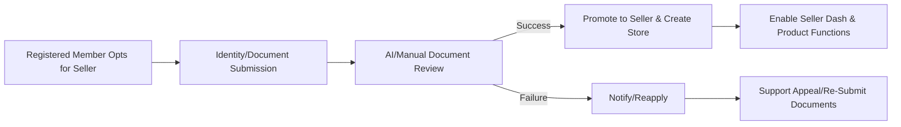
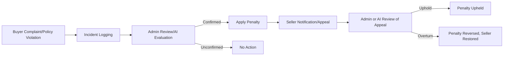

# Seller Management Functional Requirements

## 1. Introduction & Context
The aiCommerce platform supports a multi-role ecosystem where registered users may become sellers, operating their own stores and product inventories. Seller management covers onboarding, product/store administration, analytics, role elevation, and the resolution of business events such as disputes and compliance requirements. This document details all business logic and scenarios required by backend developers to build robust seller management features that meet compliance, auditability, AI integration, and scalability expectations.

## 2. Seller Onboarding
### 2.1 Registration and Verification
- WHEN a registered member opts to become a seller, THE system SHALL allow initiation of a seller registration process.
- THE system SHALL require identity verification (KYC), collection of required business documents, and agreement to platform terms prior to enabling seller privileges.
    - Data captured includes full name, legal entity, tax IDs, bank account info (for payouts), verified contact details, and regional compliance documents where applicable.
- IF registration documents are incomplete, invalid, or expired, THEN THE system SHALL prevent seller promotion and prompt corrective action.
- WHEN all documents are validated, THE system SHALL flag the account for manual or AI-assisted review (AI supports fraud detection, entity validation, document consistency verification).
- ON successful review, THE system SHALL upgrade the user's role to seller, provision a store dashboard, and enable seller workflows.
- WHILE under review, THE member SHALL retain only non-seller functions (buy, browse, inquiry, etc.).
- IF verification is rejected, THEN THE system SHALL notify the member with reason code and guidance for appeal or re-application.
- THE system SHALL log all onboarding steps with timestamped audit records for compliance and future review.

### 2.2 Escalation and Dispute Management (During Onboarding)
- WHEN onboarding stalls past a defined SLA, THE system SHALL notify both user and admin to intervene.
- IF identity fraud, document tampering, or regulatory violations are detected, THEN THE system SHALL escalate to admin review and suspend account provisioning until resolution.
- IF legal escalation is needed (regulatory complaint, fraud case), THEN THE system SHALL enable evidence extraction and legal handover procedure as per compliance policy.

## 3. Product and Store Management
### 3.1 Product Registration, Editing, and Status
- ONLY active sellers MAY register or edit products, subject to platform policy.
- WHEN a seller registers a product, THE system SHALL enforce input validation for each required attribute (title, description, price, category, inventory, options, images, compliance tags, etc.).
- WHEN a product is created or edited, THE system SHALL generate an immutable snapshot for versioning, rollback, and legal evidence.
- THE system SHALL allow products to have one of the following statuses: draft, published, paused, suspended, out-of-stock, discontinued.
- WHEN a product is modified, THE system SHALL update availability, notify relevant customers (e.g., watchlists, favorites), and recalculate search/discovery eligibility.
- IF compliance violations (e.g., illegal goods, prohibited content) are detected, THEN THE system SHALL automatically suspend the product listing and notify seller/admin with rule references.
- THE system SHALL support batch-edit and bulk-upload processes with full audit trails.

### 3.2 Store-level Management
- THE system SHALL link each seller to one or more stores, each with unique branding, profile, business licenses, banking information, and regional settings.
- WHEN sellers edit store profiles, THE system SHALL apply approval workflows if policy/config dictates.
- STORE-level settings SHALL govern product defaults, shipping rules, returns, local compliance, and holiday hours.
- IF store identity or banking info is altered, THEN THE system SHALL require re-verification and log all changes with immutable history.

### 3.3 Compliance and Snapshotting
- THE system SHALL maintain immutable, timestamped snapshots of all product, store, and seller profile changes for audit, dispute resolution, and legal evidence.
- WHEN an admin or authorized auditor queries history, THE system SHALL retrieve all relevant snapshots per legal, regulatory, or dispute context.

## 4. Seller Analytics & Performance
### 4.1 Performance Metrics and Dashboards
- THE system SHALL present sellers with dashboards containing real-time and historical metrics: sales volumes, revenue, conversion rates, order fulfillment times, returns, refund rates, product view/click stats, and customer satisfaction scores.
- Metrics SHALL be exportable by time window, product, category, or market segment, subject to privacy and data retention rules.
- WHEN key performance indicators (KPIs) fall below policy thresholds (e.g., high return rate, slow shipping, poor CSAT), THE system SHALL alert sellers and optionally trigger AI-powered recommendations.

### 4.2 AI-Driven Insights
- THE system SHALL provide sellers with AI-generated insights, such as sales forecasts, stockout predictions, personalized marketing suggestions, demand spikes, and competitive positioning.
- WHEN anomalies in seller performance are detected (e.g., fraud patterns, order spikes), THE system SHALL automatically flag for admin review, notify the seller, and initiate monitoring workflows.
- THE system SHALL leverage AI to assess review sentiment and suggest policy changes or improvements to sellers.

## 5. Penalties, Escalation, and Dispute Resolution
- WHEN buyer complaints, returns above threshold, or policy violations occur, THE system SHALL log each incident and notify seller and admin with severity classification.
- IF admin review confirms infractions, THEN THE system SHALL apply penalties per escalation matrix: warning, temporary suspension, permanent removal, or regulatory reporting.
- Sellers SHALL be allowed to appeal decisions, uploading supporting documentation for admin or AI-assisted re-evaluation.
- THE system SHALL track all escalations, penalties, and outcomes for seller profile audits and systemic reporting.

## 6. Role Elevation and Seller Lifecycle
### 6.1 Member-to-Seller Promotion
- WHEN a member fulfills all onboarding, verification, and policy obligations, THE system SHALL promote the role to seller and enable store/product features immediately.
- THE promotion SHALL be atomic and transactional (no partial state permitted).

### 6.2 Seller Role Termination and Downgrade
- Sellers MAY voluntarily request demotion to member; THE system SHALL require withdrawal of active listings and settlement of financial obligations prior to role change.
- IF severe policy or legal violations are confirmed, THEN THE system SHALL forcibly downgrade or terminate the seller role, with immediate suspension of stores/products and preservation of evidence.

### 6.3 Re-verification and Appeal
- WHEN major profile (identity or banking) changes are submitted, THE system SHALL require re-verification (KYC, compliance docs) and restrict selling privileges until completion.
- IF a seller is suspended or penalized, THEN THE system SHALL provide a configurable re-application/appeal mechanism, audit all appeals, and document reasons for decision.

## 7. Business Rules and Error Handling
### 7.1 Validation Logic
- THE system SHALL enforce required completeness and validity for all seller/store/product registration, including locale-compliant formatting and field constraints.
- WHEN duplicate legal entities, tax IDs, or banking details are detected, THE system SHALL block registration and trigger anti-fraud review.
- IF rate limits or abuse patterns are detected on seller creation/modification endpoints, THEN THE system SHALL throttle actions, log incidents, and notify security personnel.
- All errors SHALL be returned with descriptive business error codes/messages specifying corrective action.

### 7.2 Performance and User Experience
- Seller workflow actions (onboarding, product CRUD, analytics dashboard queries) SHALL complete within 2 seconds under normal load.
- Audit and compliance data retrieval operations SHALL complete within 10 seconds for requests covering 12+ months.
- All AI-powered insights and alerts SHALL be updated on a minimum hourly, maximum daily cycle or on real-time trigger for critical anomalies.

### 7.3 AI Service Integration
- All AI processes (fraud detection, onboarding verification, analytics) SHALL be modular, auditable, and capable of fallback to manual review in case of unavailability or conflicting decisions.
- Sellers SHALL have access to AI-supplied recommendations but final business actions (discount creation, marketing launch, escalation resolution) SHALL require explicit consent or override by seller/admin.

## 8. Mermaid Diagrams: Seller Lifecycle & Dispute Handling
### 8.1 Seller Promotion Workflow

### 8.2 Dispute and Penalty Flow

## 9. Related Documents
- For detailed permission and authentication structures, see [User Roles and Authentication Requirements](./02-user-roles-and-authentication.md).
- For complementary business rules, please refer to [Business Rules and Compliance](./14-business-rules-and-compliance.md).
- Product, Inquiry, and Bulletin Board flows are described in [Product Management Requirements](./06-product-management.md) and [Bulletin, Inquiry, and Review Requirements](./08-bulletin-inquiry-review.md).

---
> *Developer Note: This document defines business requirements only. All technical implementations (architecture, APIs, database design, etc.) are at the discretion of the development team.*