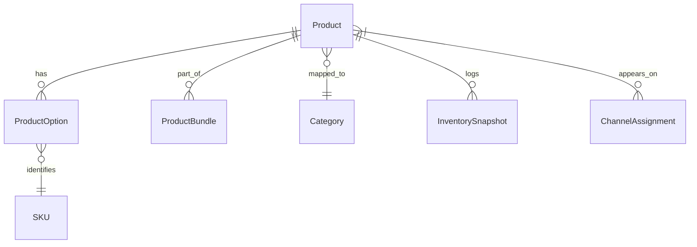

# 05_AIMALL Backend Product Management

## 1. Overview
THE Aimall backend product management system SHALL provide comprehensive tools for managing the entire product lifecycle, including catalog, inventory, category mapping, pricing, channel assignments, and AI-powered content optimization.

## 2. Objectives
- Ensure robust, scalable management of complex product catalogs for multi-seller environments
- Enable real-time synchronization of inventory and pricing across channels
- Support diverse product structures: standalone, option-based, bundles, and virtual products
- Provide tools for AI-driven optimization and monitoring of product content

## 3. User Personas
| Role        | Description                                                                                      |
|-------------|--------------------------------------------------------------------------------------------------|
| Customer    | Browses, searches, and discovers products. Sees options, bundles, availability, and reviews      |
| Seller      | Manages product listings, options, inventory, pricing, bundles, and promotional content          |
| Admin       | Oversees global product standards, enforces compliance, manages category and channel mapping     |

## 4. Product Types and Options
- Standalone products: Base purchasable units
- Option products: Variants (color, size, etc.)
- Bundles: Logical sets of products (optional/required components)
- Channel-specific: Products available on select marketplaces or sections
- Virtual/Digital: Subscription codes, VOD, non-physical inventory

## 5. Functional Requirements (EARS)
- THE product management system SHALL allow sellers to create, modify, and inactivate products.
- WHEN a seller defines product options, THE system SHALL generate all valid SKU combinations.
- WHILE a product is active, THE system SHALL track inventory levels and synchronize depletion from all sales channels.
- IF a product reaches zero inventory, THEN THE system SHALL automatically set status to 'out of stock'.
- WHEN an admin updates product categories, THE system SHALL instantly propagate changes to all mapped channels.
- WHERE AI content optimization is enabled, THE system SHALL analyze and recommend improvements for product titles, descriptions, and images.
- WHEN a bundle is created, THE system SHALL require definition of bundle rules (mandatory/optional components).

## 6. Non-Functional Requirements (EARS)
- THE system SHALL support real-time updates and availability status for customers.
- THE system SHALL record product snapshot history for all critical changes (price, inventory, availability).
- WHERE product hierarchy exists, THE system SHALL support up to three levels (main category, sub-category, section).
- THE system SHALL ensure atomic transactions for inventory adjustments.
- WHILE high concurrency, THE system SHALL remain responsive (<350ms typical update latency).

## 7. Data Model Outline (ERD Example)

## 8. AI-Driven Content Optimization
- Process: Sellers upload content → AI scans for quality, compliance, keywords, and image standards → Suggestions/action items generated.
- Metrics: Content score, compliance pass/fail, keyword density, inappropriate content flag.

## 9. Acceptance Criteria
- Products and options can be created, updated, and logically deleted.
- Inventory is accurately updated and visible across all channels.
- All product changes are logged with timestamps and responsible user.
- Bundles enforce defined composition and pricing.
- AI reviews are actionable and offer measurable uplift in content score.

## 10. Related Documents
- [06_aimall-backend_bulletin-board-and-community.md](./06_aimall-backend_bulletin-board-and-community.md)
- [04_aimall-backend_seller-and-admin-system.md](./04_aimall-backend_seller-and-admin-system.md)
- [08_aimall-backend_order-and-delivery-system.md](./08_aimall-backend_order-and-delivery-system.md)
