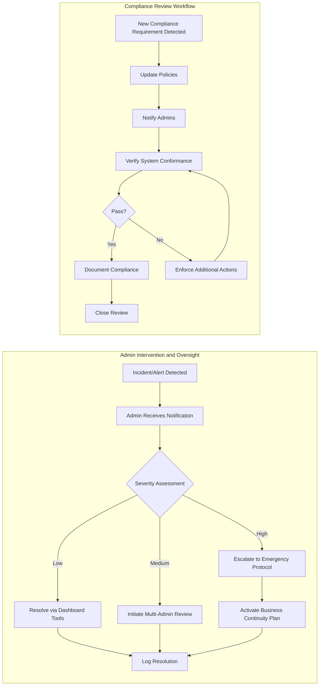

# Admin Journey User Stories and Business Requirements (AI Shopping Mall Backend)

This document provides a comprehensive, business-centric analysis of the administrator journey in the AI-powered shopping mall backend. It covers account lifecycle, user and seller oversight, compliance monitoring, secure system operation, and incident response, ensuring seamless and lawful platform management. All requirements use EARS syntax where appropriate.

## 1. Admin Account Lifecycle

- WHEN a new administrator is required, THE admin onboarding process SHALL support secure, multi-factor authenticated account creation, logged as a traceable event.
- WHEN an administrator's status changes (suspension, escalation, removal), THE system SHALL limit or revoke administrative permissions and maintain audit trails.
- WHERE an administrator's permissions are escalated, THE system SHALL require another admin's approval for escalation and log the action.
- WHEN contact details of an administrator are updated, THE system SHALL validate input (format, authenticity) and log changes.
- WHILE an admin account is active, THE system SHALL allow secure password updates, forced logouts by security policy, and deactivation/reactivation operations.
- IF a former administrator is offboarded, THEN THE system SHALL revoke all access, anonymize personal data per compliance policy, and log final actions.
- THE system SHALL maintain full role and permission traceability for every admin lifecycle event, linked to compliance reporting.

## 2. User Management

- WHEN reviewing user or seller accounts, THE admin SHALL be able to search, filter, and view all profile, status, and compliance-linked data using multiple criteria (name, ID, channel, activity).
- WHEN a policy violation or suspicious activity is detected, THE admin SHALL be able to freeze, restrict, or update user access, and these actions SHALL be logged with evidence snapshots.
- IF a user requests deletion or modification of their data, THEN THE admin SHALL review and approve/deny requests within business SLA, ensuring legal compliance (e.g., GDPR, CCPA).
- WHEN membership escalations, demotions, or status exceptions occur, THE system SHALL trigger a mandatory review/override workflow for administrative oversight.
- THE admin SHALL have access to historic activity logs and account histories, presented with audit-compliant snapshots.
- WHEN bulk actions (multi-account suspensions, permission grants) are performed, THE system SHALL require two-step confirmation and log all affected entities.
- IF an error or policy breach occurs during user management, THEN THE system SHALL generate automated alerts, requiring timely admin intervention and providing guided recovery steps.

## 3. System Monitoring and Auditing

- THE admin dashboard SHALL provide real-time views of platform health, transactional integrity (orders, payments), inventory states, and active user/seller metrics.
- WHEN critical anomalies (e.g., payment failures, order spikes, inventory shortages) are detected, THE system SHALL notify admins instantly and provide immediate drill-down analytics.
- THE system SHALL aggregate operational logs, security events, and compliance records accessible to admin, including all privilege escalations and sensitive operations.
- WHEN an admin views or downloads log files or sensitive reports, THE system SHALL require authentication and log access events for audit compliance.
- WHILE business-critical dashboards are in use, THE system SHALL continuously refresh data (e.g., every 60 seconds) without degrading admin user experience.
- IF a suspicious admin action is detected, THEN THE system SHALL flag for higher-level review and temporarily restrict advanced operations.

## 4. Compliance and Security Enforcement

- THE admin SHALL have workflows and tools to review, approve, or deny KYC (Know Your Customer), AML (Anti-Money Laundering), and other legal verifications for sellers and customers.
- WHEN compliance requirements change (external audit, law update), THE admin SHALL be able to promptly update operational and data retention policies through business controls.
- THE system SHALL provide GDPR, CCPA, and local compliance reports, and the admin SHALL export, review, and optionally share these.
- WHEN a compliance violation is triggered (e.g., expired data retention, incomplete history logs), THE system SHALL alert admin and block further risky operations until resolution.
- THE admin SHALL periodically review evidence preservation logs (snapshots, audit trails), and the system SHALL provide tools for comparison, annotation, and external auditor access.
- IF a security breach or data privacy threat is detected, THEN THE system SHALL guide admin through immediate mitigation and legal notification steps as per business policy.

## 5. Incident Handling

- WHEN the system detects a business-impacting incident (e.g., payment gateway failure, unauthorized access), THE admin SHALL receive instant, actionable system alerts and be guided through predefined playbooks.
- THE admin SHALL be able to categorize, escalate, and assign incidents (technical, operational, compliance) and track their resolution with evidence logging.
- WHERE required, THE admin SHALL initiate emergency overrides or business continuity actions, such as manual order fulfillment, temporary access bans, or compliance lockdowns.
- WHEN incidents are resolved, THE system SHALL generate comprehensive incident reports, including root cause, timeline, impact assessment, and corrective actions, stored for future audits.
- IF incident recovery exceeds the business-defined SLA, THEN THE admin and stakeholders SHALL be notified, and follow-up workflows are triggered.
- THE admin SHALL have protocols for user communication during major service disruptions, with template messages and approval workflows for customer/seller notifications.

## 6. Business Process Flows and Diagrams

## 7. Error Scenarios and Performance Expectations

- WHEN a business process error (e.g., policy violation, data inconsistency) occurs, THE admin SHALL be able to view cause, history, and corrective options within 5 seconds.
- IF platform downtime or data unavailability is detected, THEN THE system SHALL provide incident diagnostics, estimated restoration time, and automated alerting for all on-duty admins within 30 seconds.
- WHEN an admin executes audit, compliance, or incident actions, THE system SHALL process and reflect these reliably, with full traceability, within 2 seconds for standard actions and 15 seconds for bulk reviews or downloads.
- IF admin dashboards, logs, or analytics are degraded for more than 10 seconds, THEN THE system SHALL automatically create an incident for follow-up.
- THE admin user interface SHALL be designed for high availability and instant feedback, supporting immediate multi-tasking and rapid search/filter operations without user-visible lag.

---

This document provides business requirements only. All technical implementation decisions (architecture, APIs, DB schema, etc.) are at the discretion of the development team.