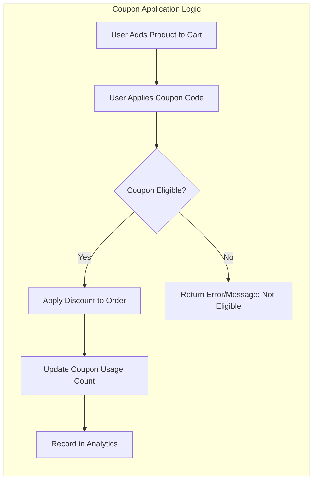
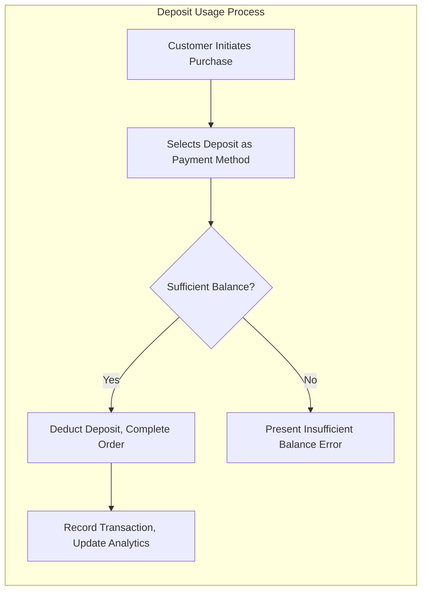

# Discount, Coupon, and Loyalty Program Requirements Analysis Report

## Introduction
This document provides a comprehensive set of requirements for implementing discounts, coupon issuance and application, deposit and mileage management, and loyalty logic in the AI-driven ShoppingMall backend platform. Requirements are articulated in natural language and EARS format, focusing on business processes, validation logic, error scenarios, and role-based permission controls for customers, sellers, and administrators. All provisions are designed for modular extensibility, compliance, traceability, and AI enablement.

## Business Justification and Scope
Discount and loyalty programs are essential for customer retention, acquisition, revenue growth, and user engagement in competitive e-commerce. This system supports modular coupon and reward logic, robust fraud prevention, full audit trails for compliance/dispute, and performance analytics for optimization. Features are built with multi-channel, multi-section scalability and global expansion in mind.

## Discount and Coupon Design

### Coupon Modes
- THE ShoppingMall system SHALL support multiple coupon modes, including public coupons (site-wide or channel-wide distribution), private coupons (user- or segment-targeted), and one-time coupon codes (bulk or single-use).
- Coupon codes SHALL support secure code generation, uniqueness, and validity checks.

### Issuance Conditions and Targeting
- THE system SHALL allow coupons to be issued based on business rules, including channel, section, seller, product, or customer criteria.
- WHERE customer segmentation is available, THE system SHALL enable coupons targeting by behavior, purchase history, or assigned segment.
- Coupon issuance conditions SHALL be configurable (e.g., after sign up, purchase threshold, promotional event).

### Application Logic and Validation
- WHEN a coupon is applied to an order/cart, THE system SHALL validate eligibility, applying stackability/exclusivity rules, expiry date, usage limitations, minimum order amount, and inclusion/exclusion by product, seller, or section.
- Coupons SHALL support fixed amount and percentage-based discounts.
- WHEN multiple coupons are present, THE system SHALL apply business logic (e.g., maximum benefit to user, exclusive first) as configured.
- IF coupon validation fails (e.g., expired, not eligible, limit exceeded), THEN THE system SHALL clearly surface a reason code and user-readable message.

### Stackability, Exclusivity, and Constraints
- Coupons SHALL be configured per business policy as exclusive (cannot be combined) or stackable (combinable within limits and logic).
- WHERE coupons are stackable, THE system SHALL enforce business-specific stack limits, sequence, and exclusions (e.g., cannot combine two seller coupons for same product).
- Coupon usage count, per-user and total issuance limits SHALL be enforced at the time of redemption.

### Coupon Analytics and Performance Tracking
- THE system SHALL record every issuance, redemption, and rejection event with metadata (who, when, order, product, reason).
- Aggregate analytics for coupon performance (e.g., usage rate, conversion, average discount, user lift) SHALL be available for sellers/administrators.

### Mermaid Diagram: Coupon Application Flow

## Deposit and Mileage System

### Deposit Logic
- THE system SHALL support deposit accounts for every customer, allowing topping up, spending, and balance inquiries.
- WHEN a deposit is charged or spent, THE system SHALL record metadata (customer, date, method, purpose, order association).
- Deposit top-up workflows SHALL include async payment support (virtual account, wire transfer) and promotion campaigns (e.g., bonus on deposit).
- IF a deposit transaction fails, THEN THE system SHALL reverse any provisional credits and notify the user with specific error information.

### Deposit Security and Validation
- THE system SHALL validate every deposit income/outcome for duplicate, fraud, or suspicious behavior.
- WHERE fraud is suspected, THE system SHALL flag and freeze the related funds, requiring admin review.

### Mileage System
- THE system SHALL offer a loyalty mileage (points) program, accumulating points via purchases, reviews, campaigns, and donations.
- Mileage accrual and spend rates SHALL be configurable globally and per-campaign.
- WHILE mileage is valid, THE user SHALL be able to use points for eligible purchases; expired points SHALL be automatically deducted with notification.
- Donation logic SHALL allow mileage to be given to approved campaigns, with reason/history tracking.

### Loyalty and Donation Management
- Administrators SHALL have the ability to configure and run donation campaigns, including targets, timelines, and reporting.
- Mileage balances SHALL be visible to customers, with transaction details and expiry dates.

### Error Handling and Support
- IF mileage or deposit actions fail (e.g., insufficient balance, expired promo), THEN THE system SHALL present clear, actionable errors to users and log for audit.
- All deposit/mileage updates must be atomic (either fully succeed or fully roll back).

### Mermaid Diagram: Deposit Usage

## Loyalty Logic and Campaigns

### Segmentation and Personalization
- WHEN a customer qualifies under defined criteria (e.g., total spend, frequency), THE system SHALL trigger loyalty campaign offers or milestone rewards.
- AI-driven segmentation and dynamic campaign eligibility SHALL be available for targeted reward distribution (personalized coupons, bonus point events).

### Reward Mechanisms
- THE system SHALL enable various reward mechanisms: tiered milestones, gamification, badge/level upgrades, or instant-win campaigns.
- All rewards SHALL be tracked with history, metadata, and result in updates (coupon, deposit, or mileage grants).

### Campaign Configuration and Analytics
- Administrators SHALL configure campaign rules, durations, targets, and rewards via admin interface.
- Campaign performance metrics (participation, cost, revenue impact, post-campaign churn) SHALL be automatically tracked, reported, and available for optimization.

### Automation and AI Enablement
- THE system SHALL support automated triggering, personalized recommendations, and campaign optimization via AI insights and predictive analytics for future redesign.

## Business Rules and Validation Logic

### EARS-Based Rules (Examples)
- WHEN a coupon is issued, THE system SHALL ensure unique code assignment and prevent duplication.
- WHEN a user redeems a coupon, THE system SHALL decrement the available quantity and enforce per-user/per-campaign limits.
- IF an expired coupon is used, THEN THE system SHALL deny redemption and present a clear message.
- WHEN multiple benefit systems (coupon, deposit, mileage) are used in one order, THE system SHALL prioritize business logic for calculation order, stack limits, and eligibility.
- Coupons, deposits, or mileage SHALL never result in negative order balances; IF attempted, THEN THE system SHALL reject the transaction.
- IF a loyalty campaign configuration is invalid (e.g., missing reward setting), THEN THE system SHALL block activation and display/configure errors to admin.

## Error Handling and User Feedback
- All error states for coupons, deposits, and mileage SHALL result in actionable, user-friendly messages, with recovery instruction and reference code.
- All business rule enforcement SHALL be logged with event metadata for dispute/audit.
- System SHALL support internationalization for all error and informational messages for global user base.

## Performance, Auditability, and Compliance
- All discount/loyalty activities SHALL be logged in a tamper-evident, snapshot-preserving audit trail system for compliance and dispute support.
- All user-initiated actions SHALL complete in under 3 seconds for a standard retail transaction; bulk coupon or campaign processing SHALL return progress indicators and complete within user-acceptable windows.
- The system SHALL comply with all regulatory requirements for financial product management, data privacy (GDPR/CCPA), taxation, and international e-commerce laws.

## Role-Based Access and Permissions
- Customers can redeem coupons, manage their deposits/mileage, and participate in loyalty campaigns.
- Sellers can issue, analyze, and manage coupons for their own products; access analytics and campaign reports.
- Administrators have system-wide oversight, manage global campaigns, resolve exceptions, audit logs, investigate fraud, configure reward logic, and manage donation programs.

## Extensibility and Automation
- The system is modular to support expansion of new coupon types, loyalty campaign formats, and integration with external/AI services.
- All rules, validation, and analytics SHALL be configurable and accessible for both business and technical users for ongoing optimization.

## Links to Related Documents
- [User Roles and Authentication](./02-user-roles-and-authentication.md)
- [Functional Requirements Overview](./03-functional-requirements-overview.md)
- [Order, Cart, and Payment Workflows](./05-order-cart-and-payment-workflows.md)

---

*Developer Note: This document defines business requirements only. All technical implementations (architecture, APIs, database design, etc.) are at the discretion of the development team.*