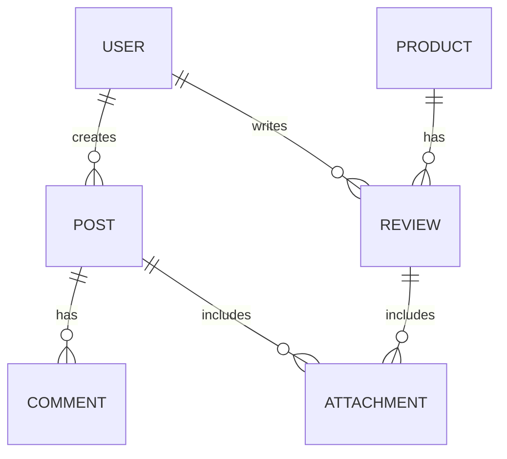

# Bulletin Board & Community System

## Overview
The bulletin board and community features form the user engagement core of the Aimall backend system, delivering scalable Q&A, product reviews, comments, snapshots, and interactive experiences. Advanced moderation, AI-driven content review, and file attachment facilities empower customers, sellers, and administrators.

## Objectives
- Facilitate product-related and open-topic discussions among customers and sellers
- Drive trust through authentic user-generated content (UGC) and transparent reviews
- Reduce manual moderation workload with AI-powered content filtering
- Ensure safe, compliant, and enjoyable engagement spaces

## Key Features
### Q&A Board
- Customers and sellers can initiate and respond to product-specific questions
- Supports public or private (seller-customer only) threads
- Permits attachments for richer inquiries/responses

### Product Reviews & Ratings
- Customers may submit reviews and star ratings (1–5) for purchased products
- Sellers can respond to reviews for dispute resolution or appreciation
- Reviews are moderated via AI and admin actions
- Supports photos/videos in reviews

### Comments & Snapshots
- Users can comment on posts, reviews, or announcements
- Snapshots: Users upload moments/photos, optionally tagged to products

### Moderation & Complaint Handling
- AI-based pre-screening for offensive language, spam, or prohibited content
- Admin panel for content review, approval, or removal
- Report/flag functionality enables users to alert moderators

### File Attachment Support
- Posts, Q&A, reviews, and comments support image, video, or doc attachments
- Size/type validation

## Roles & Permissions
| Role          | View | Post | Comment | Attach | Moderate |
|---------------|------|------|---------|--------|----------|
| Customer      | ✔    | ✔    | ✔       | ✔      | ✖        |
| Seller        | ✔    | ✔    | ✔       | ✔      | ✖        |
| Administrator | ✔    | ✔    | ✔       | ✔      | ✔        |

## EARS-Style Core Requirements
- THE system SHALL allow authenticated users to post questions, reviews, comments, and snapshots.
- WHEN a post/review is submitted, THE system SHALL validate and pre-screen content using AI moderation.
- IF content is flagged as unsafe by AI or by users, THEN THE system SHALL quarantine it for admin review.
- WHILE a review is approved, THE system SHALL display it publicly on product pages.
- WHERE an admin rejects a post, THE system SHALL notify the original poster of the moderation decision.
- THE system SHALL restrict unregistered/guest users to view-only access for all community features.
- WHEN a user uploads an attachment, THE system SHALL check size and type compliance before saving.

## Non-Functional Requirements
- THE system SHALL ensure data consistency and availability, even with high posting volumes.
- THE system SHALL support rapid moderation queue processing (AI + admin actions).
- THE system SHALL maintain GDPR and platform-specific compliance for user-generated content.

## Acceptance Criteria
- Users can successfully create and view Q&A, reviews, comments, and snapshots from both web and API.
- AI pre-moderation operates with a configurable sensitivity threshold.
- Admins can filter, search, and take actions on all content in a moderation panel.
- Attachments are validated, securely stored, and correctly displayed or downloadable.
- Appropriate notifications delivered for moderation actions (approval, rejection, quarantine).

## Entity Relationships (Conceptual)

---
For cross-references: [Table of Contents](./00_aimall-backend_table-of-contents.md) | [Seller/Admin System](./04_aimall-backend_seller-and-admin-system.md)
