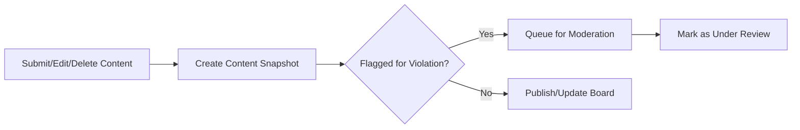

# Bulletin Board, Inquiry, and Review System Requirements Specification

## 1. Introduction and Objectives
Bulletin board, inquiry, and review features allow customers, sellers, and admins to interact around products and orders, with audit-compliant records, real-time notifications, and AI-assisted moderation. The system supports evidence preservation, legal compliance, and enhances community trust through transparency.

## 2. System Scope and Overview
Scope covers product Q&A and review boards, general announcement posts, edit/history snapshotting, threaded replies, file attachments, moderation, and comprehensive audit/compliance logging. All content is versioned; moderation, error, and notification workflows are natively integrated. AI moderation supports abuse/fraud/spam detection, with automated escalation/flagging.

## 3. User Roles and Permission Matrix
| Feature                        | Customer | Seller | Admin      |
|------------------------------- |----------|--------|------------|
| Submit inquiry (product Q&A)   | ✅       | ✅     | ✅         |
| Answer inquiry (official)      | ❌       | ✅     | ✅         |
| Write review                   | ✅*      | ❌     | ✅         |
| Create board post              | ✅       | ✅     | ✅         |
| Comment/reply                  | ✅       | ✅     | ✅         |
| Attach files/media             | ✅       | ✅     | ✅         |
| Moderate all content           | ❌       | Limited| ✅         |
| View edit history              | ✅ (own) | ✅ (own/issued) | ✅ (all) |
*Reviews only for verified purchases.

## 4. Inquiry and Review Management
### 4.1 Inquiries
- WHEN a customer views a product page, THE system SHALL present a product-linked inquiry submission interface, attaching a product snapshot reference.
- WHEN an inquiry is submitted, THE system SHALL record submitter, timestamp, source channel/section, and product/version as immutable metadata.
- IF the inquiry is marked private, THEN THE system SHALL restrict visibility to the author, seller, and admins only.
- Sellers/Admins SHALL post official answers, linked to inquiry snapshot, and the inquirer/customer SHALL be notified instantly via preferred channel (in-app, email, push).
- All inquiries/answers SHALL be versioned, retained for compliance, and tied to channel/section for analytics.

### 4.2 Reviews
- WHEN a customer with a completed order accesses their purchase history, THE system SHALL enable write/review for relevant products, enforcing verified purchase status.
- WHEN a review is created, THE system SHALL store order + product snapshot and review metadata (customer, timestamp, rating/value, text, media, channel).
- IF a review is edited, THEN THE system SHALL snapshot the full prior state and require an edit reason if moderated.
- WHILE a review is flagged or disputed, THE system SHALL hide it from public view until moderation.
- Admins may grant/remove "verified purchase" badges; only one review per product-order-customer tuple is allowed.

### 4.3 Comments and Replies
- THE system SHALL support infinite or configurable threaded replies on any inquiry/review/post.
- WHEN a reply/comment is created, edited, or deleted, THE system SHALL snapshot the event, recording user, time, parent/child linkage, and moderation status.
- IF deleted, content is only hidden (not destroyed), marked as removed with audit metadata.
- Notifications (push/app/email) SHALL be triggered for replies, @mentions, and moderation to all involved users.

## 5. Board/Post Management Logic
- THE system SHALL allow creation of general and section/category boards, with hierarchical post/thread structure, per-channel configuration, and access restrictions by role.
- Board-posts SHALL support images, video, rich-format text, and attachments; all uploads are validated, stored with metadata, and versioned.
- Moderation and posting permissions reflect role/type and may be further restricted by board configuration.
- All posts SHALL retain audit trails for state changes (publish, edit, delete).
- Board hierarchy, visibility, and action permission tables SHALL be administrable at system/channel/section levels.

## 6. Edit History and Audit Snapshots
- All create/edit/delete events on posts, comments, reviews, and inquiries SHALL result in full-snapshot records (content, meta, attachment refs, participants, timestamps).
- Snapshots are immutable; restoration/comparison is available to admin roles for compliance/legal review.
- All mutation events, moderation actions, and compliance escalations are audit-linked and sequenced chronologically for investigation.

### Mermaid: Edit Snapshot Flow

## 7. Moderation and Compliance Handling
- Moderation covers all board, inquiry, review, and response content. Seller moderation is limited to their own products; all others are handled by admins.
- WHEN content is flagged (AI/manual), THE system SHALL queue full content history for review. Admins can approve, edit, reject, or permanently suppress content.
- All moderation actions include reason, actor, and timestamp, and are appended to the content’s audit trail.
- Upon moderation outcome, notifications SHALL be issued to affected users, and records are available for legal/audit need.

## 8. Notifications and Interaction Flows
- Any creation, reply, mention, moderation, or broad role-trigger event SHALL push notification to affected users according to delivery preferences (push, email, in-app).
- Subscription/follow logic is enabled; users receive notification on future events for content they are linked to.

## 9. Exception, Error, and Dispute Management
- IF user attempts to act outside permissions (e.g., delete/modify others’ post, view private inquiry), THEN THE system SHALL block and log attempt, showing context-specific error.
- IF moderation/posting fails due to compliance or configuration, THEN actionable error is shown and audit event written.
- Disputes on moderation or deletion are escalated via system links, and all mutation/audit trails are accessible to authorized staff, protected for legal/compliance period.
- Rollback/recovery is possible for admin roles as required.

## 10. Business Rules and Validation (EARS)
- WHEN duplicate, spam, or abusive content is detected (AI/moderator), THE system SHALL suppress and flag for review.
- IF a user posts offensive/non-compliant content, THE system SHALL deny publication and require revision.
- All reviews and inquiries must be tied to a verified purchase and product snapshot, enforced at submission.
- Only one review allowed per purchase per product per customer.
- All admin/moderation actions, errors, and escalations are logged with full context.
- ALL failure/rejection scenarios present actionable user feedback for recovery or appeal.

## 11. KPIs and Success Metrics
- Mean moderation/review time (AI/manual)
- Proportion of flagged posts resolved within SLA (e.g., 24 hours)
- Audit log request success rate
- Dispute mediation response time
- Uptime and latency of board/inquiry/review features
- Notification delivery latency per role/event type

## 12. Reference
For user roles see [User Roles and Authentication](./02-user-roles-and-authentication.md). For full audit/compliance logic refer to [System Architecture, Snapshots, and Compliance](./09-system-architecture-snapshots-and-compliance.md).