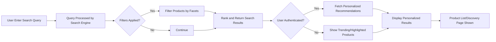
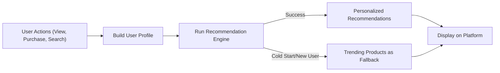

# AI Commerce: Product Search and Personalized Discovery Requirements Specification

## 1. Introduction
This document defines comprehensive business requirements for the product search, discovery, tagging, trending/highlighted products, and AI-powered recommendation systems of the aiCommerce backend. All requirements are written in natural language and EARS format where appropriate. Technical implementation details, APIs, and schema design are expressly omitted.

## 2. Business Objectives
Advanced and highly relevant product search and discovery experience is a core competitive advantage for aiCommerce. The objective is to:
- Enable buyers to find and discover products quickly, accurately, and in a personalized manner
- Empower sellers and admins to optimize product discoverability through tagging and curation
- Utilize AI to continuously improve discovery based on behavior, content, and broader trends

### AI-Driven Differentiators
- Dynamic, context-aware recommendations per buyer
- Personalization evolving from AI-driven analysis of user actions
- Real-time trending and system-adaptive highlighted products

### Success Criteria
- Search results relevant for >95% of buyer queries (business metric)
- Recommendation click-through rate increases over baseline by >15%
- Product discovery actions (search, filter, recommendation) respond within 1 second 99% of the time

## 3. User Roles & Permissions (Business Perspective)

| Role     | Can Search | Can Filter | See Recommendations | Tag/Curate | Access Trending | Manage AI Discovery |
|----------|:----------:|:----------:|:------------------:|:----------:|:---------------:|:--------------------:|
| Visitor  | ✅         | ✅         | Personalized: ❌ / Popular: ✅ | ❌         | ✅              | ❌                 |
| Buyer    | ✅         | ✅         | ✅                 | ❌         | ✅              | ❌                 |
| Seller   | ✅         | ✅         | ✅ (store scope)   | ✅ (their listings) | ✅              | ❌                 |
| Admin    | ✅         | ✅         | ✅                 | ✅ (platform) | ✅              | ✅                 |

- IF user is buyer, seller, or admin, THEN THE system SHALL show personalized product recommendations.
- WHERE user is visitor, THE system SHALL provide popular/trending and highlighted recommendations only (not personalized).
- Seller can only manage tags/curation for their own listings.
- Admin can override, moderate, or set highlight/trending status for all products.

## 4. Feature Requirements

### 4.1 Search Capabilities
- THE system SHALL provide full platform product search accessible to all users.
- WHEN user enters a query, THE system SHALL return relevant product results based on keyword matching, tags, and popularity within 1 second in 99% of cases (performance requirement).
- THE system SHALL support filtering by multiple facets: category, price range, availability, seller, rating, shipping options, tags, etc.
- THE system SHALL allow combining filters using AND/OR logic (multi-facet search).
- WHEN query has misspellings or is ambiguous, THE system SHALL provide suggestions and/or autocorrect options (AI-powered if available).
- WHERE user locale is set, THE system SHALL search both by query and relevant translated data.
- WHEN user applies filters, THE system SHALL update result counts and product lists instantly.
- IF a search yields no results, THEN THE system SHALL suggest alternative queries or display relevant trending/highlighted items.
- THE system SHALL support search/autocomplete as user types with response in under 300ms.

#### 4.1.1 Advanced Sorting and Ranking
- THE system SHALL provide sorting (by relevance, recency, price, rating, popularity).
- WHEN multiple products are equally relevant, THE system SHALL break ties by platform-defined ranking rules (e.g., stock, sales velocity).

#### 4.1.2 International & Multi-language Support
- THE system SHALL recognize query language and prioritize results accordingly.
- THE system SHALL support search by localized terms, with fallback to English or main marketplace language if unavailable.

### 4.2 Tag and Keyword Management
- Sellers and admins SHALL attach descriptive tags to products at listing/update.
- THE system SHALL validate tags for length, banned terms, and appropriateness.
- WHEN seller attempts to add prohibited, duplicate, or irrelevant tags, THE system SHALL reject input and provide feedback.
- Admins SHALL be able to mass-edit, approve, or remove tags to maintain quality.
- THE system SHALL support both user-facing tags (for search) and hidden/internal tags (for recommendation/analytics).
- Sellers SHALL only edit tags on their own products. Admins SHALL edit platform-wide.

### 4.3 Trending and Highlighted Product Management
- THE system SHALL automatically identify trending products using sales, view data, and velocity analytics.
- Admins SHALL manually mark/unmark products as highlighted or trending as a business override.
- Trending calculations SHALL use rolling time windows (e.g., 24h, 7d) and re-calculate at fixed intervals (e.g., hourly).
- IF trending algorithm fails or is insufficient, THEN THE system SHALL display admin-chosen fallback highlighted products.
- WHEN a product is marked as highlighted, THE system SHALL display it in applicable discovery modules to all users.

### 4.4 AI-Powered Recommendation & Personalization
- WHEN buyer is authenticated, THE system SHALL provide recommendations based on prior purchases, views, favorites, and search behavior.
- THE system SHALL build a dynamic user interest profile and use it to personalize discovery, including search result ordering and recommendations.
- WHERE user history is insufficient (new/anonymous users), THE system SHALL use collaborative filtering and overall platform trends as fallback.
- Recommendations SHALL be explainable: THE system SHALL provide a business-purpose rationale ("Because you viewed X...").
- THE system SHALL continuously refine recommendations as new user actions occur.
- Seller view of recommendations SHALL be limited to their store’s visitors or analytics.
- Admins may simulate recommendations for any user or segment for business QA.

#### 4.4.1 Product-to-Product Similarity
- THE system SHALL suggest similar products based on attributes, visual similarity (if available), and shared user behaviors.

### 4.5 Search Analytics and Optimization
- THE system SHALL log anonymized search queries, filters, and resulting product clicks for analytics and quality improvement.
- Admins SHALL access dashboards showing top search terms, no-result rates, CTR, recommendation usage, and AI model impact.
- WHEN search errors or failed queries occur, THE system SHALL record them for error analysis and system improvement.
- THE system SHALL support A/B testing of search and recommendation logic to drive optimization.

## 5. Business Rules & Error Handling

- IF user inputs prohibited search terms or violates platform guidelines, THEN THE system SHALL reject and log the query with feedback.
- IF query triggers search rate limits (anti-abuse), THEN THE system SHALL limit requests and provide cooldown/error response per business policy.
- IF internal recommendation engine fails, THEN THE system SHALL fallback to trending/highlighted content.
- WHEN server-side search/recommendation is slow (>1s), THE system SHALL report degraded search status via business monitoring channel.
- THE system SHALL display the most up-to-date indexed product data in search. IF product becomes unavailable during use, THEN THE system SHALL show "Out of Stock" or "No Longer Available" messaging without causing app errors.

## 6. Compliance, Security & Privacy Considerations
- THE system SHALL anonymize user search and click data for analytics.
- THE system SHALL comply with applicable privacy regulations (GDPR, etc.) for all personalized recommendation logic.
- THE system SHALL only allow authorized admin/staff to view raw search logs or recommendation engine performance data.
- THE system SHALL restrict seller access to only their own products'/store data in all discovery analytics/campaign modules.

## 7. Success Criteria & KPIs
- ≥95% relevant result satisfaction in user search feedback
- Search/Discovery response time <1s for 99% of valid queries
- Trending/highlighted products module refreshes data within 10 minutes of changes
- AI-powered recommendation click-through rate ≥15% above non-personalized baseline
- Reduction of no-result search queries over time

## 8. Mermaid Diagrams
### 8.1 User Search and Discovery Journey

### 8.2 AI Recommendation/Personalization Flow

## 9. Appendix: Term Definitions
- **Facet**: A product attribute used for filtering (e.g., brand, price, color)
- **Tag**: A user/admin/seller-assigned keyword associated with a product
- **Recommendation Engine**: Business logic that predicts what products a user will want to see next
- **Trending/Highlighted**: Products surfaced either by algorithm or admin/manual curation for extra visibility
- **Personalization**: The process of tailoring discovery experience per user based on data analysis

---
> *Developer Note: This document defines business requirements only. All technical implementations (architecture, APIs, database design, etc.) are at the discretion of the development team.*
