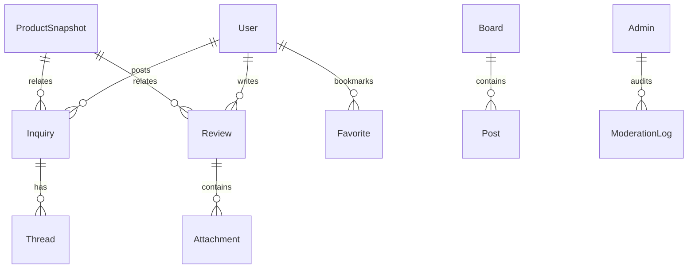

# 7. Engagement & Board Systems

## 7.1 Overview
The Engagement & Board Systems module enables a robust, interactive environment for shoppers, sellers, and administrators. It integrates product-centric inquiry, review, and bulletin board features tied to immutable product snapshots—establishing trust, encouraging high-quality user-generated content, and supporting compliance and moderation workflows.

## 7.2 Objectives
- Foster authentic customer engagement and feedback
- Ensure transparent, traceable product discussions (snapshot-linked)
- Enable multi-level moderation and automated AI abuse detection
- Deliver a flexible favorite system that adapts to evolving entities

## 7.3 Core Features
### 7.3.1 Inquiries & Reviews
- **Product inquiries**: Threaded, with configurable visibility (public/private), tied to product snapshots
- **Reviews**: Only for verified purchases (verified badge support), supporting ratings, media, and markdown content
- **Admin/seller responses**: Threaded, auditable, snapshot-aware
- **Moderation**: Manual/AI-driven (spam, abuse, fraud detection); escalation workflows for sensitive cases
- **Change auditability**: All edits or deletes are version-controlled and logged

### 7.3.2 Board System Architecture
- Supports custom boards (e.g. product Q&A, seller bulletin, FAQ) per channel/section
- Board configuration: permissions (who can post/reply), category tags, sorting/filtering by snapshot or status
- Attachment support: images, files, with secure versioning and CDN integration
- Role-based moderation tools and real-time notification options

### 7.3.3 Favorite & Notification System
- **Favoriting entities**: Support for products, inquiries, and addresses
- **Favorites tied to snapshots**: Users are notified of relevant changes or updates
- **Management UI and history**: Clear management tools and opt-out controls

## 7.4 User Scenarios
| User      | Scenario                                                                                          |
|-----------|--------------------------------------------------------------------------------------------------|
| Customer  | Leaves verified review (with images), favorites an inquiry to get notified of seller response     |
| Seller    | Answers product inquiry, requests admin moderation for reported abuse post                        |
| Admin     | Batch removes inappropriate reviews using AI flag queue; audits board changes via snapshot logs   |

## 7.5 Functional Requirements
- Reviews/inquiries only possible for logged-in members (with channel-specific rules)
- Threaded posts, snapshot-referential structure
- Real-time and batch notification logic
- Attachment support (with size/type/version controls)
- AI integration for content moderation (configurable thresholds/actions)
- Audit logging for all board activities

## 7.6 Non-Functional Requirements
- Scalable storage architecture for high volume UGC
- Strong privacy controls and opt-in/opt-out notification management
- Full accessibility, multilingual UI
- GDPR/CCPA compliance, export of activity history per user

## 7.7 Acceptance Criteria
- All engagements are properly logged and auditable
- Users only see content they’re authorized to view (per channel/role/settings)
- Verified purchases can leave reviews, flagged content is moderated per escalation chain
- Favoriting automatically triggers user-appropriate notifications tied to entity snapshot

## 7.8 Data Model (High Level)

Is there anything else to refine for the Engagement & Board Systems?