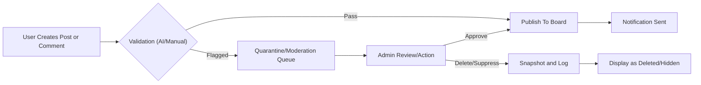

# Requirement Analysis Report: Bulletin, Inquiry, and Review System (AICommerce)

## 1. Introduction

### 1.1 Scope
This document specifies the requirements for all user-generated content (UGC) subsystems on the AICommerce platform—including bulletins (noticeboards), product inquiries, reviews, and user comment threads. Focus is on backend process modeling, content state management, moderation, history preservation, and notification logic.

### 1.2 Audience
Targeted at backend developers, business analysts, and architects responsible for backend logic and compliance. All requirements are written in unambiguous, EARS-backed language suitable for direct implementation.

### 1.3 Relationship to Other Platform Components
- Integrates with [User Management and Addressing Requirements](./04-user-management-and-addressing.md), [Product Management Requirements](./06-product-management.md), [Business Rules and Compliance](./14-business-rules-and-compliance.md), and [Attachment and File Management Guidelines](./13-attachment-and-file-management.md).
- Notification, audit, and AI moderation tie to wider platform rules.

## 2. Business Model and Rationale for UGC

### 2.1 Role of User-Generated Content in AICommerce
The availability and management of bulletins, inquiries, and reviews are core to building trust, driving engagement, and increasing transaction success in an AI-driven marketplace. UGC provides context for purchasing decisions, highlights seller reliability, and enables data-driven product/service iteration via customer feedback. AI moderation ensures compliance and scalability.

### 2.2 Impact & AI-Driven Differentiators
UGC increases discoverability, retention, and cross-sell opportunities. AI is leveraged for content moderation, real-time sentiment analysis, automated escalation, and insight generation, keeping operations efficient and scalable.

## 3. User Roles and Permissions in UGC

### 3.1 Role Definitions
- **Visitor:** Can view public bulletins, reviews, and inquiries, but cannot create content.
- **Buyer:** Can create inquiries/reviews for their orders, comment on posts, modify/edit or delete their own content, and report inappropriate content.
- **Seller:** Can respond to inquiries/reviews related to their products, moderate reviews on their items, comment, and report violations.
- **Admin:** Can manage, moderate, edit, or delete any UGC content; review/restore deleted or flagged content; review edit history and perform compliance audits.

### 3.2 Permission Matrix (Sample)
| Action                        | Visitor | Buyer | Seller | Admin |
|-------------------------------|---------|-------|--------|-------|
| View bulletins/inquiries/rev. |   ✅    |  ✅   |   ✅   |  ✅   |
| Post inquiry/review           |         |  ✅   |   ✅*  |  ✅   |
| Edit/delete own content       |         |  ✅   |   ✅   |  ✅   |
| Respond to inquiries          |         |       |   ✅   |  ✅   |
| Moderate/flag/review any      |         |       |        |  ✅   |
| Access edit history           |         |  ✅** |   ✅*  |  ✅   |
| Receive notifications         |    ✅   |  ✅   |   ✅   |  ✅   |

*Only for their own products or content; **buyers can access their own histories only

## 4. Core Functional Requirements

### 4.1 UGC Structure and Key Entities
- **Bulletin:** Platform announcements, system notices (admin/seller generated)
- **Inquiry:** Buyer question linked to a product; seller can respond
- **Review:** Buyer feedback on purchased item; seller can respond
- **Comment:** Threaded discussion on bulletins, inquiries, or reviews

### 4.2 Business Logic and EARS-format Specifications

#### Posting Content
- WHEN a buyer with a completed purchase submits a review, THE system SHALL allow posting if one review per order-item is enforced.
- WHEN a user (buyer/seller/admin) posts content, THE system SHALL validate content against community guidelines and prohibited language (AI-powered filter).

#### Editing and Deletion
- WHEN a user edits their post or comment, THE system SHALL record a snapshot of both the pre- and post-edit state.
- WHEN a user deletes their own content, THE system SHALL mark it as deleted and preserve its state for audit recovery, instead of actual deletion.
- IF admin performs force deletion, THEN THE system SHALL permanently remove the content after audit trail retention period.

#### Commenting & Replies
- WHEN a review/inquiry/bulletin is open for comments, THE system SHALL allow threaded comment structure up to N-level nesting (e.g., 3 levels).
- WHERE comments violate moderation policies, THE system SHALL flag for review and suppress display pending moderation.

#### Moderation & Reporting
- WHERE any user identifies inappropriate content, THE system SHALL provide reporting functionality linked to moderation workflow.
- WHEN a seller responds to a review or inquiry, THE system SHALL notify involved parties and record response history.
- IF content is flagged by AI or multiple reports, THEN THE system SHALL queue for admin manual review and apply temporary visibility restrictions.

#### Evidence Preservation
- WHEN content is edited or deleted (including replies/comments), THE system SHALL create an immutable snapshot for legal/audit retrieval.
- THE system SHALL log timestamp, user identity, action type, and previous/current state for all UGC transitions.

#### Attachment/File Handling
- WHEN user attaches files to UGC, THE system SHALL enforce file type, size, and content scanning rules as defined in [Attachment and File Management Guidelines](./13-attachment-and-file-management.md).

#### Privacy and Permissions
- Buyers/sellers SHALL be able to set inquiry/review privacy (public/private); private content visibility restricted to involved parties and admins.
- THE system SHALL verify content ownership before allowing edits/deletes.

### 4.3 Error and Exception Handling
- IF user exceeds allowed rate of posting or comment limits, THEN THE system SHALL block action and show appropriate error message (e.g., rate limit exceeded).
- IF validation fails (toxicity detected, banned words, invalid attachment), THEN THE system SHALL deny posting and return precise validation error.
- IF a user attempts banned operation (e.g., delete others’ content), THEN THE system SHALL block the action and record attempted breach.

## 5. Moderation and Audit Logging
- THE system SHALL employ AI/ML models for proactive moderation (toxicity, spam, fraud detection), supplementing manual review by admin.
- WHEN content is flagged, THE system SHALL log all AI/manual actions taken, outcomes, and reviewer identities.
- Moderation decisions (approve, remove, escalate, restore) SHALL be auditable by admins.

## 6. Snapshot (History) and Evidence Preservation
- WHEN a content item is edited/deleted, THE system SHALL store a readonly, timestamped snapshot.
- THE system SHALL allow admin and content owner to view historical versions and change logs, where permitted.
- Snapshots SHALL be maintained for a period in accordance with compliance rules (see [Business Rules and Compliance](./14-business-rules-and-compliance.md)).
- Legal requests for content history SHALL be processed via secure access channels.

## 7. Notification Management
- WHEN a relevant event occurs (comment added, reply received, moderation event), THE system SHALL trigger notifications to the involved parties in accordance with their settings.
- Notifications SHALL be delivered via user-preferred channels (on-site, push, email) and tracked for delivery/failure.
- Users SHALL be able to manage their notification preferences.
- IF notification fails delivery (e.g., invalid address), THEN THE system SHALL queue retry and log the error.

## 8. Performance and Usability Requirements
- THE system SHALL support bulk moderation and restore actions for admins (e.g., process >100 items in under 5 seconds).
- WHEN UGC is requested for display, THE system SHALL serve content (including comment trees and histories) within 2 seconds for standard queries (≤1000 items).
- THE system SHALL provide clear, user-oriented error messages for all failed actions.

## 9. Appendix
### 9.1 UGC Workflow Diagram

### 9.2 EARS Format Checklist
- [x] All actionable requirements use EARS format
- [x] Triggers, conditions, and actors explicitly specified
- [x] Error and exception scenarios handled

