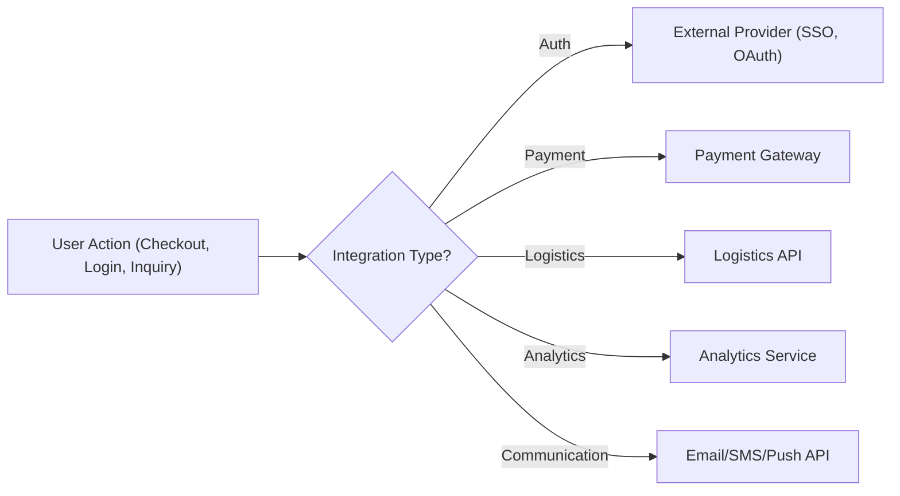

# External Integrations Requirements Analysis Report for AI-Powered Shopping Mall Backend

## Required Integrations Overview
THE shoppingMallAiBackend SHALL integrate with external services to enhance functionality, streamline business flows, and provide a seamless user experience. The following classes of external integrations are mandatory:

| Integration Type       | Description & Purpose                                                                       | Business Trigger Examples                           |
|------------------------|--------------------------------------------------------------------------------------------|-----------------------------------------------------|
| Authentication         | Connects with third-party authentication providers to enable quick, secure login and SSO    | When user selects 'Login with external service'     |
| Payment Gateway        | Facilitates secure order payment, refunds, and transaction audits via third-party gateways   | When user initiates a payment or refund             |
| Logistics/Shipping     | Automates fulfillment, order tracking, and delivery status updates with logistics partners   | When an order is confirmed and ready to be shipped  |
| Analytics/Tracking     | Captures user, sales, and conversion events for business analysis through analytics platforms| After business-critical user or order events occur  |
| Marketing/Communication| Sends promotional content or transactional updates (e.g., email, SMS, push) via external APIs| On promotional or service event triggers           |

### Diagram: Integration Sequence Overview

## Authentication and User Tracking
- WHEN a user chooses a social or third-party login, THE system SHALL initiate authentication with the relevant external provider (e.g., OAuth, SSO), capture, and verify the returned credentials, and SHALL record the identity linkage for future sessions.
- WHERE a user logs in via multiple providers (social login, SSO, internal account), THE system SHALL provide business logic to merge/link identities so that users are uniquely tracked across all channels.
- WHEN an external authentication fails due to provider-side issues, THE system SHALL present informative error feedback to the user and provide a fallback or recovery flow.
- WHERE regulations require (e.g., EU GDPR, South Korea CI/DI), THE system SHALL manage identity data according to channel, jurisdiction, and retention rules, including user request for data erasure.
- THE system SHALL support business-level analytics on authentication events, sign-up conversion rates, and source/channel attribution, but SHALL NOT expose sensitive user information to third parties.

## Payment Systems
- WHEN a customer initiates payment, THE system SHALL connect to the configured external payment gateway, transmit the required order and customer data, and receive payment results with status, transaction ID, and any error information.
- IF the payment gateway signals payment failure, cancellation, or error, THEN THE system SHALL reflect the payment status immediately in the order history and inform the customer with actionable error messages (e.g., retry possibility, support contact).
- WHERE a payment requires asynchronous confirmation (such as virtual account remittance or bank transfer), THE system SHALL update its status based on external provider callbacks and notify users when the payment is confirmed or canceled.
- WHEN a refund, reversal, or chargeback occurs via a payment gateway, THE system SHALL synchronize the internal order state with external transaction outcomes and record event evidence for compliance/auditability.
- THE payment system integration SHALL support geo-specific business logic, such as enabling certain payment providers/channels for specific countries, supporting multi-currency payments, and respecting regulatory requirements (e.g., KYC/AML where required).
- THE integration SHALL enable AI-based fraud checks: WHEN risk factors are detected (unusual transaction patterns, high-value orders, failed authentication), THE system SHALL flag the transaction and escalate for review before fulfillment.

## Logistics and Analytics
- WHEN an order is finalized and ready for shipment, THE system SHALL transmit order and shipping information to the designated logistics partner(s) according to the user’s selection (e.g., domestic courier, international express).
- WHERE split shipments or partial fulfillment is required, THE system SHALL support multiple logistics provider integrations per order and track each shipment status separately.
- WHEN logistics status updates are received from the external provider (pickup, in-transit, delivered, failed), THE system SHALL update the internal order and notify the customer of changes.
- IF delivery exceptions occur (failed delivery, customs hold, address error), THEN THE system SHALL trigger an incident management business process and notify both the customer and seller of next steps.
- THE system SHALL use business analytics integrations to transmit anonymized sales, user journey, marketing, and conversion data to analytics providers at key milestones in the business process (e.g., completion of checkout, coupon usage, customer support events).
- WHERE internationalization is needed, THE system SHALL enable country/region-specific logistics integrations according to business partner contracts.

## Third-Party Data Handling
- THE system SHALL establish and enforce business policies for third-party data storage, including evidence preservation requirements for legal compliance and dispute resolution (e.g., snapshots for payment, shipping, or authentication events).
- WHEN an integration partner rotates keys, updates endpoints, or changes functionality, THE system SHALL trigger a business-level provider management workflow for validation and incident prevention.
- WHEN audit requests or disputes arise, THE system SHALL provide a process to retrieve and present externally-sourced data, while maintaining clear data provenance (e.g., timestamp, source, context).
- WHERE personal or sensitive information is involved in third-party exchanges, THE system SHALL ensure data minimization, purpose limitation, and regulatory-compliant consent management.
- IF an integration partner suffers failure or error (timeout, invalid response, data loss), THEN THE system SHALL fail gracefully, log the incident, and initiate a business-level alert/escalation process to support continuity of service.
- THE system SHALL maintain the ability to switch or add external providers (e.g., payment, logistics) with minimal business impact, including contract management and migration planning.

## Performance and Error Handling Expectations
- THE system SHALL complete externally-triggered business transactions (e.g., payment authorization, shipping label purchase, analytics event submission) within 10 seconds on average under normal load; critical customer-facing flows SHALL provide real-time progress feedback.
- IF an external integration experiences delay beyond 15 seconds, THEN THE system SHALL inform users that processing is in progress and provide ongoing updates until success or failure.

## Compliance, Privacy, and Evidence Management
- THE system SHALL comply with all business-side regulatory obligations tied to external integrations, including PCI DSS for payments, privacy for analytics/marketing, and evidence preservation for dispute resolution.
- WHEN an integration type is changed (e.g., switching from one payment provider to another), THE system SHALL preserve all business-level evidence required for receipts, history, and legal audits.

## Summary
These requirements specify the business logic and workflows for integrating with third-party systems within the AI shopping mall backend. Development teams have full autonomy over the choice of technical implementation, protocols, and detailed API specification, provided that these business obligations are met. All requirements are described in natural language and EARS format as applicable, focusing exclusively on what the business needs, not how the integrations are to be built.