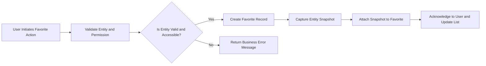
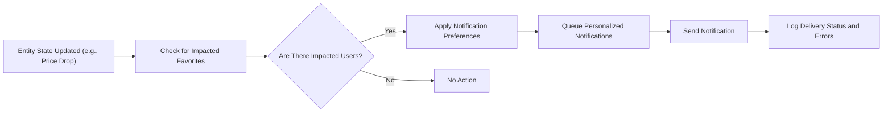

# Favorites, Personalization, and Snapshot Management Requirements

## 1. Introduction and Scope
The favorites subsystem in the shoppingMall backend empowers authenticated users to maintain curated lists of products, addresses, and inquiries. All favorites must be evidence-grade entries, storing immutable entity snapshots at the moment of favoriting for audit, personalization, and compliance. Favorites serve as signals for AI-driven recommendations and user notifications and are governed by strict permission rules.

## 2. Favorites Management (Products, Addresses, Inquiries)

### 2.1 Business Process and Entity Types
- WHEN a user with proper authentication and authorization requests to favorite a product, address, or inquiry, THE system SHALL validate existence, access permission, and ensure the entity belongs to the intended scope (e.g., only owner's addresses can be favorited by the owner).
- WHEN the favorite action is validated, THE system SHALL create a persistent record associating a comprehensive snapshot of the entity as of favoriting time.
- WHEN a user is unauthenticated, THE system SHALL restrict access to all favorite management features and prompt login or registration.
- IF a user attempts to favorite a deleted, inaccessible, or already-removed entity, THEN THE system SHALL reject the action and return an explicit, user-facing error.
- IF a user tries to favorite the same entity more than once, THEN THE system SHALL prevent duplicates and surface a constraint error.

#### Supported Entity Types:
- Products (and product variants)
- User shipping/delivery addresses
- Inquiries and Q&A posts (linked to products, orders, or general boards)

### 2.2 Operational Logic and User Scenarios
- WHEN a favorited product is updated or deleted later, THE favorite SHALL preserve the original snapshot and associate future changes through versioning and notification workflows.
- WHEN a user re-favorites an entity after a prior removal, THE system SHALL create a new favorite entry, maintaining a chain of snapshot versions.
- Users SHALL be able to organize, sort, and batch-manage favorites per entity type, including using custom folders, labels, or tags for organization.
- Maximum number of allowed favorites per type per user SHALL be system-configurable (default: 200). IF a user exceeds this cap, THEN THE system SHALL provide a clear, actionable message.

## 3. Permission Enforcement and Role Matrix
- Customers: Can favorite and manage their own products, addresses, and inquiries. Cannot favorite others' private inquiries or non-owned addresses.
- Sellers: Inherit customer permissions. Can only access favorites for entities within authorized scope (e.g., their products, public product Q&A).
- Admins: Have global access to query or manage favorites for audit or support purposes but must not manipulate user favorites unless resolving compliance or dispute requests. All admin actions on favorites SHALL be logged.

| Action                 | Customer | Seller | Admin   |
|------------------------|----------|--------|---------|
| Add favorite           | ✅       | ✅     | (Audit) |
| Remove favorite        | ✅       | ✅     | (Audit) |
| List/organize own      | ✅       | ✅     | (Audit) |
| Mass remove/export     | ✅       | ✅     | (Audit) |
| Query other’s favorite | ❌       | ❌     | ✅      |
| Admin override         | ❌       | ❌     | ✅      |

- WHEN permission violation occurs, THE system SHALL deny the action and log the attempt as a potential issue for audit/compliance.

## 4. Snapshot Storage and Evidence Management
- WHEN a user creates a favorite, THE system SHALL attach a snapshot of the entity including all relevant business data (product: price, title, options, media, seller info; address: formatted structure, label, validation; inquiry: text, attachments, privacy, timestamps, masked author info if not owner).
- Snapshots SHALL be immutable for audit but can be expunged (with record) for GDPR/CCPA-compliant data erasure requests.
- Snapshots SHALL be version-controlled for entities that are updated after favoriting, ensuring traceability and evidence retention.
- IF favorite is deleted, THEN THE system SHALL retain the snapshot for configurable audit duration (default: 180 days), marking it as removed with deletion meta.
- All snapshots SHALL be queryable for dispute resolution and compliance exports.

## 5. Personalization and Notification Features
- WHEN a user favorites an entity, THE system SHALL use this data as input to AI-driven recommendation and personalization modules.
- WHEN a favorited entity is materially updated (price drop, restock, new inquiry answer), THE system SHALL notify the user per their notification preferences within defined SLA (e.g., price drop: within 1 hour; new answer: within 5 minutes).
- Users SHALL be able to opt-in/out of specific favorite notifications, configure mute times, and select notification channels (e-mail, push, etc.).
- All notification sending actions SHALL be logged and delivery results recorded for analytics and troubleshooting.
- Batch operations SHALL be supported (e.g., bulk mute/delete/organize). All such actions SHALL be atomic – either all succeed or none.

## 6. Error Handling Requirements
- WHEN a favorite operation is attempted on an invalid or already-removed entity, THE system SHALL give a localized, actionable error.
- IF a favorite operation exceeds max allowed per user/type, THEN THE system SHALL reject the action with a reason and suggest mass removal or upgrade.
- IF notification delivery fails (bounce, push block), THEN THE system SHALL log the error and back off further attempts for the affected entity/user for a cooldown period.
- All operational errors SHALL be tied to trace/event logs for audit.

## 7. Compliance and Privacy Requirements
- All favorite and snapshot data SHALL meet or exceed GDPR, CCPA, and local privacy standards.
- Snapshots SHALL be exportable and erasable per user request except where other laws or disputes require retention (in which case, status and justification SHALL be logged).
- No snapshots SHALL retain unnecessary PII for non-owner queries; only the owning user and authorized admin/audit roles may view full detail; others see masked/meta-only.

## 8. Batch Operations, Export, and Performance
- Mass favorite operations (delete, mute, organize, export) SHALL be processed atomically and with transactional audit trails. If one favorite cannot be processed (e.g., legal hold), only that is excluded and a structured report is returned to the user.
- Exported favorite/snapshot data SHALL be provided in a structured, user-friendly format respecting field-level privacy masking.
- All single favorite operations SHALL complete in under 1 second for up to 99% of user cases; batch operations (<=100 entities) SHALL complete in under 5 seconds.

## 9. Integration and Extensibility
- The favorites module is fully integrated with the product catalog, address book, messaging/notification engine, and AI recommendation system.
- All snapshot and audit rules follow global evidence/data retention conventions (see [System Architecture, Snapshots, and Compliance](./09-system-architecture-snapshots-and-compliance.md)).
- Data structure is extensible for new favorite entity types or personalization channels without impact on audit or compliance flows.

## 10. Process and Notification Flow Diagrams

### 10.1 Mermaid: Favorite Entity Flow

### 10.2 Mermaid: Notification Trigger

## 11. Success Criteria and KPIs
- All favorites must remain consistent, traceable, and audit-friendly.
- User-facing actions (add, remove, list, notify) must perform within the strict performance deadlines.
- All evidence/snapshot and data privacy rules must always be satisfied, traceable, and recoverable for the legal/business maximum period.
- Notification and batch features must be reliably processed and actionable, with outcomes visible to both users and administrators for auditing or support.

---
Favoriting and snapshot systems here adhere to full requirements for audit, compliance, performance, AI enablement, and business transparency, positioned for extensibility and global best practices.