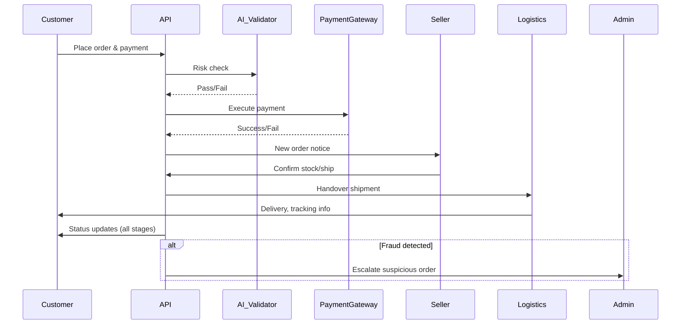

# AIMALL Backend – Order and Delivery System

## Overview
The AIMALL order and delivery system provides an end-to-end, API-driven workflow for managing customer orders, supporting diverse payment options, leveraging AI for fraud detection, and enabling seamless fulfillment tracking for both customers and sellers. This backbone ensures transactional reliability, high user satisfaction, and operational efficiency across all user roles—customer, seller, and administrator.

## Objectives
- Ensure robust, scalable handling of orders from initiation to completion
- Reduce errors and fraud via AI-driven verification
- Accelerate fulfillment with transparent, tracked processes
- Support complex order scenarios: multi-item, multi-seller, cross-promotion
- Maximize customer trust through communication and self-service tools

## User Journeys
### Customer
1. Browses catalog and selects items, reviews cart
2. Initiates order, chooses payment (card, points, multiple/partial payments)
3. Receives real-time order, payment, and fulfillment updates
4. Can request modifications or cancellations, return/exchange requests
5. Accesses historical orders and delivery records

### Seller
1. Receives new order notifications
2. Manages inventory and allocates products for shipment
3. Confirms shipment via API and supplies tracking info
4. Responds to customer queries, return/exchange actions

### Administrator
1. Monitors order pipeline, fraud alerts, system health
2. Oversees shipment SLAs, logistics performance, and escalates exceptions
3. Adjusts order or delivery details for risk or compliance issues

## Functional Requirements
- THE system SHALL allow customers to place orders for single/multiple products, even across different sellers.
- THE system SHALL support multi-payment options, including points and deferred payment methods.
- WHEN an order is submitted, THE system SHALL perform AI-based validation to detect suspicious activity.
- WHEN AI validation detects risk, THEN THE system SHALL flag the order for admin review before fulfillment.
- WHEN payment succeeds, THE system SHALL notify associated sellers and reduce inventory accordingly.
- WHILE order is in delivery, THE system SHALL provide real-time tracking visibility to both customer and seller.
- WHEN fulfillment issues arise (e.g., delay, damage), THE system SHALL allow customers to open tickets or return requests.
- WHEN order is fulfilled, THE system SHALL update status and invite customer feedback.

## Non-Functional Requirements
- THE system SHALL process >95% of orders within 2 seconds.
- THE system SHALL encrypt all sensitive transaction and user data.
- THE system SHALL maintain 99.9% uptime for order APIs.
- THE system SHALL comply with regional e-commerce and tax regulations.

## Acceptance Criteria
| Requirement ID | Scenario                                     | Acceptance Test                         |
|:--------------|:----------------------------------------------|:----------------------------------------|
| ORD-001        | Placing a multi-seller order                  | Multiple sellers notified, inventory sync |
| ORD-002        | High-fraud order detected by AI               | Admin alerted, fulfillment paused       |
| ORD-003        | Order shipment confirmed                      | Customer receives carrier & tracking    |
| ORD-004        | Order cancellation pre-shipment               | Payment reversed, stock restored        |
| ORD-005        | Return requested and approved                 | Seller notified, customer return label  |

## Data Model and Flow (Mermaid)

[⬅️ Back to Table of Contents](./00_aimall-backend_table-of-contents.md)
