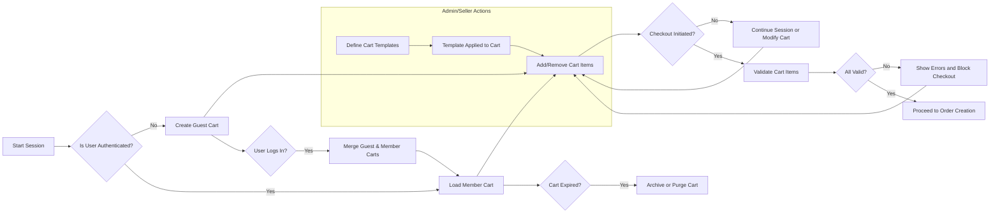

# Cart Management Requirement Specification for aiCommerce Backend

## 1. Introduction and Background
The aiCommerce platform enables users to browse, select, and purchase products through sophisticated e-commerce workflows. The cart service is central to this: it acts as a temporary, modifiable holding area for buyers' potential purchases and as a tool for sellers and admins to optimize user experience (via templates and analytics). This document defines the full scope of business logic for cart management, including persistence, session handling, merging, validation, customization, and error handling.

## 2. Business Context: Cart Functionality in AI Commerce
The cart system facilitates the buyer's purchasing decision, allows sellers/administrators to affect the cart structure via templates, and supports personalization and recovery through AI. Correct cart handling maximizes conversion rates, supports multi-device and multi-session continuity, and ensures accurate order creation, inventory, and discount logic.

## 3. User Roles and Permissions
| Role     | Permissions in Cart System                                                                                                                        |
|----------|---------------------------------------------------------------------------------------------------------------------------------------------------|
| Visitor  | View/catalog products, add items to guest cart, modify/remove items, convert to member cart upon registration or login                            |
| Buyer    | Persist cart across sessions/devices, manage cart contents, apply templates, select options, merge/recover carts, proceed to order                |
| Seller   | Create/manage cart templates, receive analytics on cart usage for their products, view aggregated (not individual) buyer cart analytics           |
| Admin    | Monitor and troubleshoot cart system behavior, configure platform-wide cart expiration, handle disputes, audit cart/session activities            |

All cart-related actions must fully respect and enforce the permissions outlined above.

## 4. Cart Lifecycle and User Journey
- WHEN a visitor browses products, THE system SHALL allow creating a guest cart associated with a browser session or device identifier.
- WHEN a registered buyer adds products to their cart, THE system SHALL persist the cart, associating it with their account.
- WHEN a user logs in and an existing guest cart is present, THE system SHALL automatically merge or prompt merging with the member cart following merging business rules.
- WHEN a user logs out, THE system SHALL retain their persistent (member) cart and discard or anonymize guest cart data following security rules.
- WHEN a cart is converted to an order, THE system SHALL mark the cart as 'checked out' and prevent further modification.
- WHEN a cart expires (see Expiration Rules), THE system SHALL flag or archive it, and make recovery options available where possible.

## 5. Cart Persistence and Session Management
- WHERE a user is logged in, THE system SHALL persist the cart to the buyer's account for cross-device/session consistency.
- WHERE a user is a guest, THE system SHALL store cart data using secure client identifiers (e.g., browser cookie, device fingerprint) and maintain for a defined period or session.
- WHEN a session ends (via explicit logout or session timeout), THE system SHALL ensure cart data integrity, never losing in-progress carts unless subject to expiration policy.
- WHEN a user logs in, THE system SHALL reconcile/merge the active guest cart with their persistent member cart per business merging logic.
- THE system SHALL log all cart creation, modification, merging, and deletion events for audit and troubleshooting.

## 6. Guest vs Member Cart Logic
- WHEN a guest is promoted to a buyer (via registration or OAuth), THE system SHALL merge any active guest cart into the member cart, subject to validation on product availability, inventory, and pricing updates.
- IF a guest cart has items not present in the member cart, THEN THE system SHALL append those items, ensuring no duplication of identical product/option combinations.
- IF product details change between guest and member cart merge (e.g., price, availability), THEN THE system SHALL alert the user and require confirmation before proceeding.
- WHERE a member is using multiple devices, THE system SHALL resolve cart differences by last-modified timestamp, prioritizing recent updates, and flagging conflicts for user action if necessary.

## 7. Cart Item and Option Management
- WHEN a product is added, THE system SHALL capture all option selections (size/color/etc.) and persist them as part of the cart item.
- WHEN the user modifies cart item options, THE system SHALL validate current inventory and pricing for the chosen combination.
- IF inventory or product status changes after addition to cart, THEN THE system SHALL notify the user with actionable choices (remove, modify, replace, or proceed with updated terms).
- THE system SHALL allow items to be removed or have their quantity adjusted, with constraints such as minimum and maximum quantity (as determined by product settings).
- WHERE a seller designates required options for a product, THE system SHALL enforce selection of all required options before allowing the cart item to proceed to order.

## 8. Cart Templates, Recovery, and Merging
- Sellers may define templated cart structures (product bundles, suggested carts) to accelerate buyer flow.
- WHEN a buyer chooses to load a seller/admin template to their cart, THE system SHALL replace or append items per the template configuration and validate current state (availability, pricing).
- IF a user accidentally clears or loses their cart (hardware/software failure, logout, etc.), THEN THE system SHALL provide recovery options within retention/expiration window, restoring the last valid cart state.
- WHERE merging occurs (login, template use), THE system SHALL validate all items for continued validity and flag conflicts (pricing/inventory) for user resolution.
- IF duplicate products with identical options are merged, THEN THE system SHALL sum their quantities up to configured limits or prompt the user to resolve excess items.

## 9. Cart Validation and Expiration
- WHEN a buyer proceeds to checkout, THE system SHALL validate all cart items for:
  - Active product status
  - Sufficient inventory
  - Valid/selected options
  - Current pricing and discounts
- IF any item fails validation, THEN THE system SHALL display a detailed error and require user action (modify cart, remove invalid item, etc.).
- THE system SHALL enforce cart expiration based on configurable retention (e.g., 7 days for member carts, 1 day for guests, or admin-defined).
- WHEN a cart expires, THE system SHALL archive or purge the cart according to data retention and compliance requirements, with optional user notification for registered buyers.

## 10. Error Handling and User Experience Requirements
- IF user attempts to check out with an expired or invalid cart, THEN THE system SHALL block the action, present recovery/repair options, and provide guidance on next steps.
- IF a duplicate session or device attempts conflicting cart actions, THEN THE system SHALL enforce data consistency and present clear management options.
- THE system SHALL support undo and restore options for cart clearing or accidental removal for a defined retention window.
- Error messages shall be actionable and non-blocking where possible, never resulting in silent failures or unexplained losses.

## 11. Performance Expectations
- WHEN a cart action is performed (add, update, remove), THE system SHALL respond within 1 second for standard cart sizes (<30 items), or provide progress feedback for larger/complex operations.
- Cart merges, recovery, and validation during member login SHALL complete within acceptable delay (<2 seconds in standard network conditions), or provide progress/status updates.

## 12. Business Rules and Constraints
- All cart changes must be auditable, time-stamped, and traceable to user/session (including merged/recovered carts).
- Cart creation, manipulation, and expiration must comply with data privacy policies.
- Cart pricing, inventory, and product detail validations must use real-time data whenever possible (not stale caches).
- Cart templates may be restricted to certain sellers, sections, or campaigns; application rules must be enforced.
- Business rules for cart merging: prioritize user recently-changed items, alert on pricing/inventory change, prompt for conflict resolution.
- Max/min allowable cart items per buyer/session must be enforced (configurable per business policy).

## 13. Mermaid Diagram: Cart Lifecycle & User Interaction

## 14. Success Metrics
- Cart-to-order conversion rate
- Average cart item retention time
- Number of abandoned carts recovered
- Cart error rate (validation, expiry, merge conflicts)
- Cart operation response times

## 15. Related Documents
- [User Roles and Authentication Requirements](./02-user-roles-and-authentication.md)
- [Product Management Requirements](./06-product-management.md)
- [Order Management Requirements](./10-order-management.md)
- [Payment, Coupon, and Mileage Requirements](./11-payment-coupon-mileage.md)
- [Business Rules and Compliance](./14-business-rules-and-compliance.md)
