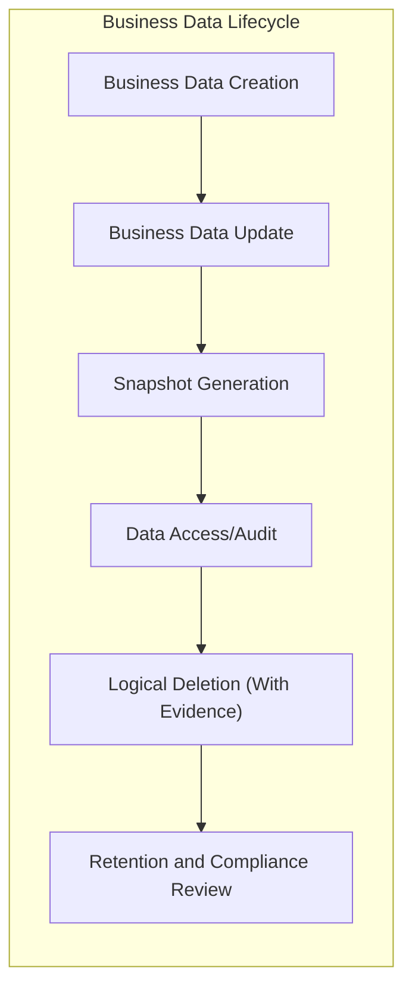

# Data Management and Evidence Preservation Requirements for shoppingMallAiBackend

## 1. Business Data Lifecycle

THE shoppingMallAiBackend SHALL treat every business record (product, order, customer, transaction, review, inquiry, complaint) as a governed entity tracked from creation to logical deletion. 

WHEN a new record is created, THE system SHALL assign it a unique business identifier and creation timestamp.

WHEN a business record is updated, THE system SHALL generate a new immutable snapshot of its complete business state prior to applying the change.

WHILE a record exists in the system, THE system SHALL allow authorized users to view its complete lifecycle history (creation, edits, status changes, logical deletion events) as business evidence.

IF a record is marked for deletion, THEN THE system SHALL not physically delete it but record a deletion timestamp and retain its current snapshot for audit and investigation purposes, following data retention rules.

THE system SHALL not allow any restoration, editing, or access to logically deleted records except by admin roles authorized for evidence review and compliance purposes.

## 2. Snapshot and Audit Trails

WHEN any business event occurs that affects a critical business entity (order state change, product update, user information change, coupon/mileage update, review/inquiry edit or removal), THE system SHALL create an immutable, time-stamped snapshot of the entire affected entity, preserving its previous state as business evidence.

WHERE a dispute, complaint, chargeback, or regulatory investigation is initiated, THE system SHALL provide access to all relevant snapshots and audit histories for affected records, including originator, approver (if any), and associated changes.

THE system SHALL provide business flows to retrieve, compare, and restore previous business states for any entity, only for authorized compliance staff or upon valid business/legal request.

THE system SHALL maintain a complete audit trail of all business-critical actions (who performed, what change, when, why if applicable, and affected entities) and make this trail accessible for regulatory/business review as required.

THE system SHALL retain all snapshots and trails used for the basis of billing, refunds, fulfillment, compliance, or dispute for at least the minimal period set by business retention policies or legal requirements, whichever is greater.

## 3. Evidence and Compliance Requirements

THE shoppingMallAiBackend SHALL ensure that all business data (orders, payments, user identity, accounting, legal documents) is preserved in a form that is tamper-evident and suitable for submission as business or legal evidence.

THE system SHALL identify and classify records with special preservation needs (e.g., financial transactions, refund/cancellation requests, KYC documents, customer claims, audit logs).

WHEN evidence is requested by regulatory authorities, legal representatives, or through customer escalation, THE system SHALL provide all immutable snapshots and audit trails within the required time frames and in formats specified by business or regulatory needs.

WHERE a record is subject to a legal hold (investigation, litigation, tax review), THE system SHALL prevent its deletion/alteration for the period of legal retention, regardless of ordinary business deletion logic.

IF tampering, deletion, or unauthorized access is detected or suspected, THEN THE system SHALL record the event, notify responsible business units, and support investigation according to policy.

## 4. User Data Rights and Security

THE system SHALL allow customers, sellers, and admins to initiate business requests for data export, correction, withdrawal (account deletion), and data portability, fulfilling all such legitimate requests in accordance with local/international business regulations and timelines.

WHEN a user exercises a data rights request (e.g., deletion, restriction, export, correction), THE system SHALL log this request as a business event and provide confirmation/tracking to the requester.

WHERE a data deletion/withdrawal request conflicts with business obligations (ongoing transaction, legal retention, regulatory audit), THE system SHALL notify the requester of the constraint, record the business justification for retention, and provide a process for appeal if required.

THE system SHALL enforce business-driven access control policies, allowing only authorized roles to retrieve, modify, or remove data relevant to their duties, with all access events recorded to the business audit trail.

THE system SHALL apply business-level policies for encryption, key management, and evidence of access (e.g., two-person integrity for sensitive access), and provide notification/reporting for potential security incidents.

## 5. Data Retention Policies

THE system SHALL classify business data into retention categories (short-term: session data, mid-term: transactional records, long-term: financial/legal documents, perpetual: audit logs required by law), with clear business justifications for each.

WHERE laws or business policy require, THE system SHALL automatically review and process data deletion, archival, and retention actions (for example: deleting expired shopping carts after 30 days, archiving order and payment data after statutory retention period).

WHEN business data reaches its defined end-of-life, THE system SHALL apply logical deletion, archival, or anonymization as appropriate, preserving evidence as snapshots and business event logs as required for compliance/audit.

THE system SHALL retain evidence used in automated processes (AI/ML training, compliance screening) only as long as needed for assigned business purposes, and shall document all such usage in retention and compliance records.

THE system SHALL support business reporting, user notification, and compliance self-audits to verify retention, deletion, and evidence policies are being properly implemented.

## Supporting Mermaid Diagram

## Business Rules for Auditability

- THE system SHALL maintain a complete, immutable log of changes to all business-sensitive records.
- WHEN an entity is modified, THE system SHALL provide a complete before-and-after business-level comparison for audit.
- IF any inconsistency, unauthorized activity, or tampering is suspected, THEN THE system SHALL make such events discoverable via audit tools and preserve all related evidence for investigation.

## Error Scenarios and Handling

- IF snapshot creation fails at any required business event, THEN THE system SHALL block the associated business operation and notify responsible business units for resolution.
- IF a business evidence query is made for a logically deleted or archived record, THEN THE system SHALL respond with access denied unless authorized admin/compliance override is present.
- WHERE evidence or audit data is requested but retention period has expired and data is legally and business-justifiably purged, THE system SHALL provide a clear business justification for unavailability.

## Performance Expectations

- WHEN audit trails or snapshots are queried by authorized business users, THE system SHALL provide results within business-standard review time (no more than 5 seconds for typical cases, 30 seconds for extensive legal/reporting queries).
- THE system SHALL support high concurrency for evidence query and export events without degrading business process performance.

## Business-Only Scope Notice

This document defines business requirements only. All technical implementation, physical data storage, and detailed architecture decisions belong to developers. The document describes WHAT to do, not HOW to build it.