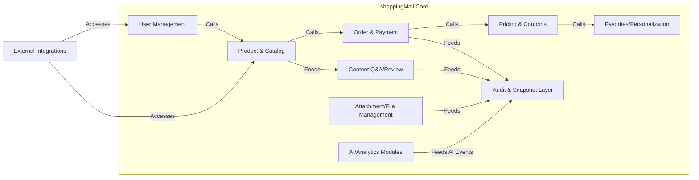
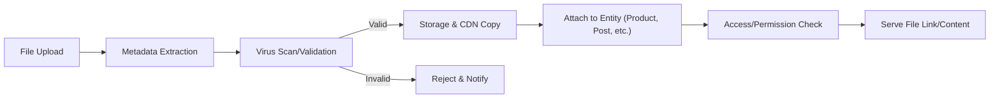

# System Architecture, Snapshots, and Compliance Requirements for the AI-Driven Shopping Mall Backend

## 1. System Structure and Extensibility

### 1.1 Modular, Scalable Architecture
THE shoppingMall backend SHALL operate as a modular system, ensuring clear separation of responsibility for each primary domain: user management, product/catalog, order/payment, content, audit/compliance, file attachment, AI/analytics, and external integrations. WHEN a new sales channel or section is introduced, THE system SHALL allow its independent configuration and deployment without affecting existing channels. THE system SHALL enable plug-and-play extension of all core business modules (e.g., launching new AI recommendation engines, integration connectors) without disruption. WHEN business modules or features are upgraded, THE system SHALL preserve backward compatibility for all non-breaking business logic, documenting all configuration changes with timestamp, author, and business impact.

#### 1.1.1 Performance and Scalability
THE system SHALL support horizontal scaling (sharding, read/write split, CDN caching) to maintain service for hundreds of channels and millions of SKUs/users/transactions. WHEN seasonal traffic surges are expected, THE system SHALL scale preemptively and provide monitoring/alerts for resource bottlenecks. All user- and business-critical workflows (product search, checkout, payment, content upload) SHALL complete in under 2 seconds for >99% scenarios under target peak loads. IF performance degrades, THEN THE system SHALL queue affected events and notify admins via dashboards and alerts.

#### 1.1.2 Data Denormalization and Futureproofing
THE architecture SHALL allow denormalization of frequently accessed business data for performance without compromising traceability or snapshot integrity. WHEN new data attributes or business rules are added, THE system SHALL not impact current entity states; all schema extensions SHALL be backward-compatible, and documentation SHALL be versioned.

#### 1.1.3 Mermaid Diagram: Modular System Structure

## 2. File and Attachment Management

#### 2.1 Attachment and File Handling Requirements
THE shoppingMall backend SHALL support upload, metadata extraction, version history, and secure storage of file attachments for all relevant business objects (products, reviews, posts, inquiries, profile images, etc.). WHEN a file is uploaded, THE system SHALL record complete metadata (upload user, filename, mimetype, size, upload time, associated business entity, channel/section, purpose tag, storage URL), and validate against allow-listed types and system limits (e.g., 2GB max per file unless otherwise configured). WHEN a file is updated, ALL previous versions SHALL be preserved, with linkage to events and audit/snapshot chains.

THE system SHALL integrate with a CDN for geographic delivery and enforce fine-grained permissions for download/download URLs on a channel, role, and entity basis. WHEN an upload fails (e.g., type, virus, permission), THE system SHALL return structured feedback with explicit failure reason to the uploading user.

#### 2.2 Compliance, Security, and Audit
All attachments SHALL be subject to compliance checks (malware scan, region legality, PII rules), and THE system SHALL log all uploads, updates, accesses, and deletes (soft only). Data marked as deleted SHALL not be removed from storage until all legal retention and audit processing is verified as complete. IF an admin or user requests export as part of rights invocation (GDPR/CCPA), THEN THE system SHALL extract all related files/attachments per user/entity.

#### 2.3 Mermaid Diagram: File Upload and Access

## 3. Snapshot, Audit, and Compliance Rules

### 3.1 Snapshot Evidence and Audit Trails
THE shoppingMall backend SHALL create an immutable snapshot and audit record for all material changes to business entities (products, orders, posts, users, reviews, files, etc.), storing both pre- and post-event versions, actors, and timestamps. WHEN data is logically deleted/updated, THE system SHALL mark the deletion/override in snapshots and maintain all prior versions for lawful retention.

THE audit subsystem SHALL ensure tamper-evident records and maintain a globally queryable evidence trail (e.g., order → refund → audit snapshot chain), with all admin/user actions, triggers, and business events logged.

### 3.2 Cross-Entity Consistency
WHERE a transaction alters multiple business entities (e.g., batch inventory update or refund), THE system SHALL link and atomicly log all relevant snapshots as a consistent event bundle, ensuring audit and legal traceability.

### 3.3 Audit Access, Error Handling, and Export
All authorized admin users and compliance tools SHALL have interface/query access to prior states, with filterable logs by entity, time, action, user, or legal request. IF a snapshot or audit write fails, THEN THE system SHALL alert system administrators, flag the affected process, and require corrective action before further business flows.

#### 3.4 Mermaid Diagram: Audit and Snapshot Chain

## 4. Data Privacy, Security, and Internationalization

### 4.1 Encryption and Security
All personal and business-critical data SHALL be encrypted in transit (TLS 1.2+) and at rest (AES-256 or strong regional equivalent). WHEN identity verification, payment, or PII is processed, THE system SHALL strictly segregate storage by channel and/or legal jurisdiction. All access to protected data SHALL be logged with role, entity, time, and business purpose; THE system SHALL surface only minimum data needed for authorized operation.

### 4.2 Legal and Regional Compliance
THE system SHALL guarantee all user/institutional rights (data export/rectification/erasure, audit request) via standardized APIs and UI, logging all rights exercises for compliance review. WHEN a data breach or security event is detected, THE system SHALL lock affected records, notify regulators and users as required, and initiate a full audit/investigation. THE audit subsystem SHALL preserve all evidence for the legally mandated duration per channel/geography (e.g., 5yrs for Korea, 3yrs EU/US) and support data export on regulator request.

### 4.3 Internationalization and Accessibility
THE shoppingMall backend SHALL deliver all user/business-facing content in multiple languages, currencies, and region-appropriate number/date/address formats. WHEN serving a new region/channel, THE system SHALL allow per-channel configuration of legal, tax, payment, and content business logic overlays, with fallback to default platform rules. All end-user content SHALL comply with WCAG 2.1 accessibility guidance (screen reader compatibility, keyboard nav, color/controast, alt text for media).

### 4.4 PCI/AML/KYC, Region-Specific Controls
All payment flows SHALL meet PCI DSS and local anti-money-laundering (AML), know-your-customer (KYC) requirements. WHERE regulation differs by channel, THE system SHALL configure and enforce those rules at channel, seller, and business entity granularity, and provide targeted compliance reporting for each.

---

**This business requirements specification provides a comprehensive foundation for backend development, meeting all enhancement, evidence, security, and compliance standards for the AI-driven shoppingMall platform. All requirements herein avoid technical (DB, API) detail and are actionable in natural EARS language for business logic implementation.**