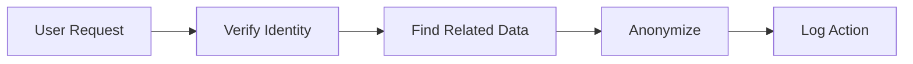

# 9. Business, Compliance & Security

## Table of Contents
1. [Overview & Objectives](#overview--objectives)
2. [Key Compliance Domains & Use Cases](#key-compliance-domains--use-cases)
3. [Immutable History & Soft Delete](#immutable-history--soft-delete)
4. [RBAC & Permission Management](#rbac--permission-management)
5. [Data Encryption & Masking](#data-encryption--masking)
6. [Compliance Workflows & Auditing](#compliance-workflows--auditing)
7. [Regional Adaptability](#regional-adaptability)
8. [Risk Management & Continuous Improvement](#risk-management--continuous-improvement)
9. [Acceptance Criteria](#acceptance-criteria)

---

## 1. Overview & Objectives

A compliant, secure backend is foundational to user trust and business longevity. This system is designed to maintain **regulatory alignment** with GDPR/CCPA, PCI-DSS, AML, and local laws, safeguarding sensitive data while enabling global business needs. 

**Scenario Example:**
- When a customer requests their data be erased under GDPR, the system identifies all relevant PII, executes anonymization, and generates a compliance report for audit.

## 2. Key Compliance Domains & Use Cases

| Domain          | Typical Workflow Example                                    |
|-----------------|------------------------------------------------------------|
| **GDPR**        | User requests erasure > System verifies request > Execute anonymization > Log action | 
| **PCI-DSS**     | Card entry > Data encrypted-at-rest > Transaction logged > PCI-compliant processor | 
| **AML**         | Large order triggers AML workflow > Flag for review > Approve/reject | 
| **Accessibility**| Release content > Automated WCAG scan > Remediation flagged > Report generated |

## 3. Immutable History & Soft Delete

Every record (order, account, deletion) is snapshotted with timestamp, actor, and change reason. No destructive deletes: all deletes create a soft-deleted flag, retrievable by audit users.

**Example:**
```
{ "user_id":123, "action":"soft_delete", "target":"order", "order_id":850, "reason":"user request", "timestamp":"2025-06-09T00:00:00+09:00" }
```

**Retention Policies:**
- Orders: 7 years (regulatory)
- Personal data: Configurable per compliance

**Audit Scenario:**
- Auditor retrieves soft-deleted orders for a given user for the past two years via protected API.

## 4. RBAC & Permission Management

Permissions are granular, contextual, and enforce separation-of-duties. All actions are mapped to roles; escalation requires approval workflow.

**Permission Matrix Example:**
| Role    | View Orders | Edit Product | Erase Data | Access PII |
|---------|-------------|--------------|------------|------------|
| Admin   | ✔           | ✔            | Approval   | Approval   |
| Seller  | Own Only    | ✔            | No         | No         |
| Auditor | Logs Only   | No           | No         | Masked     |

**Escalation Flow**: 
1. Seller requests elevated access
2. System logs request
3. Admin reviews/approves
4. Temporary access granted, then auto-revoked

## 5. Data Encryption & Masking

- **Encryption Algorithms:** AES-256 for at-rest; TLS 1.3 for in-transit
- **Key Rotation:** Scheduled every 90 days, auto-notified to admin dashboard
- **Masking:**
  - Logs obfuscate PII as: `john***@email.com`, `****-****-1234`

## 6. Compliance Workflows & Auditing

**Workflow: GDPR Erasure**

**Sample Policy Engine Rule:**
- "If coupon value exceeds $500, secondary admin must approve."

## 7. Regional Adaptability

- **Configurable Policy Example:**
  - `data_retention_period["EU"] = 730` 
  - `data_retention_period["KR"] = 1825`

- **Update Deployment:**
  - Updates to locale policy files are loaded at runtime without redeploy

- **Adaptation Example:**
  - Korean orders require resident registration number masking; EU disables this by default

## 8. Risk Management & Continuous Improvement

- **Automated Scans:** Weekly vulnerability and compliance checks
- **Audit Checklist Sample:**
  1. PII Access logs reviewed
  2. Key rotation validated
  3. Retention schedules run tested
- **Scheduled Activities:**
  - Penetration test every quarter

## 9. Acceptance Criteria

- All access to PII is logged with timestamp, actor, and reason.
- Soft-deleted records can be recovered through audited API call, only by auditor role.
- Key rotations are completed every 90 days with notification logs.
- GDPR erasure requests are fulfilled within 30 days, fully anonymizing all linked PII.
- PCI-related actions never store raw card data; audits export in CSV/xml format.
- Regional policies can be updated without code redeployment.

---
[Back to TOC](./00_toc.md)
