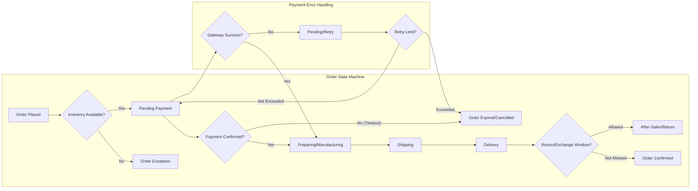

# 1. Validation Rules Overview

- THE shoppingMallAiBackend SHALL validate all user inputs according to business context (name, address, product options, quantities, payment details), rejecting values outside business-permitted ranges/formats immediately with actionable feedback.

- WHEN new customer records are created, THE shoppingMallAiBackend SHALL require phone/email uniqueness on per-channel basis.

- WHEN product is registered or updated, THE shoppingMallAiBackend SHALL require all required fields populated (title, category, price, images; optional fields may remain empty), and SHALL record versioned snapshots of any modifications for audit.

- WHEN user initiates payment, THE shoppingMallAiBackend SHALL verify inventory availability for all line items before confirming payment intent.

- IF discount/coupon code is applied, THEN THE shoppingMallAiBackend SHALL validate active state, minimum order value, eligibility (buyer segment, channel, product), validity period, one-time use conditions, stacking rules, exclusivity, and per-user limits.

- WHEN order is placed, THE shoppingMallAiBackend SHALL generate immutable order records, allow for split or partial fulfillment where business policy permits, and SHALL control transitions through all valid order states only (see state diagram).

# 2. Exception and Edge Cases

- IF inventory is depleted between order placement and payment confirmation, THEN THE shoppingMallAiBackend SHALL flag affected line items as failed, provide user with resolution options (refund, reselect, waitlist), and prevent further processing until resolved.

- IF payment gateway returns failure or is unreachable, THEN THE shoppingMallAiBackend SHALL mark order as 'pending payment', notify user and retry provider up to a business-defined limit; recovery paths include retry, alternative payment proposal, or order cancellation.

- WHEN any fraud or compliance risk is detected (e.g., mismatched customer identity, abuse of refunds, or multi-account manipulation), THE shoppingMallAiBackend SHALL suspend all transactions for affected user/channel until manual audit is complete.

- IF data modification is required for legal or dispute resolution reasons, THEN THE shoppingMallAiBackend SHALL operate on versioned snapshot (not destructive overwrite), logging all changes and rationale for traceability.

# 3. Discount, Order, and Payment Logic

- WHEN consumer applies multiple coupons, THE shoppingMallAiBackend SHALL enforce stacking and exclusivity rules (e.g., certain discounts may not be combined), and SHALL calculate order final total by permitted stacking order.

- IF minimum order value for coupon use is not met even after applying discounts, THEN THE shoppingMallAiBackend SHALL prevent coupon application and explain reason to user.

- WHEN order is completed, THE shoppingMallAiBackend SHALL trigger loyalty/mileage accrual, update user transaction history, and process deposit/mileage usage rules.

- WHEN payment is asynchronous (virtual account, bank wire), THE shoppingMallAiBackend SHALL keep order in 'pending payment' state until funds are confirmed, with auto-expiry/action after timeout.

- WHEN order is split for partial fulfillment, THE shoppingMallAiBackend SHALL allow only valid business transitions and track parent-child relationship through entire lifecycle.

- IF user requests order cancellation before 'shipping confirmed' state, THEN THE shoppingMallAiBackend SHALL process request immediately with refund logic per business/tax rules; beyond this stage, cancellation requires manual escalation and audit.

- WHEN return or exchange is requested, THE shoppingMallAiBackend SHALL validate eligibility: receipted transaction, within allowed time frame, compliant product condition, and SHALL enforce 'no exchange/refund' beyond the confirmation window except for legal/QA exception.

- WHEN applying deposit/mileage, THE shoppingMallAiBackend SHALL deduct balances in strict FIFO order; expired mileage SHALL not be applied, and donation options are surfaced per admin configuration.

# 4. Security, Privacy, and Compliance Constraints

- THE shoppingMallAiBackend SHALL store all personally identifiable information (PII) and financial data encrypted-at-rest and in-transit using approved cryptographic standards.

- WHEN processing identity (KYC) or payment, THE shoppingMallAiBackend SHALL never expose sensitive data in cleartext to downstream integrations or UI clients.

- WHEN user requests account deletion or "right-to-be-forgotten", THE shoppingMallAiBackend SHALL anonymize/delete all user-associated PII except where legal retention mandates apply (e.g., transaction records for tax).

- IF unauthorized access is detected (session hijack, token replay, API brute force attempts), THEN THE shoppingMallAiBackend SHALL lock out affected session(s), trigger administrator notification, and audit for source/cause.

- THE shoppingMallAiBackend SHALL retain all audit, snapshot, and event logs for minimum required business/legal retention periods (e.g., 5 years for transactions/GDPR, etc.), with no manual deletion possible by regular users/admins before this period.

- WHEN handling cross-border users/data, THE shoppingMallAiBackend SHALL ensure compliance with all applicable privacy laws (GDPR, CCPA, local e-commerce acts), and support opt-in/out for marketing consent by region.

# 5. Operational Limitations

- THE shoppingMallAiBackend SHALL deliver all customer and seller-initiated transaction processing in under 2 seconds for 95% of cases, with real-time user notification for any delays beyond 5 seconds.

- THE shoppingMallAiBackend SHALL support only business-approved external integrations, with all third-party access logged/audited and only for minimum permitted data.

- THE shoppingMallAiBackend SHALL not allow rollback or masking of critical events (e.g., payment, legal complaint, inventory destruction) once they have reached an immutable business status.

- THE shoppingMallAiBackend SHALL restrict configuration of stacking/discount/cancellation policies to admin users with validated 2-factor authentication, and log all outbound admin actions.

- THE shoppingMallAiBackend SHALL ensure system extensibility (new channels, payment types, regulatory policies) only via established update flows and after comprehensive business/legal review.

# 6. Order and Exception State Diagrams (Mermaid)

# 7. Handling and Reporting of Business Exceptions

- WHEN any systemic business error or constraint breach occurs, THE shoppingMallAiBackend SHALL log full incident context, notify affected users (in their language/channel where possible), and escalate to admin for remediation within a defined SLA.

- IF AI-driven workflow triggers an action beyond normal policy boundaries (e.g., overrides return windows for high-value/complaint resolution), THEN THE shoppingMallAiBackend SHALL require dual-admin approval and record justification in compliance/audit logs.

- IF legal or compliance criteria change (new law, regulation, or business audit finding), THEN THE shoppingMallAiBackend SHALL mandate update of all affected business rule configs prior to further relevant operations.

# 8. Documentation and Traceability

- THE shoppingMallAiBackend SHALL ensure all business rules, exceptions, and constraints are documented in a traceable, versioned manner linked to organizational compliance, and accessible to authorized auditors and developers alike.

- Upon any change to formal rules, THE shoppingMallAiBackend SHALL require review/approval workflow with automated notification to impacted business and technical teams.

- THE shoppingMallAiBackend SHALL not allow automated AI updates to business rules without explicit, verifiable stakeholder approval.

# 9. Additional Guidance for Developers

All business rules above are stated in natural language using EARS syntax where applicable. Developers are responsible for interpreting ambiguity in favor of more conservative, secure, and compliant operation. For further scenarios and legal interpretations, refer to related documents including: [Service Overview](./01-service-overview.md), [Functional Requirements](./03-functional-requirements.md), [Admin Journey](./06-admin-journey-user-stories.md), [Compliance and Legal Requirements](./14-compliance-and-legal-requirements.md), and [Future Roadmap and Known Issues](./16-future-roadmap-and-known-issues.md).