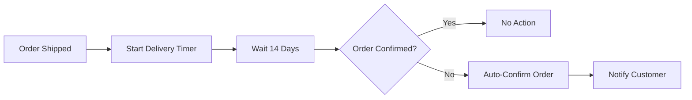

# Business Rules, Exception Handling, Workflow Automation, Scalability & AI Feature Roadmap

## 1. Introduction
This report provides enforceable business requirements for the rule engine, workflow automation, exception management, audit trails, system scaling, and advanced/AI feature roadmap for the shoppingMall backend. All provisions are written in EARS format for clarity, testability, and developer-actionability.

## 2. Business Rule Engine

### 2.1 Rule Coverage and Domains
- THE backend SHALL enforce business rules for order, payment, inventory, coupon logic, permissions, fulfillment, and evidence retention.
- Business rules SHALL be evaluated at every stage: order/process, discounts, inventory, auditing, access control, exception, and workflow stage.
- WHEN a business action occurs (e.g., coupon use, order cancellation, price change), THE rule engine SHALL (a) validate business constraints, (b) authorize by role, (c) log the trigger, (d) check escalation paths where needed.
- WHEN a rule check fails, THE system SHALL prevent the next transition, surface a testable/business-code, and log the reason in the audit record.

### 2.2 Rule Configurability and Traceability
- THE system SHALL support channel/section/time-based rule versions and configurations, preserving per-version audit trails for all changes.
- WHEN a rule is changed, THE system SHALL record author, timestamp, reason, and affected entities, and update audit trails accordingly.
- RULE engine SHALL allow querying past/present parameters with business context, showing who/when/what logic was in effect for any workflow or entity change.

### 2.3 Rule Examples (EARS Compliance)
- WHEN customer applies a coupon, THE system SHALL check stackability, exclusivity, expiry, and all order eligibility before allowing redemption; IF violation, THEN THE system SHALL block use and provide error with code/explanation within 2 seconds.
- WHEN order is submitted, THE rule engine SHALL enforce logical state, inventory sufficiency, and prevent regressions; illegal transitions SHALL be blocked and logged.
- WHEN seller attempts to edit a product, THE rule engine SHALL block edits to non-eligible statuses (e.g. paused, discontinued) and require explicit role validation.
- WHEN admin escalates a business rule, THE system SHALL snapshot the event, escalate to relevant modules, and issue a notification within 60 seconds.

## 3. Exception & Error Management

### 3.1 Error Types
- THE system SHALL classify ALL errors as: (1) user-recoverable, (2) business logic rule violation, (3) system/infrastructure, (4) external/integration, or (5) compliance/audit.
- WHEN an error occurs, THE system SHALL log the context, error code, trigger entity, affected user, and resolution status.

### 3.2 User-Facing Errors & Recovery
- WHEN users make recoverable errors (e.g., invalid coupon, insufficient inventory), THE system SHALL surface a recovery instruction and actionable code, enabling users to fix the mistake and retry.
- WHEN unrecoverable/system errors occur, THE system SHALL display an explanatory message, offer escalation (e.g., contact support, reference code), and block the operation for safety.

### 3.3 Exception Auditability
- ALL exceptions SHALL create an audit log entry with a unique code, user, operation, impacted entities, and steps taken.
- WHEN a compliance/integrity warning is triggered, THE system SHALL mark the affected workflow as locked and alert admin within 2 minutes.

### 3.4 Example Error Handling Scenarios
- IF payment fails after inventory is deducted, THEN THE system SHALL (a) roll back inventory change, (b) inform the user, (c) retry or start refund within 10 seconds, and (d) log all actions.
- IF audit log cannot be written, THEN THE system SHALL halt all affected workflows, trigger failover, and alert admin within 1 minute.

## 4. Workflow Automation and Safeguards

### 4.1 Automated Business Process Scenarios
- WHEN a timed or event-driven trigger is configured, THE workflow module SHALL execute automation (e.g., batch order auto-confirm after N days, mass coupon expiration, inactivity clean-up, SLA breach escalation, or scheduled bulk notifications).
- ALL automated actions SHALL be logged for traceability, with before/after entity snapshots and escalation paths on failure.

### 4.2 Manual Override
- Admins SHALL have manual override powers for all automation; WHEN used, THE system SHALL log the operator, timestamp, action, and justification for future audit.
- WHEN conflicting/duplicate automations are detected, THE workflow engine SHALL block the risk path and escalate for human review.

### 4.3 Automation Example (EARS format)
- WHEN order is shipped, THE workflow engine SHALL start a delivery timer and, after 14 days without customer confirmation, auto-confirm receipt, update order state, and notify the customer within 30 seconds of execution.
- WHEN a coupon expires, THE system SHALL deactivate it and notify users/sellers within the configured notification window.

### 4.4 Mermaid Diagram: Automated Order Confirmation

## 5. Scalability & Performance Requirements

### 5.1 Transaction Volume/Expansion
- THE system SHALL support limitless channels and sections, up to 100 million+ entities (SKUs, orders, users), with consistent response time under 2 seconds for 99% of business events.
- Snapshots/audit history retrieval for any entity/period SHALL always complete in <3 seconds.

### 5.2 Scalability Automation
- WHEN traffic is predicted to spike (e.g., campaign, holiday), THE system SHALL automate horizontal scale-up within 10 minutes, duplicating data and services as required.
- Sharding, denormalization, and read/write separation SHALL be invoked when monitoring detects performance below thresholds for target SLAs.

### 5.3 Audit and Compliance at Scale
- THE audit system SHALL maintain tamper-evidence and completeness, ensuring every change is saved, indexed, and available globally.
- Integration of new channels/regions SHALL be completed with zero downtime and compliance configuration overlays for region laws.

## 6. Advanced Feature & AI Roadmap

### 6.1 AI-Powered Feature Use Cases
- THE system SHALL provide data flows, triggers, and extensibility for AI modules:
    - Personalized product recommendations
    - Real-time fraud/anomaly detection
    - Dynamic pricing optimization
    - Sentiment analysis on reviews/inquiries
    - Predictive analytics for orders/churn/inventory
- AI-powered flows SHALL log all decisions, provide versioned explainability, and allow auditing of automation impact.
- WHEN AI models are used, THE system SHALL allow opt-in/out by channel/region and record all usage/decision events for compliance.

### 6.2 Automation Enablement and Control
- All business process automation, whether rule-driven or AI-triggered, SHALL provide feedback for review, rollback, or override.
- AI-based modules SHALL only access data fields in compliance with privacy and opt-in/consent regulation; data for training/inference SHALL be sanitized as required by GDPR/CCPA.
- Every AI/ML action impacting user experience or business workflow SHALL be explainable, versioned, and overrideable by admin with audit trail.

### 6.3 Example AI Workflow Scenario
- WHEN a customer views products, THE AI module SHALL recommend other items based on browsing, favorite, and purchase snapshot history, within 2 seconds. Recommendations SHALL be documented for transparency and compliance.
- Fraud detection SHALL flag suspicious orders/user patterns in real time, lock affected workflows, and alert admins for resolution.

### 6.4 AI/Automation Compliance
- AI/automation usage SHALL be logged, explainable, and subject to admin audit and tuning.
- All regulatory obligations for data subject rights, algorithm transparency, and bias reporting SHALL be enforced.

## 7. Conclusion
These business requirements create a comprehensive, developer-facing foundation for automatable, auditable, and AI-enabled business rule execution with explicit exception handling and workflow management ready for global, multichannel scaling. All requirements herein are ready for direct backend implementation, supporting future extensibility and compliance under constant innovation and regulatory change.