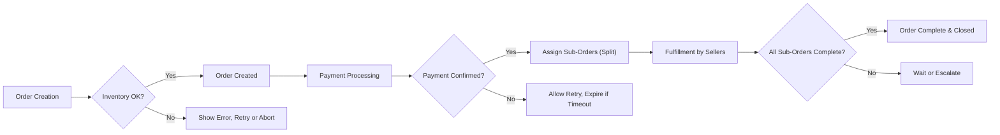

# Order and Fulfillment Management Requirements Specification - aiCommerce

## 1. Introduction
The aiCommerce order management module orchestrates the entire post-cart customer experience, from checkout through payment, fulfillment, delivery, and after-sales processes. Leveraging advanced AI, the system supports smart decisions such as order splitting, fraud detection, and dynamic workflow optimization for optimal user satisfaction and operational efficiency.

## 2. User Roles in Order Management
- **buyer**: May place and track orders, initiate payment, request returns or assistance, and monitor the status at all lifecycle stages. Can cancel or adjust eligible orders within system-imposed windows.
- **seller**: Granted the ability to process and fulfill their own product orders, update shipping and delivery information, manage after-sales support, and monitor orders' financial status. May only interact with their assigned sub-orders.
- **admin**: Holds global authority to view, edit, correct, or mediate any order/sub-order, override statuses, investigate disputes, adjust payments, and perform compliance/audit operations. Can deploy or configure AI processing flows.
- **visitor**: May only view non-sensitive order-related processes/policies; ineligible to place or manage any orders.

## 3. Order Creation & Initialization
- WHEN a **buyer** chooses to checkout, THE system SHALL validate the shopping cart for eligibility: product stock, purchase policy compliance (quantities, restrictions), and correctness of shipping/billing information.
- WHEN validated, THE system SHALL generate a unique order with:
  - Atomic order identifier
  - Ordered product items (with snapshot)
  - Segmentation by seller or fulfillment channel (where applicable)
  - Linked shipping, billing, and applied coupon/reward details
- WHERE a **visitor** initiates checkout, THE system SHALL require full registration and conversion to a **buyer** before allowing order creation.
- IF any cart item is out-of-stock or otherwise ineligible, THEN THE system SHALL prompt the buyer to revise the cart or abort.

## 4. Order Lifecycle: Statuses and Transitions
- THE system SHALL implement a required status progression:
  - Created ➔ Payment Pending ➔ Payment Confirmed ➔ Fulfillment Started ➔ Shipped ➔ Delivered ➔ Closed
- WHEN a **buyer** payment is confirmed, THE system SHALL lock product prices, shipping costs, applied discounts, and item allocations as of that moment.
- WHEN orders contain multiple sellers, THE system SHALL create independent sub-orders for each fulfillment path, linked to the parent for global management.
- WHEN any sub-order is updated (e.g., seller ships items), THE system SHALL update only that segment’s status, with parent order reflecting aggregate state once all sub-orders reach completion.
- The system SHALL enforce irreversible closure after all fulfillment and after-sales flows are finalized (e.g., post-delivery automatic closure after defined days).
- IF status progression is blocked by an error (e.g., inventory change, payment timeout), THEN THE system SHALL provide actionable feedback and log the issue.

## 5. Order Item and Payment Management
- Each order SHALL explicitly itemize: product, SKU/options, quantity, unit and total price, seller/vendor reference, all discounts, tax, and reward allocations.
- WHERE the **buyer** uses mixed payment methods (cash, deposit, coupon, points), THE system SHALL assign the correct payment split per item.
- WHEN asynchronous or deferred payment methods are chosen (virtual account, wire), THE system SHALL:
  - Track pending status until confirmation or timeout
  - Allow the **buyer** to retry payment within the validity window
  - Auto-cancel the order if payment is not verified within the allowable timeframe.

## 6. Split/Partial Fulfillment and Multi-Vendor Logic
- WHEN an order includes products from different sellers or fulfillment channels, THE system SHALL automatically generate sub-orders or shipments according to vendor and/or item type.
- Sub-orders SHALL carry independent status transitions (e.g., some items shipped, others pending).
- IF a **buyer** initiates a return/cancellation for individual items, THEN THE system SHALL handle eligible items independently, process corresponding adjustments, and update involved sub-orders without affecting unrelated shipments.
- The system SHALL support business rules for partial shipment, backorder, or delayed fulfillment with clear communication to the **buyer** and respective **seller(s)**.
- Split handling SHALL be applied for both physical and digital goods as appropriate.

## 7. After-Sales and Customer Support Handling
- WHEN a **buyer** requests an after-sales action (return, refund, exchange, support), THE system SHALL validate eligibility:
  - Allow only for eligible statuses (e.g., not after irreversible closure)
  - Evaluate item return periods, usage/consumption status
- All support actions and communication SHALL be logged and accessible to involved actors and admins for audit and escalation.
- WHERE a **seller** responds or proposes a resolution, THE system SHALL track acceptance, counter-offers, and status changes step by step.
- IF disputes are raised, THEN THE system SHALL allow **admin** intervention, granting manual correction, override, or forced mediation.
- WHEN after-sales is granted, THE system SHALL adjust inventory, trigger refunds, or update order records with full auditability.
- IF parties do not act within response SLA (e.g., 3 business days), THEN THE system SHALL escalate to the next automated or admin process.

## 8. AI-powered and Automated Order Processing
- WHERE enabled, THE system SHALL apply AI models at key points:
  - Fraud detection at order/payment creation (anomaly, duplicate, high-risk signals)
  - Intelligent order splitting and routing (based on real-time stock, fulfillment SLAs, geo-optimization)
  - Automation of routine status updates and user notifications through chatbots/AI agents
  - Predictive after-sales triggers (proactive offers, satisfaction follow-ups)
- AI flows SHALL be overrideable by **admin** intervention if needed for compliance or business needs.
- THE system SHALL learn and adapt its decision criteria based on new data (orders, disputes, returns).

## 9. Business Rules, Error Handling, and Performance
- THE system SHALL surface clear errors with actionable next steps whenever any part of the order workflow fails (payment, split routing, policy conflict).
- THE system SHALL auto-cancel or escalate orders not completed within defined timeframes (e.g., payment not confirmed within 24h; fulfillment not started within 7 days).
- When concurrent order actions occur (e.g., cancellation + shipment mark), THE system SHALL enforce atomic transactions and log authority of final action.
- THE system SHALL handle all standard order transitions (creation, payment, fulfillment, delivery) within 2 seconds per operation under normal load.
- THE system SHALL preserve all critical order state changes (who, when, why) for audit logs and legal evidence.

## 10. Mermaid Diagrams and Workflows

## 11. Role and Permission Matrix for Order Operations
| Action | buyer | seller | admin |
|--------|-------|--------|-------|
| Create Order | ✅ | ❌ | ✅ |
| Pay/Confirm | ✅ | ❌ | ✅ |
| Fulfill/Ship | ❌ | ✅ | ✅ |
| Update Order | ❌ | ✅ (own) | ✅ |
| Cancel/Refund | ✅ (limits) | ✅ (own, limits) | ✅ |
| Escalate/Dispute | ✅ | ✅ | ✅ |
| AI Automation | Viewer | Viewer/Request | Configure/Override |

## 12. Success Criteria and KPIs
- ≥99% of standard order transitions processed within 2 seconds
- <0.5% error or failed transaction rate after successful payment
- >95% accuracy in split/multi-vendor order assignment
- <24h SLA for after-sales initiation and first seller/admin response
- AI-enabled fraud detection achieves false positive rate <2%

## 13. References to Related Documents
- For role/permission/authentication: [User Roles and Authentication Document](./02-user-roles-and-authentication.md)
- For payment and transactional business logic: [Payment, Coupon and Mileage Requirements](./11-payment-coupon-mileage.md)
- For compliance, audit, and system integrity: [Business Rules and Compliance](./14-business-rules-and-compliance.md)

