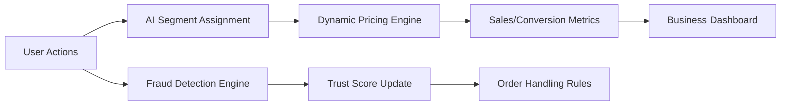

AI and Analytics Business Feature Requirements for ShoppingMallAiBackend

## Introduction

ShoppingMallAiBackend aims to realize an AI-driven shopping mall backend, leveraging advanced analytics and machine learning to provide unique value for customers, sellers, and administrators. The following requirements define how intelligence, personalization, fraud mitigation, and smarter data-driven decision-making shall be integral to the platform’s business model and operation.

## 1. AI Personalization

### 1.1 User Profiling and Behavioral Analysis
WHEN a customer interacts with the platform, THE system SHALL record user actions, preferences, session context, and purchase history to enhance personalization.

WHEN a new customer is onboarded, THE system SHALL initiate an individual preferences profile that is refined over time with explicit feedback and inferred behavior.

WHERE explicit consent is given, THE system SHALL collect browsing, wishlist, favorite, and abandonment data for AI analysis.

### 1.2 AI Recommendation and Content Curation
WHEN a customer browses products, THE system SHALL provide AI-personalized product, coupon, and content recommendations based on real-time profile signals and historic data.

WHEN a customer reviews or favorites an item, THE system SHALL update the customer’s recommendation profile in real time.

WHEN insufficient personal data exists, THE system SHALL fallback to collaborative or trending recommendations derived from similar user clusters.

### 1.3 Personalization Performance Metrics
THE system SHALL measure and report on key metrics such as conversion uplift from AI recommendations, engagement rate, and customer satisfaction scores.

## 2. Fraud Detection and Trust-Enabling Features

### 2.1 Fraud Scenario Identification
WHEN order anomalies are detected (e.g., high-frequency purchases, location mismatches, unusual payment flows), THE system SHALL flag the session for enhanced risk assessment.

WHEN suspicious activity occurs, THE system SHALL cross-reference user/device/profile links to identify patterns of abuse (e.g., multiple accounts, abnormal returns).

### 2.2 AI Risk Prediction Workflows
WHEN the risk score of a transaction exceeds threshold, THE system SHALL request additional authentication or temporarily pause the transaction pending review.

WHEN known scam signals match an existing pattern, THE system SHALL notify administrators for manual or automated follow-up action.

### 2.3 Trust Rating and Application
WHEN a customer, seller, or transaction is risk-assessed, THE system SHALL assign or adjust a trust score, visible in admin/seller dashboards and optionally to end users.

THE system SHALL factor trust scores into order processing, coupon eligibility, and product visibility rules (e.g., low-trust sellers may have restricted inventory publication).

## 3. Smart Pricing Optimization

### 3.1 Dynamic Pricing Requirements
WHEN market signals (competitor prices, inventory levels, historical sales velocity) are processed, THE system SHALL recommend or execute price adjustments for products, sections, or categories.

WHERE sellers or admins approve, THE system SHALL automate scheduled or threshold-based repricing policies.

### 3.2 Price Recommendation and Evaluation
WHEN a product’s price is changed by AI, THE system SHALL record the trigger event, rationale, and resulting business outcome (e.g., improved conversion rate, change in margin).

THE system SHALL enable A/B testing of different pricing strategies, analyzing their performance in controlled cohorts.

### 3.3 Impact on Business Rules
THE system SHALL ensure AI-driven price changes abide by business constraints, e.g., minimum margin, price caps per seller, and regulatory guidelines.

## 4. Advanced Analytics Goals

### 4.1 Customer and Product Segmentation
THE system SHALL segment users and products by behavioral, demographic, and transactional attributes for targeting, campaign management, and analytics.

### 4.2 Conversion, LTV, and Sales Dashboard Analytics
WHEN business stakeholders access analytics dashboards, THE system SHALL present real-time sales KPIs, user engagement metrics, and cohort analysis.

THE system SHALL calculate, visualize, and provide insights on customer lifetime value (LTV), repeat purchase rate, and cart-to-order conversion rates.

### 4.3 Predictive and Actionable Analytics
THE system SHALL leverage AI models to forecast demand trends, inventory needs, and potential user churn, providing actionable recommendations (e.g., restock suggestions, targeted offers).

THE system SHALL monitor sentiment and review statistics to enable proactive outreach to at-risk users or products.

### 4.4 Example Analytics (Mermaid Diagram)

## 5. Business Success Metrics

### 5.1 KPI and Metrics Definition
THE system SHALL establish and report the following business success indicators:
- Personalization conversion uplift (measured against A/B control groups)
- Fraud incident reduction rate
- Average trust score by user group
- Dynamic pricing impact on revenue and volume
- Dashboard accessibility and stakeholder satisfaction ratings

### 5.2 Effect Evaluation and Continuous Optimization
WHEN quarterly (or configured period) performance reviews occur, THE system SHALL analyze AI/Analytics feature contribution to business goals, suggesting prioritizations for roadmap evolution.

IF business targets are not met, THEN THE system SHALL recommend actionable improvements or adjustments in AI/Analytics models or data collection processes.

## Conclusion: Roadmap and Conditions for Success
THE system SHALL ensure AI and analytics features remain explainable, testable, auditable, and adjustable in accordance to platform governance. Continuous feedback loops (explicit and implicit) from all stakeholders SHALL be maintained to maximize value realization from smart backend features.