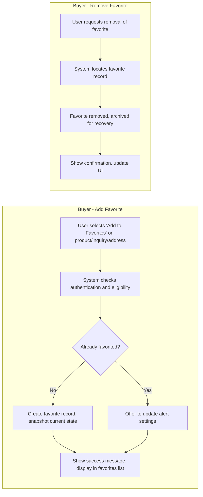
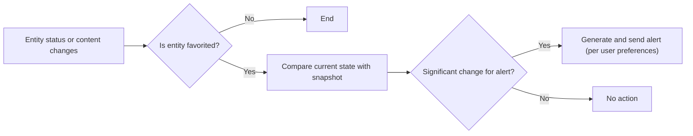

# Favorites and Bookmarking System Requirements Specification for aiCommerce

## 1. Service Introduction
The aiCommerce platform facilitates an AI-driven, highly personalized e-commerce experience. Core to this vision is a robust favorites/bookmarking system enabling buyers, sellers, and administrators to save, organize, and act upon their preferred products, inquiries, and addresses. This document defines the complete business logic, requirements, workflows, validation rules, and snapshots related to favorites management.

## 2. Business Context and Objectives
Personalization is a strategic differentiator for aiCommerce. The favorites/bookmarking system:
- Drives repeat engagement through saved items and activity-triggered alerts
- Powers AI models for recommendation, trend analysis, and user profiling
- Ensures each favorite's state is auditable and legally compliant
- Enables recovery, organization, and optimization of user experiences

## 3. Business Glossary and Key Concepts
- **Favorite/Bookmark:** User-designated reference to a product, inquiry, or address for quick access, notification, or organization.
- **Snapshot:** Immutable record of target entity's state at moment of favoriting, providing evidence and audit trail.
- **Alert (Favorite Notification):** Personalized system message sent to a user regarding status changes or actions related to favorited items.
- **Batch Operation:** Actions affecting multiple favorites at once (e.g., removal, organization, notification settings).

## 4. User Roles and Permission Model in Favorites Context
| Role      | Can Add Favorites | Can Remove Favorites | Can Organize/Categorize | Snapshot Recording | Receive Alerts | View/Manage All Favorites |
|-----------|------------------|---------------------|------------------------|--------------------|----------------|--------------------------|
| Visitor   | ❌               | ❌                  | ❌                     | N/A                | ❌             | ❌                       |
| Buyer     | ✅               | ✅                  | ✅                     | ✅                 | ✅             | Own Only                 |
| Seller    | ✅ (for own/managed products, inquiries, addresses) | ✅                  | ✅                     | ✅                 | ✅             | Own Only                 |
| Admin     | ✅ (for any entity, incl. impersonation/audit) | ✅                  | ✅                     | ✅                 | ✅             | All                      |

*Refer to [User Roles and Authentication Requirements](./02-user-roles-and-authentication.md) for underlying role definitions.*

## 5. Favorites Business Requirements
### 5.1 Universal Rules
- THE favorites system SHALL support products, inquiries, and addresses as favoritable entity types.
- THE system SHALL restrict favorites operations to authenticated users (buyer, seller, admin).
- THE system SHALL record a snapshot of the entity at the time a favorite is added.
- THE system SHALL allow users to organize favorites with custom labels, folders, and batch operations.

### 5.2 Product Favorites
- WHEN a buyer or seller adds a product to favorites, THE system SHALL create a distinct favorite record, linked to both the user and product.
- WHEN a product is updated (e.g., price, stock, availability), THE system SHALL compare new state to the favorite's snapshot and, IF significant, THEN SHALL trigger a personalized alert to the user.
- WHERE products marked as favorite become unavailable or discontinued, THE system SHALL notify the user and mark favorite as invalid.
- THE system SHALL allow users to set alert preferences for price drops, restocks, or promotion events on their favorited products.
- THE system SHALL support viewing history and restoration (redo) of previously removed product favorites.

### 5.3 Inquiry Favorites
- WHEN a buyer or seller bookmarks a product inquiry, THE system SHALL save a favorite record referencing the inquiry and snapshot its status/content.
- WHEN a response, update, or status change occurs on a favorited inquiry, THE system SHALL issue a notification, as per user alert preferences.
- WHERE the inquiry is deleted or resolved, THE system SHALL update the favorite's state to reflect archival status and alert the user.
- THE system SHALL allow batch removal and organization for inquiry favorites.

### 5.4 Address Favorites
- WHEN a user marks an address as favorite, THE system SHALL store a snapshot of the address, including all details and labels.
- THE system SHALL allow designation of a primary shipping address among favorites, supporting quick selection and validation during checkout.
- WHERE an address favorite is edited or removed, THE system SHALL update or remove the favorite accordingly, maintaining audit trails.
- THE system SHALL validate address format and display warnings/alerts IF inconsistencies are detected (e.g., international format mismatch).

## 6. Snapshotting and Versioning Requirements
- THE favorites system SHALL save a snapshot of the entity's state (product, inquiry, address) at the time of favoriting for audit and evidence purposes.
- WHEN the original entity is changed or deleted, THE system SHALL preserve the favorite's snapshot and indicate disconnect or invalidation.
- Snapshots SHALL include all attributes necessary for business and legal evidence: entity ID, data at time of favoriting, user ID, timestamp, and channel/section context.
- THE system SHALL enable comparison between snapshot and current entity state for alerting and auditing.

## 7. Personalization and Organization Rules
- THE system SHALL allow users to group favorites into user-defined folders or categories, supporting drag-and-drop style organization.
- THE system SHALL enable users to annotate (e.g., custom label, tag, rating) each favorite.
- Batch update capabilities SHALL be supported (e.g., move multiple favorites, mass delete, adjust alert preferences for a group).
- WHERE AI-driven recommendations are enabled, THE system SHALL propose new categories/folders or highlight groupings based on usage patterns.

## 8. Favorites-Driven Notification Logic
- WHEN a significant event occurs to any favorited entity (e.g., price drop, new answer, delivery status update), AND IF user alert preferences permit, THEN THE system SHALL trigger an immediate alert to the user (via preferred channel: email, in-app, push).
- WHERE a favorite's underlying entity becomes invalid (deleted, expired, unavailable), THE system SHALL promptly notify the user and update the favorite record status.
- THE system SHALL aggregate multiple updates into a digest WHEN events are frequent, to avoid overwhelming users.
- Alert triggers SHALL be configurable per user, per entity type and, where supported, per individual favorite.

## 9. Error Handling and Edge Case Management
- IF a user attempts to favorite an entity already favorited, THEN THE system SHALL return a user-friendly message and offer to update alert settings instead.
- IF an entity referenced by a favorite is removed (by admin or seller), THEN THE system SHALL display snapshot information and clearly communicate invalidation.
- WHERE communication to user fails (e.g., alert delivery fails), THE system SHALL log the incident for admin resolution and allow re-sending from the interface.
- THE system SHALL validate input for custom labels, folder names, and annotations, rejecting disallowed characters or formats.

## 10. Performance and Experience Requirements
- THE system SHALL allow adding or removing a favorite for eligible users instantly (within 1 second under normal conditions).
- Notification delivery (for real-time events) SHALL occur within 30 seconds of event occurrence (provided external systems are operational).
- Batch operations on favorites (move, delete, organize) SHALL complete for up to 100 items in under 5 seconds.
- WHERE background AI processing affects favorites organization, user experience SHALL not be degraded (all actions feel instantaneous from user perspective).

## 11. Business Logic and Validation Rules
- Users can have up to 1,000 active favorites per entity type (limit configurable per business policy).
- Only valid, unexpired entities can be favorited; IF a user attempts to favorite an invalid entity, THEN THE system SHALL block and explain.
- A favorite is uniquely defined by user ID, entity type, and target entity ID; duplicates are not allowed.
- Organization (folders, labels) and alert preferences persist per user, and are fully user-editable.

## 12. Compliance, Privacy, and Auditability
- Snapshots taken at the time of favoriting SHALL be immutable for forensic and legal/evidence purposes, in accordance with [Audit and Data Integrity Requirements](./14-business-rules-and-compliance.md).
- Under data privacy regulations, users SHALL be able to view and export a list of their favorites and associated snapshots, with clear indication of any personal data included.
- Admins SHALL have ability to audit, review, and (if necessary due to abuse/compliance) remove or anonymize favorites after business-level review.

## 13. Diagrams (Mermaid)
### 13.1 Favorites Add/Remove Flow (Buyer Perspective)

### 13.2 Alert Triggering Logic

## 14. Success Criteria and KPIs
- >95% of favorite add/remove actions complete within 1 second (normal load)
- 100% of favorite snapshots are intact, accessible, and auditable by admin
- Zero tolerance for duplicate favorites per user/entity
- User surveys indicate >90% satisfaction with favorites personalization and notifications

---

This business requirements specification defines the entire scope of the favorites/bookmarking feature for aiCommerce. Implementation details are left to backend development teams, who maintain full autonomy over APIs, storage, and internal processes.