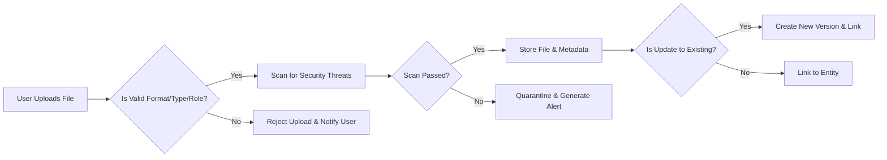

# AI Commerce Backend Attachment and File Management Requirements

## 1. Introduction & Scope

This document defines comprehensive business requirements for handling all file attachments within the AI Commerce backend. It covers processes for upload, metadata management, version control, validation, permissions, security, CDN synchronization, and compliance, supporting roles of buyer, seller, admin, and visitor as defined by the platform. The requirements enable secure, auditable management of all digital content across marketplace functions such as product management, reviews, inquiries, operations, administration, and AI-driven content analysis.

## 2. Attachment Upload and Workflow

### Uploading Attachments
- WHEN a user (buyer, seller, admin) accesses an upload interface, THE system SHALL validate active authentication and confirm that the user's role is permitted to upload attachments within the current context.
- WHEN a permitted user initiates a file upload, THE system SHALL present real-time feedback on progress, including remaining time, size, and supported types.
- WHEN the upload is complete, THE system SHALL generate a unique file identifier, store the file in encrypted storage, register all relevant metadata, and link the file to the associated business entity (e.g., product, review, inquiry, admin asset).
- WHEN a file is uploaded as a new version of an existing attachment, THE system SHALL preserve the complete version history, with ability to retrieve, audit, or restore prior versions.
- THE system SHALL strictly enforce size and file type limits according to business policy for each upload context (see table below).
- WHEN an upload fails (due to unsupported type, excess size, network interruption, or simultaneous duplicate), THEN THE system SHALL notify the user with a detailed actionable error, log the failure event, and prevent incomplete entries.
- WHEN any upload is completed, THE system SHALL scan the file for security threats (malware, embedded scripts, improper content) before making it accessible for download or embedding.

### Upload Constraints Table
| Context        | Max Size (MB) | Allowed Types           | Max per Entity   |
|---------------|--------------|-------------------------|------------------|
| Product Image | 10           | jpg, png, webp          | 10               |
| Document      | 20           | pdf, docx, xlsx, txt    | 5                |
| Video         | 50           | mp4, avi, mov           | 2                |
| Admin Asset   | 100          | All above + svg, pptx   | 50               |

## 3. File Metadata, Versioning, and Type Validation

### Metadata Management
- THE system SHALL store, for every file, the uploader’s account (buyer, seller, admin), upload timestamp, original filename, file size, file type, the associated entity (and its ID/type), uploader’s IP, upload context, current file status, and CDN endpoint URL if published.
- WHEN a file is updated, THE system SHALL increment the version, preserve the previous version, and update the version history log (uploader, reason, delta, timestamp).
- WHEN file metadata is altered (renaming for business clarity, changing status), THE system SHALL record the edit as an auditable event.
- THE system SHALL validate each file using MIME and file signature identification for authenticity—not just file extension.
- IF a file appears corrupted, tampered, or fails validation, THEN THE system SHALL isolate (quarantine) it, log a compliance incident, and restrict further handling to authorized staff only.

#### File Upload and Versioning Workflow Mermaid Diagram

## 4. Access Permissions and CDN Integration

### Access Control Matrix
| File Context        | Visitor | Buyer   | Seller | Admin |
|--------------------|---------|---------|--------|-------|
| Public Product Img | Read    | Read    | Read   | All   |
| Order Invoice      | None    | Read*   | Read*  | All   |
| Seller Doc         | None    | None    | All    | All   |
| Admin Asset        | None    | None    | None   | All   |
| Private Attachment | None    | Owner   | Owner  | All   |

*(Read: only if party to the order.)*

- WHEN a user (visitor, buyer, seller) attempts to access an attachment, THE system SHALL enforce this access matrix according to user role, entity association, file status (published, draft, quarantined), and business rules.
- IF access is denied, THEN THE system SHALL respond with a forbidden error (clear business language), log the event, and monitor for abnormal access patterns.
- WHEN a file is approved for public or platform-wide sharing, THE system SHALL push it to the interconnected CDN, update its indexed metadata, and apply configured cache policies for user experience optimization.
- WHILE the file is on CDN, THE system SHALL monitor CDN usage, propagate updates/deletes rapidly (within 15 minutes of change), and support forced cache purges for compliance or admin interventions.
- WHERE a business entity is deleted or a data subject requests erasure, THE system SHALL flag associated attachments for removal from the active index, schedule CDN and cold storage purges, and log the lifecycle event for compliance.

## 5. File Security and Compliance

- THE system SHALL store all files with encryption at rest, and only transfer using encrypted channels (TLS or higher).
- THE system SHALL maintain an immutable, search-capable audit log of all attachment actions: uploads, views, edits, deletions, recoveries, versioning, and permissions changes.
- THE system SHALL support compliance-driven data access, retrieval, or expungement in line with applicable regulations (EU GDPR, CCPA, PCI DSS, local laws), on data subject or authority request.
- IF illegal, harmful, or suspicious content is detected (automatically or by report), THEN THE system SHALL immediately isolate, restrict, and record the file with sufficient evidence for further investigation by authorized admin or compliance staff.
- WHERE a file is under legal hold or eDiscovery, THE system SHALL suspend normal deletion timelines and retain all access records until release/written authorization.
- THE system SHALL conduct regular reviews and security penetration tests of all file management and access features.

## 6. Error Handling and User-Facing Scenarios

- IF upload fails (general error), THEN THE system SHALL inform user with actionable message and retry guidance. For size/type validation errors, THE system SHALL specify limits and supported types.
- IF access is denied due to permissions, THEN THE system SHALL display a business-context error (no technical stack details) and, when appropriate, prompt the user to request access or support.
- IF a file is under compliance review or legal action, THEN THE system SHALL show a clear, non-revealing message about restricted access.
- IF CDN retrieval fails due to network/cache issues, THEN THE system SHALL fall back to powering a retry, failing gracefully with a clear user error, and notify admins for persistent CDN issues.

## 7. Performance & Scalability Requirements

- THE system SHALL process compliant single-file uploads up to 50MB within 5 seconds for 95% of transactions on supported networks.
- THE system SHALL distribute and update registered attachments to the CDN worldwide in under 15 minutes (measured from successful upload or edit).
- Bulk operations (admin asset uploads, mass deletions) SHALL be queued and batch-processed, providing progress feedback and completion/error notices to initiators.
- THE system SHALL support real-time searching/filtering of attachments in a catalog of at least 1 million (1M) entries, with sub-second metadata lookup response.

## 8. Business Rules and Examples

- All attachments must be tied to a business entity/event for tracking, compliance, and user journey linkage.
- Sellers can only add or manage attachments for their own resources (store, product, order), not system-wide or for other sellers.
- All edits/version updates are logged and retrievable. Deletions are first logical (marked non-visible), then purged after retention window.
- In compliance or eDiscovery situations, attachments cannot be purged or edited; audit trail must be preserved.

## 9. Success Criteria

- All functional requirements and business policies for file management are enforced unambiguously via strict validation, security, versioning, and permission gates.
- Role access, entity assignment, upload, and metadata flow are implemented as described, including all EARS-driven requirements above.
- File and access logs support full traceability and meet audit, compliance, and investigation standards.
- All CDN and file operations fulfill stated SLAs for delivery, error handling, and user-facing recovery.
- Compliance, privacy, and evidence retention objectives are met for all user and admin interactions.
