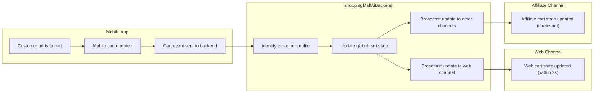

# Channel and Omnichannel Requirements for AI-Powered Shopping Mall Backend

## Omnichannel Business Rationale

### Market and Business Context
AI-powered e-commerce demands that customers seamlessly shop, transact, and engage across multiple channels—websites, mobile apps, partner mini-apps, and physical kiosks. Business growth depends on consistent access, personalized experiences, and transparent business process execution regardless of touchpoint.

### Business Need
- WHEN customers move between channels during their journey, THE shoppingMallAiBackend SHALL preserve their identity, context, and in-progress business actions without loss or fragmentation.
- THE system SHALL enable business policies, promotions, and loyalty incentives to be defined globally and enforced consistently at every customer touchpoint.
- WHERE a customer interacts via multiple devices or external affiliates, THE system SHALL link all interactions to a single global customer profile using channel-agnostic identifiers.

## Channel Management Needs

### Channel Definition, Onboarding, and Lifecycle
- THE shoppingMallAiBackend SHALL support registration and configuration of distinct sales channels, each with unique branding, settings, legal/operational requirements, and business logic extensions.
- WHEN an admin registers a new channel, THE system SHALL require: channel name, code, branding assets, operating country/region, allowed languages/currencies, and channel manager assignment.
- WHEN a channel is placed in maintenance or sunset state, THE system SHALL prevent new transactions and pro-actively notify affected users, sellers, and admins with channel-specific messaging.
- THE system SHALL provide business workflows for channel onboarding (approval, handoff, operational readiness), and offboarding (liquidation, data migration, legal compliance).

### Channel-Specific Operations
- WHERE sellers operate in more than one channel, THE system SHALL allow granular assignment of products, inventory, and prices by channel, while maintaining global analytics and traceability.
- WHEN new business rules or promotions are defined at the global level, THE system SHALL apply channel overrides only where explicitly configured and log every override decision for auditability.
- WHERE product catalogs diverge by market or channel, THE system SHALL enable mapping and synchronization rules between master and local catalogs, including manual and automated propagation according to business configuration.

## Consistency and Identity Policies

### Unified Customer Experience
- THE shoppingMallAiBackend SHALL enforce a unified customer experience policy to ensure user journeys (cart, wishlist, purchase, reviews, support) are transferable across all channels where business permits.
- WHEN a customer logs into any channel, THE system SHALL recognize and authenticate the global customer account and retrieve all channel-relevant states.
- IF customer status or entitlements change on any channel (e.g., loyalty tier upgrade, ban, verified badge), THEN THE system SHALL update all channels within 2 seconds to prevent cross-channel inconsistency.

### Branding and Policy Consistency
- THE system SHALL provide centralized configuration for business branding, compliance language, customer communication templates, and core business rules, propagated to all channels.
- IF a channel attempts to operate with outdated or non-compliant branding, THEN THE system SHALL block relevant business features and alert admins for remediation.
- THE system SHALL maintain audit trails for all cross-channel policy enforcement and exception events.

### AI Personalization and Analytics
- WHERE AI-powered personalization is deployed, THE system SHALL segment and adapt recommendations contextually, but always anchor to the unified customer profile and global business logic.
- THE system SHALL collect channel-specific activity for analytics, but aggregate at the global profile for business intelligence.
- WHERE privacy or consent policies restrict data use, THE system SHALL adhere strictly to per-channel legal constraints and flag violations for business compliance review.

## Cross-channel Data Flow and Rules

### Data Synchronization and Propagation
- WHEN an event (e.g., cart update, order placed, loyalty redemption) occurs on any channel, THE system SHALL propagate relevant state and business data to all other channels in near-real-time (<2s for high-priority events).
- IF propagation fails or is delayed, THEN THE system SHALL log the event, retry delivery, and escalate for user/business support if not resolved within the business-defined SLA.
- WHERE data models differ by channel (e.g., local currencies, regional customs), THE system SHALL perform normalization or mapping per business rule, preserving evidence and auditability for all transformations.

### Identity and Data Ownership
- THE shoppingMallAiBackend SHALL maintain a single source of truth for core entities (customers, products, orders, promotions), with explicit ownership and data stewardship for each record.
- WHERE regulatory or contractual requirements restrict cross-border or cross-channel data sharing, THE system SHALL enforce all limitations and surface actionable error messages for forbidden actions.

### Typical Omnichannel Scenarios
- WHEN a customer initiates a shopping cart in the mobile app and logs in on desktop, THE full cart contents and offers SHALL be available instantly on the web.
- WHEN a seller updates inventory for flagship products in the master channel, THE change SHALL synchronize to all dependent regional or affiliate channels as per mapping rules, respecting inventory thresholds and business policy exceptions.
- IF a promotion is scheduled to start or end, THEN THE effective time SHALL apply synchronously on all channels, with user notification and channel-level tracking for possible errors.

### Error Handling and Business Recovery
- IF a customer or seller encounters a synchronization failure, THEN THE system SHALL offer a clear remediation path (retry, manual reconciliation, or support contact) and log the business impact.
- THE system SHALL provide admins with dashboards of channel status, recent events, and root cause analytics for cross-channel issues.
- THE system SHALL comply with business rules for evidence preservation whenever an error or collision is detected.

### Performance and Scalability
- THE system SHALL process all cross-channel business state changes (orders, payments, status updates) for affected users or products within 2 seconds for 99% of cases under normal business loads.
- IF peak loads or technical issues delay propagation, THEN THE system SHALL alert admins and provide fallback communication to users in the affected channels.

## Example Mermaid Diagram: Cross-Channel Cart Synchronization

## Compliance and Auditability
- THE system SHALL maintain evidence records of all cross-channel events, transformations, and errors for business auditing and compliance review.
- WHEN business processes require regulatory reporting, THE system SHALL surface all relevant multi-channel records in reconciled, auditable format.

## Final Business Constraints
- THE shoppingMallAiBackend SHALL only enforce business logic described herein; all technical implementation choices are at the discretion of the development team.
- THE system SHALL document and notify all known limitations, synchronization delays, or recovery events to affected business users and stakeholders.
