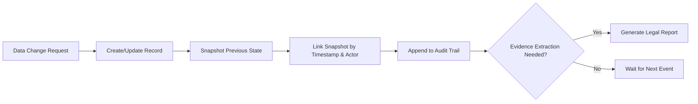
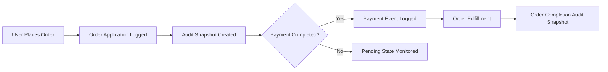

# AICommerce Business Rules and Compliance Specification

## 1. Introduction & Scope

AICommerce is a multi-channel, AI-powered e-commerce platform. This document defines all business rules concerning auditability, data integrity, privacy, analytics, extensibility, and legal compliance. These requirements ensure the resilience, trustworthiness, and legality of all backend services supporting buyers, sellers, admins, and visitors.

## 2. Audit and Data Integrity Requirements

### 2.1 Evidence and Audit Trail

- THE system SHALL record all critical state changes (order, payment, inventory, user data, reviews, price changes) as immutable snapshots linked by event time and actor.
- WHEN data is modified or deleted, THE system SHALL preserve an audit record with before/after states, timestamp, actor, and operation context.
- THE system SHALL never physically delete business-critical records; IF logical deletion occurs, THEN THE system SHALL record deletion timestamp and actor.
- THE system SHALL support legal evidence extraction for any transaction or data mutation through reconstructable history.

#### Example Audit Event Table
| Event Type | Captured Fields | Required for Snapshot |
|------------|----------------|----------------------|
| Order State Change | orderId, prevStatus, newStatus, timestamp, actorId | Yes |
| User Profile Edit | userId, field, oldValue, newValue, timestamp, actorId | Yes |
| Inventory Adjustment | sku, oldQty, newQty, timestamp, cause | Yes |
| Payment Event | orderId, type, amount, paymentId, timestamp, actorId | Yes |

### 2.2 Integrity Checking

- THE system SHALL implement snapshots and cross-reference hashes for all order, inventory, and financial records to prevent and detect tampering.
- WHEN a snapshot discrepancy is detected, THE system SHALL log it as a critical security event and notify the compliance team.

#### Mermaid Diagram: Audit Snapshot Flow

## 3. Order-Payment and Inventory Business Logic

### 3.1 Order and Payment State Management

- WHEN an order is placed, THE system SHALL separate order application from payment confirmation; ordered items remain reserved but unpaid until confirmation.
- THE system SHALL log payment success/failure with timestamp, payment method, and reason.
- WHEN a payment is cancelled, THE system SHALL maintain full payment cancellation history and revert affected order/item/inventory statuses.
- IF an order is confirmed, THEN refund or modification SHALL follow return/exchange business rules only.
- THE system SHALL automatically confirm delivery 14 days after last status update unless a dispute or hold exists.

### 3.2 Inventory

- WHEN an order is confirmed, THE system SHALL decrement inventory per product and option configuration.
- IF inventory falls below a defined threshold, THEN THE system SHALL raise an alert for replenishment.
- Inventory adjustment events SHALL be snapshot-logged with timestamps and reasons.
- THE system SHALL enable retrospective reconciliation of all stock movements.

## 4. Permission, Security and Privacy Rules

### 4.1 Roles and Access Control

#### User Roles
| Role      | Description                                                                  |
|-----------|------------------------------------------------------------------------------|
| visitor   | Unauthenticated guest; browse public listings; no purchase or account access |
| buyer     | Registered shopper; can purchase, review, favorite, and inquire              |
| seller    | Registered member with products; manage store and orders                     |
| admin     | Full platform overseer; can moderate, resolve disputes, configure settings   |

#### Role-Based Access Rules (EARS examples)
- IF a visitor attempts to access purchase or review functions, THEN THE system SHALL return an access denied error.
- WHEN a seller accesses product management tools, THE system SHALL restrict scope to their own products and analytics only.
- IF an admin moderates user or seller content, THEN ALL actions SHALL be logged with timestamp and reason.

### 4.2 Privacy and Data Protection

- THE system SHALL store PII, authentication credentials, and payment details using strong encryption (at rest and in transit).
- WHERE applicable, personal data management (storage, access, and deletion) SHALL comply with user’s country of residence regulations (e.g., GDPR, CCPA).
- THE system SHALL support data subject rights: access, correction, export, and erasure, with audit trails for every such operation.
- IF a user requests account deletion, THEN THE system SHALL anonymize all personal identifiers but preserve transaction records for legal purposes.

### 4.3 Security Measures

- THE system SHALL enforce minimum password complexity and support two-factor authentication for sellers and admins.
- Failed login, suspicious access, or privilege escalation attempts SHALL be logged and alerted.
- API access SHALL be restricted by JWT-based session verification and fine-grained permissions.

## 5. Analytics, Performance, and Extensibility

### 5.1 Cross-Channel Analytics

- THE system SHALL aggregate and report product sales, order conversions, cart abandonment, and traffic per channel/section/category for all roles with relevant permissions.
- Cross-channel user actions (e.g., orders placed via mobile & web) SHALL be linkable for unified customer journey analytics.
- Sellers SHALL have access only to their shop/channel analytics, buyers to their own activity, and admins to all aggregated data.

### 5.2 Performance KPIs

- Key Performance Indicators SHALL include order confirmation time, transaction volume per minute, inventory reconciliation delay, and system uptime.
- WHEN backend response exceeds 2 seconds for standard operations (order placement, payment, cart update), THE system SHALL log and analyze for optimization.

### 5.3 Extensibility

- THE platform SHALL enable adding new sales channels, payment gateways, AI recommendation modules, and legal compliance features with minimal disruption to live services.
- Data structures SHALL support versioning and dynamic extension without breaking compatibility.

## 6. Regulatory Compliance (Global)

### 6.1 Personal Data & Privacy Laws

- WHEN storing or processing PII of EEA or UK residents, THE system SHALL be GDPR compliant, ensuring consent, lawful basis, and DSR fulfilment.
- WHEN handling CCPA-covered California residents’ data, THE system SHALL enable opt-outs, disclosure, and deletion per statute.
- Cross-border data transfers SHALL use recognized legal mechanisms (e.g., SCCs, adequacy decisions).

### 6.2 E-Commerce and Consumer Protection

- Orders, digital receipts, return procedures, and consumer rights enforcement SHALL be built according to target markets’ e-commerce laws.
- THE system SHALL capture and store transaction records for legal minimum durations required (e.g., 5-7 years).
- Tax calculation and compliance SHALL adjust dynamically by channel/geography.

### 6.3 Financial, Payment & Anti-Fraud

- Payment processing SHALL be PCI DSS compliant (tokenized, segregated data flows).
- KYC procedures SHALL be performed for sellers in alignment with AML regulations before funds are withdrawn.
- Fraud indicators (rapid order surge, repeated failed payments, mismatched info) SHALL trigger automated reviews and require admin intervention.

### 6.4 Accessibility

- All features (from registration to checkout) SHALL be accessible (WCAG 2.1 compliance): screen-reader, keyboard navigation, and plain text alternatives must be present.
- Currency, number, and date formats SHALL be localized based on user settings or region.

## 7. Success Criteria, Error Handling, and KPIs

- THE system SHALL provide a 99.9% uptime SLA outside of scheduled maintenance.
- All failed operations (order, payment, data updates) SHALL return error codes and descriptions suitable for audit and troubleshooting, with remedial guidance for end users.
- Compliance with privacy & security laws SHALL be validated annually by an external audit.
- Continuous monitoring of KPIs with alerting on target breaches SHALL be maintained.
- WHEN new compliance requirements emerge, THE system SHALL enable timely and auditable updates to all policies and workflows.

## Appendix: Sample Mermaid Process — Order Audit Trail

> *Developer Note: This document defines business requirements only. All technical implementations (architecture, APIs, database design, etc.) are at the discretion of the development team.*