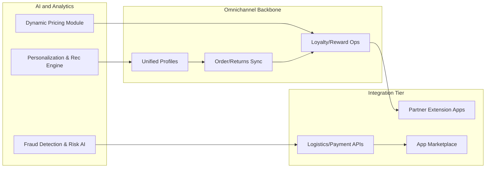

# AICommerce Advanced Features and Roadmap Requirements Analysis Report

## 1. Introduction & Purpose

AICommerce aspires to elevate modern commerce platforms by integrating advanced AI/ML, next-generation analytics, omnichannel fulfillment, and extensible, partner-friendly architectures. This requirements report translates strategic goals and business aspirations into precise, actionable system requirements for backend developers, using the EARS methodology for clarity and rigor.

## 2. AI-Driven Personalization and Optimization

### 2.1 AI Personalization Engine
- THE system SHALL generate product recommendations for buyers, derived from user preferences, shopping behavior, and purchase history.
- WHEN a buyer interacts with the platform, THE system SHALL update that buyer’s profile in real time, adapting subsequent recommendations accordingly.
- IF a buyer opts out of personalization, THEN THE system SHALL exclude their behavior data from algorithmic processing and tailor only basic offers.
- Sellers SHALL be empowered to offer recommendations to select segments, with the system mediating these based on user affinity and explicit opt-ins.
- WHEN products in recommendation lists become unavailable, THE system SHALL re-prioritize and substitute within 2 seconds to avoid displaying obsolete options.
- All personalized outputs SHALL be retained in a log that is auditable by admins for compliance and explanation.

### 2.2 Dynamic Pricing & Optimization
- THE system SHALL support AI-driven pricing logic for sellers, factoring real-time demand shifts, competitor pricing, inventory, buyer profile, and time-of-day.
- WHEN a dynamic promotion or pricing rule activates, THE system SHALL notify sellers/admins and log all suggestions or actions taken.
- WHERE sellers or admins opt for manual override, THE system SHALL respect and persist the override, reverting to AI pricing only upon new confirmation.
- AI pricing and promotion features SHALL be configurable per seller, per channel, and per product.

### 2.3 Fraud Detection & Risk Controls
- THE system SHALL continuously monitor orders, payments, and account actions using AI-generated risk scoring.
- WHEN patterns indicative of fraud or abuse (multi-account, synthetic identity, abnormal address or payment changes) are detected, THE system SHALL halt fulfillment, log the event, and alert administrators for review.
- THE audit trail SHALL include all signals and algorithmic decisions that led to fraud suspicion.

## 3. Advanced Analytics and Smart Features

### 3.1 Real-Time Analytics & Reporting
- THE system SHALL provide dashboards for sellers and admins with up-to-date sales analytics, customer flows, conversion rates, and inventory turnover.
- Charts and summaries SHALL refresh automatically every 60 seconds, or by user role preference.
- Sellers/admins SHALL configure custom reports using KPIs most relevant to their operations or objectives (e.g. customer LTV, churn, cohort performance).

### 3.2 Customer Segmentation & Predictive Insights
- THE system SHALL segment buyers by value, frequency, demography, and channel, updating clusters dynamically as new data arrives.
- WHEN a notable change (e.g., spike in churn, rise in repeat buyers) is observed in a segment, THE system SHALL recommend outreach or offer actions to the responsible seller/admin within 10 seconds.
- Predictive analytics SHALL inform sellers about stock management, marketing triggers, and new product launch windows, based on ongoing analysis of historical and current data.

### 3.3 Sentiment & Feedback Analysis
- THE system SHALL aggregate and classify reviews, inquiries, and customer communications by sentiment (positive/negative/neutral).
- WHEN negative trends surpass thresholds, THE system SHALL escalate issues to admins with suggested resolutions, and optionally enable direct feedback response templates for sellers.

## 4. Omnichannel and Extended Customer Journey

### 4.1 Unified Experience Across Channels
- THE system SHALL keep buyer profiles, preferences, order states, and incentives synchronized in real time across all channels (website, app, third-party resellers, physical integration where available).
- WHEN buyers switch channels mid-interaction, THE system SHALL preserve full transactional context for seamless continuation.
- Loyalty programs, discounts, and redemption SHALL be unified and portable across channels, honoring regional and regulatory boundaries.

### 4.2 Cross-Channel Fulfillment and Logistics
- THE system SHALL support fulfilling and returning orders across channels, including in-store pickup for online orders, home delivery from physical stores, and returns initiated on any connected channel.
- Stock and policy logic SHALL be channel-sensitive but maintain a core set of consistent business rules and full transparency to the buyer.
- Sellers/admins SHALL define channel-specific fulfillment or return policies, subject to compliance and buyer notification requirements.
- All cross-channel logistics SHALL be monitored in real time, with status updates and exception notifications to all affected roles.

### 4.3 Unified Profile and Address Management
- Buyer and address information SHALL be centralized, visible, and editable from any channel, with instant propagation and audit trail.
- WHERE data residency or privacy mandates restrict central storage, THE system SHALL apply regionalization or anonymization logic, logging all exceptions.

## 5. Integration and Third-Party API Structure

### 5.1 Authentication and Social Login
- THE system SHALL permit buyers and sellers to register and log in via external OAuth/OpenID providers, configurable per deployment region.
- The system SHALL keep a record of all link/unlink actions of external accounts, and securely handle orphaned data or permissions.

### 5.2 Partner and Merchant APIs
- THE system SHALL provide documented, discoverable APIs for logistics partners, payment processors, and business workflow integrations.
- All third-party API calls SHALL be validated, logged, and provided with actionable error codes.
- THE system SHALL ensure versioning for partner APIs; any deprecation SHALL trigger automated notifications and migration guides.

### 5.3 App Marketplace and Extensions
- THE system SHALL expose an extension framework for partner, seller, or third-party developer-created apps.
- Installation, upgrade, and removal of extensions SHALL be auditable, revertible, and respect permission boundaries.
- Role and data access rights SHALL automatically update when extension status changes.

## 6. Platform Extensibility Roadmap

### 6.1 Modular Feature Architecture
- THE system SHALL structure AI, analytics, UI/business, and integration features as loosely coupled modules with clear interfaces, supporting add, upgrade, or removal with no downtime.
- New feature modules SHALL register using a manifest including dependencies, role permissions, and compatibility version.
- All module changes SHALL be logged and reportable to admin roles for audit and support.

### 6.2 Future Proofing and Staged Rollout
- THE system SHALL organize emerging smart features (e.g., AI chatbots, advanced fraud engines, dynamic discounts, custom user journeys) into a backlog, prioritizing based on impact, stakeholder input, and technical feasibility.
- A formal feedback mechanism SHALL allow key roles (admins, lead sellers, pilot buyers) to suggest, test, and rate candidate features before general rollout.

## 7. Success Criteria & Performance Expectations

- Personalized product recommendations, analytics, and segmentation actions SHALL be delivered to users within 2 seconds of triggering event.
- Cross-channel synchronization and profile updates SHALL propagate within 1 second under normal load conditions.
- Fraud/risk events SHALL trigger review and notification within 10 seconds of detection.
- All API integrations and extension management operations SHALL log status to a queryable, real-time dashboard for platform support roles.

## 8. Mermaid Diagram: Platform Extensibility and Integration Flow

## 9. Compliance & Security Requirements

- AI/ML operations, data lakes, and external integrations SHALL comply with regional/global privacy laws (GDPR, CCPA, etc.), with all required audit trails and opt-in/out controls (see [Business Rules and Compliance](./14-business-rules-and-compliance.md)).
- Event logs and data flows SHALL be available for review and audit by authorized admin roles only.

## 10. Platform Upgrade Roadmap Example

| Phase         | Major Feature Set                 | Outcome                                                               |
|---------------|-----------------------------------|-----------------------------------------------------------------------|
| Phase 1 (0-6m)| AI Personalization & Analytics    | Launch core personalization, near-real-time dashboards                |
| Phase 2 (6-12m)| Omnichannel Experience           | Roll out unified profile/order, cross-channel logistics & loyalty     |
| Phase 3 (12-18m)| Open APIs, Partner Extensions    | Enable external apps, partner APIs, modular feature onboarding        |
| Phase 4 (18-24m)| Advanced AI, Marketplace Growth  | Optimize with AI chatbots, full dynamic pricing, AI-powered support   |

---
For full context and role security, reference [Service Overview](./01-service-overview.md), [Business Rules and Compliance](./14-business-rules-and-compliance.md), and [User Roles and Authentication](./02-user-roles-and-authentication.md).